# 用 Python 进行机器学习:分类(完整教程)

> 原文：<https://towardsdatascience.com/machine-learning-with-python-classification-complete-tutorial-d2c99dc524ec?source=collection_archive---------0----------------------->


## 数据分析和可视化、特征工程和选择、模型设计和测试、评估和解释

## 摘要

在本文中，我将使用数据科学和 Python 解释分类用例的主要步骤，从数据分析到理解模型输出。

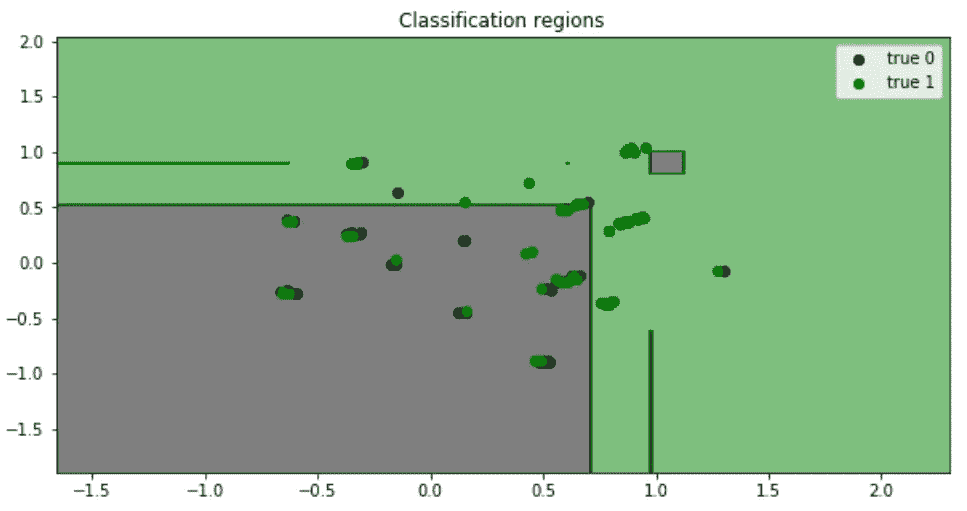

由于本教程对于初学者来说是一个很好的起点，我将使用著名的 Kaggle 竞赛中的“ **Titanic dataset** ”，其中为您提供了乘客数据，任务是建立一个预测模型来回答这个问题:“什么样的人更有可能幸存？”(下面链接)。

[](https://www.kaggle.com/c/titanic/overview) [## 泰坦尼克号:机器从灾难中学习

### 从这里开始！预测泰坦尼克号上的生存并熟悉 ML 基础知识

www.kaggle.com](https://www.kaggle.com/c/titanic/overview) 

我将展示一些有用的 Python 代码，这些代码可以很容易地用于其他类似的情况(只需复制、粘贴、运行)，并通过注释遍历每一行代码，这样您就可以很容易地复制这个示例(下面是完整代码的链接)。

[](https://github.com/mdipietro09/DataScience_ArtificialIntelligence_Utils/blob/master/machine_learning/example_classification.ipynb) [## mdipietro 09/data science _ 人工智能 _ 实用工具

### permalink dissolve GitHub 是 4000 多万开发人员的家园，他们一起工作来托管和审查代码，管理…

github.com](https://github.com/mdipietro09/DataScience_ArtificialIntelligence_Utils/blob/master/machine_learning/example_classification.ipynb) 

特别是，我将经历:

*   环境设置:导入库并读取数据
*   数据分析:理解变量的意义和预测能力
*   特征工程:从原始数据中提取特征
*   预处理:数据划分、处理缺失值、编码分类变量、缩放
*   特征选择:只保留最相关的变量
*   模型设计:训练、调整超参数、验证、测试
*   绩效评估:阅读指标
*   可解释性:理解模型如何产生结果

## 设置

首先，我需要导入以下库。

```
**## for data**
import **pandas** as pd
import **numpy** as np**## for plotting**
import **matplotlib**.pyplot as plt
import **seaborn** as sns**## for statistical tests**
import **scipy**
import **statsmodels**.formula.api as smf
import statsmodels.api as sm**## for machine learning**
from **sklearn** import model_selection, preprocessing, feature_selection, ensemble, linear_model, metrics, decomposition**## for explainer**
from **lime** import lime_tabular
```

然后我会把数据读入熊猫数据框。

```
dtf = pd.read_csv('data_titanic.csv')
dtf.head()
```

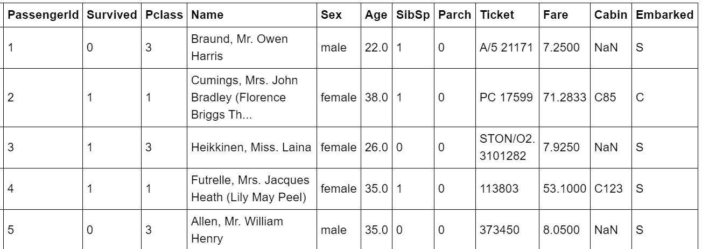

有关列的详细信息可以在所提供的数据集链接中找到。

请注意，表格的每一行代表一个特定的乘客(或观察)。如果您正在处理一个不同的数据集，它没有这样的结构，其中每一行代表一个观察，那么您需要汇总数据并转换它。

现在一切都设置好了，我将从分析数据开始，然后选择特征，建立机器学习模型并进行预测。

我们开始吧，好吗？

## 数据分析

在统计学中，[探索性数据分析](https://en.wikipedia.org/wiki/Exploratory_data_analysis)是对数据集的主要特征进行总结的过程，以了解数据在正式建模或假设检验任务之外还能告诉我们什么。

我总是从获得整个数据集的概述开始，特别是我想知道有多少**分类**和**数值**变量，以及**缺失数据**的比例。识别变量的类型有时会很棘手，因为类别可以用数字表示(Su *rvived c* 列由 1 和 0 组成)。为此，我将编写一个简单的函数来完成这项工作:

```
**'''
Recognize whether a column is numerical or categorical.
:parameter
    :param dtf: dataframe - input data
    :param col: str - name of the column to analyze
    :param max_cat: num - max number of unique values to recognize a column as categorical
:return
    "cat" if the column is categorical or "num" otherwise
'''**
def **utils_recognize_type**(dtf, col, max_cat=20):
    if (dtf[col].dtype == "O") | (dtf[col].nunique() < max_cat):
        return **"cat"**
    else:
        return **"num"**
```

这个功能非常有用，可以用在很多场合。为了举例说明，我将绘制 dataframe 的 [**热图**](http://Heat map) ，以可视化列类型和缺失的数据。

```
dic_cols = {col:**utils_recognize_type**(dtf, col, max_cat=20) for col in dtf.columns}heatmap = dtf.isnull()
for k,v in dic_cols.items():
 if v == "num":
   heatmap[k] = heatmap[k].apply(lambda x: 0.5 if x is False else 1)
 else:
   heatmap[k] = heatmap[k].apply(lambda x: 0 if x is False else 1)sns.**heatmap**(heatmap, cbar=False).set_title('Dataset Overview')
plt.show()print("\033[1;37;40m Categerocial ", "\033[1;30;41m Numeric ", "\033[1;30;47m NaN ")
```

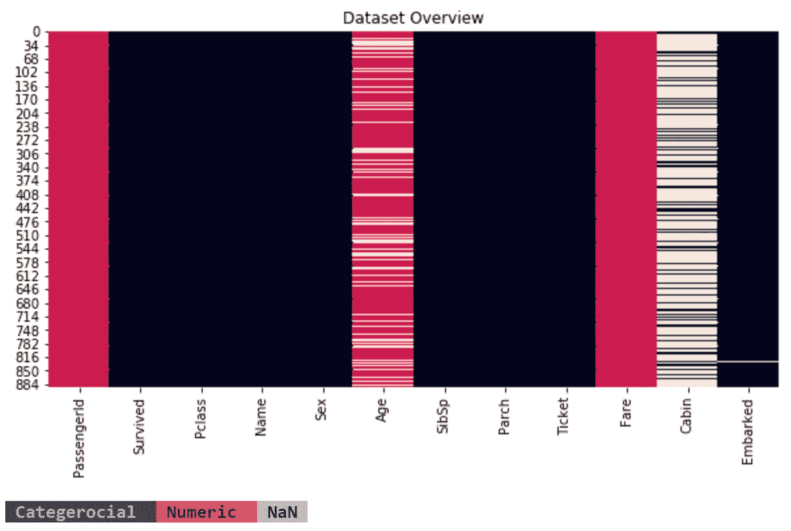

有 885 行和 12 列:

*   表中的每一行都代表一个由 *PassengerId* 标识的特定乘客(或观察)，所以我将它设置为 index(或 SQL 爱好者的表的[主键](https://en.wikipedia.org/wiki/Primary_key))。
*   *幸存的*是我们想要理解和预测的现象(或目标变量)，所以我将该列重命名为“*Y”*。它包含两个类别:如果乘客幸存，则为 1，否则为 0，因此这个用例是一个二元分类问题。
*   *年龄*和*费用*是数字变量，而其他是分类变量。
*   只有*年龄*和*舱室*包含缺失数据。

```
dtf = dtf.set_index("**PassengerId**")dtf = dtf.rename(columns={"**Survived**":"**Y**"})
```

我相信可视化是数据分析的最好工具，但是你需要知道什么样的图更适合不同类型的变量。因此，我将提供代码来为不同的示例绘制适当的可视化。

首先，让我们看看单变量分布(只有一个变量的概率分布)。一个 [**条形图**](https://en.wikipedia.org/wiki/Bar_chart) 适用于理解单个**分类**变量的标签频率。例如，让我们绘制目标变量:

```
**y = "Y"**ax = dtf[y].value_counts().sort_values().plot(kind="barh")
totals= []
for i in ax.patches:
    totals.append(i.get_width())
total = sum(totals)
for i in ax.patches:
     ax.text(i.get_width()+.3, i.get_y()+.20, 
     str(round((i.get_width()/total)*100, 2))+'%', 
     fontsize=10, color='black')
ax.grid(axis="x")
plt.suptitle(y, fontsize=20)
plt.show()
```

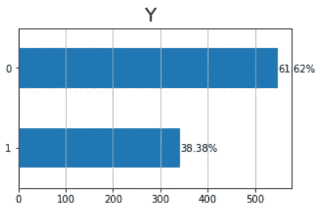

多达 300 名乘客幸存，大约 550 人没有，换句话说，存活率(或人口平均值)是 38%。

此外，一个 [**直方图**](https://en.wikipedia.org/wiki/Histogram) 完美地给出了单个**数值**数据的基本分布密度的粗略感觉。我推荐使用一个 [**箱线图**](https://en.wikipedia.org/wiki/Box_plot) 来图形化地描绘数据组的四分位数。让我们以*年龄*变量为例:

```
**x = "Age"**fig, ax = plt.subplots(nrows=1, ncols=2,  sharex=False, sharey=False)
fig.suptitle(x, fontsize=20)**### distribution**
ax[0].title.set_text('distribution')
variable = dtf[x].fillna(dtf[x].mean())
breaks = np.quantile(variable, q=np.linspace(0, 1, 11))
variable = variable[ (variable > breaks[0]) & (variable < 
                    breaks[10]) ]
sns.distplot(variable, hist=True, kde=True, kde_kws={"shade": True}, ax=ax[0])
des = dtf[x].describe()
ax[0].axvline(des["25%"], ls='--')
ax[0].axvline(des["mean"], ls='--')
ax[0].axvline(des["75%"], ls='--')
ax[0].grid(True)
des = round(des, 2).apply(lambda x: str(x))
box = '\n'.join(("min: "+des["min"], "25%: "+des["25%"], "mean: "+des["mean"], "75%: "+des["75%"], "max: "+des["max"]))
ax[0].text(0.95, 0.95, box, transform=ax[0].transAxes, fontsize=10, va='top', ha="right", bbox=dict(boxstyle='round', facecolor='white', alpha=1))**### boxplot** 
ax[1].title.set_text('outliers (log scale)')
tmp_dtf = pd.DataFrame(dtf[x])
tmp_dtf[x] = np.log(tmp_dtf[x])
tmp_dtf.boxplot(column=x, ax=ax[1])
plt.show()
```

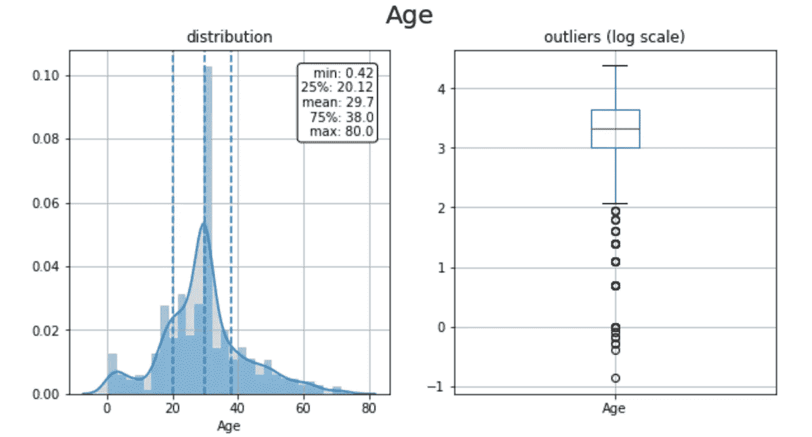

平均而言，乘客相当年轻:分布偏向左侧(平均值为 30 岁，第 75 百分位为 38 岁)。加上箱形图中的异常值，左尾部的第一个尖峰表示有大量的儿童。

我将把分析进行到下一个层次，并研究双变量分布，以了解*年龄*是否具有预测 *Y* 的预测能力。这就是**绝对( *Y* )对数值(*年龄* )** 的情况，因此我将这样进行:

*   将总体(整个观察集)分成 2 个样本:Y = 1 (存活)和 Y = 0 (未存活)的乘客部分。
*   绘制并比较两个样本的密度，如果分布不同，则变量是可预测的，因为两组具有不同的模式。
*   将数值变量(*年龄*)分组到箱(子样本)中，并绘制每个箱的组成，如果所有箱中 1 的比例相似，则该变量不具有预测性。
*   绘制并比较两个样本的箱线图，找出异常值的不同行为。

```
**cat, num = "Y", "Age"**fig, ax = plt.subplots(nrows=1, ncols=3,  sharex=False, sharey=False)
fig.suptitle(x+"   vs   "+y, fontsize=20)

**### distribution**
ax[0].title.set_text('density')
for i in dtf[cat].unique():
    sns.distplot(dtf[dtf[cat]==i][num], hist=False, label=i, ax=ax[0])
ax[0].grid(True)**### stacked**
ax[1].title.set_text('bins')
breaks = np.quantile(dtf[num], q=np.linspace(0,1,11))
tmp = dtf.groupby([cat, pd.cut(dtf[num], breaks, duplicates='drop')]).size().unstack().T
tmp = tmp[dtf[cat].unique()]
tmp["tot"] = tmp.sum(axis=1)
for col in tmp.drop("tot", axis=1).columns:
     tmp[col] = tmp[col] / tmp["tot"]
tmp.drop("tot", axis=1).plot(kind='bar', stacked=True, ax=ax[1], legend=False, grid=True)**### boxplot **  
ax[2].title.set_text('outliers')
sns.catplot(x=cat, y=num, data=dtf, kind="box", ax=ax[2])
ax[2].grid(True)
plt.show()
```

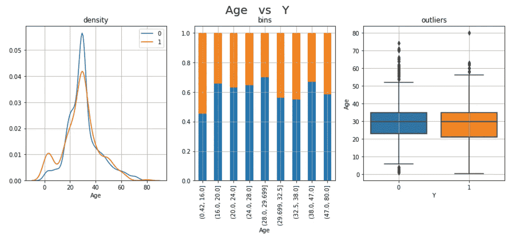

这 3 个图只是结论*年龄*具有预测性的不同角度。年轻乘客的存活率更高:1s 分布的左尾有一个尖峰，第一个箱(0-16 岁)包含最高百分比的幸存乘客。

当“视觉直觉”无法说服你时，你可以求助于古老的统计数据来进行测试。在这种分类(*Y*vs 数值(*年龄*)的情况下，我会使用一个**o**[**n-way ANOVA 检验**](http://en.wikipedia.org/wiki/F_test#One-way_ANOVA_example) 。基本上是检验两个或两个以上独立样本的均值是否显著不同，所以如果 p 值足够小(< 0.05)样本的零假设意味着相等可以被拒绝。

```
**cat, num = "Y", "Age"**model = smf.**ols**(num+' ~ '+cat, data=dtf).fit()
table = sm.stats.**anova_lm**(model)
p = table["PR(>F)"][0]
coeff, p = None, round(p, 3)
conclusion = "Correlated" if p < 0.05 else "Non-Correlated"
print("Anova F: the variables are", conclusion, "(p-value: "+str(p)+")")
```

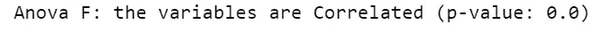

显然，乘客的年龄决定了他们的生存。这是有道理的，因为在生命受到威胁的情况下，当救生艇等生存资源有限时，妇女和儿童的生命将被首先拯救，通常是弃船(代码"[妇女和儿童优先](https://en.wikipedia.org/wiki/Women_and_children_first))。

为了检查第一个结论的有效性，我必须分析*性别*变量相对于目标变量的行为。这是一个**分类( *Y* ) vs 分类(*性别* )** 的例子，所以我将绘制两个条形图，一个是两个类别*性别*(男性和女性)中 1 和 0 的数量，另一个是百分比。

```
**x, y = "Sex", "Y"**fig, ax = plt.subplots(nrows=1, ncols=2,  sharex=False, sharey=False)
fig.suptitle(x+"   vs   "+y, fontsize=20)**### count**
ax[0].title.set_text('count')
order = dtf.groupby(x)[y].count().index.tolist()
sns.catplot(x=x, hue=y, data=dtf, kind='count', order=order, ax=ax[0])
ax[0].grid(True)**### percentage**
ax[1].title.set_text('percentage')
a = dtf.groupby(x)[y].count().reset_index()
a = a.rename(columns={y:"tot"})
b = dtf.groupby([x,y])[y].count()
b = b.rename(columns={y:0}).reset_index()
b = b.merge(a, how="left")
b["%"] = b[0] / b["tot"] *100
sns.barplot(x=x, y="%", hue=y, data=b,
            ax=ax[1]).get_legend().remove()
ax[1].grid(True)
plt.show()
```

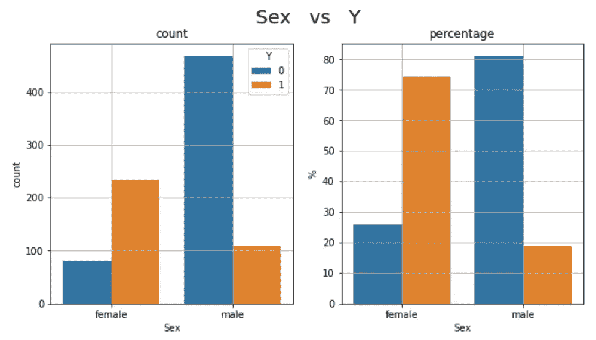

200 多名女性乘客(占机上女性总数的 75%)和约 100 名男性乘客(不到 20%)幸存。换句话说，女性的存活率是 75%,男性是 20%,因此性别是可以预测的。此外，这证实了他们优先考虑妇女和儿童。

就像之前一样，我们可以测试这两个变量的相关性。由于它们都是分类的，我将使用 C [**卡方检验:**](https://en.wikipedia.org/wiki/Chi-square_test) 假设两个变量是独立的(零假设)，它将检验这些变量的列联表的值是否是均匀分布的。如果 p 值足够小(< 0.05)，可以拒绝零假设，我们可以说这两个变量可能是相关的。可以计算 C [**ramer 的 V**](https://en.wikipedia.org/wiki/Cram%C3%A9r's_V) **t** 这是从该测试得出的相关性度量，它是对称的(就像传统的皮尔逊相关性)，范围在 0 和 1 之间(不像传统的皮尔逊相关性，没有负值)。

```
**x, y = "Sex", "Y"**cont_table = pd.crosstab(index=dtf[x], columns=dtf[y])
chi2_test = scipy.stats.**chi2_contingency**(cont_table)
chi2, p = chi2_test[0], chi2_test[1]
n = cont_table.sum().sum()
phi2 = chi2/n
r,k = cont_table.shape
phi2corr = max(0, phi2-((k-1)*(r-1))/(n-1))
rcorr = r-((r-1)**2)/(n-1)
kcorr = k-((k-1)**2)/(n-1)
coeff = np.sqrt(phi2corr/min((kcorr-1), (rcorr-1)))
coeff, p = round(coeff, 3), round(p, 3)
conclusion = "Significant" if p < 0.05 else "Non-Significant"
print("Cramer Correlation:", coeff, conclusion, "(p-value:"+str(p)+")")
```

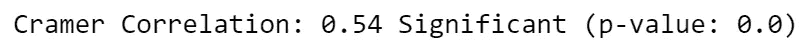

*年龄*和*性别*都是预测特征的例子，但并不是数据集中的所有列都是这样。例如，*舱*似乎是一个**无用变量**，因为它不提供任何有用的信息，有太多的缺失值和类别。

应该对数据集中的每个变量进行这种分析，以决定哪些应该作为潜在特征保留，哪些因为不具有预测性而可以放弃(查看完整代码的链接)。

## 特征工程

是时候使用领域知识从原始数据创建新要素了。我将提供一个例子:我将尝试通过从 *Cabin* 列中提取信息来创建一个有用的特征。我假设每个舱号开头的字母(即“ ***B*** *96* ”)表示某种区域，也许有一些幸运区域靠近救生艇。我将通过提取每个舱室的截面来按组总结观察结果:

```
**## Create new column**
dtf["**Cabin_section**"] = dtf["**Cabin**"].apply(lambda x: str(x)[0])**## Plot contingency table** cont_table = pd.crosstab(index=dtf["**Cabin_section"**], 
             columns=dtf["**Pclass**"], values=dtf["**Y**"], aggfunc="sum")sns.**heatmap**(cont_table, annot=True, cmap="YlGnBu", fmt='.0f',
            linewidths=.5).set_title( 
            'Cabin_section vs Pclass (filter: Y)' )
```

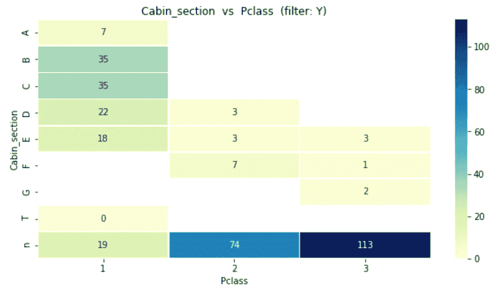

该图显示了幸存者在客舱各部分和各等级中的分布情况(7 名幸存者在 A 区，35 名在 B 区……)。大多数区段被分配给第一类和第二类，而大多数缺失区段(" *n"* )属于第三类。我将保留这个新特性，而不是列 *Cabin:*

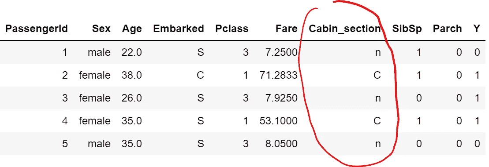

## 预处理

数据预处理是准备原始数据以使其适合机器学习模型的阶段。特别是:

1.  每个观察必须用一行来表示，换句话说，不能用两行来描述同一个乘客，因为它们将被模型分别处理(数据集已经是这样的形式，所以✅).而且每一列都应该是一个特征，所以你不应该用 *PassengerId* 作为预测器，这就是为什么这种表叫做“**特征矩阵**”。
2.  数据集必须**划分为**至少两组:模型应在数据集的重要部分(所谓的“训练集”)上进行训练，并在较小的数据集(“测试集”)上进行测试。
3.  **缺失值**应该用东西替换，否则你的模型可能会出问题。
4.  **分类数据**必须编码，这意味着将标签转换成整数，因为机器学习期望的是数字而不是字符串。
5.  对数据进行**缩放**是一种很好的做法，这有助于在特定范围内对数据进行标准化，并加快算法的计算速度。

好的，让我们从**划分数据集**开始。当把数据分成训练集和测试集时，你必须遵循一个基本规则:训练集中的行不应该出现在测试集中。这是因为模型在训练过程中会看到目标值，并使用它来理解现象。换句话说，模型已经知道训练观察的正确答案，在这些基础上测试就像作弊。我见过很多人推销他们的机器学习模型，声称有 99.99%的准确率，但实际上却忽略了这条规则。幸运的是，S *cikit-learn* 包知道:

```
**## split data**
dtf_train, dtf_test = **model_selection**.**train_test_split**(dtf, 
                      test_size=0.3)**## print info**
print("X_train shape:", dtf_train.drop("Y",axis=1).shape, "| X_test shape:", dtf_test.drop("Y",axis=1).shape)
print("y_train mean:", round(np.mean(dtf_train["Y"]),2), "| y_test mean:", round(np.mean(dtf_test["Y"]),2))
print(dtf_train.shape[1], "features:", dtf_train.drop("Y",axis=1).columns.to_list())
```

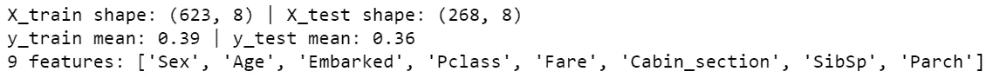

下一步:*年龄*列包含一些需要处理的**缺失数据** (19%)。在实践中，您可以用一个特定的值来替换丢失的数据，比如 9999，它可以跟踪丢失的信息，但会改变变量的分布。或者，你可以使用列的平均值，就像我要做的。我想强调的是，从机器学习的角度来看，首先分成训练和测试，然后仅用训练集的平均值替换 *NAs* 是正确的。

```
dtf_train["Age"] = dtf_train["Age"].**fillna**(dtf_train["Age"].**mean**())
```

仍然有一些**分类数据**应该被编码。两种最常见的编码器是标签编码器(每个唯一的标签映射到一个整数)和一位热编码器(每个标签映射到一个二进制向量)。第一种方法只适用于普通数据。如果应用于没有普通性的列，如 *Sex* ，它会将向量*【m*ale，female，female，male，male，…】转换为【1，2，2，1，…】,我们会得到那个 female > male，平均值为 1.5，这是没有意义的。另一方面，One-Hot-Encoder 会将之前的示例转换为两个[虚拟变量](https://en.wikipedia.org/wiki/Dummy_variable_(statistics))(二分量化变量):Mal *e [1* ，0，0，1，…]和 Fem *ale [0* ，1，1，0，…]。它的优点是结果是二进制的而不是有序的，并且一切都位于正交向量空间中，但是具有高基数的特性可能会导致维数问题。我将使用 One-Hot-Encoding 方法，将 1 个具有 n 个唯一值的分类列转换为 n-1 个虚拟列。让我们以编码*性别*为*T21 为例:*

```
**## create dummy**
dummy = pd.get_dummies(dtf_train["**Sex**"], 
                       prefix="Sex",drop_first=True)
dtf_train= pd.concat([dtf_train, dummy], axis=1)
print( dtf_train.filter(like="Sex", axis=1).head() )**## drop the original categorical column**
dtf = dtf_train.drop("**Sex**", axis=1)
```

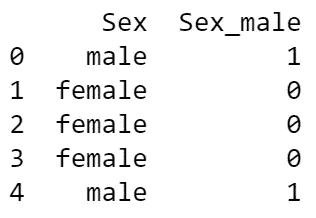

最后但同样重要的是，我将**缩放特征**。有几种不同的方法可以做到这一点，我将只介绍最常用的方法:标准缩放器和最小最大缩放器。第一种假设数据呈正态分布，并对其进行重新调整，使分布以 0 为中心，标准差为 1。然而，当计算缩小特征值范围的经验平均值和标准偏差时，离群值具有影响，因此该缩放器不能在离群值存在时保证平衡的特征尺度。另一方面，最小最大缩放器重新缩放数据集，使所有特征值都在同一范围内(0–1)。它受离群值的影响较小，但压缩了一个狭窄范围内的所有内联值。因为我的数据不是正态分布的，所以我将使用最小最大缩放器:

```
scaler = **preprocessing**.**MinMaxScaler**(feature_range=(0,1))
X = scaler.fit_transform(dtf_train.drop("Y", axis=1))dtf_scaled= pd.DataFrame(X, columns=dtf_train.drop("Y", axis=1).columns, index=dtf_train.index)
dtf_scaled["Y"] = dtf_train["Y"]
dtf_scaled.head()
```

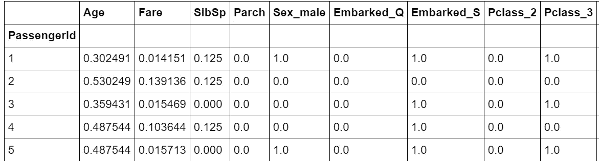

## 特征选择

特征选择是选择相关变量的子集来构建机器学习模型的过程。它使模型更容易解释，并减少过度拟合(当模型适应训练数据过多，并且在训练集之外表现不佳时)。

在数据分析期间，我已经通过排除不相关的列进行了第一次“手动”特征选择。现在会有一点不同，因为我们假设矩阵中的所有特性都是相关的，我们想去掉不必要的特性。当一个特性不是必需的时候。答案很简单:当有更好的对等物，或者做同样工作但更好的对等物时。

我用一个例子来解释: *Pclass* 与 *Cabin_section* 高度相关，因为，正如我们之前看到的，某些部分位于一等舱，而其他部分位于二等舱。让我们计算相关矩阵来看看:

```
corr_matrix = dtf.copy()
for col in corr_matrix.columns:
    if corr_matrix[col].dtype == "O":
         corr_matrix[col] = corr_matrix[col].factorize(sort=True)[0]corr_matrix = corr_matrix.**corr**(method="pearson")
sns.heatmap(corr_matrix, vmin=-1., vmax=1., annot=True, fmt='.2f', cmap="YlGnBu", cbar=True, linewidths=0.5)
plt.title("pearson correlation")
```

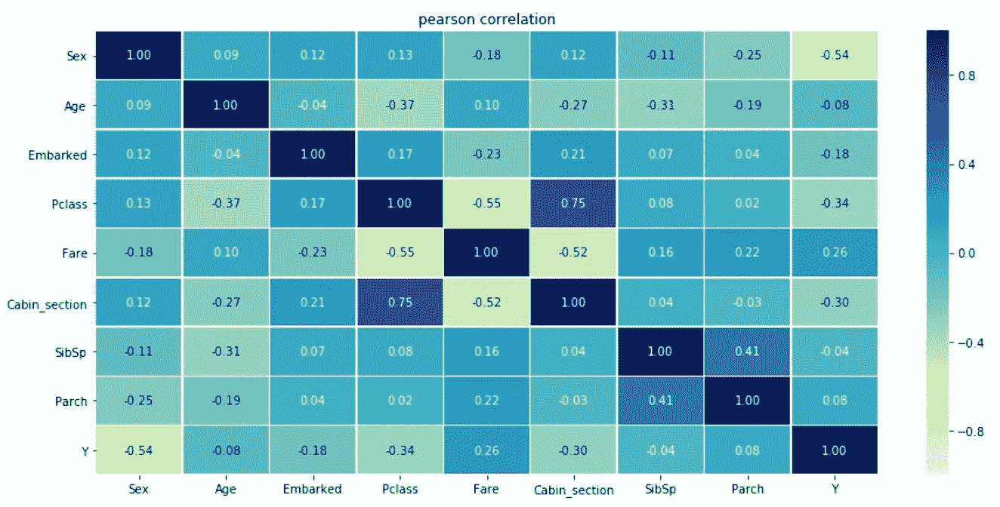

*Pclass* 和 *Cabin_section* 中的一个可能是不必要的，我们可以决定丢弃它并保留最有用的一个(即具有最低 p 值的一个或最能降低熵的一个)。

我将展示两种不同的方法来执行自动特征选择:首先，我将使用正则化方法并将其与之前已经提到的 ANOVA 测试进行比较，然后我将展示如何从集成方法中获得特征重要性。

[**套索正则化**](https://en.wikipedia.org/wiki/Lasso_(statistics)) 是一种回归分析方法，执行变量选择和正则化，以提高准确性和可解释性。

```
X = dtf_train.drop("Y", axis=1).values
y = dtf_train["Y"].values
feature_names = dtf_train.drop("Y", axis=1).columns**## Anova**
selector = **feature_selection.SelectKBest**(score_func=  
               feature_selection.f_classif, k=10).fit(X,y)
anova_selected_features = feature_names[selector.get_support()]

**## Lasso regularization**
selector = **feature_selection.SelectFromModel**(estimator= 
              linear_model.LogisticRegression(C=1, penalty="l1", 
              solver='liblinear'), max_features=10).fit(X,y)
lasso_selected_features = feature_names[selector.get_support()]

**## Plot** dtf_features = pd.DataFrame({"features":feature_names})
dtf_features["anova"] = dtf_features["features"].apply(lambda x: "anova" if x in anova_selected_features else "")
dtf_features["num1"] = dtf_features["features"].apply(lambda x: 1 if x in anova_selected_features else 0)
dtf_features["lasso"] = dtf_features["features"].apply(lambda x: "lasso" if x in lasso_selected_features else "")
dtf_features["num2"] = dtf_features["features"].apply(lambda x: 1 if x in lasso_selected_features else 0)
dtf_features["method"] = dtf_features[["anova","lasso"]].apply(lambda x: (x[0]+" "+x[1]).strip(), axis=1)
dtf_features["selection"] = dtf_features["num1"] + dtf_features["num2"]
sns.**barplot**(y="features", x="selection", hue="method", data=dtf_features.sort_values("selection", ascending=False), dodge=False)
```

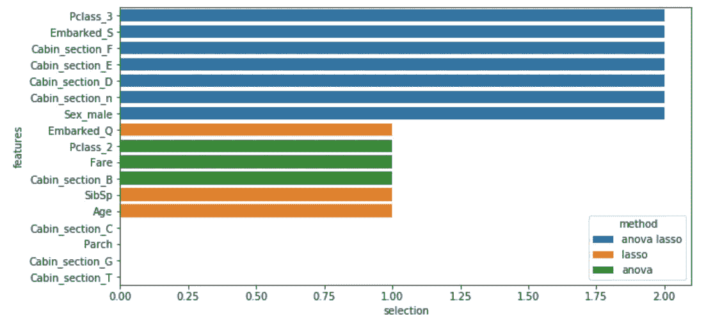

蓝色要素是通过方差分析和 LASSO 选择的要素，其他要素是通过两种方法中的一种选择的。

[**随机森林**](https://en.wikipedia.org/wiki/Random_forest) 是一种集成方法，由许多决策树组成，其中每个节点都是单个要素上的一个条件，旨在将数据集一分为二，以便相似的响应值最终出现在同一组中。特征重要性是根据每个特征减少树中熵的多少来计算的。

```
X = dtf_train.drop("Y", axis=1).values
y = dtf_train["Y"].values
feature_names = dtf_train.drop("Y", axis=1).columns.tolist()**## Importance**
model = ensemble.**RandomForestClassifier**(n_estimators=100,
                      criterion="entropy", random_state=0)
model.fit(X,y)
importances = model.**feature_importances_****## Put in a pandas dtf**
dtf_importances = pd.DataFrame({"IMPORTANCE":importances, 
            "VARIABLE":feature_names}).sort_values("IMPORTANCE", 
            ascending=False)
dtf_importances['cumsum'] =  
            dtf_importances['IMPORTANCE'].cumsum(axis=0)
dtf_importances = dtf_importances.set_index("VARIABLE")

**##** **Plot**
fig, ax = plt.subplots(nrows=1, ncols=2, sharex=False, sharey=False)
fig.suptitle("Features Importance", fontsize=20)
ax[0].title.set_text('variables')
    dtf_importances[["IMPORTANCE"]].sort_values(by="IMPORTANCE").plot(
                kind="barh", legend=False, ax=ax[0]).grid(axis="x")
ax[0].set(ylabel="")
ax[1].title.set_text('cumulative')
dtf_importances[["cumsum"]].plot(kind="line", linewidth=4, 
                                 legend=False, ax=ax[1])
ax[1].set(xlabel="", xticks=np.arange(len(dtf_importances)), 
          xticklabels=dtf_importances.index)
plt.xticks(rotation=70)
plt.grid(axis='both')
plt.show()
```

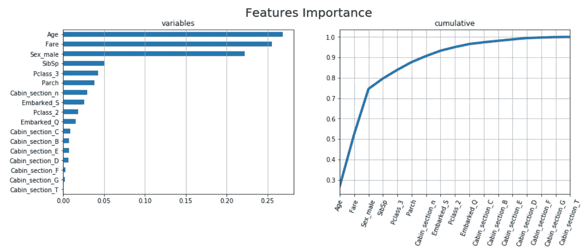

很有意思的是，*年龄*和*票价、*这两个这次最重要的特征，以前并不是最重要的特征，相反*客舱 _ E 段*、 *F* 和 *D* 在这里似乎并不太有用。

就我个人而言，我总是尽量少用一些功能，所以在这里我选择了以下几个，并继续进行机器学习模型的设计、训练、测试和评估:

```
X_names = ["Age", "Fare", "Sex_male", "SibSp", "Pclass_3", "Parch",
"Cabin_section_n", "Embarked_S", "Pclass_2", "Cabin_section_F", "Cabin_section_E", "Cabin_section_D"]X_train = dtf_train[X_names].values
y_train = dtf_train["Y"].valuesX_test = dtf_test[X_names].values
y_test = dtf_test["Y"].values
```

请注意，在使用测试数据进行预测之前，您必须对其进行预处理，就像我们对训练数据所做的那样。

## 模型设计

最后，是时候建立机器学习模型了。首先，我们需要选择一种算法，它能够从训练数据中学习如何通过最小化一些误差函数来识别目标变量的两个类别。

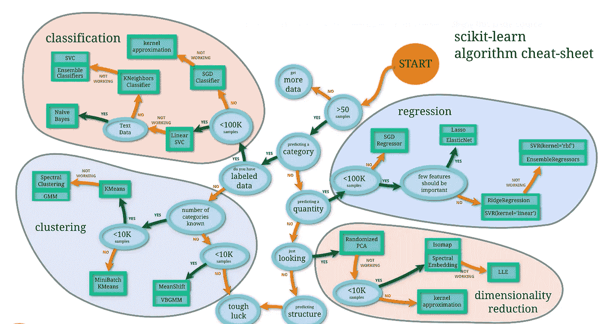

来源: [scikit-learn](https://scikit-learn.org/stable/tutorial/machine_learning_map/index.html)

我建议总是尝试一个 [**渐变提升**](https://en.wikipedia.org/wiki/Gradient_boosting) 算法(像 XGBoost)。这是一种机器学习技术，它以弱预测模型的集合的形式产生预测模型，通常是决策树。基本上，它类似于一个随机的森林，不同之处在于每棵树都符合前一棵树的误差。

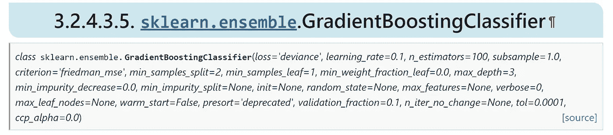

来源: [scikit-learn](https://scikit-learn.org/stable/modules/generated/sklearn.ensemble.GradientBoostingClassifier.html)

有很多超参数，没有什么是最好的通用规则，所以你只需要找到更适合你的数据的正确组合。您可以手动进行不同的尝试，或者让计算机通过 GridSearch(尝试每种可能的组合，但需要时间)或 RandomSearch(随机尝试固定次数的迭代)来完成这项繁琐的工作。我将尝试对我的**超参数调整**进行随机搜索:机器将通过训练数据迭代 n 次(1000 次)以找到参数组合(在下面的代码中指定),最大化用作 KPI(准确性，正确预测数与输入样本总数的比率)的评分函数:

```
**## call model**
model = ensemble.**GradientBoostingClassifier**()**## define hyperparameters combinations to try** param_dic = {'**learning_rate**':[0.15,0.1,0.05,0.01,0.005,0.001],      *#weighting factor for the corrections by new trees when added to the model* '**n_estimators**':[100,250,500,750,1000,1250,1500,1750],  *#number of trees added to the model*
'**max_depth**':[2,3,4,5,6,7],    *#maximum depth of the tree*
'**min_samples_split**':[2,4,6,8,10,20,40,60,100],    *#sets the minimum number of samples to split*
'**min_samples_leaf**':[1,3,5,7,9],     *#the minimum number of samples to form a leaf* '**max_features**':[2,3,4,5,6,7],     *#square root of features is usually a good starting point*
'**subsample**':[0.7,0.75,0.8,0.85,0.9,0.95,1]}       *#the fraction of samples to be used for fitting the individual base learners. Values lower than 1 generally lead to a reduction of variance and an increase in bias.***## random search**
random_search = model_selection.**RandomizedSearchCV**(model, 
       param_distributions=param_dic, n_iter=1000, 
       scoring="accuracy").fit(X_train, y_train)print("Best Model parameters:", random_search.best_params_)
print("Best Model mean accuracy:", random_search.best_score_)model = random_search.best_estimator_
```

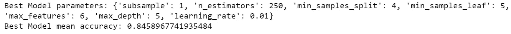

酷，这是最好的模型，平均精度为 0.85，因此在测试集上可能有 85%的预测是正确的。

我们还可以使用 **k 倍交叉验证**来验证该模型，该过程包括将数据分成 k 次训练和验证集，并且针对每次分割对模型进行训练和测试。它用于检查模型通过一些数据进行训练的能力，以及预测未知数据的能力。

我想澄清一下，我称**验证集**为一组用于调整分类器超参数的例子，从分割训练数据中提取。另一方面，**测试集**是一个模拟模型在生产中的表现，当它被要求预测以前从未见过的观察时。

通常为每个折叠绘制一个 **ROC 曲线**，该图说明了二元分类器的能力如何随着其区分阈值的变化而变化。它是通过在各种阈值设置下绘制真阳性率(正确预测的 1)与假阳性率(预测的 1 实际上是 0)来创建的。[**AUC**](https://en.wikipedia.org/wiki/Receiver_operating_characteristic#Area_under_the_curve)**(ROC 曲线下的面积)表示分类器将随机选择的阳性观察值( *Y=1* )排序高于随机选择的阴性观察值( *Y=0* )的概率。**

**现在，我将展示一个 10 次折叠的示例(k=10):**

```
cv = model_selection.StratifiedKFold(n_splits=10, shuffle=True)
tprs, aucs = [], []
mean_fpr = np.linspace(0,1,100)
fig = plt.figure()i = 1
for train, test in cv.split(X_train, y_train):
   prediction = model.fit(X_train[train],
                y_train[train]).predict_proba(X_train[test])
   fpr, tpr, t = metrics.roc_curve(y_train[test], prediction[:, 1])
   tprs.append(scipy.interp(mean_fpr, fpr, tpr))
   roc_auc = metrics.auc(fpr, tpr)
   aucs.append(roc_auc)
   plt.plot(fpr, tpr, lw=2, alpha=0.3, label='ROC fold %d (AUC = 
            %0.2f)' % (i, roc_auc))
   i = i+1

plt.plot([0,1], [0,1], linestyle='--', lw=2, color='black')
mean_tpr = np.mean(tprs, axis=0)
mean_auc = metrics.auc(mean_fpr, mean_tpr)
plt.plot(mean_fpr, mean_tpr, color='blue', label=r'Mean ROC (AUC = 
         %0.2f )' % (mean_auc), lw=2, alpha=1)
plt.xlabel('False Positive Rate')
plt.ylabel('True Positive Rate')
plt.title('K-Fold Validation')
plt.legend(loc="lower right")
plt.show()
```

**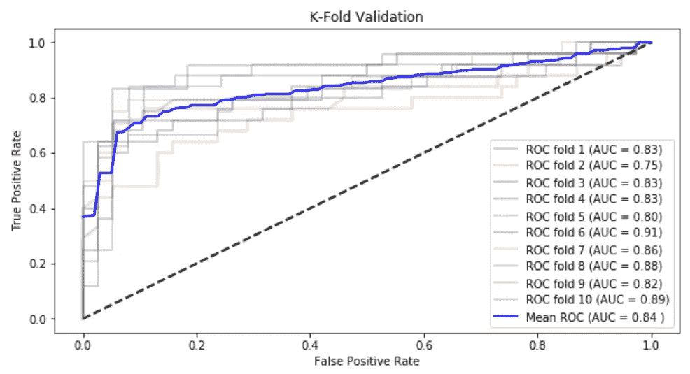**

**根据这一验证，在对测试进行预测时，我们应该预期 AUC 分数在 0.84 左右。**

**出于本教程的目的，我认为性能很好，我们可以继续使用随机搜索选择的模型。一旦选择了正确的模型，就可以在整个训练集上对其进行训练，然后在测试集上进行测试。**

```
**## train**
model.**fit**(X_train, y_train)**## test**
predicted_prob = model.**predict_proba**(X_test)[:,1]
predicted = model.**predict**(X_test)
```

**在上面的代码中，我做了两种预测:第一种是观察值为 1 的概率，第二种是标签(1 或 0)的预测。为了得到后者，你必须决定一个概率阈值，对于这个阈值，一个观察可以被认为是 1，我使用默认的阈值 0.5。**

## **估价**

**关键时刻到了，我们要看看所有这些努力是否值得。重点是研究模型做出了多少正确的预测和错误类型。**

**我将使用以下常用指标来评估该模型:准确性、AUC、 [**精度和召回**](https://en.wikipedia.org/wiki/Precision_and_recall) 。我已经提到了前两个，但我认为其他的更重要。精度是模型在所有预测的 1(或 0)中正确预测的 1(或 0)的分数，因此它可以被视为预测 1(或 0)时的一种置信度。召回是模型在测试集中所有 1(或 0)中正确预测的 1(或 0)的部分，基本上它是真正的 1 率。将精确度和召回率与调和平均值相结合，就得到 F1 分数。**

**让我们看看模型在测试集上的表现:**

```
**## Accuray e AUC**
accuracy = metrics.**accuracy_score**(y_test, predicted)
auc = metrics.**roc_auc_score**(y_test, predicted_prob)
print("Accuracy (overall correct predictions):",  round(accuracy,2))
print("Auc:", round(auc,2))

**## Precision e Recall**
recall = metrics.**recall_score**(y_test, predicted)
precision = metrics.**precision_score**(y_test, predicted)
print("Recall (all 1s predicted right):", round(recall,2))
print("Precision (confidence when predicting a 1):", round(precision,2))
print("Detail:")
print(metrics.**classification_report**(y_test, predicted, target_names=[str(i) for i in np.unique(y_test)]))
```

**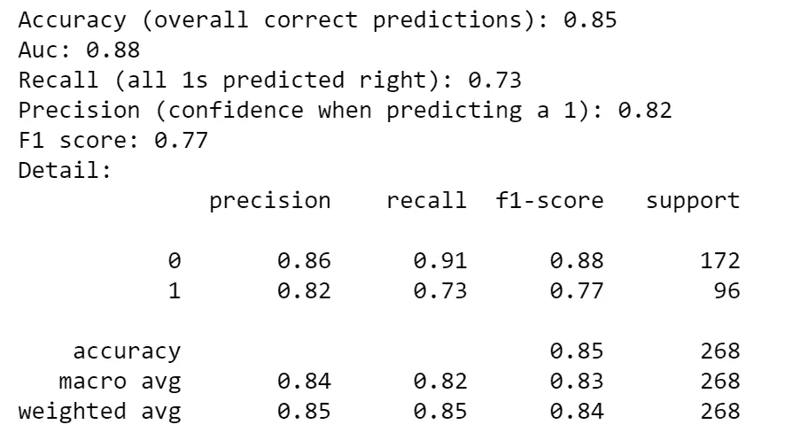**

**正如预期的那样，模型的总体准确率在 85%左右。它以 84%的精度正确预测了 71%的 1，以 85%的精度正确预测了 92%的 0。为了更好地理解这些指标，我将把结果分解成一个[混淆矩阵](https://en.wikipedia.org/wiki/Confusion_matrix):**

```
classes = np.unique(y_test)
fig, ax = plt.subplots()
cm = metrics.**confusion_matrix**(y_test, predicted, labels=classes)
sns.heatmap(cm, annot=True, fmt='d', cmap=plt.cm.Blues, cbar=False)
ax.set(xlabel="Pred", ylabel="True", title="Confusion matrix")
ax.set_yticklabels(labels=classes, rotation=0)
plt.show()
```

**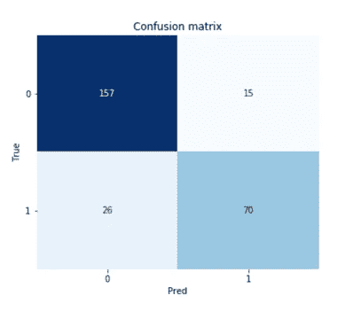**

**我们可以看到，该模型预测了 85 (70+15)个 1，其中 70 个是真阳性，15 个是假阳性，因此在预测 1 时，它的精度为 70/85 = 0.82。另一方面，该模型在测试集中的所有 96 个(70+26)1 中得到了 70 个 1，因此其召回率为 70/96 = 0.73。**

**选择阈值 0.5 来决定预测是 1 还是 0 导致了这种结果。换一个会不一样吗？当然可以，但是没有一个阈值可以让准确率和召回率都达到最高分，选择一个阈值意味着在这两个指标之间进行折衷。我将通过绘制测试结果的 ROC 曲线和精确回忆曲线来说明我的意思:**

```
classes = np.unique(y_test)
fig, ax = plt.subplots(nrows=1, ncols=2)**## plot ROC curve**
fpr, tpr, thresholds = metrics.**roc_curve**(y_test, predicted_prob)
roc_auc = metrics.auc(fpr, tpr)     
ax[0].plot(fpr, tpr, color='darkorange', lw=3, label='area = %0.2f' % roc_auc)
ax[0].plot([0,1], [0,1], color='navy', lw=3, linestyle='--')
ax[0].hlines(y=recall, xmin=0, xmax=1-cm[0,0]/(cm[0,0]+cm[0,1]), color='red', linestyle='--', alpha=0.7, label="chosen threshold")
ax[0].vlines(x=1-cm[0,0]/(cm[0,0]+cm[0,1]), ymin=0, ymax=recall, color='red', linestyle='--', alpha=0.7)
ax[0].set(xlabel='False Positive Rate', ylabel="True Positive Rate (Recall)", title="Receiver operating characteristic")     
ax.legend(loc="lower right")
ax.grid(True)**## annotate ROC thresholds**
thres_in_plot = []
for i,t in enumerate(thresholds):
     t = np.round(t,1)
     if t not in thres_in_plot:
         ax.annotate(t, xy=(fpr[i],tpr[i]), xytext=(fpr[i],tpr[i]), 
              textcoords='offset points', ha='left', va='bottom')
         thres_in_plot.append(t)
     else:
         next**## plot P-R curve**
precisions, recalls, thresholds = metrics.**precision_recall_curve**(y_test, predicted_prob)
roc_auc = metrics.auc(recalls, precisions)
ax[1].plot(recalls, precisions, color='darkorange', lw=3, label='area = %0.2f' % roc_auc)
ax[1].plot([0,1], [(cm[1,0]+cm[1,0])/len(y_test), (cm[1,0]+cm[1,0])/len(y_test)], linestyle='--', color='navy', lw=3)
ax[1].hlines(y=precision, xmin=0, xmax=recall, color='red', linestyle='--', alpha=0.7, label="chosen threshold")
ax[1].vlines(x=recall, ymin=0, ymax=precision, color='red', linestyle='--', alpha=0.7)
ax[1].set(xlabel='Recall', ylabel="Precision", title="Precision-Recall curve")
ax[1].legend(loc="lower left")
ax[1].grid(True)**## annotate P-R thresholds** thres_in_plot = []
for i,t in enumerate(thresholds):
    t = np.round(t,1)
    if t not in thres_in_plot:
         ax.annotate(np.round(t,1), xy=(recalls[i],precisions[i]), 
               xytext=(recalls[i],precisions[i]), 
               textcoords='offset points', ha='left', va='bottom')
         thres_in_plot.append(t)
    else:
         next
plt.show()
```

**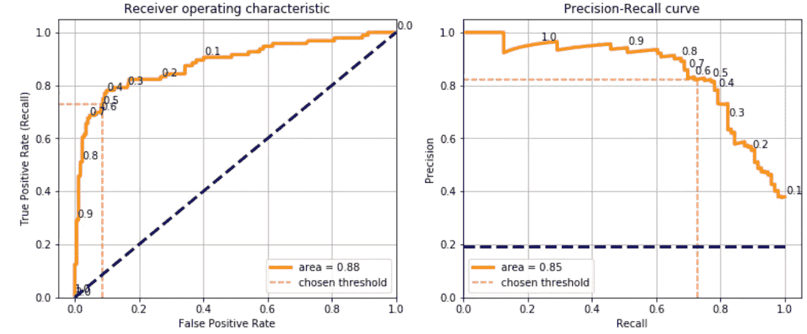**

**这些曲线的每一点都代表用不同阈值(曲线上印的数字)获得的混淆矩阵。我可以使用 0.1 的阈值，获得 0.9 的召回率，这意味着该模型将正确预测 90%的 1，但精度将下降到 0.4，这意味着该模型将预测大量的假阳性。因此，这实际上取决于用例的类型，尤其是假阳性是否比假阴性的成本更高。**

**当数据集是平衡的，并且项目涉众没有指定度量标准时，我通常选择最大化 F1 分数的阈值。方法如下:**

```
**## calculate scores for different thresholds**
dic_scores = {'accuracy':[], 'precision':[], 'recall':[], 'f1':[]}
XX_train, XX_test, yy_train, yy_test = model_selection.train_test_split(X_train, y_train, test_size=0.2)
predicted_prob = model.fit(XX_train, yy_train).predict_proba(XX_test)[:,1]thresholds = []
for threshold in np.arange(0.1, 1, step=0.1):
    predicted = (predicted_prob > threshold)
    thresholds.append(threshold)
        dic_scores["accuracy"].append(metrics.accuracy_score(yy_test, predicted))
dic_scores["precision"].append(metrics.precision_score(yy_test, predicted))
dic_scores["recall"].append(metrics.recall_score(yy_test, predicted))
dic_scores["f1"].append(metrics.f1_score(yy_test, predicted))

**## plot** dtf_scores = pd.DataFrame(dic_scores).set_index(pd.Index(thresholds))    
dtf_scores.plot(ax=ax, title="Threshold Selection")
plt.show()
```

**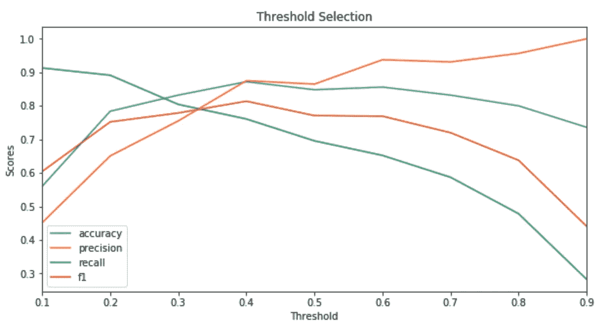**

**在继续这篇长教程的最后一节之前，我想说我们还不能说这个模型是好是坏。精度 0.85，高吗？相比什么？你需要一个**基线**来比较你的模型。也许你正在做的项目是关于建立一个新的模型来取代一个可以用作基线的旧模型，或者你可以在同一训练集上训练不同的机器学习模型，并在测试集上比较性能。**

## **可解释性**

**你分析并理解了数据，你训练了一个模型并测试了它，你甚至对性能感到满意。你以为你完了吗？不对。项目利益相关者很有可能不关心你的指标，不理解你的算法，所以你必须证明你的机器学习模型不是黑盒。**

***石灰*包可以帮助我们建造一个**讲解器**。为了举例说明，我将从测试集中随机观察，看看模型预测了什么:**

```
print("True:", y_test[4], "--> Pred:", predicted[4], "| Prob:", np.max(predicted_prob[4]))
```

**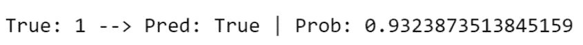**

**模型认为这个观察值是 1，概率为 0.93，事实上这个乘客确实活了下来。为什么？让我们使用解释器:**

```
explainer = lime_tabular.LimeTabularExplainer(training_data=X_train, feature_names=X_names, class_names=np.unique(y_train), mode="classification")
explained = explainer.explain_instance(X_test[4], model.predict_proba, num_features=10)
explained.as_pyplot_figure()
```

**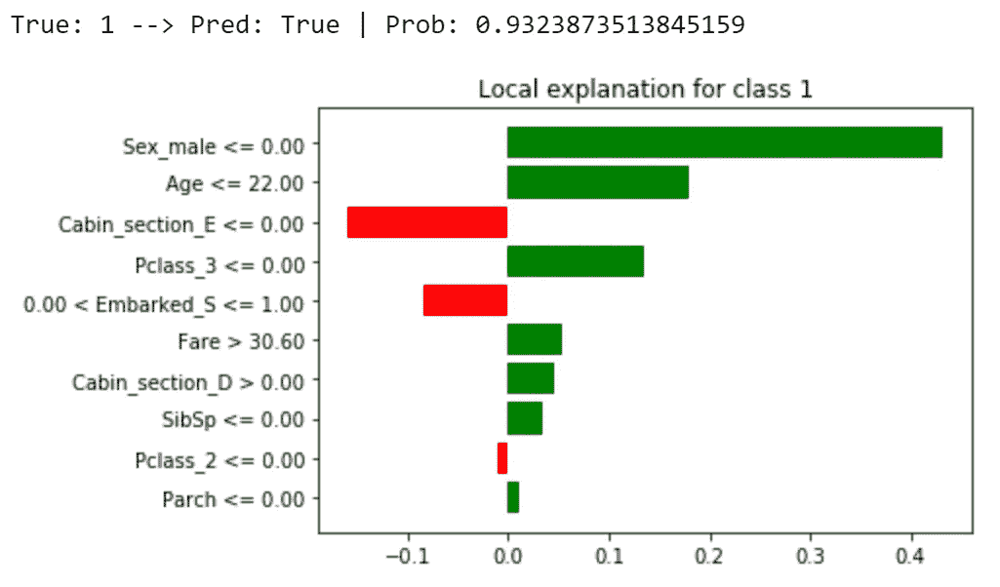**

**该特定预测的主要因素是乘客是女性(性别 _ 男性= 0)、年轻(年龄≤ 22)并且乘坐头等舱旅行(Pclass_3 = 0 和 Pclass_2 = 0)。**

**混淆矩阵是显示测试进行情况的一个很好的工具，但是我也绘制了**分类区域**来直观地帮助我们了解模型正确预测了哪些观察结果，以及它错过了哪些观察结果。为了绘制二维数据，需要进行一定程度的降维(通过获得一组主要变量来减少特征数量的过程)。我将给出一个例子，使用 [PCA](https://en.wikipedia.org/wiki/Principal_component_analysis) 算法将数据总结为两个变量，这些变量是通过特征的线性组合获得的。**

```
**## PCA**
pca = decomposition.PCA(n_components=2)
X_train_2d = pca.fit_transform(X_train)
X_test_2d = pca.transform(X_test)**## train 2d model**
model_2d = ensemble.GradientBoostingClassifier()
model_2d.fit(X_train, y_train)

**## plot classification regions**
from matplotlib.colors import ListedColormap
colors = {np.unique(y_test)[0]:"black", np.unique(y_test)[1]:"green"}
X1, X2 = np.meshgrid(np.arange(start=X_test[:,0].min()-1, stop=X_test[:,0].max()+1, step=0.01),
np.arange(start=X_test[:,1].min()-1, stop=X_test[:,1].max()+1, step=0.01))
fig, ax = plt.subplots()
Y = model_2d.predict(np.array([X1.ravel(), X2.ravel()]).T).reshape(X1.shape)
ax.contourf(X1, X2, Y, alpha=0.5, cmap=ListedColormap(list(colors.values())))
ax.set(xlim=[X1.min(),X1.max()], ylim=[X2.min(),X2.max()], title="Classification regions")
for i in np.unique(y_test):
    ax.scatter(X_test[y_test==i, 0], X_test[y_test==i, 1], 
               c=colors[i], label="true "+str(i))  
plt.legend()
plt.show()
```

****

## **结论**

**这篇文章是演示**如何用数据科学处理分类用例**的教程。我以泰坦尼克号数据集为例，经历了从数据分析到机器学习模型的每一步。**

**在探索部分，我分析了单个分类变量、单个数值变量以及它们如何相互作用的情况。我举了一个从原始数据中提取特征的特征工程的例子。关于预处理，我解释了如何处理缺失值和分类数据。我展示了选择正确特征的不同方法，如何使用它们来构建机器学习分类器，以及如何评估性能。在最后一节，我就如何提高你的机器学习模型的可解释性给出了一些建议。**

**一个重要的注意事项是，我还没有介绍在您的模型被批准部署之后会发生什么。请记住，您需要构建一个管道来自动处理您将定期获得的新数据。**

**现在，您已经知道如何处理数据科学用例，您可以将这些代码和方法应用于任何类型的二进制分类问题，执行您自己的分析，构建您自己的模型，甚至解释它。**

**我希望你喜欢它！如有问题和反馈，或者只是分享您感兴趣的项目，请随时联系我。**

> **👉[我们来连线](https://linktr.ee/maurodp)👈**

> **本文是系列**用 Python 进行机器学习**的一部分，参见:**

**[](/machine-learning-with-python-regression-complete-tutorial-47268e546cea) [## Python 机器学习:回归(完整教程)

### 数据分析和可视化、特征工程和选择、模型设计和测试、评估和解释

towardsdatascience.com](/machine-learning-with-python-regression-complete-tutorial-47268e546cea) [](/clustering-geospatial-data-f0584f0b04ec) [## 聚类地理空间数据

### 使用交互式地图绘制机器学习和深度学习聚类

towardsdatascience.com](/clustering-geospatial-data-f0584f0b04ec) [](/deep-learning-with-python-neural-networks-complete-tutorial-6b53c0b06af0) [## Python 深度学习:神经网络(完整教程)

### 用 TensorFlow 建立、绘制和解释人工神经网络

towardsdatascience.com](/deep-learning-with-python-neural-networks-complete-tutorial-6b53c0b06af0) [](/modern-recommendation-systems-with-neural-networks-3cc06a6ded2c) [## 基于神经网络的现代推荐系统

### 使用 Python 和 TensorFlow 构建混合模型

towardsdatascience.com](/modern-recommendation-systems-with-neural-networks-3cc06a6ded2c)**