# Python 机器学习:回归(完整教程)

> 原文：<https://towardsdatascience.com/machine-learning-with-python-regression-complete-tutorial-47268e546cea?source=collection_archive---------2----------------------->


## 数据分析和可视化、特征工程和选择、模型设计和测试、评估和解释

## 摘要

在本文中，我将使用数据科学和 Python 解释回归用例的主要步骤，从数据分析到理解模型输出。

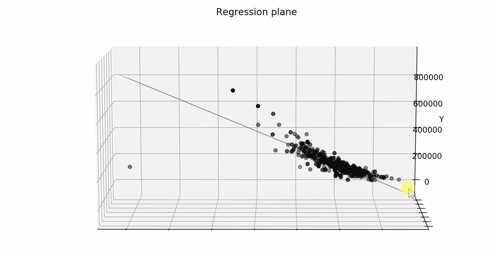

我将展示一些有用的 Python 代码，这些代码可以很容易地用于其他类似的情况(只需复制、粘贴、运行)，并通过注释遍历每一行代码，这样您就可以很容易地复制这个示例(下面是完整代码的链接)。

[](https://github.com/mdipietro09/DataScience_ArtificialIntelligence_Utils/blob/master/machine_learning/example_regression.ipynb) [## mdipietro 09/data science _ 人工智能 _ 实用工具

### permalink dissolve GitHub 是 4000 多万开发人员的家园，他们一起工作来托管和审查代码，管理…

github.com](https://github.com/mdipietro09/DataScience_ArtificialIntelligence_Utils/blob/master/machine_learning/example_regression.ipynb) 

我将使用“**房价数据集**”(链接如下)，其中为您提供了描述一些住宅不同方面的多个解释变量，任务是预测每套住宅的最终价格。

[](https://www.kaggle.com/c/house-prices-advanced-regression-techniques/data) [## 房价:高级回归技术

### 预测销售价格并实践特征工程、RFs 和梯度推进

www.kaggle.com](https://www.kaggle.com/c/house-prices-advanced-regression-techniques/data) 

特别是，我将经历:

*   环境设置:导入库并读取数据
*   数据分析:理解变量的意义和预测能力
*   特征工程:从原始数据中提取特征
*   预处理:数据划分、处理缺失值、编码分类变量、缩放
*   特征选择:只保留最相关的变量
*   模型设计:基线、训练、验证、测试
*   绩效评估:阅读指标
*   可解释性:理解模型如何做出预测

## 设置

首先，我需要导入以下库。

```
**## for data**
import **pandas** as pd
import **numpy** as np**## for plotting**
import **matplotlib**.pyplot as plt
import **seaborn** as sns**## for statistical tests**
import **scipy**
import **statsmodels**.formula.api as smf
import statsmodels.api as sm**## for machine learning**
from **sklearn** import model_selection, preprocessing, feature_selection, ensemble, linear_model, metrics, decomposition**## for explainer**
from **lime** import lime_tabular
```

然后我会把数据读入一个*熊猫*数据帧。原始数据集包含 81 列，但是出于本教程的目的，我将使用 12 列的子集。

```
dtf = pd.read_csv("data_houses.csv")cols = ["OverallQual","GrLivArea","GarageCars", 
        "GarageArea","TotalBsmtSF","FullBath",
        "YearBuilt","YearRemodAdd",
        "LotFrontage","MSSubClass"]dtf = dtf[["Id"]+cols+["SalePrice"]]
dtf.head()
```

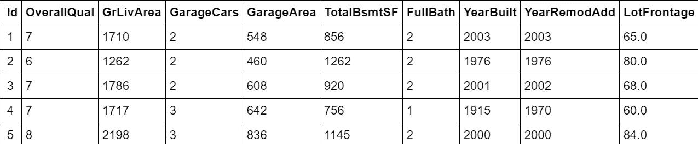

有关列的详细信息可以在所提供的数据集链接中找到。

请注意，表格的每一行代表一个特定的房子(或观察)。如果您正在处理一个不同的数据集，它没有这样的结构，其中每一行代表一个观察，那么您需要汇总数据并转换它。

现在一切都设置好了，我将从分析数据开始，然后选择特征，建立机器学习模型并进行预测。

我们开始吧，好吗？

## 数据分析

在统计学中，[探索性数据分析](https://en.wikipedia.org/wiki/Exploratory_data_analysis)是对数据集的主要特征进行总结的过程，以了解数据在正式建模或假设检验任务之外还能告诉我们什么。

我总是从获得整个数据集的概述开始，特别是，我想知道有多少个**分类**和**数值**变量以及**缺失数据**的比例。识别变量的类型有时会很棘手，因为类别可以用数字表示。为此，我将编写一个简单的函数来完成这项工作:

```
**'''
Recognize whether a column is numerical or categorical.
:parameter
    :param dtf: dataframe - input data
    :param col: str - name of the column to analyze
    :param max_cat: num - max number of unique values to recognize a column as categorical
:return
    "cat" if the column is categorical or "num" otherwise
'''**
def **utils_recognize_type**(dtf, col, max_cat=20):
    if (dtf[col].dtype == "O") | (dtf[col].nunique() < max_cat):
        return **"cat"**
    else:
        return **"num"**
```

这个功能非常有用，可以用在很多场合。为了举例说明，我将绘制 dataframe 的 [**热图**](http://Heat map) ，并可视化列类型和缺失的数据。

```
dic_cols = {col:**utils_recognize_type**(dtf, col, max_cat=20) for col in dtf.columns}heatmap = dtf.isnull()
for k,v in dic_cols.items():
 if v == "num":
   heatmap[k] = heatmap[k].apply(lambda x: 0.5 if x is False else 1)
 else:
   heatmap[k] = heatmap[k].apply(lambda x: 0 if x is False else 1)sns.**heatmap**(heatmap, cbar=False).set_title('Dataset Overview')
plt.show()print("\033[1;37;40m Categerocial ", "\033[1;30;41m Numeric ", "\033[1;30;47m NaN ")
```

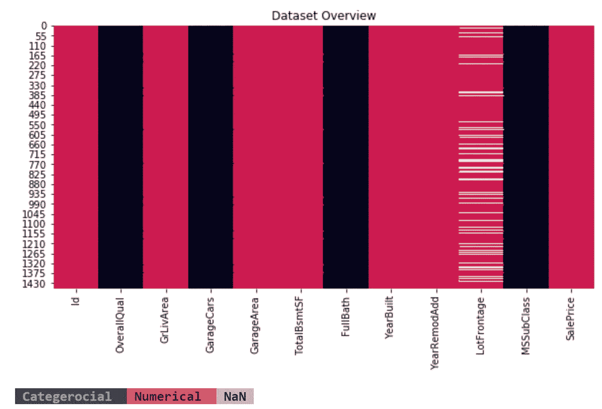

有 1460 行和 12 列:

*   表中的每一行都代表一个由 *Id* 标识的特定房屋(或观察)，所以我将它设置为索引(或者为 SQL 爱好者设置表的[主键](https://en.wikipedia.org/wiki/Primary_key))。
*   *SalePrice* 是我们想要了解和预测的因变量，所以我将该列重命名为“*Y”*。
*   *总体质量、车库、全浴*和*ms 子类*是分类变量，其他是数值变量。
*   只有 *LotFrontage* 包含缺失数据。

```
dtf = dtf.set_index("**Id**")dtf = dtf.rename(columns={"**SalePrice**":"**Y**"})
```

我相信可视化是数据分析的最好工具，但是你需要知道什么样的图更适合不同类型的变量。因此，我将提供代码来为不同的示例绘制适当的可视化。

首先，让我们看看单变量分布(只有一个变量的概率分布)。一个 [**直方图**](https://en.wikipedia.org/wiki/Histogram) 完美地给出了单个**数值**数据的底层分布密度的粗略感觉。我推荐使用一个 [**方框图**](https://en.wikipedia.org/wiki/Box_plot) 来图形化地描绘数据组通过它们的四分位数。例如，让我们绘制目标变量:

```
**x = "Y"**fig, ax = plt.subplots(nrows=1, ncols=2,  sharex=False, sharey=False)
fig.suptitle(x, fontsize=20)**### distribution**
ax[0].title.set_text('distribution')
variable = dtf[x].fillna(dtf[x].mean())
breaks = np.quantile(variable, q=np.linspace(0, 1, 11))
variable = variable[ (variable > breaks[0]) & (variable < 
                    breaks[10]) ]
sns.distplot(variable, hist=True, kde=True, kde_kws={"shade": True}, ax=ax[0])
des = dtf[x].describe()
ax[0].axvline(des["25%"], ls='--')
ax[0].axvline(des["mean"], ls='--')
ax[0].axvline(des["75%"], ls='--')
ax[0].grid(True)
des = round(des, 2).apply(lambda x: str(x))
box = '\n'.join(("min: "+des["min"], "25%: "+des["25%"], "mean: "+des["mean"], "75%: "+des["75%"], "max: "+des["max"]))
ax[0].text(0.95, 0.95, box, transform=ax[0].transAxes, fontsize=10, va='top', ha="right", bbox=dict(boxstyle='round', facecolor='white', alpha=1))**### boxplot** 
ax[1].title.set_text('outliers (log scale)')
tmp_dtf = pd.DataFrame(dtf[x])
tmp_dtf[x] = np.log(tmp_dtf[x])
tmp_dtf.boxplot(column=x, ax=ax[1])
plt.show()
```

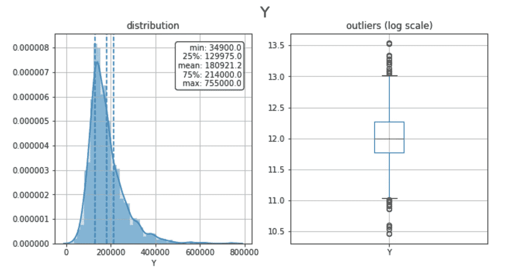

这个群体的平均房价是 181，000 美元，分布是高度偏斜的，两边都有异常值。

此外，一个 [**条形图**](https://en.wikipedia.org/wiki/Bar_chart) 适于理解单个**分类**变量的标签频率。让我们以*全浴室*(浴室数量)变量为例:它具有普通性(2 个浴室> 1 个浴室)，但它不是连续的(一个家庭不可能有 1.5 个浴室)，所以它可以作为一个范畴来分析。

```
**x = "Y"**ax = dtf[x].value_counts().sort_values().plot(kind="barh")
totals= []
for i in ax.patches:
    totals.append(i.get_width())
total = sum(totals)
for i in ax.patches:
     ax.text(i.get_width()+.3, i.get_y()+.20, 
     str(round((i.get_width()/total)*100, 2))+'%', 
     fontsize=10, color='black')
ax.grid(axis="x")
plt.suptitle(x, fontsize=20)
plt.show()
```

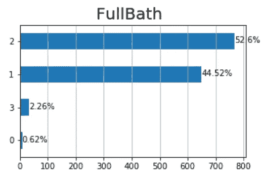

大多数房子有 1 个或 2 个浴室，也有一些离群值有 0 个和 3 个浴室。

我将把分析带到下一个层次，并研究二元分布，以了解 *FullBath* 是否具有预测 *Y* 的预测能力。这就是**分类(*全浴*)对数字( *Y* )** 的情况，因此我将这样进行:

*   将人口(整套观察结果)分成 4 个样本:有 0 间浴室(*全浴= 0)、* 1 间浴室(*全浴= 1)* 的房屋部分，以此类推…
*   绘制并比较 4 个样本的密度，如果分布不同，则变量是可预测的，因为 4 组具有不同的模式。
*   将数值变量( *Y* )分组到箱(子样本)中，并绘制每个箱的组成，如果所有箱中类别的比例相似，则该变量不具有预测性。
*   绘制并比较 4 个样本的箱线图，找出异常值的不同行为。

```
**cat, num = "FullBath", "Y"**fig, ax = plt.subplots(nrows=1, ncols=3,  sharex=False, sharey=False)
fig.suptitle(x+"   vs   "+y, fontsize=20)

**### distribution**
ax[0].title.set_text('density')
for i in dtf[cat].unique():
    sns.distplot(dtf[dtf[cat]==i][num], hist=False, label=i, ax=ax[0])
ax[0].grid(True)**### stacked**
ax[1].title.set_text('bins')
breaks = np.quantile(dtf[num], q=np.linspace(0,1,11))
tmp = dtf.groupby([cat, pd.cut(dtf[num], breaks, duplicates='drop')]).size().unstack().T
tmp = tmp[dtf[cat].unique()]
tmp["tot"] = tmp.sum(axis=1)
for col in tmp.drop("tot", axis=1).columns:
     tmp[col] = tmp[col] / tmp["tot"]
tmp.drop("tot", axis=1).plot(kind='bar', stacked=True, ax=ax[1], legend=False, grid=True)**### boxplot **  
ax[2].title.set_text('outliers')
sns.catplot(x=cat, y=num, data=dtf, kind="box", ax=ax[2])
ax[2].grid(True)
plt.show()
```

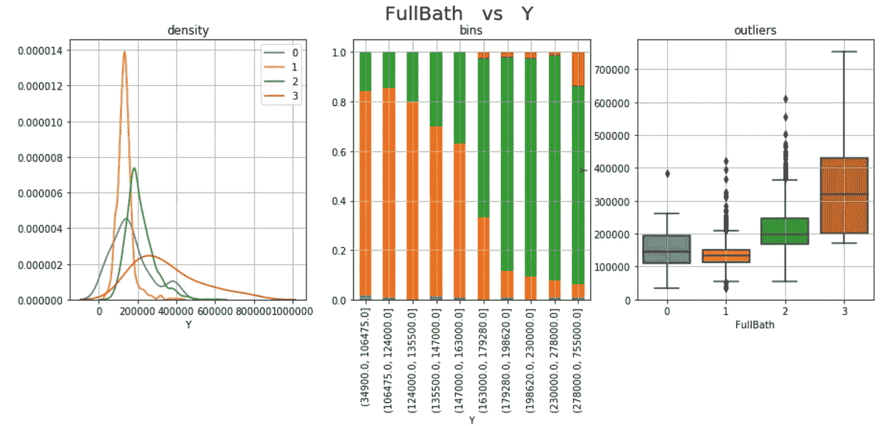

FullBath 似乎具有预测性，因为 4 个样本的分布在价格水平和观察次数上有很大不同。房子里的浴室越多，价格就越高，但我想知道 0 浴室样本和 3 浴室样本中的观察值是否有统计学意义，因为它们包含的观察值很少。

当“视觉直觉”无法说服你时，你可以求助于古老的统计数据来进行测试。在这种分类(*full bath*vs 数值( *Y* )的情况下，我会使用一个**o**[**n-way ANOVA 检验**](http://en.wikipedia.org/wiki/F_test#One-way_ANOVA_example) 。基本上是检验两个或两个以上独立样本的均值是否显著不同，所以如果 p 值足够小(< 0.05)样本的零假设意味着相等可以被拒绝。

```
**cat, num = "FullBath", "Y"**model = smf.**ols**(num+' ~ '+cat, data=dtf).fit()
table = sm.stats.**anova_lm**(model)
p = table["PR(>F)"][0]
coeff, p = None, round(p, 3)
conclusion = "Correlated" if p < 0.05 else "Non-Correlated"
print("Anova F: the variables are", conclusion, "(p-value: "+str(p)+")")
```

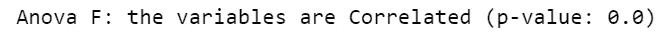

我们可以得出结论，浴室的数量决定了房子的价格。这是有道理的，因为更多的浴室意味着更大的房子，而房子的大小是一个重要的价格因素。

为了检查第一个结论的有效性，我必须分析目标变量相对于 *GrLivArea* (以平方英尺为单位的地上居住面积)的行为。这是一个**数值( *GrLivArea* ) vs 数值( *Y* )** 的例子，所以我将生成两个图:

*   首先，我将把 *GrLivArea* 值分组到箱中，并比较每个箱中 *Y* 的平均值(和中值),如果曲线不平坦，则变量是预测性的，因为箱具有不同的模式。
*   第二，我将使用散点图，图中两边是两个变量的分布。

```
**x, y = "GrLivArea", "Y"****### bin plot** dtf_noNan = dtf[dtf[x].notnull()]
breaks = np.quantile(dtf_noNan[x], q=np.linspace(0, 1, 11))
groups = dtf_noNan.groupby([pd.cut(dtf_noNan[x], bins=breaks, 
           duplicates='drop')])[y].agg(['mean','median','size'])
fig, ax = plt.subplots(figsize=figsize)
fig.suptitle(x+"   vs   "+y, fontsize=20)
groups[["mean", "median"]].plot(kind="line", ax=ax)
groups["size"].plot(kind="bar", ax=ax, rot=45, secondary_y=True,
                    color="grey", alpha=0.3, grid=True)
ax.set(ylabel=y)
ax.right_ax.set_ylabel("Observazions in each bin")
plt.show()**### scatter plot**
sns.jointplot(x=x, y=y, data=dtf, dropna=True, kind='reg', 
              height=int((figsize[0]+figsize[1])/2) )
plt.show()
```

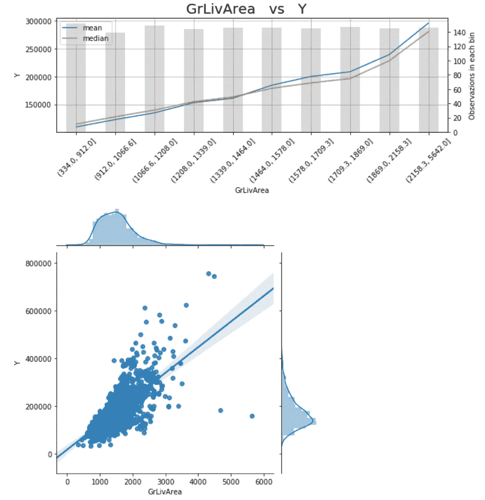

GrLivArea 是预测性的，有一个清晰的模式:平均来说，房子越大，价格越高，即使有一些超出平均水平的异常值和相对较低的价格。

就像之前一样，我们可以测试这两个变量之间的相关性。既然都是数值，我就 **t** [**est 皮尔逊相关系数**](https://en.wikipedia.org/wiki/Pearson_correlation_coefficient) :假设两个变量是独立的(零假设)，检验两个样本是否有线性关系。如果 p 值足够小(< 0.05)，可以拒绝零假设，我们可以说这两个变量可能是相关的。

```
**x, y = "GrLivArea", "Y"**dtf_noNan = dtf[dtf[x].notnull()]
coeff, p = scipy.stats.**pearsonr**(dtf_noNan[x], dtf_noNan[y])
coeff, p = round(coeff, 3), round(p, 3)
conclusion = "Significant" if p < 0.05 else "Non-Significant"
print("Pearson Correlation:", coeff, conclusion, "(p-value: "+str(p)+")")
```

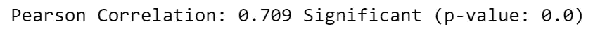

*FullBath* 和 *GrLivArea* 是预测特性的例子，因此我将保留它们用于建模。

应该对数据集中的每个变量进行这种分析，以决定哪些应该作为潜在特征保留，哪些因为不具有预测性而可以放弃(查看完整代码的链接)。

## 特征工程

是时候使用领域知识从原始数据创建新要素了。我将提供一个例子: *MSSubClass* 列(building 类)包含 15 个类别，这是一个很大的数目，在建模过程中会导致维度问题。让我们看看:

```
sns.**catplot**(x="MSSubClass", y="Y", data=dtf, kind="box")
```

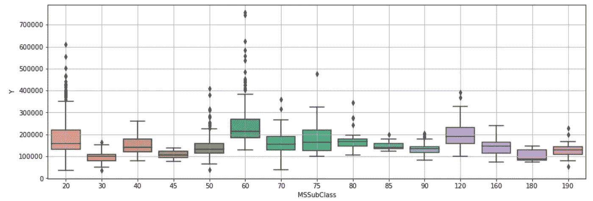

有许多类别，很难理解每个类别中的分布情况。因此，我将把这些类别分组为簇:具有较高 *Y* 值的类(如 *MSSubClass 60 和 120* )将进入“最大”簇，价格较低的类(如 *MSSubClass 30、45、180* )将进入“最小”簇，其余的将进入“平均”簇。

```
**## define clusters**
MSSubClass_clusters = {"**min**":[30,45,180], "**max**":[60,120], "**mean**":[]}**## create new columns**
dic_flat = {v:k for k,lst in MSSubClass_clusters.items() for v in lst}
for k,v in MSSubClass_clusters.items():
    if len(v)==0:
        residual_class = k 
dtf[x+"_cluster"] = dtf[x].apply(lambda x: dic_flat[x] if x in 
                          dic_flat.keys() else residual_class)**## print**
dtf[["MSSubClass","MSSubClass_cluster","Y"]].head()
```

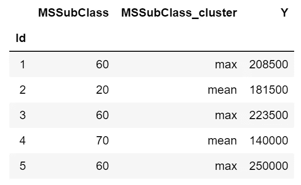

这样，我将类别的数量从 15 个减少到 3 个，这样更便于分析:

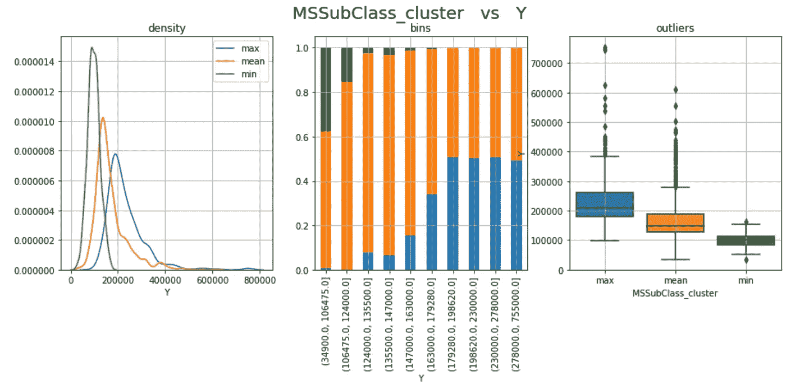

新的分类特性更易于阅读，并且保持了原始数据中显示的模式，因此我将保留 *MSSubClass_cluster* 而不是列 *MSSubClass* 。

## 预处理

数据预处理是准备原始数据以使其适合机器学习模型的阶段。特别是:

1.  每个观察必须用一行来表示，换句话说，不能用两行来描述同一个乘客，因为它们将被模型分别处理(数据集已经是这样的形式，所以✅).而且每一列都应该是一个特征，所以你不应该用 *Id* 作为预测器，这就是为什么这种表叫做“**特征矩阵**”。
2.  数据集必须**分割**成至少两个集合:模型应该在你的数据集的一个重要部分上训练(所谓的“训练集”)，在一个较小的集合上测试(“测试集”)。
3.  **缺少的值**应该用东西替换，否则，你的模型可能会出问题。
4.  **分类数据**必须编码，这意味着将标签转换为整数，因为机器学习期望的是数字，而不是字符串。
5.  对数据进行**缩放**是一种很好的做法，这有助于在特定范围内对数据进行标准化，并加快算法中的计算速度。

好的，让我们从**划分数据集**开始。当把数据分成训练集和测试集时，你必须遵循一个基本规则:训练集中的行不应该出现在测试集中。这是因为模型在训练过程中会看到目标值，并使用它来理解现象。换句话说，模型已经知道训练观察的正确答案，在这些基础上测试就像作弊。

```
**## split data**
dtf_train, dtf_test = **model_selection**.**train_test_split**(dtf, 
                      test_size=0.3)**## print info**
print("X_train shape:", dtf_train.drop("Y",axis=1).shape, "| X_test shape:", dtf_test.drop("Y",axis=1).shape)
print("y_train mean:", round(np.mean(dtf_train["Y"]),2), "| y_test mean:", round(np.mean(dtf_test["Y"]),2))
print(dtf_train.shape[1], "features:", dtf_train.drop("Y",axis=1).columns.to_list())
```

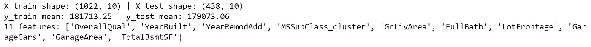

下一步: *LotFrontage* 列包含一些需要处理的**缺失数据** (17%)。从机器学习的角度来看，首先分成训练和测试，然后用训练集的平均值替换 *NAs* 是正确的。

```
dtf_train["*LotFrontage*"] = dtf_train["*LotFrontage*"].**fillna**(dtf_train["*LotFrontage*"].**mean**())
```

我创建的新列 *MSSubClass_cluster* 包含应该被编码的**分类数据**。我将使用 One-Hot-Encoding 方法，将 1 个具有 n 个唯一值的分类列转换为 n-1 个虚拟列。

```
**## create dummy**
dummy = pd.**get_dummies**(dtf_train["*MSSubClass_cluster*"], 
                       prefix="*MSSubClass_cluster*",drop_first=True)
dtf_train= pd.concat([dtf_train, dummy], axis=1)
print( dtf_train.filter(like="*MSSubClass_cluster*",axis=1).head() )**## drop the original categorical column**
dtf_train = dtf_train.drop("*MSSubClass_cluster*", axis=1)
```

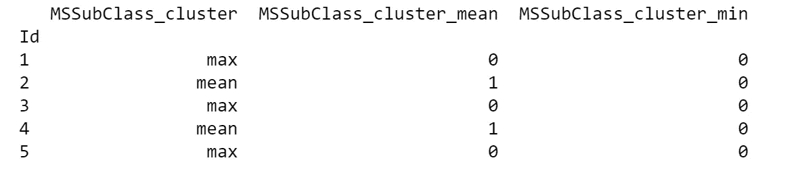

最后但同样重要的是，我将**缩放特征**。对于回归问题，通常需要转换输入变量和目标变量。我将使用*鲁棒定标器*，它通过减去中值然后除以四分位数范围(75%值-25%值)来转换特征。这个定标器的优点是它受异常值的影响较小。

```
**## scale X**
scalerX = preprocessing.**RobustScaler**(quantile_range=(25.0, 75.0))
X = scaler.fit_transform(dtf_train.drop("Y", axis=1))dtf_scaled= pd.DataFrame(X, columns=dtf_train.drop("Y", 
                        axis=1).columns, index=dtf_train.index)**## scale Y** scalerY = preprocessing.**RobustScaler**(quantile_range=(25.0, 75.0))
dtf_scaled[y] = scalerY.fit_transform(
                    dtf_train[y].values.reshape(-1,1))dtf_scaled.head()
```

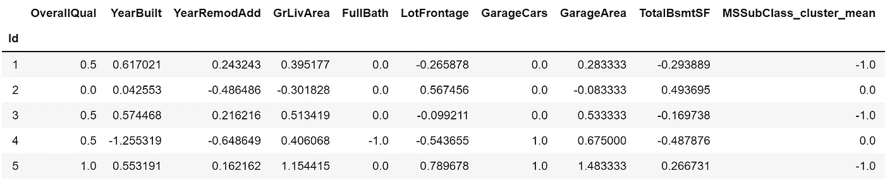

## 特征选择

特征选择是选择相关变量的子集来构建机器学习模型的过程。它使模型更容易解释，并减少过度拟合(当模型适应训练数据过多，并且在训练集之外表现不佳时)。

在数据分析期间，我已经通过排除不相关的列进行了第一次“手动”特征选择。现在会有一点不同，因为我们必须处理**多重共线性**问题，这是指多元回归模型中两个或更多解释变量高度线性相关的情况。

我用一个例子来解释: *GarageCars* 与 *GarageArea* 高度相关，因为它们给出的信息都是一样的(车库有多大，一个是根据能停多少车，另一个是根据平方英尺)。让我们计算相关矩阵来看看:

```
corr_matrix = dtf_train.**corr**(method="pearson")
sns.heatmap(corr_matrix, vmin=-1., vmax=1., annot=True, fmt='.2f', cmap="YlGnBu", cbar=True, linewidths=0.5)
plt.title("pearson correlation")
```

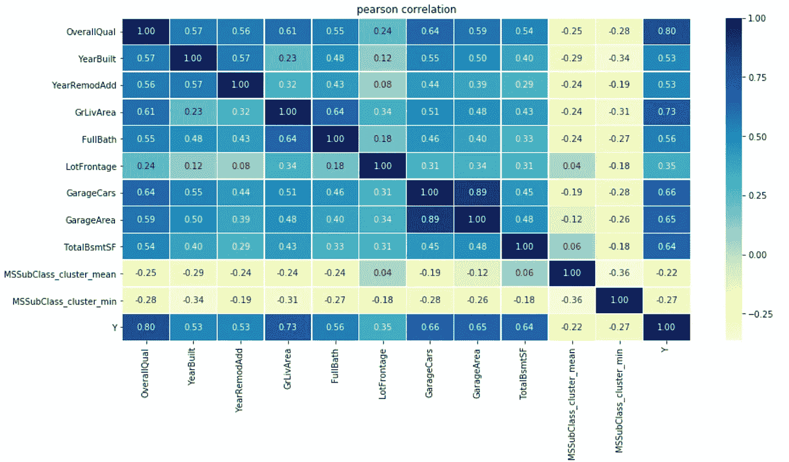

*GarageCars* 和 *GarageArea* 中的一个可能是不必要的，我们可以决定丢弃它并保留最有用的一个(即具有最低 p 值的那个或最能降低熵的那个)。

[**线性回归**](https://en.wikipedia.org/wiki/Linear_regression) 是一种对标量响应和一个或多个解释变量之间的关系进行建模的线性方法。单变量线性回归测试广泛用于测试许多回归变量中每一个的个体效应:首先，计算每个回归变量和目标之间的相关性，然后进行 ANOVA F-测试。

[**岭正则化**](https://en.wikipedia.org/wiki/Tikhonov_regularization) 对于缓解线性回归中的多重共线性问题特别有用，这种问题通常出现在具有大量参数的模型中。

```
X = dtf_train.drop("Y", axis=1).values
y = dtf_train["Y"].values
feature_names = dtf_train.drop("Y", axis=1).columns**## p-value**
selector = **feature_selection.SelectKBest**(score_func=  
               feature_selection.f_regression, k=10).fit(X,y)
pvalue_selected_features = feature_names[selector.get_support()]

**## regularization**
selector = **feature_selection.SelectFromModel**(estimator= 
              linear_model.Ridge(alpha=1.0, fit_intercept=True), 
                                 max_features=10).fit(X,y)
regularization_selected_features = feature_names[selector.get_support()]

**## plot** dtf_features = pd.DataFrame({"features":feature_names})
dtf_features["p_value"] = dtf_features["features"].apply(lambda x: "p_value" if x in pvalue_selected_features else "")
dtf_features["num1"] = dtf_features["features"].apply(lambda x: 1 if x in pvalue_selected_features else 0)
dtf_features["regularization"] = dtf_features["features"].apply(lambda x: "regularization" if x in regularization_selected_features else "")
dtf_features["num2"] = dtf_features["features"].apply(lambda x: 1 if x in regularization_selected_features else 0)
dtf_features["method"] = dtf_features[["p_value","regularization"]].apply(lambda x: (x[0]+" "+x[1]).strip(), axis=1)
dtf_features["selection"] = dtf_features["num1"] + dtf_features["num2"]
dtf_features["method"] = dtf_features["method"].apply(lambda x: "both" if len(x.split()) == 2 else x)sns.barplot(y="features", x="selection", hue="method", data=dtf_features.sort_values("selection", ascending=False), dodge=False)
```

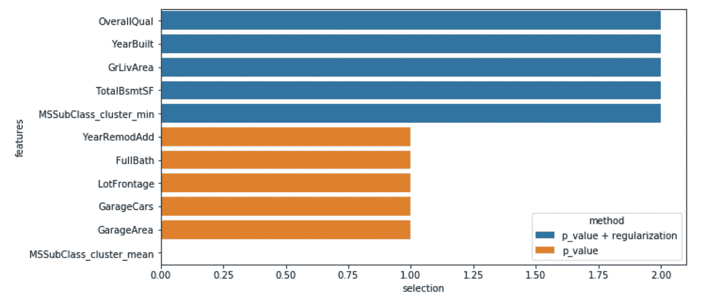

蓝色的特征是由方差分析和岭选择的，其他的是由第一种统计方法选择的。

或者，您可以使用集成方法来获得特征重要性。 [**集成方法**](https://en.wikipedia.org/wiki/Ensemble_learning) 使用多种学习算法来获得比单独使用任何一种成分学习算法所能获得的更好的预测性能。我将给出一个使用 [**梯度推进**](https://en.wikipedia.org/wiki/Gradient_boosting) 算法的例子:它以向前逐级的方式建立一个加性模型，并在每个阶段在给定损失函数的负梯度上拟合一个回归树。

```
X = dtf_train.drop("Y", axis=1).values
y = dtf_train["Y"].values
feature_names = dtf_train.drop("Y", axis=1).columns.tolist()**## call model**
model = ensemble.**GradientBoostingRegressor**()**## Importance**
model.fit(X,y)
importances = model.**feature_importances_****## Put in a pandas dtf**
dtf_importances = pd.DataFrame({"IMPORTANCE":importances, 
            "VARIABLE":feature_names}).sort_values("IMPORTANCE", 
            ascending=False)
dtf_importances['cumsum'] =  
            dtf_importances['IMPORTANCE'].cumsum(axis=0)
dtf_importances = dtf_importances.set_index("VARIABLE")

**##** **Plot**
fig, ax = plt.subplots(nrows=1, ncols=2, sharex=False, sharey=False)
fig.suptitle("Features Importance", fontsize=20)
ax[0].title.set_text('variables')
    dtf_importances[["IMPORTANCE"]].sort_values(by="IMPORTANCE").plot(
                kind="barh", legend=False, ax=ax[0]).grid(axis="x")
ax[0].set(ylabel="")
ax[1].title.set_text('cumulative')
dtf_importances[["cumsum"]].plot(kind="line", linewidth=4, 
                                 legend=False, ax=ax[1])
ax[1].set(xlabel="", xticks=np.arange(len(dtf_importances)), 
          xticklabels=dtf_importances.index)
plt.xticks(rotation=70)
plt.grid(axis='both')
plt.show()
```


非常有趣的是， *OverallQual、GrLivArea* 和 *TotalBsmtSf* 在所有呈现的方法中占主导地位。

就我个人而言，我总是试图使用尽可能少的功能，因此在这里我选择以下功能，并继续设计、训练、测试和评估机器学习模型:

```
X_names = ['OverallQual', 'GrLivArea', 'TotalBsmtSF', "GarageCars"]X_train = dtf_train[X_names].values
y_train = dtf_train["Y"].valuesX_test = dtf_test[X_names].values
y_test = dtf_test["Y"].values
```

请注意，在使用测试数据进行预测之前，您必须对其进行预处理，就像我们对训练数据所做的那样。

## 模型设计

最后，是时候建立机器学习模型了。我将首先运行一个简单的线性回归，并将其用作更复杂模型的基线，如梯度推进算法。

我通常使用的第一个指标是 [**R 的平方**](https://en.wikipedia.org/wiki/Coefficient_of_determination) ，它表示自变量中可预测的因变量方差的比例。

我将使用 **k 倍交叉验证**来比较线性回归 R 的平方与梯度推进的平方，这是一个将数据分成 k 次训练和验证集的过程，对于每次分割，模型都被训练和测试。它用于检查模型通过一些数据进行训练的能力，以及预测未知数据的能力。

我将通过绘制**预测值与实际值 *Y*** *来可视化验证的结果。*理想情况下，所有的点都应接近预测值=实际值的对角线。

```
**## call model**
model = linear_model.**LinearRegression**()**## K fold validation**
scores = []
cv = model_selection.KFold(n_splits=5, shuffle=True)
fig = plt.figure()
i = 1
for train, test in cv.split(X_train, y_train):
    prediction = model.fit(X_train[train],
                 y_train[train]).predict(X_train[test])
    true = y_train[test]
    score = metrics.r2_score(true, prediction)
    scores.append(score)
    plt.scatter(prediction, true, lw=2, alpha=0.3, 
                label='Fold %d (R2 = %0.2f)' % (i,score))
    i = i+1
plt.plot([min(y_train),max(y_train)], [min(y_train),max(y_train)], 
         linestyle='--', lw=2, color='black')
plt.xlabel('Predicted')
plt.ylabel('True')
plt.title('K-Fold Validation')
plt.legend()
plt.show()
```

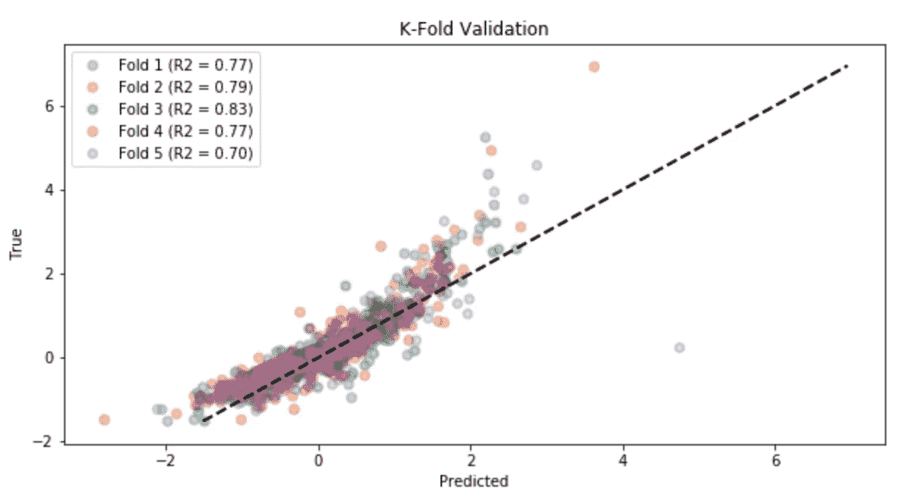

线性回归的平均 R 平方为 0.77。让我们看看梯度推进验证是如何进行的:

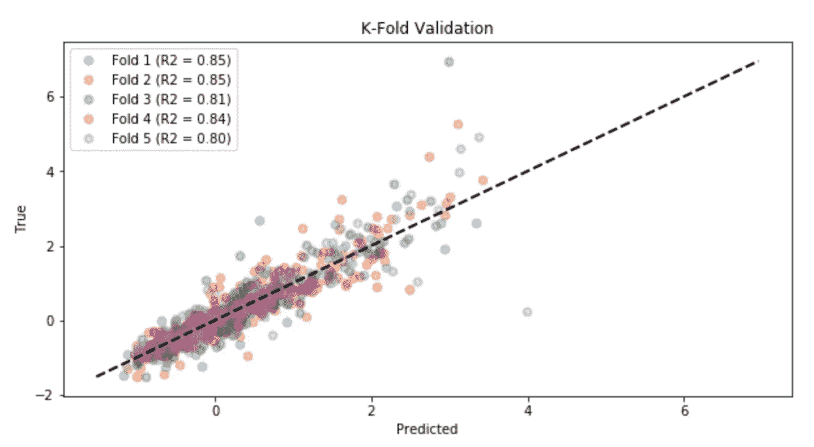

梯度推进模型表现出更好的性能(平均 R 平方为 0.83)，因此我将使用它来预测测试数据:

```
**## train**
model.**fit**(X_train, y_train)**## test**
predicted = model.**predict**(X_test)
```

请记住，数据是经过缩放的，因此为了将预测值与测试集中的实际房价进行比较，它们必须是未经缩放的(使用逆变换函数):

```
predicted = scalerY.**inverse_transform**( 
                  predicted.reshape(-1,1) ).reshape(-1)
```

## 估价

关键时刻到了，我们要看看所有这些努力是否值得。重点是研究模型能解释多少 Y 的方差，以及误差是如何分布的。

我将使用以下常用度量来评估该模型:R 平方、**平均绝对误差(MAE)** 和**均方根误差(RMSD)** 。后两个是表达同一现象的成对观察值之间的误差度量。由于误差可能是正的(实际>预测)也可能是负的(实际<预测)，您可以测量每个误差的绝对值和平方值。

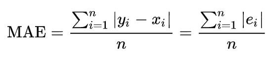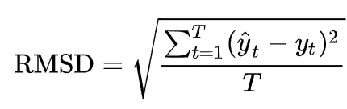

```
**## Kpi**
print("R2 (explained variance):", round(metrics.r2_score(y_test, predicted), 2))
print("Mean Absolute Perc Error (Σ(|y-pred|/y)/n):", round(np.mean(np.abs((y_test-predicted)/predicted)), 2))
print("Mean Absolute Error (Σ|y-pred|/n):", "{:,.0f}".format(metrics.mean_absolute_error(y_test, predicted)))
print("Root Mean Squared Error (sqrt(Σ(y-pred)^2/n)):", "{:,.0f}".format(np.sqrt(metrics.mean_squared_error(y_test, predicted))))**## residuals** residuals = y_test - predicted
max_error = max(residuals) if abs(max(residuals)) > abs(min(residuals)) else min(residuals)
max_idx = list(residuals).index(max(residuals)) if abs(max(residuals)) > abs(min(residuals)) else list(residuals).index(min(residuals))
max_true, max_pred = y_test[max_idx], predicted[max_idx]
print("Max Error:", "{:,.0f}".format(max_error))
```

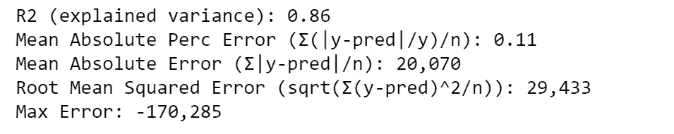

该模型解释了目标变量 86%的方差。平均而言，预测误差为 2 万美元，或者说误差为 11%。测试集上的最大误差超过 17 万美元。我们可以通过绘制预测值与实际值和每个预测值的残差(误差)来可视化误差。

```
**## Plot predicted vs true**
fig, ax = plt.subplots(nrows=1, ncols=2)
from statsmodels.graphics.api import abline_plot
ax[0].scatter(predicted, y_test, color="black")
abline_plot(intercept=0, slope=1, color="red", ax=ax[0])
ax[0].vlines(x=max_pred, ymin=max_true, ymax=max_true-max_error, color='red', linestyle='--', alpha=0.7, label="max error")
ax[0].grid(True)
ax[0].set(xlabel="Predicted", ylabel="True", title="Predicted vs True")
ax[0].legend()

**## Plot predicted vs residuals**
ax[1].scatter(predicted, residuals, color="red")
ax[1].vlines(x=max_pred, ymin=0, ymax=max_error, color='black', linestyle='--', alpha=0.7, label="max error")
ax[1].grid(True)
ax[1].set(xlabel="Predicted", ylabel="Residuals", title="Predicted vs Residuals")
ax[1].hlines(y=0, xmin=np.min(predicted), xmax=np.max(predicted))
ax[1].legend()
plt.show()
```

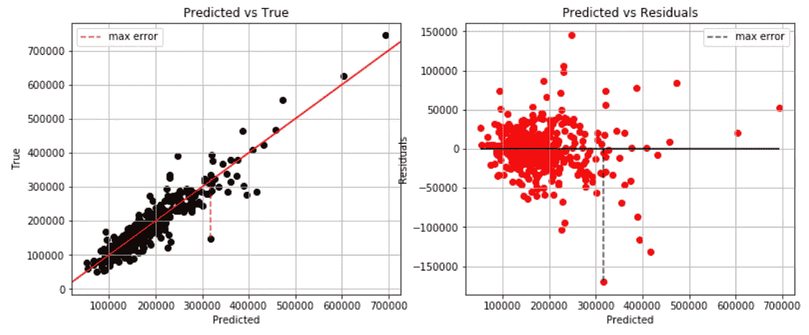

这就是-170k 的最大误差:模型预测的误差约为 320k，而实际观测值约为 150k。似乎大多数误差位于 50k 和-50k 之间，让我们更好地看看残差的分布，看看它是否近似正态:

```
fig, ax = plt.subplots()
sns.distplot(residuals, color="red", hist=True, kde=True, kde_kws={"shade":True}, ax=ax)
ax.grid(True)
ax.set(yticks=[], yticklabels=[], title="Residuals distribution")
plt.show()
```

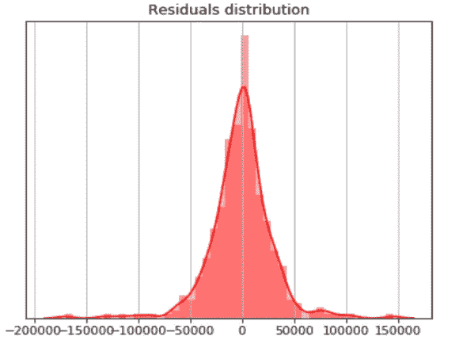

## 可解释性

你分析并理解了数据，你训练了一个模型并测试了它，你甚至对性能感到满意。你可以多走一步，证明你的机器学习模型不是一个黑盒。

这个*石灰*包可以帮助我们建造一个**讲解器**。为了举例说明，我将从测试集中随机观察，看看模型预测了什么:

```
print("True:", "{:,.0f}".format(y_test[1]), "--> Pred:", "{:,.0f}".format(predicted[1]))
```

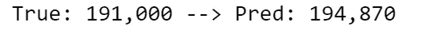

该模型预测这栋房子的价格为 194，870 美元。为什么？让我们使用解释器:

```
explainer = lime_tabular.LimeTabularExplainer(training_data=X_train, feature_names=X_names, class_names="Y", mode="regression")
explained = explainer.explain_instance(X_test[1], model.predict, num_features=10)
explained.as_pyplot_figure()
```

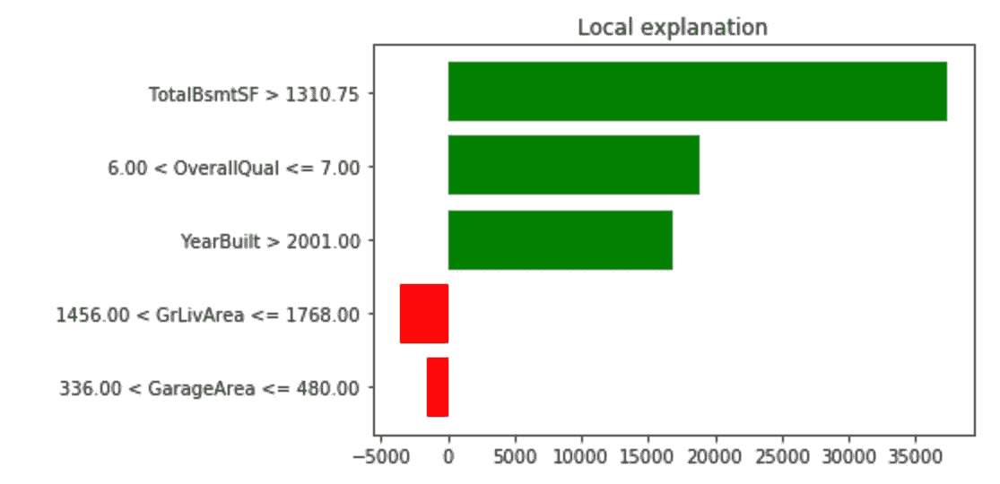

这个特殊预测的主要因素是房子有一个大的地下室(TotalBsmft > 1.3k)，它是用高质量的材料建造的(总体质量> 6)，而且是最近建造的(建造年份> 2001)。

预测值与实际值的对比图是显示测试进行情况的一个很好的工具，但是我也绘制了**回归平面**来直观地帮助观察模型没有正确预测的异常值。由于线性模型效果更好，我将使用线性回归来拟合二维数据。为了绘制二维数据，需要进行一定程度的降维(通过获得一组主要变量来减少特征数量的过程)。我将给出一个例子，使用 [PCA](https://en.wikipedia.org/wiki/Principal_component_analysis) 算法将数据总结为两个变量，这些变量是通过特征的线性组合获得的。

```
**## PCA**
pca = decomposition.PCA(n_components=2)
X_train_2d = pca.fit_transform(X_train)
X_test_2d = pca.transform(X_test)**## train 2d model**
model_2d = linear_model.LinearRegression()
model_2d.fit(X_train, y_train)**## plot regression plane**
from mpl_toolkits.mplot3d import Axes3D
ax = Axes3D(plt.figure())
ax.scatter(X_test[:,0], X_test[:,1], y_test, color="black")
X1 = np.array([[X_test.min(), X_test.min()], [X_test.max(), 
               X_test.max()]])
X2 = np.array([[X_test.min(), X_test.max()], [X_test.min(), 
               X_test.max()]])
Y = model_2d.predict(np.array([[X_test.min(), X_test.min(), 
                     X_test.max(), X_test.max()], 
                    [X_test.min(), X_test.max(), X_test.min(), 
                     X_test.max()]]).T).reshape((2,2))
Y = scalerY.inverse_transform(Y)
ax.plot_surface(X1, X2, Y, alpha=0.5)
ax.set(zlabel="Y", title="Regression plane", xticklabels=[], 
       yticklabels=[])
plt.show()
```


## 结论

这篇文章是一个教程，展示了**如何用数据科学处理回归用例**。我以房价数据集为例，经历了从数据分析到机器学习模型的每个步骤。

在探索部分，我分析了单个分类变量、单个数值变量的情况，以及它们如何相互作用。我举了一个从原始数据中提取特征的特征工程的例子。关于预处理，我解释了如何处理缺失值和分类数据。我展示了选择正确特性的不同方法，如何使用它们来构建回归模型，以及如何评估性能。在最后一节，我就如何提高你的机器学习模型的可解释性给出了一些建议。

一个重要的注意事项是，我还没有介绍在您的模型被批准部署之后会发生什么。请记住，您需要构建一个管道来自动处理您将定期获得的新数据。

现在，您已经知道如何处理数据科学用例，您可以将这些代码和方法应用于任何类型的回归问题，执行您自己的分析，构建您自己的模型，甚至解释它。

我希望你喜欢它！如有问题和反馈，或者只是分享您感兴趣的项目，请随时联系我。

> 👉[我们来连线](https://linktr.ee/maurodp)👈

> 本文是用 Python 进行机器学习系列**的一部分**，参见:

[](/machine-learning-with-python-classification-complete-tutorial-d2c99dc524ec) [## 用 Python 进行机器学习:分类(完整教程)

### 数据分析和可视化、特征工程和选择、模型设计和测试、评估和解释

towardsdatascience.com](/machine-learning-with-python-classification-complete-tutorial-d2c99dc524ec) [](/clustering-geospatial-data-f0584f0b04ec) [## 聚类地理空间数据

### 使用交互式地图绘制机器学习和深度学习聚类

towardsdatascience.com](/clustering-geospatial-data-f0584f0b04ec) [](/deep-learning-with-python-neural-networks-complete-tutorial-6b53c0b06af0) [## Python 深度学习:神经网络(完整教程)

### 用 TensorFlow 建立、绘制和解释人工神经网络

towardsdatascience.com](/deep-learning-with-python-neural-networks-complete-tutorial-6b53c0b06af0) [](/modern-recommendation-systems-with-neural-networks-3cc06a6ded2c) [## 基于神经网络的现代推荐系统

### 使用 Python 和 TensorFlow 构建混合模型

towardsdatascience.com](/modern-recommendation-systems-with-neural-networks-3cc06a6ded2c)