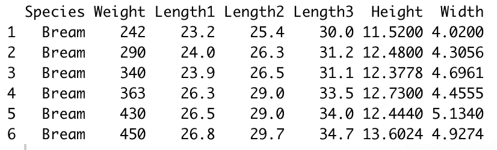
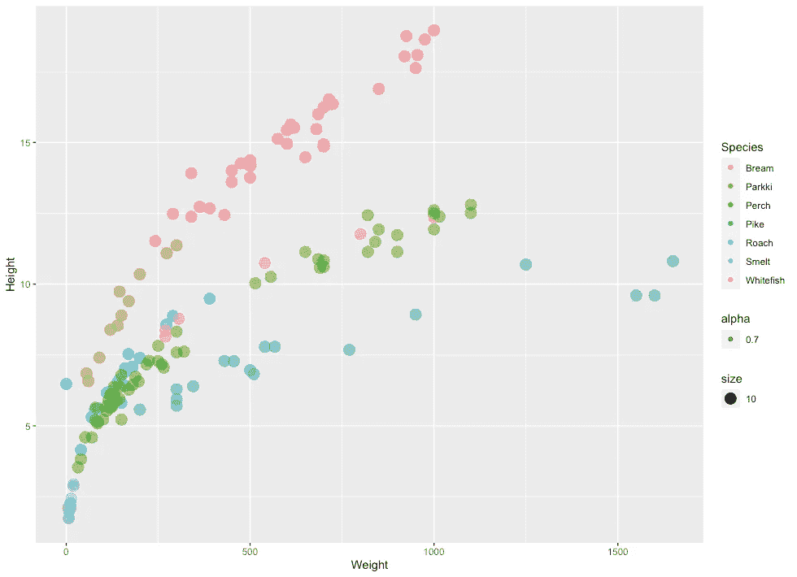
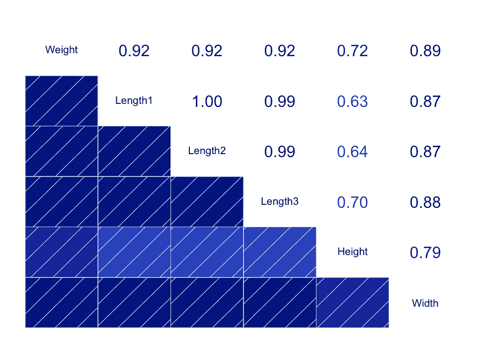
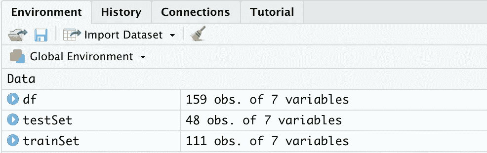
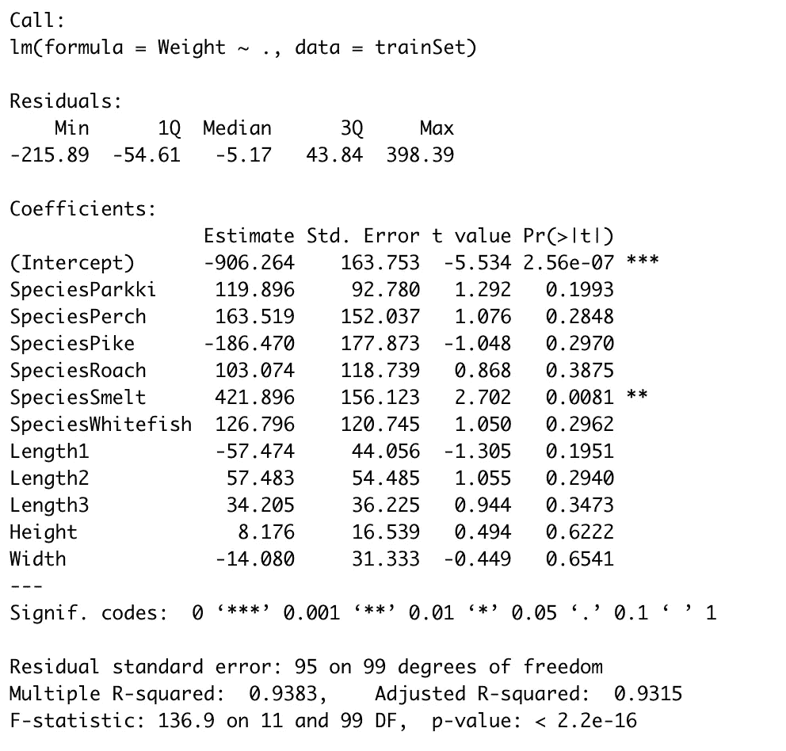
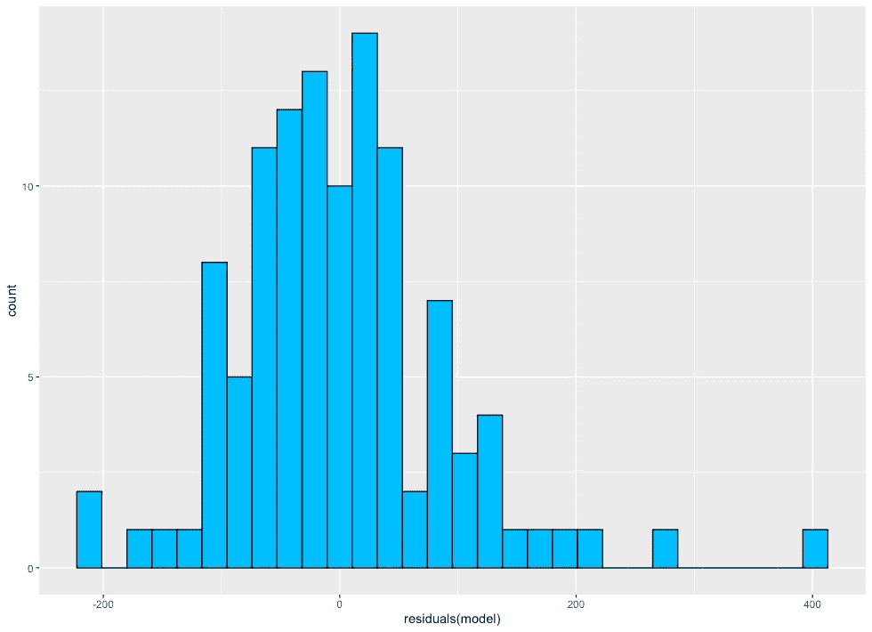
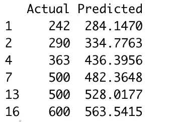

# 带 R 的机器学习:线性回归

> 原文：<https://towardsdatascience.com/machine-learning-with-r-linear-regression-558fa2edaaf0?source=collection_archive---------10----------------------->

## 机器学习基础和 r .和一堆其他的东西。

我决定用 *R* 开始关于机器学习的整个系列。不，这并不意味着我要退出 *Python* (但愿不会如此)，但我最近一直在探索 *R* ，它并没有我最初想象的那么糟糕。所以，让我们从基础开始——线性回归。


照片由[内森·安德森](https://unsplash.com/@nathananderson?utm_source=medium&utm_medium=referral)在 [Unsplash](https://unsplash.com?utm_source=medium&utm_medium=referral) 上拍摄

如果你想知道我对编程语言的最初印象，这里有几周前的一篇文章:

[](/ive-tried-r-for-the-first-time-how-bad-was-it-ba344f22e90b) [## 我第一次尝试 R——有多糟糕？

### 空前的 Pythonista 尝试 R——包括与 Python 的比较。

towardsdatascience.com](/ive-tried-r-for-the-first-time-how-bad-was-it-ba344f22e90b) 

这应该是一个有趣的系列。我打算涵盖所有主要的机器学习算法，将“奇怪”的部分与其 *Python* 替代方案进行比较，并在这个过程中学习很多东西。

这篇文章的结构如下:

*   线性回归简介
*   数据集介绍和加载
*   基础 EDA
*   模型训练和评估
*   结论

如果你更喜欢视频，我可以帮你搞定:

还有，你可以在这里获得源代码[。](https://github.com/betterdatascience/MachineLearningWithR)

我们有很多东西要讲，所以让我们马上开始吧！

# 线性回归简介

我会抓住机会说，这可能不是你第一次接触线性回归。这是不应该的，因为这篇文章不会在理论上做太多的深入。不过，我们将从算法的高级概述开始。

线性回归是最初在**统计**领域开发的简单算法。它被作为理解输入和输出变量之间关系的模型来研究。顾名思义，它是一个线性模型，所以它假设输入变量和单个(连续)输出变量之间是线性关系。

该输出变量被计算为输入变量的线性组合。

存在两种主要类型的线性回归:

*   *简单线性回归* —当我们只有一个输入变量时
*   *多元线性回归* —当有多个输入变量时

训练线性回归模型实质上是为每个输入变量添加一个系数，该系数决定了输入变量的重要性。然后将输入变量的值乘以相应的系数，并将偏差(截距)项添加到总和中。这基本上是我们的预测值。

厉害！线性回归有一些假设，我们作为数据科学家必须意识到它们:

*   *线性假设* —模型假设变量之间的关系是线性的
*   *无噪声* —模型假设输入和输出变量没有噪声——因此如果可能的话移除异常值
*   *无共线性*-当输入变量高度相关时，模型会过度拟合
*   *正态分布*-如果输入和输出变量呈正态分布，模型将做出更可靠的预测。如果不是这样，试着对你的变量进行一些变换，使它们看起来更正常
*   *重定标输入* —使用定标器或规格化器进行更可靠的预测

这就是高级概述。现在让我们继续好东西。

# 数据集介绍和加载

我们将使用[鱼市场](https://www.kaggle.com/aungpyaeap/fish-market)数据集来构建我们的模型。是的，我也是第一次用，所以你不是一个人。下载数据集并将其存储在友好的位置。

现在我们可以从进口开始:

```
library(dplyr)
library(ggplot2)
library(caTools)
library(corrgram)
```

简而言之——`dplyr`用于数据操作，`ggplot2`用于可视化，`caTools`用于训练/测试分割，`corrgram`用于制作简洁的相关矩阵图。

我们现在可以读入数据集，并检查前几行看起来如何:

```
df <- read.csv('data/Fish.csv')
head(df)
```



厉害！一切似乎都很好，所以我们可以继续进行基本的探索性数据分析。

# 基础 EDA

我们需要做的第一件事是检查丢失的值。这个过程和使用 *Python* 一样简单:

```
any(is.na(df))
```

执行这段代码会在控制台中产生一个大写的 *FALSE* ，表示没有丢失值——因此我们可以继续进行分析。

接下来让我们做几个可视化。没什么复杂的，只是感受一下我们的数据集的行为。第一个可视化是鱼的重量与高度的散点图，用鱼的种类来着色。下面的代码片段实现了这个目的:

```
ggplot(data=df, aes(x=Weight, y=Height)) +
  geom_point(aes(color=Species, size=10, alpha=0.7))
```



仅仅从颜色上，我们可以看到鱼的种类被很好的分开了(在大多数情况下)。接下来，让我们检查属性之间的**相关性**。在这里，corrgram 库就派上了用场。代码如下:

```
corrgram(df, lower.panel=panel.shade, upper.panel=panel.cor)
```

情节是这样的:



几乎所有属性之间的相关性都高得惊人。但是我们不会做任何事情，因为本文的目的是讨论线性回归，而不是探索性的数据分析。

请记住——这最有可能导致模型**过度拟合**，但稍后会有更多相关内容。

EDA 部分到此结束，我们可以继续实际建模。

# 模型训练和评估

这将是迄今为止最长的部分，所以给自己一杯咖啡。我们将从培训/测试拆分开始。我们希望将数据集分成两部分，一部分(较大)用于训练模型，另一部分(较小)用于模型评估。

在我们做任何事情之前，让我们设置一个随机种子。训练/测试分割是一个随机过程，seed 确保随机化在您和我的计算机上的效果相同:

```
set.seed(42)
```

太好了！让我们现在进行分割。70%的数据用于训练，剩下的 30%用于测试。代码如下:

```
sampleSplit <- sample.split(Y=df$Weight, SplitRatio=0.7)
trainSet <- subset(x=df, sampleSplit==TRUE)
testSet <- subset(x=df, sampleSplit==FALSE)
```

执行代码后，您应该会在右上面板中看到另外两个变量:



因此，我们总共有 159 行，其中 111 行分配给模型训练，其余 48 行用于测试模型。

我们现在可以进行模型训练了。

*R* 对线性回归模型使用以下语法:

```
model <- lm(target ~ var_1 + var_2 + ... + var_n, data=train_set)
```

没关系，但是想象一下我们有 100 个预测值，那么把每一个都写到等式里将是一场噩梦。相反，我们可以使用以下语法:

```
model <- lm(target ~. , data=train_set)
```

请记住，这只有在您决定使用所有预测器进行模型训练时才有效。相应地，我们可以这样训练模型:

```
model <- lm(formula=Weight ~ ., data=trainSet)
```

简而言之，我们试图将权重属性预测为所有其他属性的线性组合。r 也自动处理分类属性。接招吧，蟒蛇！

接下来，我们可以看看我们模型的总结:

```
summary(model)
```



这里最有趣的是 P 值，显示在`Pr(>|t|)`列中。这些值显示变量对预测不重要的概率。通常使用 5%的显著性阈值，因此如果 P 值为 0.05 或更低，我们可以说它对分析不显著的可能性很低。抱歉否定，假设就是这么形成的。

厉害！接下来，我们可以制作一个残差图，或者更精确的残差直方图。这里我们期望看到近似正态分布的东西。让我们看看直方图是什么样子的:

```
modelResiduals <- as.data.frame(residuals(model)) ggplot(modelResiduals, aes(residuals(model))) +
  geom_histogram(fill='deepskyblue', color='black')
```



嗯，由于最右边的值有一点偏斜，但目测之后，我们可以得出结论，残差近似正态分布。

现在我们终于可以预测了！这样做很容易:

```
preds <- predict(model, testSet)
```

现在我们可以评估。首先，我们将创建一个实际值和预测值的数据框架:

```
modelEval <- cbind(testSet$Weight, preds)
colnames(modelEval) <- c('Actual', 'Predicted')
modelEval <- as.data.frame(modelEval)
```

下面是前几行的样子:



这不是最好的模型——至少在没有任何调整的情况下不是，但我们仍然得到了不错的结果。多体面？这就是像 MSE 和 RMSE 这样的指标会告诉我们的。以下是计算结果:

```
mse <- mean((modelEval$Actual - modelEval$Predicted)²)
rmse <- sqrt(mse)
```

我们得到的 RMSE 值是 95.9，MSE 是它的平方。这意味着我们平均错了 95.9 个重量单位。我会让你来决定这是好是坏。

在我看来，由于输入变量之间的相关系数较大，该模型过度拟合了训练数据。此外，列车组的判定值系数(R2)高得惊人(0.93+)。

这就足够了。让我们在下一部分总结一下。

# 在你走之前

我希望这篇文章很容易理解。我们讨论了最简单的机器学习算法，并略微涉及了探索性数据分析。我知道对于一篇文章来说有很多东西需要消化，但是这个主题并不难。

我们接下来将讨论逻辑回归，大约在 3-4 天内，如果你对此感兴趣，请继续关注。

感谢阅读。

## [**加入我的私人邮件列表，获取更多有用的见解。**](https://mailchi.mp/46a3d2989d9b/bdssubscribe)

*喜欢这篇文章吗？成为* [*中等会员*](https://medium.com/@radecicdario/membership) *继续无限制学习。如果你使用下面的链接，我会收到你的一部分会员费，不需要你额外付费。*

[](https://medium.com/@radecicdario/membership) [## 通过我的推荐链接加入 Medium-Dario rade ci

### 作为一个媒体会员，你的会员费的一部分会给你阅读的作家，你可以完全接触到每一个故事…

medium.com](https://medium.com/@radecicdario/membership) 

*原载于 2020 年 9 月 25 日 https://betterdatascience.com*[](https://betterdatascience.com/machine-learning-with-r-linear-regression/)**。**