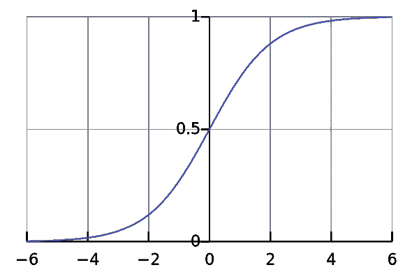
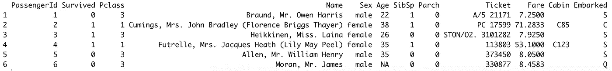
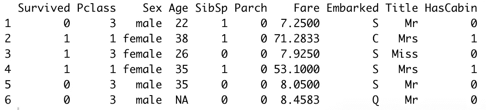
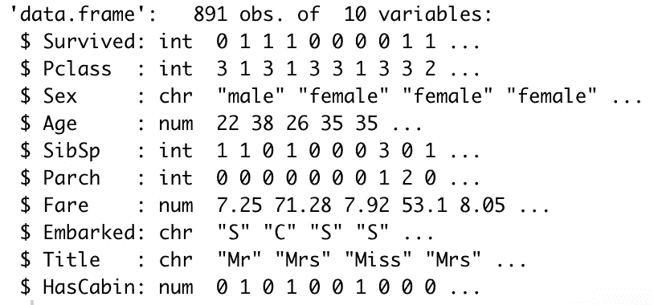
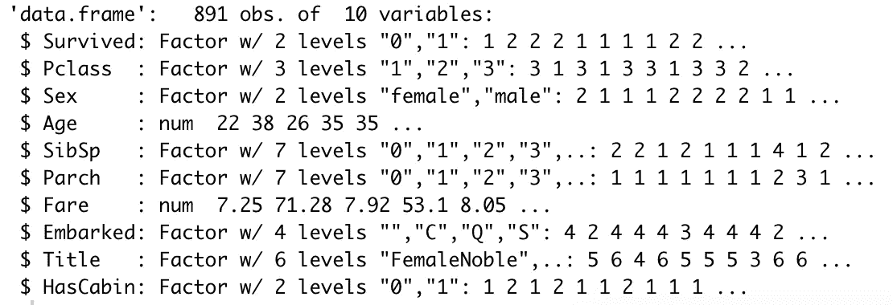
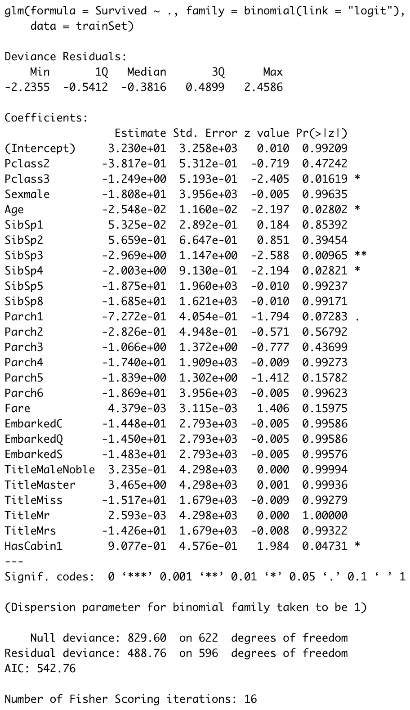
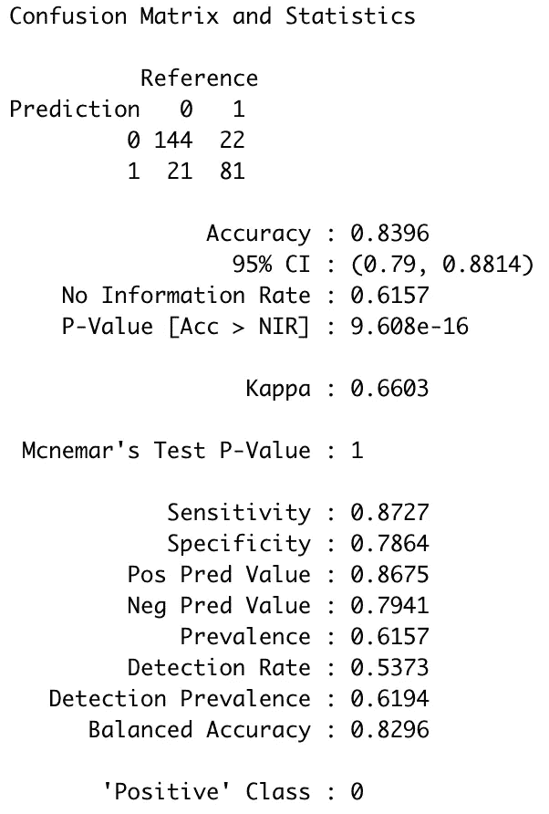

# 带 R 的机器学习:逻辑回归

> 原文：<https://towardsdatascience.com/machine-learning-with-r-logistic-regression-152ec20351db?source=collection_archive---------19----------------------->

## 包括 R 代码中的分类基础知识

我们和 *R* 的机器学习小旅程还在继续！今天的主题是逻辑回归——作为机器学习分类任务的介绍。我们将涵盖众所周知的*泰坦尼克号*数据集的数据准备、建模和评估。


照片由[阿伦·范德波尔](https://unsplash.com/@aronvandepol?utm_source=unsplash&utm_medium=referral&utm_content=creditCopyText)在 [Unsplash](https://unsplash.com/s/photos/abstract?utm_source=unsplash&utm_medium=referral&utm_content=creditCopyText) 拍摄

如果您想从头开始阅读本系列，这里有以前文章的链接:

*   [带 R 的机器学习:线性回归](/machine-learning-with-r-linear-regression-558fa2edaaf0)

这篇文章的结构如下:

*   逻辑回归简介
*   数据集介绍和加载
*   数据准备
*   模型训练和评估
*   结论

你可以在这里下载源代码。简介部分到此结束，我们有许多内容要讲，所以让我们直接进入正题。

# 逻辑回归简介

逻辑回归是从统计学领域借用的二元分类(两个类值)的一个很好的介绍性算法。该算法得名于其底层机制——逻辑函数(有时称为 sigmoid 函数)。

逻辑函数是在统计中开发的 S 形函数，它接受任何实数值并将其映射到 0 到 1 之间的值。这正是我们进行二元分类所需要的，因为我们可以将阈值设置为 0.5，并根据逻辑函数的输出进行预测。

下面是逻辑函数的样子:



如果你感兴趣，下面是逻辑函数的方程式。记住——它接受任何实数值，并将其转换为 0 到 1 之间的值。


这对于理论来说已经足够了。我重复一遍——这篇文章的目的不是覆盖理论，因为有太多的理论文章/书籍。是纯动手的作品。

# 数据集介绍和加载

好了，现在我们对逻辑回归有了基本的了解，我们可以从编码部分开始了。如前所述，我们将使用泰坦尼克号数据集。你不必下载它，因为 R 已经为我们下载了。

下面是库导入和数据集加载的代码片段:

```
library(dplyr) 
library(stringr) 
library(caTools) 
library(caret) df <- read.csv('https://raw.githubusercontent.com/datasciencedojo/datasets/master/titanic.csv')
```

下面是前几行的样子:



厉害！数据集需要做一些准备才能转换成 ml 格式，所以这是我们接下来要做的。

# 数据准备

我们必须做几件重要的事情:

*   从名称属性中提取标题
*   照常/不寻常地重新映射提取的标题
*   将小屋属性转换为二进制 HasCabin
*   删除不必要的属性

这个来自 Kaggle 的[片段对标题提取和重新映射有很大帮助，只需稍加修改。其他要点相对简单，如下面的代码片段所示:](https://www.kaggle.com/tysonni/extracting-passenger-titiles-in-r)

```
maleNobleTitles <- c('Capt', 'Col', 'Don', 'Dr', 'Jonkheer', 'Major', 'Rev', 'Sir') 
femaleNobleTitles <- c('Lady', 'Mlle', 'Mme', 'Ms', 'the Countess') df$Title <- str_sub(df$Name, str_locate(df$Name, ',')[ , 1] + 2, str_locate(df$Name, '\\.')[ , 1] - 1) 
df$Title[df$Title %in% maleNobleTitles] <- 'MaleNoble' 
df$Title[df$Title %in% femaleNobleTitles] <- 'FemaleNoble' 
df$HasCabin <- ifelse(df$Cabin == '', 0, 1) 
df <- df %>% select(-PassengerId, -Name, -Ticket, -Cabin)
```

我们实际上为贵族头衔创建了两个数组，一个用于男性，一个用于女性，将头衔提取到 title 列，并用表达式“MaleNoble”和“FemaleNoble”替换贵族头衔。

此外，ifelse 函数帮助创建了`HasCabin`属性，如果 Cabin 的值不为空，则该属性的值为 1，否则为 0。最后，我们只保留了与分析相关的特性。

以下是数据集现在的样子:



厉害！接下来我们来处理缺失值。

## 处理缺失数据

下面一行代码打印出每个属性有多少个缺失值:

```
lapply(df, function(x) { length(which(is.na(x))) })
```

属性`Age`是唯一包含缺失值的属性。由于本文涵盖了机器学习而不是数据准备，我们将用一个简单的平均值来进行插补。以下是片段:

```
df$Age <- ifelse(is.na(df$Age), mean(df$Age, na.rm=TRUE), df$Age)
```

这就是归罪。只剩下一件事要做了，准备工作。

## 因子转换

我们的数据集中有许多分类属性。r 提供了一个简单的`factor()`函数，将分类属性转换成算法可以理解的格式。

以下是我们的数据集在转换前的结构:



下面是执行转换的代码片段:

```
df$Survived <- factor(df$Survived) 
df$Pclass <- factor(df$Pclass) 
df$Sex <- factor(df$Sex) 
df$SibSp <- factor(df$SibSp) 
df$Parch <- factor(df$Parch) 
df$Embarked <- factor(df$Embarked) 
df$Title <- factor(df$Title) 
df$HasCabin <- factor(df$HasCabin)
```



数据准备部分已经完成，现在我们可以继续建模了。

# 模型训练和评估

在实际的模型训练之前，我们需要在训练和测试子集上分割数据集。这样做可以确保我们有一个数据子集来评估，并且知道模型有多好。代码如下:

```
set.seed(42) sampleSplit <- sample.split(Y=df$Survived, SplitRatio=0.7) 
trainSet <- subset(x=df, sampleSplit==TRUE) 
testSet <- subset(x=df, sampleSplit==FALSE)
```

上面的代码将原始数据集分成 70:30 的子集。我们将对大多数(70%)进行训练，对其余的进行评估。

我们现在可以用函数来训练模型。我们将使用所有的属性，用点表示，列是目标变量。

```
model <- glm(Survived ~ ., family=binomial(link='logit'), data=trainSet)
```

就这样——我们成功地训练了这个模型。让我们通过调用它的`summary()`函数来看看它是如何执行的:

```
summary(model)
```



这里最令人兴奋的是 P 值，显示在 **Pr( > |t|)** 列中。这些值表示变量对预测不重要的概率。通常使用 5%的显著性阈值，因此如果 P 值为 0.05 或更低，我们可以说它对分析不显著的可能性很低。

我们可以看到，最重要的属性/属性子集是`Pclass3`、**、*、*、**、**、、**、**、*、*、`SibSp4`、**、*、*、**和`HasCabin1`。**

我们现在对我们的模型有了更多的信息——我们知道决定一名乘客是否在泰坦尼克号事故中幸存的最重要的因素。现在，我们可以继续评估以前未见过的数据—测试集。

我们故意保持这个子集不变，只是为了模型评估。首先，我们需要计算预测概率和基于这些概率的预测类别。我们将设定 0.5 作为阈值——如果生还的机会小于 0.5，我们就说乘客没有在事故中幸存。代码如下:

```
probabs <- predict(model, testSet, type='response') 
preds <- ifelse(probabs > 0.5, 1, 0)
```

现在很容易在此基础上进行构建。分类任务的主要方法是建立一个混淆矩阵——一个 2×2 矩阵，显示第一个和第四个元素的正确分类，以及第二个和第三个元素的错误分类(从左到右、从上到下阅读)。下面是如何通过代码获得它:

```
confusionMatrix(factor(preds), factor(testSet$Survived))
```



因此，总的来说，我们的模型在大约 84%的测试案例中是正确的——对于几分钟的工作来说还不错。让我们在下一部分总结一下。

# 在你走之前

到目前为止，我们已经介绍了最基本的回归和分类机器学习算法。我知道这是一个相当乏味的过程，但却是为后面更复杂的算法和优化奠定基础所必需的。

KNN 系列的下一篇文章将在几天后发表，敬请关注。

感谢阅读。

## [**加入我的私人邮件列表，获取更多有用的见解。**](https://mailchi.mp/46a3d2989d9b/bdssubscribe)

喜欢这篇文章吗？成为 [*中等会员*](https://medium.com/@radecicdario/membership) *继续无限制学习。如果你使用下面的链接，我会收到你的一部分会员费，不需要你额外付费。*

[](https://medium.com/@radecicdario/membership) [## 通过我的推荐链接加入 Medium-Dario rade ci

### 作为一个媒体会员，你的会员费的一部分会给你阅读的作家，你可以完全接触到每一个故事…

medium.com](https://medium.com/@radecicdario/membership) 

*原载于 2020 年 10 月 4 日 https://betterdatascience.com*[](https://betterdatascience.com/machine-learning-with-r-logistic-regression/)**。**