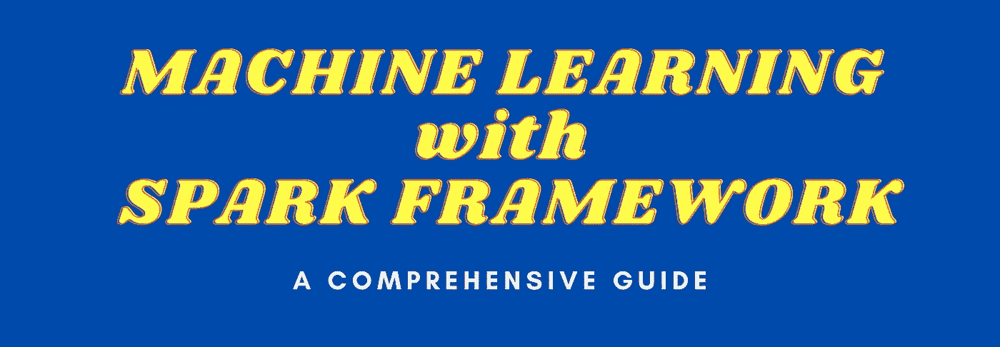

# 使用 Spark 的机器学习

> 原文：<https://towardsdatascience.com/machine-learning-with-spark-f1dbc1363986?source=collection_archive---------20----------------------->

## 综合指南

## 分布式机器学习框架

这是一个关于使用 Spark 分布式机器学习框架构建可扩展 ML 数据管道的综合教程。我将介绍在 Spark MLlib 库中实现的基本机器学习算法，通过本教程，我将在 python 环境中使用 PySpark。



作者使用 Canva.com 的图片

在几乎每个商业领域，机器学习在解决现实世界的问题方面越来越受欢迎。它有助于解决使用数据的问题，这些数据通常是非结构化的、有噪声的和巨大的。随着数据大小和各种数据源的增加，使用标准技术解决机器学习问题带来了巨大的挑战。Spark 是一个分布式处理引擎，使用 MapReduce 框架来解决与大数据及其处理相关的问题。

Spark framework 有自己的机器学习模块，名为 MLlib。在本文中，我将使用 pyspark 和 spark MLlib 来演示使用分布式处理的机器学习。读者将能够通过真实的例子学习下面的概念。

*   在谷歌联合实验室中建立火花
*   机器学习的基本概念
*   使用 Spark 进行预处理和数据转换
*   使用 pySpark 进行 spark 聚类
*   pyspark 分类
*   pyspark 回归方法

> 将提供一个工作的 google colab 笔记本来重现结果。

由于本文是一个实践教程，在一个会话中涵盖了使用 pyspark 进行转换、分类、聚类和回归，因此本文的长度比我以前的文章要长。一个好处是您可以一口气完成基本概念和实现。

# 什么是阿帕奇火花？

据[阿帕奇星火和三角洲引擎盖下的湖泊](https://databricks.com/p/ebook/apache-spark-under-the-hood)

> *Apache Spark 是一个统一的计算引擎和一组用于在计算机集群上进行并行数据处理的库。截至本文撰写之时，Spark 是针对这一任务开发的最活跃的开源引擎；使其成为任何对大数据感兴趣的开发人员或数据科学家的实际工具。Spark 支持多种广泛使用的编程语言(Python、Java、Scala 和 R)，包括从 SQL 到流和机器学习等各种任务的库，可以在从笔记本电脑到数千个服务器集群的任何地方运行。这使它成为一个易于启动和扩展到大数据处理或超大规模的系统。*


作者图片

# 在 Google 联合实验室中设置 Spark 3.0.1

作为第一步，我用 spark 安装配置 google colab 运行时。详细内容，读者可以在 Google Colab om medium 阅读我的文章[入门 Spark 3.0.0。](https://medium.com/analytics-vidhya/getting-started-spark3-0-0-with-google-colab-9796d350d78)

我们将安装以下程序

*   Java 8
*   火花-3.0.1
*   Hadoop3.2
*   [Findspark](https://github.com/minrk/findspark)

您可以使用下面的命令集安装最新版本的 Spark。

```
# Run below commands
!apt-get install openjdk-8-jdk-headless -qq > /dev/null
!wget -q http://apache.osuosl.org/spark/spark-3.0.1/spark-3.0.1-bin-hadoop3.2.tgz
!tar xf spark-3.0.1-bin-hadoop3.2.tgz
!pip install -q findspark
```

## 环境变量

安装完 spark 和 Java 之后，设置安装 Spark 和 Java 的环境变量。

```
import os
os.environ["JAVA_HOME"] = "/usr/lib/jvm/java-8-openjdk-amd64"
os.environ["SPARK_HOME"] = "/content/spark-3.0.1-bin-hadoop3.2"
```

## 火花安装试验

让我们在 google colab 环境中测试 spark 的安装。

```
import findspark
findspark.init()

from pyspark.sql import SparkSession

spark = SparkSession.builder.master("local[*]").getOrCreate()
# Test the spark 
df = spark.createDataFrame([{"hello": "world"} for x in range(1000)])

df.show(3, False)/content/spark-3.0.1-bin-hadoop3.2/python/pyspark/sql/session.py:381: UserWarning: inferring schema from dict is deprecated,please use pyspark.sql.Row instead
  warnings.warn("inferring schema from dict is deprecated,"

+-----+
|hello|
+-----+
|world|
|world|
|world|
+-----+
only showing top 3 rows# make sure the version of pyspark
import pyspark
print(pyspark.__version__)3.0.1
```

# 机器学习

一旦我们在 google colab 中设置了 spark，并确保它运行的是正确的版本，即 3.0.1。在这种情况下，我们可以开始探索基于 Spark 开发的机器学习 API。PySpark 是一个更高级的 Python API，可以将 Spark 与 Python 结合使用。对于本教程，我假设读者对机器学习和用于模型构建和训练的 SK-Learn 有基本的了解。Spark MLlib 使用了与 SK-Learn 中相同的拟合和预测结构。

为了重现结果，我已经把数据上传到我的 GitHub 上，可以方便地访问。

> 边做边学:使用 colab 笔记本自己运行它

# Spark 中的数据准备和转换

本节涵盖将输入要素数据转换为机器学习算法接受的格式所涉及的基本步骤。我们将讨论 SparkML 库带来的转换。要了解或阅读更多关于 3.0.3 中可用的 spark 转换，请点击下面的链接。

[](https://spark.apache.org/docs/3.0.1/ml-features.html) [## 提取、转换和选择特征

### 本节介绍处理要素的算法，大致分为以下几组:提取:提取…

spark.apache.org](https://spark.apache.org/docs/3.0.1/ml-features.html) 

## 规范化数字数据

MinMaxScaler 是大多数机器学习库中最受欢迎的类之一。它在 0 和 1 之间缩放数据。

```
from pyspark.ml.feature import MinMaxScaler
from pyspark.ml.linalg import Vectors# Create some dummy feature data
features_df = spark.createDataFrame([
    (1, Vectors.dense([10.0,10000.0,1.0]),),
    (2, Vectors.dense([20.0,30000.0,2.0]),),
    (3, Vectors.dense([30.0,40000.0,3.0]),),

],["id", "features"] )features_df.show()+---+------------------+
| id|          features|
+---+------------------+
|  1|[10.0,10000.0,1.0]|
|  2|[20.0,30000.0,2.0]|
|  3|[30.0,40000.0,3.0]|
+---+------------------+# Apply MinMaxScaler transformation
features_scaler = MinMaxScaler(inputCol = "features", outputCol = "sfeatures")
smodel = features_scaler.fit(features_df)
sfeatures_df = smodel.transform(features_df)sfeatures_df.show()+---+------------------+--------------------+
| id|          features|           sfeatures|
+---+------------------+--------------------+
|  1|[10.0,10000.0,1.0]|           (3,[],[])|
|  2|[20.0,30000.0,2.0]|[0.5,0.6666666666...|
|  3|[30.0,40000.0,3.0]|       [1.0,1.0,1.0]|
+---+------------------+--------------------+
```

## 标准化数字数据

StandardScaler 是另一个著名的用机器学习库编写的类。它将-1 和 1 之间的数据标准化，并将数据转换为钟形数据。你可以贬低数据和规模的一些差异。

```
from pyspark.ml.feature import  StandardScaler
from pyspark.ml.linalg import Vectors# Create the dummy data
features_df = spark.createDataFrame([
    (1, Vectors.dense([10.0,10000.0,1.0]),),
    (2, Vectors.dense([20.0,30000.0,2.0]),),
    (3, Vectors.dense([30.0,40000.0,3.0]),),

],["id", "features"] )# Apply the StandardScaler model
features_stand_scaler = StandardScaler(inputCol = "features", outputCol = "sfeatures", withStd=True, withMean=True)
stmodel = features_stand_scaler.fit(features_df)
stand_sfeatures_df = stmodel.transform(features_df)stand_sfeatures_df.show()+---+------------------+--------------------+
| id|          features|           sfeatures|
+---+------------------+--------------------+
|  1|[10.0,10000.0,1.0]|[-1.0,-1.09108945...|
|  2|[20.0,30000.0,2.0]|[0.0,0.2182178902...|
|  3|[30.0,40000.0,3.0]|[1.0,0.8728715609...|
+---+------------------+--------------------+
```

## 存储数字数据

真实的数据集具有不同的范围，有时在插入机器学习算法之前，最好将数据转换为定义明确的桶。

Bucketizer 类可以方便地将数据转换成不同的存储桶。

```
from pyspark.ml.feature import  Bucketizer
from pyspark.ml.linalg import Vectors# Define the splits for buckets
splits = [-float("inf"), -10, 0.0, 10, float("inf")]
b_data = [(-800.0,), (-10.5,), (-1.7,), (0.0,), (8.2,), (90.1,)]
b_df = spark.createDataFrame(b_data, ["features"])b_df.show()+--------+
|features|
+--------+
|  -800.0|
|   -10.5|
|    -1.7|
|     0.0|
|     8.2|
|    90.1|
+--------+# Transforming data into buckets
bucketizer = Bucketizer(splits=splits, inputCol= "features", outputCol="bfeatures")
bucketed_df = bucketizer.transform(b_df)bucketed_df.show()+--------+---------+
|features|bfeatures|
+--------+---------+
|  -800.0|      0.0|
|   -10.5|      0.0|
|    -1.7|      1.0|
|     0.0|      2.0|
|     8.2|      2.0|
|    90.1|      3.0|
+--------+---------+
```

## 标记文本数据

自然语言处理是机器学习的主要应用之一。自然语言处理的第一步是将文本标记成单词或标记。我们可以利用 SparkML 中的 Tokenizer 类来执行这项任务。

```
from pyspark.ml.feature import  Tokenizersentences_df = spark.createDataFrame([
    (1, "This is an introduction to sparkMlib"),
    (2, "Mlib incluse libraries fro classfication and regression"),
    (3, "It also incluses support for data piple lines"),

], ["id", "sentences"])sentences_df.show()+---+--------------------+
| id|           sentences|
+---+--------------------+
|  1|This is an introd...|
|  2|Mlib incluse libr...|
|  3|It also incluses ...|
+---+--------------------+sent_token = Tokenizer(inputCol = "sentences", outputCol = "words")
sent_tokenized_df = sent_token.transform(sentences_df)sent_tokenized_df.take(10)[Row(id=1, sentences='This is an introduction to sparkMlib', words=['this', 'is', 'an', 'introduction', 'to', 'sparkmlib']),
 Row(id=2, sentences='Mlib incluse libraries fro classfication and regression', words=['mlib', 'incluse', 'libraries', 'fro', 'classfication', 'and', 'regression']),
 Row(id=3, sentences='It also incluses support for data piple lines', words=['it', 'also', 'incluses', 'support', 'for', 'data', 'piple', 'lines'])]
```

## TF-IDF

词频-逆文档频率(TF-IDF)是一种广泛应用于文本挖掘的特征矢量化方法，用于反映语料库中某个词对文档的重要性。使用上面标记化的数据，让我们应用 TF-IDF

```
from pyspark.ml.feature import HashingTF, IDFhashingTF = HashingTF(inputCol = "words", outputCol = "rawfeatures", numFeatures = 20)
sent_fhTF_df = hashingTF.transform(sent_tokenized_df)sent_fhTF_df.take(1)[Row(id=1, sentences='This is an introduction to sparkMlib', words=['this', 'is', 'an', 'introduction', 'to', 'sparkmlib'], rawfeatures=SparseVector(20, {6: 2.0, 8: 1.0, 9: 1.0, 10: 1.0, 13: 1.0}))]idf = IDF(inputCol = "rawfeatures", outputCol = "idffeatures")
idfModel = idf.fit(sent_fhTF_df)
tfidf_df = idfModel.transform(sent_fhTF_df)tfidf_df.take(1)[Row(id=1, sentences='This is an introduction to sparkMlib', words=['this', 'is', 'an', 'introduction', 'to', 'sparkmlib'], rawfeatures=SparseVector(20, {6: 2.0, 8: 1.0, 9: 1.0, 10: 1.0, 13: 1.0}), idffeatures=SparseVector(20, {6: 0.5754, 8: 0.6931, 9: 0.0, 10: 0.6931, 13: 0.2877}))]
```

> 用户可以根据手头问题的要求进行各种变换。

# 使用 PySpark 进行聚类

聚类是一种机器学习技术，其中使用输入特征将数据分组到合理数量的类中。在本节中，我们将使用 spark ML 框架研究集群技术的基本应用。

```
from pyspark.ml.linalg import Vectors
from pyspark.ml.feature import VectorAssembler
from pyspark.ml.clustering import KMeans, BisectingKMeans
import glob# Downloading the clustering dataset
!wget -q 'https://raw.githubusercontent.com/amjadraza/blogs-data/master/spark_ml/clustering_dataset.csv'
```

使用 spark 加载以 csv 格式存储的聚类数据

```
# Read the data.
clustering_file_name ='clustering_dataset.csv'
import pandas as pd
# df = pd.read_csv(clustering_file_name)
cluster_df = spark.read.csv(clustering_file_name, header=True,inferSchema=True)
```

使用`VectorAssembler`将表格数据转换成矢量化格式

```
# Coverting the input data into features column
vectorAssembler = VectorAssembler(inputCols = ['col1', 'col2', 'col3'], outputCol = "features")
vcluster_df = vectorAssembler.transform(cluster_df)vcluster_df.show(10)+----+----+----+--------------+
|col1|col2|col3|      features|
+----+----+----+--------------+
|   7|   4|   1| [7.0,4.0,1.0]|
|   7|   7|   9| [7.0,7.0,9.0]|
|   7|   9|   6| [7.0,9.0,6.0]|
|   1|   6|   5| [1.0,6.0,5.0]|
|   6|   7|   7| [6.0,7.0,7.0]|
|   7|   9|   4| [7.0,9.0,4.0]|
|   7|  10|   6|[7.0,10.0,6.0]|
|   7|   8|   2| [7.0,8.0,2.0]|
|   8|   3|   8| [8.0,3.0,8.0]|
|   4|  10|   5|[4.0,10.0,5.0]|
+----+----+----+--------------+
only showing top 10 rows
```

一旦数据被准备成 MLlib 可以用于模型的格式，现在我们可以定义和训练聚类算法，例如 K-Means。我们可以定义集群的数量并初始化种子，如下所示。

```
# Applying the k-means algorithm
kmeans = KMeans().setK(3)
kmeans = kmeans.setSeed(1)
kmodel = kmeans.fit(vcluster_df)
```

培训结束后，让我们打印中心。

```
centers = kmodel.clusterCenters()
print("The location of centers: {}".format(centers))The location of centers: [array([35.88461538, 31.46153846, 34.42307692]), array([80\.        , 79.20833333, 78.29166667]), array([5.12, 5.84, 4.84])]
```

MLlib 中实现了各种聚类算法。对分 K-均值聚类是另一种流行的方法。

```
# Applying Hierarchical Clustering
bkmeans = BisectingKMeans().setK(3)
bkmeans = bkmeans.setSeed(1)bkmodel = bkmeans.fit(vcluster_df)
bkcneters = bkmodel.clusterCenters()bkcneters[array([5.12, 5.84, 4.84]),
 array([35.88461538, 31.46153846, 34.42307692]),
 array([80\.        , 79.20833333, 78.29166667])]
```

要阅读更多关于在 MLlib 中实现的集群方法，请点击下面的链接。

[](https://spark.apache.org/docs/3.0.1/ml-clustering.html) [## 使聚集

### 本页描述 MLlib 中的群集演算法。基于 RDD 的 API 中的集群指南也有相关的…

spark.apache.org](https://spark.apache.org/docs/3.0.1/ml-clustering.html) 

# 使用 PySpark 分类

分类是广泛使用的机器算法之一，几乎每个数据工程师和数据科学家都必须了解这些算法。一旦加载并准备好数据，我将演示三种分类算法。

1.  朴素贝叶斯分类
2.  多层感知器分类
3.  决策树分类

我们使用[虹膜数据](https://archive.ics.uci.edu/ml/datasets/iris)探索监督分类算法。我已经把数据上传到我的 GitHub 来重现结果。用户可以使用下面的命令下载数据。

```
# Downloading the clustering data
!wget -q "https://raw.githubusercontent.com/amjadraza/blogs-data/master/spark_ml/iris.csv"df = pd.read_csv("https://raw.githubusercontent.com/amjadraza/blogs-data/master/spark_ml/iris.csv", header=None)df.head()
```


```
spark.createDataFrame(df, columns)DataFrame[c_0: double, c_1: double, c_2: double, c_3: double, c4 : string]
```

## 预处理虹膜数据

在本节中，我们将使用 IRIS 数据来理解分类。为了执行 ML 模型，我们对输入数据应用预处理步骤。

```
from pyspark.sql.functions import *
from pyspark.ml.feature import VectorAssembler
from pyspark.ml.feature import  StringIndexer# Read the iris data
df_iris = pd.read_csv("https://raw.githubusercontent.com/amjadraza/blogs-data/master/spark_ml/iris.csv", header=None)
iris_df = spark.createDataFrame(df_iris)iris_df.show(5, False)+------------+-----------+------------+-----------+-----------+
|sepal_length|sepal_width|petal_length|petal_width|species    |
+------------+-----------+------------+-----------+-----------+
|5.1         |3.5        |1.4         |0.2        |Iris-setosa|
|4.9         |3.0        |1.4         |0.2        |Iris-setosa|
|4.7         |3.2        |1.3         |0.2        |Iris-setosa|
|4.6         |3.1        |1.5         |0.2        |Iris-setosa|
|5.0         |3.6        |1.4         |0.2        |Iris-setosa|
+------------+-----------+------------+-----------+-----------+
only showing top 5 rows# Rename the columns
iris_df = iris_df.select(col("0").alias("sepal_length"),
                         col("1").alias("sepal_width"),
                         col("2").alias("petal_length"),
                         col("3").alias("petal_width"),
                         col("4").alias("species"),
                        )# Converting the columns into features
vectorAssembler = VectorAssembler(inputCols = ["sepal_length", "sepal_width", "petal_length", "petal_width"],
                                  outputCol = "features")
viris_df = vectorAssembler.transform(iris_df)viris_df.show(5, False)+------------+-----------+------------+-----------+-----------+-----------------+
|sepal_length|sepal_width|petal_length|petal_width|species    |features         |
+------------+-----------+------------+-----------+-----------+-----------------+
|5.1         |3.5        |1.4         |0.2        |Iris-setosa|[5.1,3.5,1.4,0.2]|
|4.9         |3.0        |1.4         |0.2        |Iris-setosa|[4.9,3.0,1.4,0.2]|
|4.7         |3.2        |1.3         |0.2        |Iris-setosa|[4.7,3.2,1.3,0.2]|
|4.6         |3.1        |1.5         |0.2        |Iris-setosa|[4.6,3.1,1.5,0.2]|
|5.0         |3.6        |1.4         |0.2        |Iris-setosa|[5.0,3.6,1.4,0.2]|
+------------+-----------+------------+-----------+-----------+-----------------+
only showing top 5 rowsindexer = StringIndexer(inputCol="species", outputCol = "label")
iviris_df = indexer.fit(viris_df).transform(viris_df)iviris_df.show(2, False)+------------+-----------+------------+-----------+-----------+-----------------+-----+
|sepal_length|sepal_width|petal_length|petal_width|species    |features         |label|
+------------+-----------+------------+-----------+-----------+-----------------+-----+
|5.1         |3.5        |1.4         |0.2        |Iris-setosa|[5.1,3.5,1.4,0.2]|0.0  |
|4.9         |3.0        |1.4         |0.2        |Iris-setosa|[4.9,3.0,1.4,0.2]|0.0  |
+------------+-----------+------------+-----------+-----------+-----------------+-----+
only showing top 2 rows
```

## 朴素贝叶斯分类

一旦数据准备好了，我们就可以应用第一个分类算法了。

```
from pyspark.ml.classification import NaiveBayes
from pyspark.ml.evaluation import MulticlassClassificationEvaluator# Create the traing and test splits
splits = iviris_df.randomSplit([0.6,0.4], 1)
train_df = splits[0]
test_df = splits[1]# Apply the Naive bayes classifier
nb = NaiveBayes(modelType="multinomial")
nbmodel = nb.fit(train_df)
predictions_df = nbmodel.transform(test_df)predictions_df.show(1, False)+------------+-----------+------------+-----------+-----------+-----------------+-----+------------------------------------------------------------+------------------------------------------------------------+----------+
|sepal_length|sepal_width|petal_length|petal_width|species    |features         |label|rawPrediction                                               |probability                                                 |prediction|
+------------+-----------+------------+-----------+-----------+-----------------+-----+------------------------------------------------------------+------------------------------------------------------------+----------+
|4.3         |3.0        |1.1         |0.1        |Iris-setosa|[4.3,3.0,1.1,0.1]|0.0  |[-9.966434726497221,-11.294595492758821,-11.956012812323921]|[0.7134106367667451,0.18902823898426235,0.09756112424899269]|0.0       |
+------------+-----------+------------+-----------+-----------+-----------------+-----+------------------------------------------------------------+------------------------------------------------------------+----------+
only showing top 1 row
```

让我们评估训练好的分类器

```
evaluator = MulticlassClassificationEvaluator(labelCol="label", predictionCol="prediction", metricName="accuracy")
nbaccuracy = evaluator.evaluate(predictions_df)
nbaccuracy0.8275862068965517
```

## 多层感知器分类

我们将研究的第二个分类器是一个多层感知器。在本教程中，我不打算详细介绍这个问题的最优 MLP 网络，但是在实践中，你可以研究适合手头问题的最优网络。

```
from pyspark.ml.classification import MultilayerPerceptronClassifier# Define the MLP Classifier
layers = [4,5,5,3]
mlp = MultilayerPerceptronClassifier(layers = layers, seed=1)
mlp_model = mlp.fit(train_df)
mlp_predictions = mlp_model.transform(test_df)# Evaluate the MLP classifier
mlp_evaluator = MulticlassClassificationEvaluator(labelCol="label", predictionCol="prediction", metricName="accuracy")
mlp_accuracy = mlp_evaluator.evaluate(mlp_predictions)
mlp_accuracy0.9827586206896551
```

## 决策树分类

ML 家族中另一个常见的分类器是决策树分类器，在本节中，我们将探讨这个分类器。

```
from pyspark.ml.classification import DecisionTreeClassifier# Define the DT Classifier 
dt = DecisionTreeClassifier(labelCol="label", featuresCol="features")
dt_model = dt.fit(train_df)
dt_predictions = dt_model.transform(test_df)# Evaluate the DT Classifier
dt_evaluator = MulticlassClassificationEvaluator(labelCol="label", predictionCol="prediction", metricName="accuracy")
dt_accuracy = dt_evaluator.evaluate(dt_predictions)
dt_accuracy0.9827586206896551
```

除了上面三个演示的分类算法，Spark MLlib 还有许多其他分类算法的实现。实现的分类算法的细节可以在下面的链接中找到

[](https://spark.apache.org/docs/3.0.1/ml-classification-regression.html#classification) [## 分类和回归

### \newcommand{\R}

spark.apache.org](https://spark.apache.org/docs/3.0.1/ml-classification-regression.html#classification) 

强烈建议尝试一些分类算法，以便动手操作。

# 使用 PySpark 进行回归

在本节中，我们将使用 pyspark 探索回归问题的机器学习模型。回归模型有助于使用过去的数据预测未来的值。

我们将使用[联合循环发电厂](https://archive.ics.uci.edu/ml/datasets/combined+cycle+power+plant)数据集来预测每小时净电力输出(EP)。我已经把数据上传到我的 GitHub 上，这样用户就可以重现结果了。

```
from pyspark.ml.regression import LinearRegression
from pyspark.ml.feature import VectorAssembler# Read the iris data
df_ccpp = pd.read_csv("https://raw.githubusercontent.com/amjadraza/blogs-data/master/spark_ml/ccpp.csv")
pp_df = spark.createDataFrame(df_ccpp)pp_df.show(2, False)+-----+-----+-------+-----+------+
|AT   |V    |AP     |RH   |PE    |
+-----+-----+-------+-----+------+
|14.96|41.76|1024.07|73.17|463.26|
|25.18|62.96|1020.04|59.08|444.37|
+-----+-----+-------+-----+------+
only showing top 2 rows# Create the feature column using VectorAssembler class
vectorAssembler = VectorAssembler(inputCols =["AT", "V", "AP", "RH"], outputCol = "features")
vpp_df = vectorAssembler.transform(pp_df)vpp_df.show(2, False)+-----+-----+-------+-----+------+---------------------------+
|AT   |V    |AP     |RH   |PE    |features                   |
+-----+-----+-------+-----+------+---------------------------+
|14.96|41.76|1024.07|73.17|463.26|[14.96,41.76,1024.07,73.17]|
|25.18|62.96|1020.04|59.08|444.37|[25.18,62.96,1020.04,59.08]|
+-----+-----+-------+-----+------+---------------------------+
only showing top 2 rows
```

## 线性回归

我们从最简单的回归技术开始，即线性回归。

```
# Define and fit Linear Regression
lr = LinearRegression(featuresCol="features", labelCol="PE")
lr_model = lr.fit(vpp_df)# Print and save the Model output
lr_model.coefficients
lr_model.intercept
lr_model.summary.rootMeanSquaredError4.557126016749486#lr_model.save()
```

## 决策树回归

在本节中，我们将探讨机器学习中常用的决策树回归。

```
from pyspark.ml.regression import DecisionTreeRegressor
from pyspark.ml.evaluation import RegressionEvaluatorvpp_df.show(2, False)+-----+-----+-------+-----+------+---------------------------+
|AT   |V    |AP     |RH   |PE    |features                   |
+-----+-----+-------+-----+------+---------------------------+
|14.96|41.76|1024.07|73.17|463.26|[14.96,41.76,1024.07,73.17]|
|25.18|62.96|1020.04|59.08|444.37|[25.18,62.96,1020.04,59.08]|
+-----+-----+-------+-----+------+---------------------------+
only showing top 2 rows# Define train and test data split
splits = vpp_df.randomSplit([0.7,0.3])
train_df = splits[0]
test_df = splits[1]# Define the Decision Tree Model 
dt = DecisionTreeRegressor(featuresCol="features", labelCol="PE")
dt_model = dt.fit(train_df)
dt_predictions = dt_model.transform(test_df)dt_predictions.show(1, False)+----+-----+-------+-----+------+--------------------------+-----------------+
|AT  |V    |AP     |RH   |PE    |features                  |prediction       |
+----+-----+-------+-----+------+--------------------------+-----------------+
|3.31|39.42|1024.05|84.31|487.19|[3.31,39.42,1024.05,84.31]|486.1117703349283|
+----+-----+-------+-----+------+--------------------------+-----------------+
only showing top 1 row# Evaluate the Model
dt_evaluator = RegressionEvaluator(labelCol="PE", predictionCol="prediction", metricName="rmse")
dt_rmse = dt_evaluator.evaluate(dt_predictions)
print("The RMSE of Decision Tree regression Model is {}".format(dt_rmse))The RMSE of Decision Tree regression Model is 4.451790078736588
```

## 梯度推进决策树回归

梯度推进是 ML 专业人士的另一个普遍选择。让我们在本节中尝试一下 GBM。

```
from pyspark.ml.regression import GBTRegressor# Define the GBT Model
gbt = GBTRegressor(featuresCol="features", labelCol="PE")
gbt_model = gbt.fit(train_df)
gbt_predictions = gbt_model.transform(test_df)# Evaluate the GBT Model
gbt_evaluator = RegressionEvaluator(labelCol="PE", predictionCol="prediction", metricName="rmse")
gbt_rmse = gbt_evaluator.evaluate(gbt_predictions)
print("The RMSE of GBT Tree regression Model is {}".format(gbt_rmse))The RMSE of GBT Tree regression Model is 4.035802933864555
```

除了上面演示的回归算法，Spark MLlib 还有许多其他回归算法的实现。实现回归算法的细节可以在下面的链接中找到。

[](https://spark.apache.org/docs/3.0.1/ml-classification-regression.html#regression) [## 分类和回归

### \newcommand{\R}

spark.apache.org](https://spark.apache.org/docs/3.0.1/ml-classification-regression.html#regression) 

强烈建议您尝试一些回归算法，亲自动手操作并使用这些参数。

# 一个有效的 Google Colab

# 结论

在本教程中，我试图让读者有机会学习和使用 PySpark 实现基本的机器学习算法。Spark 不仅提供了分布式处理的好处，还可以处理大量的待处理数据。总之，我们已经讨论了以下主题/算法

*   在 Google Colab 中设置 Spark 3.0.1
*   使用 PySpark 进行数据转换概述
*   使用 PySpark 的聚类算法
*   使用 PySpark 的分类问题
*   使用 PySpark 的回归问题

# 参考资料/阅读/链接

1.  https://spark.apache.org/docs/latest/ml-features.html
2.  [https://spark . Apache . org/docs/3 . 0 . 1/ml-class ification-regression . html # regression](https://spark.apache.org/docs/3.0.1/ml-classification-regression.html#regression)
3.  [https://spark.apache.org/docs/3.0.1/ml-clustering.html](https://spark.apache.org/docs/3.0.1/ml-clustering.html)
4.  [https://spark . Apache . org/docs/3 . 0 . 1/ml-class ification-regression . html # class ification](https://spark.apache.org/docs/3.0.1/ml-classification-regression.html#classification)