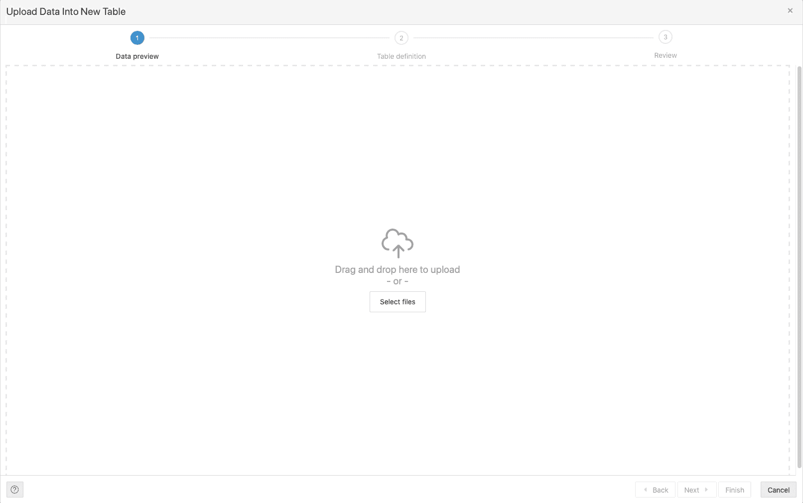
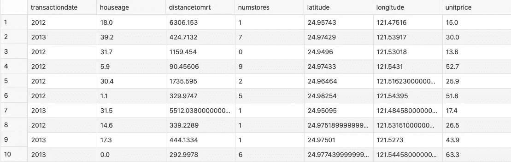
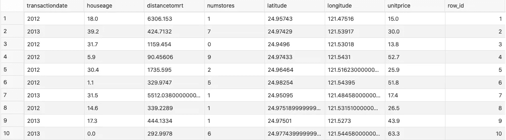
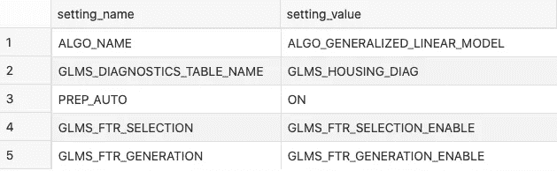
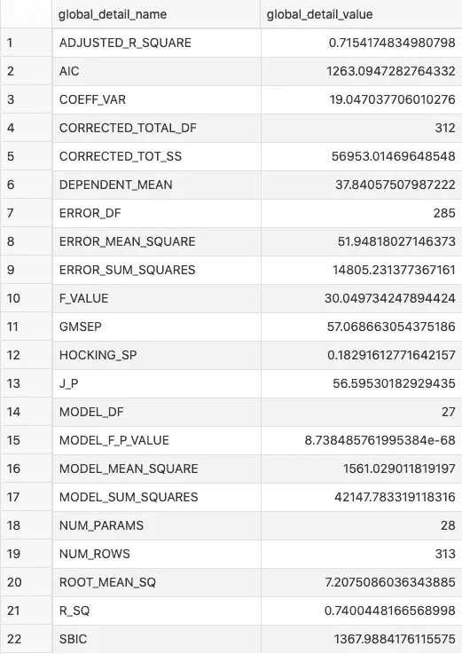
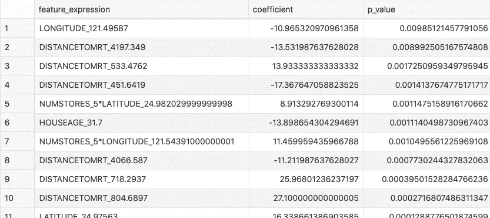
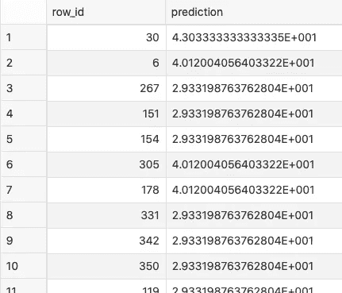

# SQL 机器学习——回归完全指南

> 原文：<https://towardsdatascience.com/machine-learning-with-sql-a-complete-guide-to-regression-b0e5e2db22da?source=collection_archive---------37----------------------->

## 数据库内机器学习？这比你想象的要容易

似乎每个人都知道如何用像 *Python* 、 *R* 和 *Julia* 这样的语言来训练预测模型。但是 *SQL* 呢？如何利用一种众所周知的数据库语言来进行机器学习？

托拜厄斯·凯勒在 [Unsplash](https://unsplash.com/s/photos/abstract?utm_source=unsplash&utm_medium=referral&utm_content=creditCopyText) 上拍摄的照片

不想看书？看看我关于这个主题的视频:

SQL 已经存在了几十年，但仍然没有被认为是机器学习的语言。当然，我会在一周的任何一天选择 Python，但有时数据库中的机器学习是唯一的选择。

在本文中，我们将使用 [Oracle 云](https://www.oracle.com/index.html)。这是免费的，所以请注册并创建一个 OLTP 数据库实例(版本 19c，有 0.2TB 的存储)。一旦完成，通过*SQL Developer Web*或任何其他工具建立连接。

我们将使用一个著名的房价数据集的稍加修改的版本——你可以在这里下载。我选择了这个数据集，因为它不需要任何广泛的准备，所以重点可以立即转移到预测建模。

这篇文章的结构如下:

*   数据集加载和准备
*   模型设置
*   模型训练和评估
*   结论

# 数据集加载和准备

如果你正在跟随，我希望你已经下载了数据集。你需要用自己选择的工具将它加载到数据库中——我使用的是 Oracle Cloud 提供的免费工具 *SQL Developer Web* 。

加载过程很简单——点击上传按钮，选择 CSV 文件，然后点击几次*下一个*:

图 1 —使用 Oracle SQL Developer Web 加载数据集(图片由作者提供)

我的现在存储在`housingprices`表中。下面是前几行的样子:

图片 2-加载的数据集的前 10 行(作者提供的图片)

*甲骨文机器学习* (OML)在创建模型方面有点奇怪。您的数据表必须包含具有 ID 的列，ID 是从序列中生成的数字。默认情况下，我们的数据集没有这个，所以让我们手动添加它:

图 3 —添加了一列行 ID(按作者分类的图像)

这一部分只剩下一件事要做:训练/测试分割。在 SQL 中，这是通过创建两个视图来完成的。第一个视图随机抽取了 75%的数据，第二个视图抽取了剩余的 25%。百分比是任意选择的:

我们现在已经创建了两个视图——`housing_train_data`用于训练,`housing_test_data`用于测试。在模型训练之前还有一件事要做:为模型指定设置。让我们在下一节做这件事。

# 模型设置

Oracle 使用这种设置表样式来训练预测模型。设置表由两列组成，一列用于名称，另一列用于值。

下面是创建表格的方法:

以下信息将存储在该表中:

*   模型类型—让我们使用一个*广义线性模型* (GLM)
*   诊断表名称-用于模型统计
*   数据准备技术——让我们用自动的
*   功能选择—禁用或启用，让我们选择启用
*   特征生成-与特征选择相同

是的，你没看错——所有这些都是自动完成的，不需要你的帮助。接下来让我们填写设置表:

这是表格的样子:

图 4-模型设置表(作者图片)

就是这样！我们继续模特训练吧。

# 模型训练和验证

模型训练归结为单个过程调用。代码如下:

如您所见，您需要首先命名您的模型。`GLMR_Regression_Housing`这个名字完全是随意取的。大约一秒钟后，模型被训练。不要害怕 Oracle 创建的表的数量。这些是模型正常工作所必需的。

接下来，我们来看一下火车布景上的模特表演。它可以通过以下查询获得:

图 5-列车组的模型性能(图片由作者提供)

平均来说，这个模型有 7.2 个单位的价格是错误的，它捕捉了超过 70%的方差。

接下来让我们看看最重要的特性。如果该特征的 P 值接近 0(小于 0.05 即可)，则可将其归类为对预测有意义。以下是查询:

图片 6 —特征重要性(作者图片)

如您所见，这些要素最初并不存在于数据集中，而是由 Oracle 的要素生成器自动创建的。

最后，让我们将这个模型应用于测试集:

结果存储在`housing_test_predictions`表中:

图 7 —测试集上的预测(图片由作者提供)

不知道科学记数法是怎么回事，但它足够好，可以进一步评估。我将把它留给你，因为你只需要在`housing_test_data`视图和`housing_test_predictions`表之间创建一个`UNION`来看看结果有多好。

# 离别赠言

机器学习不再是 Python 或 R 特有的*东西*。对于数据科学家来说，采用 SQL 不是最直观的，文档也很糟糕，但数据库内 ML 为业务用户提供了一种接触预测建模的极好方式。

不要错过 ML with SQL 系列的其他内容:

*   [使用 SQL 的机器学习(分类)](/machine-learning-with-sql-its-easier-than-you-think-c6aae9064d5a)
*   [用 SQL 进行时间序列预测](/time-series-forecasting-with-sql-its-easier-than-you-think-1f5b362d0c81)

欢迎在下面的评论区留下你的想法。

## 加入我的私人邮件列表，获取更多有用的见解。

*喜欢这篇文章吗？成为* [*中等会员*](https://medium.com/@radecicdario/membership) *继续无限制学习。如果你使用下面的链接，我会收到你的一部分会员费，不需要你额外付费。*

 [## 通过我的推荐链接加入 Medium-Dario rade ci

### 作为一个媒体会员，你的会员费的一部分会给你阅读的作家，你可以完全接触到每一个故事…

medium.com](https://medium.com/@radecicdario/membership) 

*原载于 2020 年 11 月 10 日 https://betterdatascience.com**[*。*](https://betterdatascience.com/machine-learning-with-sql-regression/)*