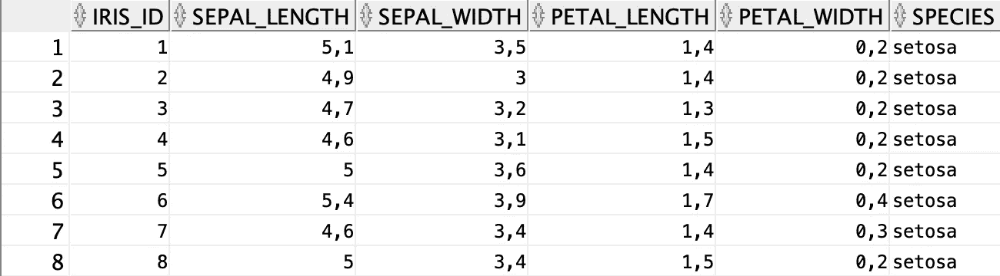

# 使用 SQL 进行机器学习——比你想象的要简单

> 原文：<https://towardsdatascience.com/machine-learning-with-sql-its-easier-than-you-think-c6aae9064d5a?source=collection_archive---------6----------------------->

## 当 Python 不是一个选项时该做什么。包括代码。

如果你一直在学习数据科学，很可能你知道如何用像 *Python* 、 *R* 和 *Julia* 这样的语言来执行机器学习任务。但是，当速度是关键，硬件有限，或者您工作的公司将 SQL 作为预测分析的唯一选择时，您能做些什么呢？数据库中的机器学习是答案。


照片由[王浩](https://unsplash.com/@danranwanghao?utm_source=medium&utm_medium=referral)在 [Unsplash](https://unsplash.com?utm_source=medium&utm_medium=referral) 上拍摄

在本文中，我们将使用 [Oracle 云](https://www.oracle.com/index.html)。这是免费的，所以请注册并创建一个 OLTP 数据库实例(版本 19c，有 0.2TB 的存储)。完成后，下载*云钱包*并通过 *SQL Developer* 或任何其他工具建立连接。

这将花费你至少 10 分钟，但这是一件相当简单的事情，所以我不会在这上面浪费时间。

我们将使用*甲骨文机器学习(OML)* 在众所周知的[虹膜数据集](https://raw.githubusercontent.com/uiuc-cse/data-fa14/gh-pages/data/iris.csv)上训练一个分类模型。我选择它是因为它不需要任何准备—我们只需要创建表并插入数据。

让我们接下来做那件事。

# 数据准备

如前所述，我们需要创建一个表来保存 Iris 数据集，然后我们需要向其中加载数据。 *OML* 要求一列用作行 ID(序列)，所以让我们记住这一点:

```
CREATE SEQUENCE seq_iris;
CREATE TABLE iris_data(
    iris_id      NUMBER DEFAULT seq_iris.NEXTVAL,
    sepal_length NUMBER,
    sepal_width  NUMBER,
    petal_length NUMBER,
    petal_width  NUMBER,
    species      VARCHAR2(16)
);
```

厉害！现在我们可以[下载数据](https://raw.githubusercontent.com/uiuc-cse/data-fa14/gh-pages/data/iris.csv)并加载它:


当弹出一个模态窗口时，只需提供下载 CSV 的路径，然后点击几次 *Next* 。没有你的帮助，SQL 开发人员应该可以把事情做好。

完成后，我们加载并准备好数据集:



现在让我们继续有趣的部分。

# 模特培训

现在我们可以接触有趣的东西，这就是训练分类模型。这被分解成多个步骤，例如训练/测试分割、模型训练和模型评估。先说最简单的。

## 训练/测试分割

Oracle 喜欢用两个视图来完成这个步骤——一个用于训练数据，一个用于测试数据。我们可以用一点 PL/SQL 魔法轻松地创建它们:

```
BEGIN
    EXECUTE IMMEDIATE 
        ‘CREATE OR REPLACE VIEW 
        iris_train_data AS 
        SELECT * FROM iris_data 
        SAMPLE (75) SEED (42)’;
    EXECUTE IMMEDIATE 
        ‘CREATE OR REPLACE VIEW 
        iris_test_data AS 
        SELECT * FROM iris_data 
        MINUS 
        SELECT * FROM iris_train_data’;
END;
/
```

这个脚本做两件事:

1.  *创建一个列车视图*——以随机种子 42 ( `SEED (42)`)分割 75%的数据(`SAMPLE (75)`)
2.  *创建一个测试视图*——作为整个数据集和训练视图的差异

我们的数据存储在名为`iris_train_data`和`iris_test_data`的视图中——你可以猜猜哪个视图包含什么。

让我们快速检查一下每一行有多少行:

```
SELECT COUNT(*) FROM iris_train_data;
**>>> 111** SELECT COUNT(*) FROM iris_test_data;
**>>> 39**
```

我们已经准备好训练模型了，接下来让我们开始吧。

## 模特培训

模型训练最简单的方法是通过`DBMS_DATA_MINING`包，只需执行一个程序，无需创建额外的设置表。

我们将使用*决策树*算法来训练我们的模型。方法如下:

```
DECLARE 
    v_setlst DBMS_DATA_MINING.SETTING_LIST;
BEGIN
    v_setlst(‘PREP_AUTO’) := ‘ON’;
    v_setlst(‘ALGO_NAME’) := ‘ALGO_DECISION_TREE’;

    DBMS_DATA_MINING.CREATE_MODEL2(
        ‘iris_clf_model’,
        ‘CLASSIFICATION’,
        ‘SELECT * FROM iris_train_data’,
        v_setlst,
        ‘iris_id’,
        ‘species’
    );
END;
/
```

`CREATE_MODEL2`过程(奇怪的是为什么它没有被命名为`CREATE_MODEL_FINAL_FINAL89`)接受很多参数。让我们解释一下我们输入的:

*   `iris_clf_model` —你的型号的简单名称。可以是任何东西
*   `CLASSIFICATION` —我们正在进行的机器学习任务的类型。出于某种原因必须大写
*   `SELECT * FROM iris_train_data` —指定存储训练数据的位置
*   `v_setlst` —以上为我们的模型声明的设置列表
*   `iris_id` —序列类型列的名称(每个值都是唯一的)
*   `species` —目标变量的名称(我们试图预测的)

执行这个代码块需要一两秒钟，但是一旦完成，就可以开始评估了！

## 模型评估

让我们使用这个脚本来评估我们的模型:

```
BEGIN
    DBMS_DATA_MINING.APPLY(
        ‘iris_clf_model’, 
        ‘iris_test_data’, 
        ‘iris_id’, 
        ‘iris_apply_result’
    );
END;
/
```

它将`iris_clf_model`应用于看不见的测试数据`iris_test_data`，并将评估结果存储到`iris_apply_result`表中。这张桌子看起来是这样的:


它有更多的行(39 x 3)，但你得到了要点。这还不是最直观的，所以让我们以稍微不同的方式显示结果:

```
DECLARE 
     CURSOR iris_ids IS 
         SELECT DISTINCT(iris_id) iris_id 
         FROM iris_apply_result 
         ORDER BY iris_id;
     curr_y      VARCHAR2(16);
     curr_yhat   VARCHAR2(16);
     num_correct INTEGER := 0;
     num_total   INTEGER := 0;
BEGIN
    FOR r_id IN iris_ids LOOP
        BEGIN
            EXECUTE IMMEDIATE 
                ‘SELECT species FROM 
                iris_test_data 
                WHERE iris_id = ‘ || r_id.iris_id
                INTO curr_y;
            EXECUTE IMMEDIATE 
                ‘SELECT prediction 
                FROM iris_apply_result 
                WHERE iris_id = ‘ || r_id.iris_id || 
               ‘AND probability = (
                   SELECT MAX(probability) 
                       FROM iris_apply_result 
                       WHERE iris_id = ‘ || r_id.iris_id || 
                   ‘)’ INTO curr_yhat;
        END;

        num_total := num_total + 1;
        IF curr_y = curr_yhat THEN 
            num_correct := num_correct + 1;
        END IF; 
    END LOOP;

    DBMS_OUTPUT.PUT_LINE(‘Num. test cases: ‘ 
        || num_total);
    DBMS_OUTPUT.PUT_LINE(‘Num. correct : ‘ 
        || num_correct);
    DBMS_OUTPUT.PUT_LINE(‘Accuracy : ‘ 
        || ROUND((num_correct / num_total), 2));
END;
/
```

是的，很多，但是上面的脚本不能再简单了。让我们来分解一下:

*   `CURSOR` —获取所有不同的 iris _ ids(因为我们在`iris_apply_results`表中复制了它们
*   `curr_y`、`curr_yhat`、`num_correct`、`num_total`是用于存储每次迭代中的实际物种和预测物种、正确分类数以及测试项目总数的变量
*   对于每个独特的`iris_id`，我们得到实际物种(来自`iris_test_data`，其中 id 匹配)和预测物种(其中预测概率在`iris_apply_results`表中最高)
*   然后很容易检查实际值和预测值是否相同，这表明分类是正确的
*   变量`num_total`和`num_correct`在每次迭代中被更新
*   最后，我们将模型的性能打印到控制台

以下是该脚本的输出:


厉害！解释为:

*   测试集有 39 个案例
*   在这 39 个中，37 个被正确分类
*   这导致了 95%的准确率

这就是模型评估的基本内容。

# 在你走之前

现在你有了它——用 SQL 从头开始编写的机器学习项目。并不是所有人都有特权在工作中使用像 *Python* 这样的东西，如果一个机器学习任务出现在你的办公桌上，你现在知道如何通过 *SQL* 来解决它。

当然，这只是一个简单的分类任务，脚本还可以进一步改进，但是您已经明白了。我希望你已经设法跟上了。如有任何问题和意见，请参考评论部分。

感谢阅读。

## 加入我的私人邮件列表，获得更多有用的见解。

*喜欢这篇文章吗？成为* [*中等会员*](https://medium.com/@radecicdario/membership) *继续无限制学习。如果你使用下面的链接，我会收到你的一部分会员费，不需要你额外付费。*

[](https://medium.com/@radecicdario/membership) [## 通过我的推荐链接加入 Medium-Dario rade ci

### 作为一个媒体会员，你的会员费的一部分会给你阅读的作家，你可以完全接触到每一个故事…

medium.com](https://medium.com/@radecicdario/membership) 

【https://betterdatascience.com】原载于 2020 年 9 月 6 日[](https://betterdatascience.com/machine-learning-with-sql-classification/)**。**