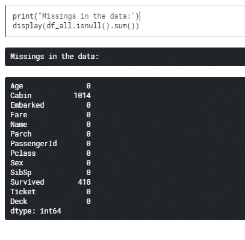

# 用泰坦尼克号数据集进行机器学习

> 原文：<https://towardsdatascience.com/machine-learning-with-the-titanic-dataset-7f6909e58280?source=collection_archive---------4----------------------->

## 预测泰坦尼克号乘客生存的端到端指南

从我的观点来看，初学者的教程应该让读者继续自己的观点。为此，我想和大家分享一个著名的泰坦尼克号 Kaggle 比赛的教程。如果你这样做，你最终会得到一个合理的分数，但我也会展示一些你可以轻松提高分数的类别。在你读完之后，你可以拿着这个模型自己改进它。如果你对机器学习感兴趣，泰坦尼克号的戏剧性沉没是你自己数据科学之旅的一个很好的起点。祝你好运！

## 入门指南

如果你对 Kaggle 完全陌生，请查看[的这个](https://www.kaggle.com/alexisbcook/titanic-tutorial)教程，了解设置过程。你会在这里找到数据集等等。

在 Kaggle 内核中加载文件之后:

哪些变量在我们的数据集中:

## Kaggle 注意到:

**pclass** :社会经济地位(SES)的代表
1st =上层
2nd =中层
3rd =下层

**sibsp** :数据集以这种方式定义家庭关系……
兄弟姐妹=兄弟、姐妹、继兄弟、继姐妹
配偶=丈夫、妻子(情妇和未婚夫被忽略)

**parch** :数据集以这种方式定义家庭关系……
Parent =母亲，father
Child =女儿，儿子，继女，继子
有些孩子只和保姆一起旅行，因此 parch=0。

## 1.数据质量检查

第一步，我们将调查泰坦尼克号的数据集。Kaggle 提供了一个训练和一个测试数据集。训练数据集包含所有特征(可能的预测值)和目标(我们想要预测结果的变量)。测试数据集用于提交，因此缺少目标变量。让我们看一下数据集:

我在引言中已经写道，目标变量“幸存”在测试数据集中是缺失的。所有其他列都出现在两个数据图表中。总的来说，我们有 11 个不同的变量，可用作预测目标结果的特征。你一眼就能看出《小屋》有遗漏。遗漏会刺激我们的算法，因此在第一步中清理数据是重要的任务。

在训练数据中，我们在年龄、客舱和登机栏中有遗漏。在测试数据集中，年龄、费用和舱位列中有缺失。我们将连接两个数据集，并对整个数据集执行数据清理。

## 2.数据清理

## 2.1 年龄

我们的年龄栏有 20%的人失踪了。让我们来看看分布情况:

我们不想删除所有缺少年龄值的行，因此我们将替换缺少的行。正如你所看到的，我们有一个年龄的右螺旋分布，中位数应该是一个很好的替代选择。

一个论点是，乘客等级的年龄中位数不同。职业发展通常伴随着年龄和经验的增长。因此，社会经济地位较高的人平均年龄较大。如果我们按性别划分，我们会发现仍然存在差异，因为女性总体上更年轻。在最后一步中，我检查了案例的数量，以确保每个类别中仍有足够的案例。我们将使用这些中间值来代替缺失值。

## 2.2 票价

在整个数据集中，我们只有一个缺失的票价值。托马斯先生乘坐三等舱，独自旅行，在南汉普顿上船。我们将从这一类别的人群中选取其他案例，并用这一组的中间值替换缺失的票价。

## 2.3 客舱

有很多缺失值，但我们应该使用客舱变量，因为它可以是一个重要的预测值。正如你在下图中看到的，一等舱在甲板 A、B 或 C 上，混合舱在 D 或 E 上，三等舱主要在 f 或 g 上。我们可以通过第一个字母来识别甲板。

存活率有显著差异，因为上层甲板的游客在救生艇上速度更快。我们将把一些甲板集合起来。

## 2.4 已上船

登船的人只有两个失踪。由于我们已经尝试了 fare 案例，我们可以查找类似的案例来替换丢失的值。有理由认为，那些支付了类似金额，也有一等舱机票，在同一个甲板上，从同一个位置上船的人。我还在 Kaggle 论坛上看到，你可以谷歌个人乘客，所以我试了一下:

陈月娇小姐:[https://www . encyclopedia-titanica . org/titanic-survivor/Amelia-icard . html](https://www.encyclopedia-titanica.org/titanic-survivor/amelia-icard.html)

乔治·尼尔森夫人:[https://www . encyclopedia-titanica . org/titanic-survivor/Martha-Evelyn-stone . html](https://www.encyclopedia-titanica.org/titanic-survivor/martha-evelyn-stone.html)

关于链接的文章都在南汉普顿登船。数据科学也是关于研究的！

## 2.5 结论

我们已经填充了数据集中所有缺失的值，还没有删除任何一列。我们使用了年龄和票价的统计方法，为客舱创建了一个新的类别，并对船上的缺失做了一些研究。让我们再检查一下是否一切正常。

## 3.特征工程

特征工程是一门艺术，也是广阔的机器学习领域中最令人兴奋的事情之一。我真的很喜欢研究 Kaggle 子论坛，探索所有伟大的想法和创造性的方法。泰坦尼克号数据集提供了很多可能性来尝试不同的方法，并提高您的预测得分。我们将关注一些标准，我将详细解释每一步。

迄今为止我们将使用的技术:
-宁滨连续变量(例如年龄)
-从现有变量中创建新特征(例如标题)
-非数字特征(例如性别)的标签编码
-类别特征(例如 Pclass)的一个热编码

## 3.1 宁滨

如你所见，年龄和费用都有异常值。与年龄相比，票价的取值范围要高得多。我们将把分布切割成小块，这样离群值就不会影响我们的算法。对于票价，我们将为每个类别分配相同数量的案例，对于年龄，我们将根据变量的值建立类别。这也是 cut 和 qcut 的区别。使用 cut，不管有多少事例属于一个类别，都会根据变量的值来形成箱。使用 qcut，我们分解一个分布，以便在每个类别中有相同数量的案例。

平均而言，较年轻的乘客有更高的生存机会，票价较高的人也是如此。年轻人可能最先获救，票价较高的人最先登上救生艇。

## 3.2 从现有变量中创建新特征

## 3.2.1 家庭规模

在我们的数据集中有两个有趣的变量告诉我们一些关于家庭规模的事情。SibSp 定义了一个乘客有多少兄弟姐妹和配偶，以及多少父母和子女。我们可以将这些变量汇总，并(为每个路人)加 1，得到家庭规模。

一个论点是，家庭比单身有更高的生存机会，因为他们能够更好地养活自己，并优先得到救助。然而，如果家庭太大，在特殊情况下协调可能会非常困难。

## 门票

我们预计购票频率和存活率之间存在关联，因为相同的票号表明人们一起旅行过。

正如所料，每种机票频率的存活率有所不同。

## 标题

这个名字为我们提供了关于乘客社会经济地位的非常重要的信息。我们可以回答这个问题:某人是否结婚，或者某人是否有正式的头衔，这可能是更高社会地位的标志。

在我们的数据集中有很多不同的标题。我们只考虑超过 10 个案例的标题，所有其他的我们将分配到“杂项”类别。

## 3.2.4 存活率

这个 Kaggle 竞争允许我们使用来自测试数据集的信息。在这一点上，我们想指出的是，要获得高分，你必须对数据有创造性。这几乎就像一场黑客马拉松。在现实世界的任务中，你通常没有机会这样做。我们会识别乘客的姓氏。然后，我们可以查看是否有任何家庭成员同时出现在训练和测试数据集中。

拥有硕士学位的人和女性存活的几率要高得多，平均而言，他们同时拥有更大的家庭。我们假设，如果一个主人或女人在训练数据集中被标记为幸存者，测试数据集中的家庭成员也将幸存。

在有两个或更多家庭成员的妇女中，大多数情况下她们全部死亡或没有死亡。

这同样适用于头衔为 master 的乘客家属。

## 3.3 标签和一个热编码

大多数算法不能对字符串做任何事情，所以变量通常在建模前被重新编码。标签编码将非数字值映射到数字。例如，对于 sex，0 和 len(sex)-1，即 1。

这就引出了另一个问题。许多算法假设一个列中有一个逻辑序列。然而，这并不总是用数字比率来表示。因此，之后需要对变量进行一次热编码。然后，性别列变成了 Sex_1 和 Sex_2 两列，其中用二进制编码表示某人是男性还是女性。因此该算法通常可以更好地处理信息。

## 4.建模和预测

对于我们的第一个预测，我们选择一个随机福里斯特分类器。RFC 易于理解，是用于分类任务的成熟工具。

我们仍然定义建模时不需要考虑的列。例如，对于 apollowed，我们已经创建了虚拟列，所以我们可以删除原来的 apollowed 列。作为培训/测试划分，我们选择 75%和 25%。我们用训练数据集训练算法，然后用测试数据集测试预测能力。

RFC 括号中的标准不是强制性的，如果您忽略它们，将使用默认设置。给定的参数已经过优化，因此我们的分类器比默认参数工作得更好。

我们的预测分数几乎是 86%，这意味着我们在 86%的情况下正确预测了我们的目标，即存活率。这已经是一个很好的值，您现在可以进一步优化它。请在下面找到我们的随机福里斯特树的可视化。

## 5.结论

我们在一个小型数据科学项目中完成了整个旅程。我们探索了数据，清理了数据，然后我们修改了特征并创建了新的特征，最后一步我们用随机森林树分类器进行了预测。但是还有很多要做，接下来你可以测试以下几样:
-其他算法的表现更好吗？
-能不能根据年龄和票价更好的选择箱柜？
-票变量可以用得更合理吗？
-有没有可能进一步调整存活率？
-我们真的需要所有的功能吗，还是我们制造了干扰我们算法的不必要的噪音？

下面你可以找到一些很好的资源。

## 6.更多阅读材料和资源:

 [## 泰坦尼克号数据科学解决方案

### 使用 Kaggle 笔记本探索和运行机器学习代码|使用《泰坦尼克号:灾难中的机器学习》中的数据

www.kaggle.com](https://www.kaggle.com/startupsci/titanic-data-science-solutions)  [## 数据科学框架:实现 99%的准确性

### 使用 Kaggle 笔记本探索和运行机器学习代码|使用《泰坦尼克号:灾难中的机器学习》中的数据

www.kaggle.com](https://www.kaggle.com/ldfreeman3/a-data-science-framework-to-achieve-99-accuracy)  [## 泰坦尼克号-高级特征工程教程

### 使用 Kaggle 笔记本探索和运行机器学习代码|使用《泰坦尼克号:灾难中的机器学习》中的数据

www.kaggle.com](https://www.kaggle.com/gunesevitan/titanic-advanced-feature-engineering-tutorial) 

[如果您喜欢中级数据科学，并且还没有注册，请随时使用我的推荐链接加入社区。](https://medium.com/@droste.benedikt/membership)