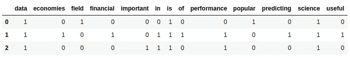
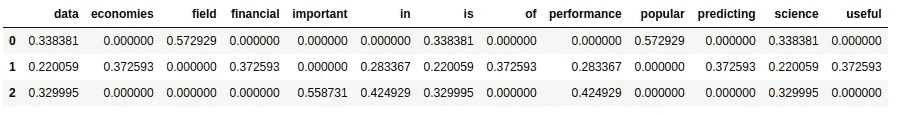
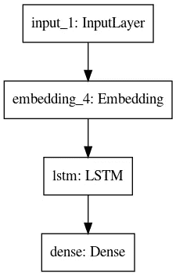

# 机器学习:单词嵌入和预测

> 原文：<https://towardsdatascience.com/machine-learning-word-embedding-and-predicting-e603254e4d7b?source=collection_archive---------20----------------------->

## 通过开发简单的单词预测器来理解单词嵌入


图片由来自 [Pixabay](https://pixabay.com/?utm_source=link-attribution&utm_medium=referral&utm_campaign=image&utm_content=2574751) 的 [Quinn Kampschroer](https://pixabay.com/users/quinntheislander-1139623/?utm_source=link-attribution&utm_medium=referral&utm_campaign=image&utm_content=2574751) 提供

单词嵌入是一种将稀疏表示向量转换成密集的更小向量的流行技术。这大大增加了计算时间，并节省了资源。在本文中，让我们看看如何开发一个预测引擎，并在工作流中利用单词嵌入的知识。

# 一点背景

## 错别字更正

这是将单个单词调整为最匹配的正确单词的地方。在大多数情况下，这种方法试图解决拼写问题。比如你输入***【helo】***，很有可能你的手机会变成 ***【你好】*** 。

## 单词预测

这是一种新的方法，可以纠正你的语法。单词被替换以使句子更自然。例如，如果你说 ***“你很漂亮”*** 我们可以有一个合理的逻辑，这个词可能会变成 ***【人】*** 。事实上，这应当完成为 ***【你是一个美丽的人】*** 。在本文中，我们将关注这种使用上下文信息的自动更正。这比修复错别字要复杂一些。我希望你们都是手机这个功能的受害者/使用者。让我们自己造一个吧！

# 查找训练数据集

有一次，我偶然发现了这个网址，它指引我找到了名为《变形记》的电子书。这是一个 ASCII 编码(UTF 8)的文本文档，可以免费下载。从今以后，我将引用这个源作为我的训练数据集。重要的事情先来！让我们快速地进行预处理和标记化，这样我们就可以开始了。我将使用以下 python 库进行预处理(以防您还没有它们)。

```
numpy
tensorflow
keras (comes as the API for tensorflow backend)
```

# 初步了解

我们要执行的第一步是对训练集中的单词进行标记化。这是因为我们应该将整个语料库中的所有单词放在一个有限的空间中，以便进行下游处理。通常，神经网络在一个值范围内表现更好。因此，我们应该将所有这些数据嵌入到密集的向量中。我们的单词符号更像是对空间的压缩。让我们看看它是如何工作的。

## 嵌入技术

1.  **TF-IDF 矢量化**

这是通过考虑单词在文档中的频率及其在语料库中的出现频率来嵌入单词的非常常见的方法。向量的大小将等于所考虑的唯一单词的数量。通常使用稀疏矩阵来实现。让我们看看下面的示例代码。

```
from sklearn.feature_extraction.text import TfidfVectorizer, CountVectorizer
import pandas as pdtexts = ["Data Science is a popular field.", 
         "Data Science is useful in predicting financial performance of economies", 
         "Performance is important in data science"]vectorizer = CountVectorizer()
counts = vectorizer.fit_transform(texts)
tfidf = TfidfVectorizer()
features = tfidf.fit_transform(texts)pd.DataFrame(counts.todense(),columns=vectorizer.get_feature_names())
pd.DataFrame(features.todense(),columns=tfidf.get_feature_names())
```

这将在终端中打印以下输出(在这里阅读更多关于理论)。



每个文档中的字数



TF-IDF 单词向量

通过这个向量的外观，你会看到它们是高维的，因此需要大量的计算资源。

## 单词嵌入

这就是我们使用嵌入层的地方，它将稀疏表示压缩到一个目标维度中，形成一个更小的表示。让我们看一个例子。

```
from tensorflow.keras.preprocessing.text import Tokenizer
from tensorflow.keras.models import Sequential
from tensorflow.keras.layers import Embeddingdocs = ["Data Science is a popular field.", 
         "Data Science is useful in predicting financial performance of economies", 
         "Performance is important in data science"]tokenizer = Tokenizer()
tokenizer.fit_on_texts(docs)
vocab_size = len(t.word_index) + 1model = Sequential()
model.add(Embedding(vocab_size, 3, input_length=1))
model.compile('rmsprop', 'mse')input_array = tokenizer.texts_to_sequences(["Data"])
output_array = model.predict(input_array)output_array
```

接下来是输出；

```
array([[[0.02056189, 0.04136733, 0.03566055]]], dtype=float32)
```

你可以看到我们看到一个形状为 ***N，1，3*** 的张量，这是因为我们的目标维度是 3，我们有一个单词。多个单词会增加张量的第二维度。这些将是你学习模型的超参数。现在，你将拥有包含三维单词的句子，与之前的词汇大小形成对比。

# 实施我们的模型

既然我们已经掌握了初步步骤的专业知识，让我们来构建模型。

## 基本进口

```
from numpy as np
import tensorflow as tf
from tensorflow.keras.preprocessing.text import Tokenizer
from tensorflow.keras.utils import to_categorical
```

## 加载训练数据

我们将使用前面提到的书 ***【蜕变】*** 作为语料库来加载数据和分词。我们将考虑 3 个连续的单词。模型的输入是前两个单词，输出将是每组 3 个单词的最后一个单词。

```
data = ""
with open("./metamorphosis.txt") as f:
    data = f.read().strip()tokenizer = Tokenizer()
tokenizer.fit_on_texts([data])# determine the vocabulary size
vocab_size = len(tokenizer.word_index) + 1
print('Vocabulary Size: %d' % vocab_size)# create line-based sequences
sequences = list()for encoded in tokenizer.texts_to_sequences(data.split("\n")):
    if len(encoded) > 0:
        for i in range(0, len(encoded) - 2):
            sequences.append(encoded[i:i+3])

print('Total Sequences: %d' % len(sequences))
sequences = np.array(sequences)X, y = sequences[:,:-1], to_categorical(sequences[:,-1], num_classes=vocab_size)
```

## 构建模型

让我们为我们的培训建立一个简单的模型。在本文中，我将开发一个非常简单的模型，它将考虑前面的两个单词来预测或纠正下一个单词。我的输出将以分类二进制格式来预测下一个单词。我将使用我喜欢使用的 ***Keras 功能 API*** 。

```
# define model
i = tf.keras.layers.Input(shape=(X.shape[1]))e = tf.keras.layers.Embedding(vocab_size, 10, input_length=max_length)(i)l = tf.keras.layers.LSTM(10)(e)d = tf.keras.layers.Dense(vocab_size, activation='softmax')(l)model = tf.keras.Model(inputs=i, outputs=[d])print(model.summary())# compile network
model.compile(loss='categorical_crossentropy', optimizer='adam', metrics=['accuracy'])

tf.keras.utils.plot_model(model)
```

注意，我们使用 ***分类交叉熵*** ，因为我们正在训练预测二进制分类值。一位将指示特定索引中的一个项目。

当我们运行代码时，我们将能够看到下面的模型。

```
Model: "model"
_________________________________________________________________
Layer (type)                 Output Shape              Param #   
=================================================================
input_1 (InputLayer)         [(None, 2)]               0         
_________________________________________________________________
embedding_4 (Embedding)      (None, 2, 10)             2700      
_________________________________________________________________
lstm (LSTM)                  (None, 10)                840       
_________________________________________________________________
dense (Dense)                (None, 270)               2970      
=================================================================
Total params: 6,510
Trainable params: 6,510
Non-trainable params: 0
```



可视化网络

我们可以使用下面几行代码启动培训程序。

```
model.fit(X, y, epochs=1000, verbose=2)
```

# 预言

现在我们已经训练了模型，我们可以开始预测下一个单词并进行纠正。让我们看看如何根据训练好的模型进行预测。

```
text = " there's still **so**"
text = " ".join(text.split(" ")[:3])encoded = tokenizer.texts_to_sequences([text])[0]
encoded = array([encoded])next = model.predict(encoded, verbose=0)for x in next:
    next_word_token = np.argmax(x) # map predicted word index to word
    for word, index in tokenizer.word_index.items():
        if index == next_word_token:
            print(word + " ")
```

这里用粗体表示，我把 ***写成了*** ，这是打了一半的最后一个单词(用于模拟用户输入)。请注意，我认为前两个词是预测。我们的预测者会预测单词 ***【某】*** 。所以完整的句子会是 ***【还有一些】*** 。我们使用 ***argmax*** 来挑选预测的类别，并在 tokenizer 字典中查找单词。

***让工作流程更智能***

我们天真地选择了最有可能的项目。然而，如果我们有了 ***【还有一些 fo】***，下一个单词很容易就是***【food】***。对此，最简单的解决方法是挑选最可能的项目集，而不选择 ***argmax*** 。然后查找单词并指定最接近的匹配。为此，您可以使用余弦距离。

***提示***

为了清晰起见，尝试绘制您的 ***Keras*** 模型。
找到一个好的语料库进行训练(我选择的是天真的)
在分类编码不适合的地方，使用二进制编码和 ***二进制交叉熵*** 。

我希望你喜欢阅读这篇文章！你好。