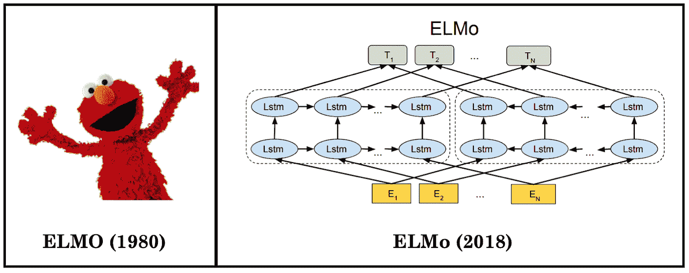
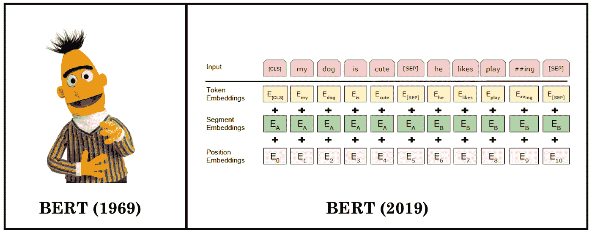
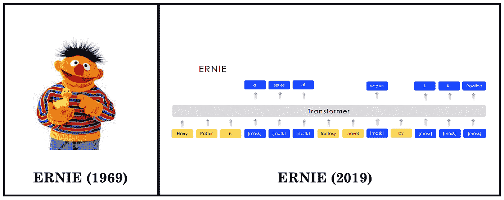
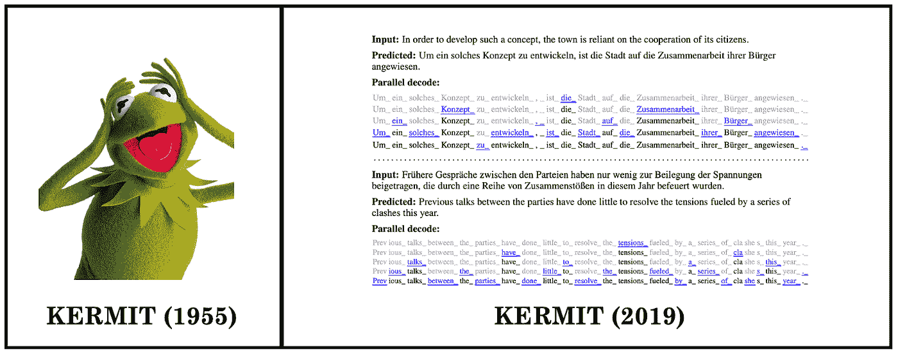
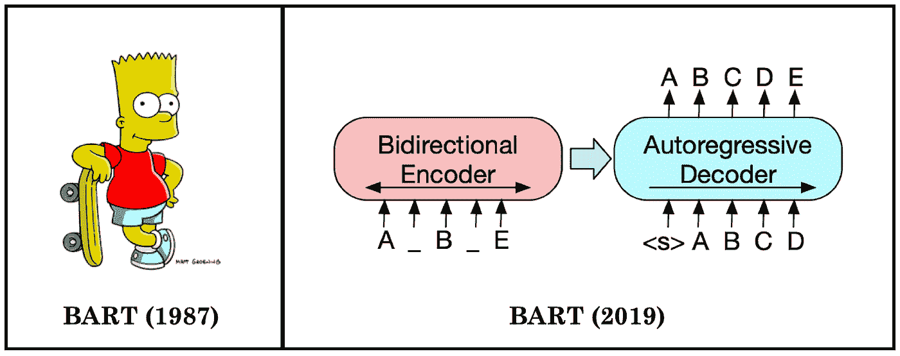
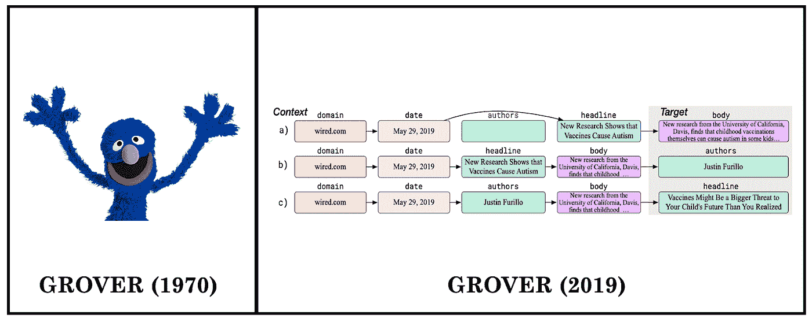
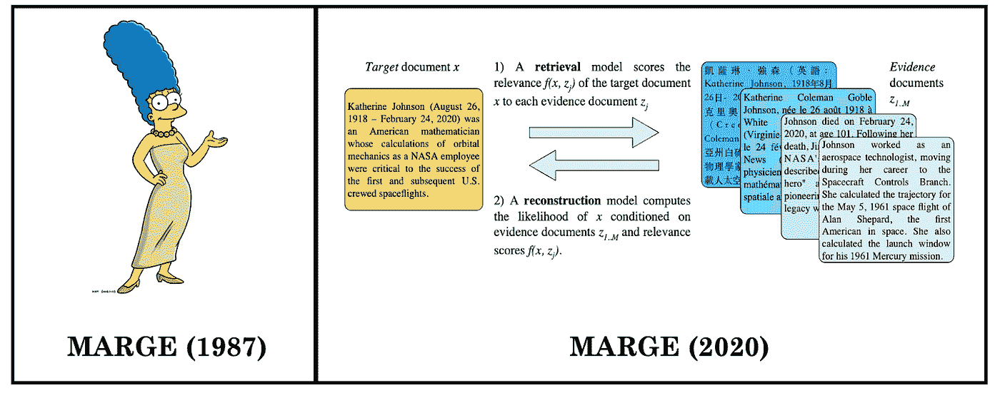
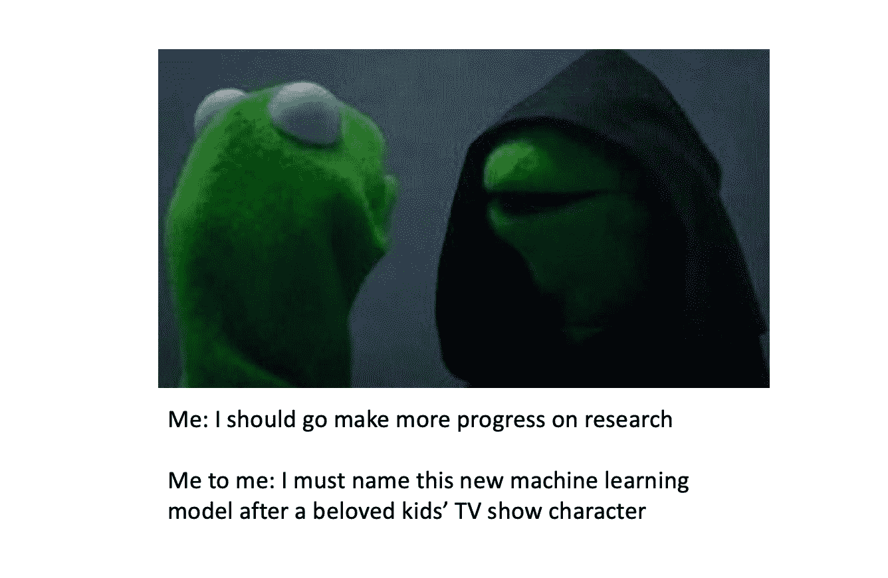

# 机器学习对儿童电视剧角色的痴迷

> 原文：<https://towardsdatascience.com/machine-learnings-obsession-with-kids-tv-show-characters-728edfb43b3c?source=collection_archive---------27----------------------->

## 埃尔默、伯特和玛吉(辛普森饰)不仅仅是你在成长过程中最喜欢的电视角色——他们也是机器学习和自然语言处理模型

斯蒂芬·格雷奇在 [Unsplash](https://unsplash.com?utm_source=medium&utm_medium=referral) 上拍摄的照片

巴特.埃尔莫。伯特。科米。玛吉。他们有什么共同点？

他们都是我们许多人年轻时看过的电视节目中受人喜爱的虚构人物。但这还不是全部——它们也都是人工智能模型。

2018 年，艾伦研究所的研究人员发表了语言模型 [ELMo](https://arxiv.org/pdf/1802.05365.pdf) 。主要作者马特·皮特斯说，该团队为他们的模型集思广益了许多首字母缩写词，ELMo 立即成为了一个[“异想天开但令人难忘的”](https://www.theverge.com/2019/12/11/20993407/ai-language-models-muppets-sesame-street-muppetware-elmo-bert-ernie)选择。

起初只是一个内部玩笑的事情已经成为一种全面发展的趋势。

Google AI 随后推出了 [BERT](https://arxiv.org/pdf/1810.04805.pdf) ，这是一个非常强大并且现在广泛使用的基于 Transformer 的语言模型。然后，更多的还有:[厄尼](https://arxiv.org/pdf/1904.09223.pdf)、 [KERMIT](https://arxiv.org/pdf/1906.01604.pdf) 、[巴特](https://arxiv.org/pdf/1910.13461.pdf)、[格罗弗](https://arxiv.org/pdf/1905.12616.pdf)等。OpenAI [差点](https://twitter.com/jackclarkSF/status/1187824098916753408)把 GPT-2 命名为“Snuffleupagus，或简称 Snuffy”就在上个月，脸书·艾出版了《玛吉与 T21》。

这篇文章对所有这些模型进行了概述，当然，下面是它们的角色灵感:

# ELMo (2018):来自语言模型的嵌入

开创这一趋势的是一种深度上下文化的单词表示方法，它能够捕捉更多关于单词的特征(语法、语义等等)。

将单词表示为向量(“单词嵌入”)的一个大挑战是，无论在什么上下文中使用，单词都将由相同的向量表示。然而，“当前”在“你的*当前*工作是什么？”对比“那是一条很强的河流*海流*”——我们不能只用一个固定的表示法来表示两个“*海流”*！

因此，**上下文化的**单词嵌入被创建来捕捉单词在其表示中的上下文。ELMo 不是一次只阅读一个单词，而是在给每个单词分配嵌入之前阅读整个句子的上下文，这是使用双向 LSTM 完成的。

ELMo 是使用语言建模的自然语言处理(NLP)研究的一大进步。对于 ELMo 的图解说明，我强烈推荐这个[资源](http://jalammar.github.io/illustrated-bert/)。

在机器学习和 NLP 之外，Elmo 是儿童节目*芝麻街*中一个可爱的毛茸茸的红色布偶。埃尔莫喜欢惊喜、披萨和泡泡浴，并且[获得了金像奖最长傻笑奖](https://lifestyle.howstuffworks.com/family/activities/how-elmo-works.htm)。它于 1980 年首次出现在银幕上。

左:芝麻街的 Elmo 右:[埃尔莫](https://arxiv.org/pdf/1802.05365.pdf)

# BERT (2019):变压器的双向编码器表示

谷歌通过[引入](https://ai.googleblog.com/2018/11/open-sourcing-bert-state-of-art-pre.html) [BERT](https://arxiv.org/pdf/1810.04805.pdf) 进一步转变了 NLP 中的预训练，这是一种新的基于 Transformer 的语言模型，首次允许****双向**和无监督表示。**

**深度双向意味着在捕捉上下文嵌入时，BERT 使用每个单词的上一个和下一个上下文来表示它。(相比较而言，ELMo 是浅双向的。)简单地根据每个单词的前一个和下一个单词来调节每个单词可能会有问题，因此 BERT 随机屏蔽一些单词，并双向调节每个单词以预测被屏蔽的单词。**

**在最初的版本中，BERT 已经在问答和自然语言理解任务中取得了令人印象深刻的成果。BERT 和其他基于变压器的架构是过去一年 NLP 研究的基石。**

**在机器学习和 NLP 之外，Bert 是*芝麻街*上一个友好的黄色角色。闲暇时，他喜欢读无聊的故事，吃燕麦粥，研究鸽子。**

****

**左:芝麻街的伯特；右:[伯特](https://arxiv.org/pdf/1810.04805.pdf)**

# **厄尼(2019):双重麻烦**

**你不能没有伯特最好的伙伴恩尼——好事研究人员开发了[恩尼](https://arxiv.org/pdf/1904.09223.pdf)(孙等人)、[恩尼](https://arxiv.org/pdf/1905.07129.pdf)(张等人)，甚至[恩尼 2.0](https://arxiv.org/abs/1907.12412) ！**

**第一个 [ERNIE](https://arxiv.org/pdf/1904.09223.pdf) (通过知识整合增强表示)提出了一个语言模型，将 BERT 的单词屏蔽策略扩展到**实体级和短语级屏蔽**。这样做，这个 ERNIE 可以在训练过程中隐式地学习短语、实体以及它们之间的关系的先验知识。**

**不到两个月后，第二个 [ERNIE](https://arxiv.org/pdf/1905.07129.pdf) (带有信息实体的增强语言表示)出版了。这个 ERNIE 提出了一个语言模型，它结合了**知识图**来优化获取尽可能多的信息。知识图是表示数据点和将它们链接在一起的关系的强大方法。**

**在机器学习和 NLP 之外，厄尼是一个麻烦制造者，他的人生使命是在*芝麻街上惹恼伯特。他非常喜欢他的橡胶鸭子，曾经说过一句著名的话“我听不见你说什么，我耳朵里有根香蕉！”***

****

**左:芝麻街的厄尼；右:[厄尼](https://arxiv.org/pdf/1904.09223.pdf)**

# **KERMIT (2019):通过插入变换进行的 Kontextuell 编码器表示**

**KERMIT 是一个基于插入的生成架构，它将联合分布、分解(即它的边界)和条件一起建模。研究人员发现，KERMIT 在一些特定的任务中表现出色，包括机器翻译。**

**如果你像我一样好奇，“kontextuell”在瑞典语中是“上下文”的意思。我们知道研究人员在这个命名上是相当故意的，因为在论文的后面，他们写道“然后，*像它的朋友* ELMo (Peters 等人，2018)，BERT (Devlin 等人，2019)，和 ERNIE (Sun 等人，2019)，我们也可以使用……”**

**在机器学习和 NLP 之外，Kermit 是一只标志性的唱歌青蛙，它已经为许多布偶作品增光添彩( *Sam and Friends，芝麻街，布偶秀*等)。)和迷因([但那不关我的事](https://www.12news.com/article/news/year-in-review/here-are-the-top-memes-of-the-2010s/75-cc27ea6b-4a22-475b-b382-4d9f5547f056)、[邪柯密特](https://www.theguardian.com/technology/2016/nov/30/evil-kermit-perfect-meme-terrible-times)等。).克米特于 1955 年首次亮相，是该榜单上年龄最大的电视角色。**

****

**左:科米蛙；右: [KERMIT](https://arxiv.org/pdf/1906.01604.pdf)**

# **BART (2019):双向和自回归变压器**

**脸书·艾在伯特、GPT 和之前的 NLP 预训练工作的基础上创建了 [BART](https://arxiv.org/pdf/1910.13461.pdf) ，这是一个用于文本生成和理解的新的预训练模型**，它结合了双向和自动回归**转换器。**

**BERT 在其双向编码器中使用掩蔽，这意味着掩蔽/丢失的单词是独立预测的。因此，BERT 不能用于文本生成。**

**相比之下，GPT 是自回归的，这意味着它在向前的方向上从给定上下文的一组单词中预测未来的单词。结果，GPT 无法学习双向互动。**

**BART 将这些基本思想结合在一起:1)用掩码替换随机文本跨度的文档被双向编码，然后 2)用自回归解码器预测文档未被修改的可能性。**

**在机器学习和 NLP 之外，巴特是电视上最知名的年轻反叛者之一。你可以在《辛普森一家》中找到巴特和他没完没了的恶作剧电话。**

****

**左图:《辛普森一家》中的巴特；右:[巴特](https://arxiv.org/pdf/1910.13461.pdf)**

# **格罗弗(2019)**

**近年来，NLP 领域发展非常迅速，以实现高度可信的摘要和翻译。然而，这些技术也可以用于不太积极的目的，例如人工智能生成的假新闻和宣传。**

**为了解决这个问题，研究人员创造了 GROVER，这是一个公开的生成器，可以写真实的可控假新闻。GROVER 的目的是让其他人可以针对它进行实践，以开发更好的技术来区分人工智能生成的假新闻和真实的人类撰写的新闻。当时，最好的鉴别器只能以 73%的准确率区分人工智能生成的假新闻和真实新闻。**

**(在一个令人困惑的命名决定中，这里没有首字母缩写——它被称为 GROVER 只是因为。)**

**在机器学习和 NLP 之外，Grover 是一个毛茸茸的蓝色芝麻街人物，他喜欢帮助(或试图帮助)别人。希望格罗弗能像帮助他的朋友一样，帮助人工智能世界解决虚假信息。**

****

**左:芝麻街的格罗弗；右:[格罗弗](https://arxiv.org/pdf/1905.12616.pdf)**

# **MARGE (2020):多语言自动编码器，检索和生成**

**最近由脸书·艾、[发表的 MARGE](https://arxiv.org/abs/2006.15020) 是一个新的“预训练的序列到序列模型，通过无监督的多语言多文档解释目标学习。”**

**更简单地说，它是一个预先训练好的语言模型，通过 1) **检索其他语言中的**相关文本，2) **通过在原始文本中寻找模式来重构**原始文本来生成文本。**

**研究人员发现，MARGE 可以成功地执行释义、翻译、多文档摘要和信息检索任务，而无需任何微调。MARGE 在 [BLEU](https://en.wikipedia.org/wiki/BLEU) (双语评估替补)上的得分高达 35.8，这是一个衡量语言翻译的指标，对于一个没有微调的模型来说，这被认为是相当高的。**

**在机器学习和 NLP 之外，Marge 是《辛普森一家》中的一个虚构角色。玛吉是三个孩子(包括巴特)的母亲，她也因身材高挑、蓝色(蓝色？👀)头发。**

**(有了巴特和玛吉，也许脸书·艾非常喜欢《辛普森一家》？)**

****

**左图:《辛普森一家》中的玛吉；右:[玛姬](https://arxiv.org/abs/2006.15020)**

# **最后的想法**

**研究人员以这种有趣、无害的方式向以前的作品致敬，这很酷。也许未来最先进的机器学习模型将被命名为赫敏或祖寇——我热切期待人工智能研究人员扩展到其他小说领域的那一天。**

**如果有其他以虚构人物命名的 AI 模型，[告诉我](https://twitter.com/catyeo18)！**

****

**感谢您的阅读！[订阅](https://medium.com/fair-bytes)阅读更多关于人工智能的研究、资源和问题。**

** [## GPT-3 有多偏？

### 尽管它的表现令人印象深刻，但世界上最新的语言模型反映了性别、种族和…

medium.com](https://medium.com/fair-bytes/how-biased-is-gpt-3-5b2b91f1177)  [## 我们需要改变图像数据集的管理方式

### 为什么许多黄金标准的计算机视觉数据集，如 ImageNet，有缺陷

medium.com](https://medium.com/fair-bytes/we-need-to-change-how-image-datasets-are-curated-b325642394df) 

凯瑟琳·杨(Catherine Yeo)是哈佛大学计算机科学专业的本科生，她对人工智能/人工智能/自然语言处理、公平和道德以及其他相关领域感兴趣。随意提出想法或者在 Twitter 上跟她打招呼[*@ catherinehyeo*](https://twitter.com/catherinehyeo)*。***