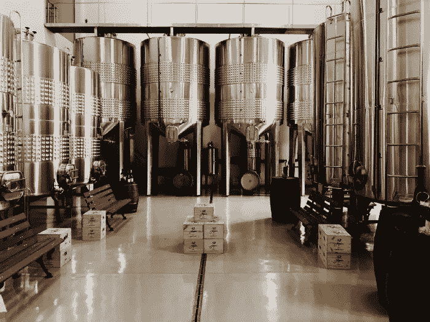
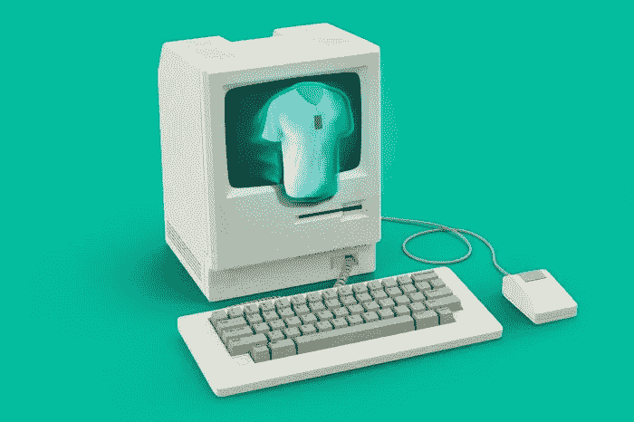

# 机器学习唯一(几乎)免费的午餐

> 原文：<https://towardsdatascience.com/machine-learnings-only-almost-free-lunch-b9da72e04ae8?source=collection_archive---------67----------------------->

照片由 Riho Kroll 在 Unsplash 上拍摄

## 集成:机器学习中唯一(几乎)免费的午餐

由[德米特里玛丽亚·博罗达科娃](https://medium.com/u/7c47d176200e?source=post_page-----b9da72e04ae8--------------------------------) — 17 分钟阅读

在这篇文章中，我将讨论集成优化这个有些被忽视的话题。我首先简要概述了一些常见的合奏技术，并概述了它们的弱点。然后，我介绍了一个简单的集成优化算法，并演示了如何用 Python 和 PyTorch 将它应用于构建神经网络集成。

丹尼斯·约翰逊在 Unsplash 上拍摄的照片

## [用 Python 创建漂亮的交互式可视化效果](/create-beautiful-interactive-visualisations-in-python-f8517dc7ae5c)

丽贝卡·维克里——5 分钟阅读

Plotly 是一个交互式的 Python 库，它提供了一个简单的界面，提供了广泛的可视化功能。Python 中有许多不同的可视化库。与 Matplotlib 相比，Plotly 与众不同的是其情节的交互性、可视化的丰富性和多样性、相对简单性，以及使用 Dash 模块将可视化部署为 web 应用的能力。

Roberta keiko Kitahara Santana 在 Unsplash 上拍摄的照片

## [把 AI 搬到现实世界](/moving-ai-to-the-real-world-e5f9d4d0f8e8#8838-5c46fa7da4dd)

由阿龙·博奇曼 — 9 分钟读取

如果你符合这些条件之一，这篇文章就是为你准备的:

● **你是数据科学经理。**你想通过一些最佳实践来提高团队的生产力。

● **你是数据科学家。你想知道下游发生了什么:你的模型如何变成产品。**

照片由 Unsplash 上的 Morning Brew 拍摄

## [人工智能助力平台商业时代的客户偏好](/customer-preferences-in-the-age-of-the-platform-business-with-the-help-of-ai-98b0eabf42d9)

由[扬·泰希曼](https://medium.com/u/941c2fa7cfd?source=post_page-----b9da72e04ae8--------------------------------) — 9 分钟阅读

营销和产品团队的任务是了解客户。为了做到这一点，他们着眼于客户的偏好——动机、期望和倾向——结合客户的需求来驱动他们的购买决策。

pixabay.com

## [什么是数据科学？](/what-is-data-science-8c8fbaef1d37)

由[杰夫·黑尔](https://medium.com/u/451599b1142a?source=post_page-----b9da72e04ae8--------------------------------) — 10 分钟阅读

什么是数据科学？是一个简单的问题，但答案往往令人困惑。我经常听到人们说数据科学只不过是穿上奇装异服的统计学。数据科学被戏称为 Mac 上的统计学。住在加州的数据科学家被称为数据分析师。