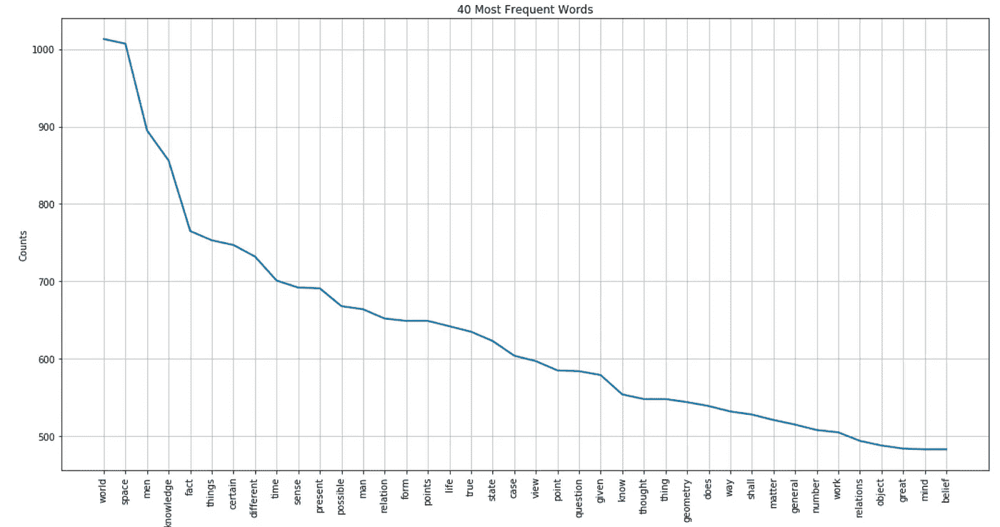
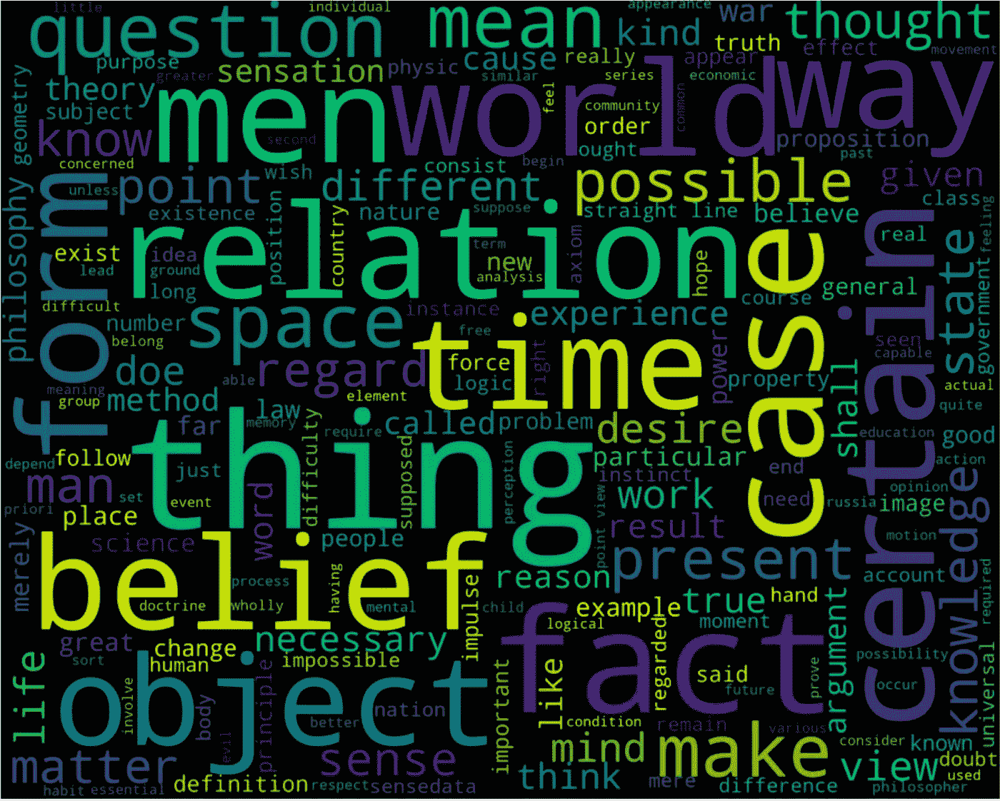
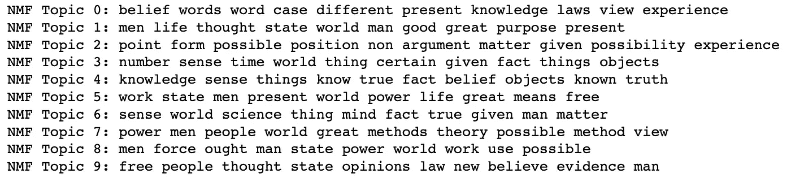
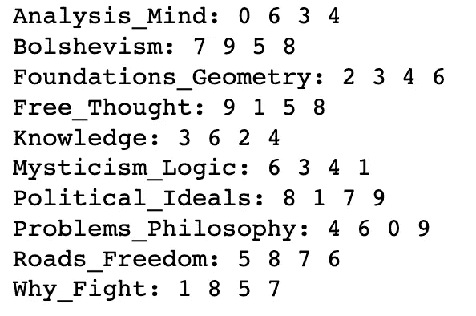
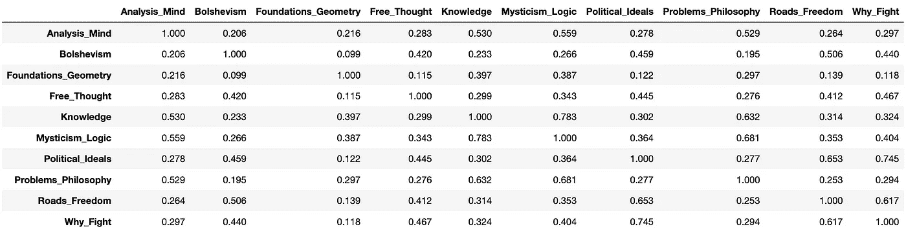

# 机器阅读伯特兰·罗素

> 原文：<https://towardsdatascience.com/machine-reads-bertrand-russell-ff4eb63bc25c?source=collection_archive---------35----------------------->


Giammarco Boscaro 在 [Unsplash](https://unsplash.com?utm_source=medium&utm_medium=referral) 上拍摄的照片

## 使用词云、主题建模和文本相似性的自然语言处理(NLP)应用

我的一个秘密目标就是多看伯特兰·罗素的作品；罗素是一个多才多艺的作家，他涉猎广泛，包括哲学、逻辑、社会问题和数学。自然地，我认为让我的电脑替我做一些阅读会有所帮助，特别是当我们仍然可以告诉电脑做什么的时候。因此，让我们从[古腾堡](https://www.gutenberg.org/)那里抓取一些文本，并教机器生成一些见解。

首先，我们需要导入要分析的文本。为此，我推荐使用 [Python 的 Gutenberg 包](https://pypi.org/project/Gutenberg/)而不是通用的文件导入包，因为它允许轻松删除 Gutenberg 在每个文档中相当长的披露。如果我们只处理一个文本，这没什么大不了的，因为删除可以手动完成，但在这种情况下，我们会带来十多个文本。要在 Google 的 Colab 上设置 Gutenberg:

整个代码被调整为在 [Colab](https://colab.research.google.com/notebooks/welcome.ipynb) 上运行，所以如果您正在您的机器上运行它，忽略您可能已经在本地拥有的包的片段。正如你可能已经知道的，Colab 设置是临时的，每次我们都需要上传默认情况下没有提供给所有用户的东西。如果在您的计算机上使用 Jupyter 笔记本，您可能希望按照以下方式调整窗口宽度(根据您自己的喜好更改百分比):

## 拉塞尔胸怀大志

预处理和词云

在本教程中，我们将使用 [NLTK](https://www.nltk.org/) 、 [Wordcloud](https://github.com/amueller/word_cloud) 和 Scikit-learn 库，它们都有自己的停用词列表(非常常见的词和其他不会给我们的分析增加太多价值的词)。为了保持一致，我们在整个教程中只使用 scikit-learn 版本，但包括一些我不认为非常有用的额外单词:

假设已经安装了 Gutenberg 包，让我们导入文本:

```
import os                       
from gutenberg.acquire import load_etext                       
from gutenberg.cleanup import strip_headers                                               path = os.getcwd() text_list = [5827, 690, 2529, 25447, 4776, 44932, 37090, 17350, 55610, 52091] #writes all texts into one file in the TextsPub directory                      os.mkdir(path + '/TextsPub')
with open(path + '/TextsPub/Russell.txt', 'w') as f:
    for text in text_list:
        text = strip_headers(load_etext(text)).strip()
        f.write(text)#writes texts into separate files in the TextsPub directory
for text in text_list:
    with open(f"{path+'/TextsPub'}/{text}", "w") as f:
        f.write(strip_headers(load_etext(text)).strip())
```

利用上一篇关于 Plutarch 的文章[中的代码，](/reimagining-plutarch-with-nlp-part-1-24e82fc6556)让我们进行[文本清理和字数统计，](https://gist.github.com/mlai-demo/4ed02f2bba7e9faf1691f05eab8510d2)我们将删除一些停用词、短词、数字、语法，对文本进行标记，并统计最常用的词:



让我们检查一下有多少单词，其中有多少是独特的:

```
unique = set(words)
print("The text is {} words long and {} unique words".format(len(words), len(unique)))
```

我们得到 216，893 个单词，其中 15，377 个是唯一的。使用这个预处理过的文本，为了使见解更有意义，让我们用[对](https://en.wikipedia.org/wiki/Lemmatisation)进行词汇化(即去除词尾变化，返回单词的基本形式)并绘制一个单词云:

```
nltk.download('wordnet') #lexical database for English
from nltk.stem import WordNetLemmatizer 

with open(path + '/TextsPub/Russell_tokens.txt') as f, open(path + '/TextsPub/Russell_lemma.txt', 'w') as out_f:    
    text = f.read()
    tokens = word_tokenize(text)
    lemma = WordNetLemmatizer()
    lemmed = [lemma.lemmatize(word) for word in tokens]
    #print(lemmed[:100])
    new_lem_text = ' '.join(lemmed)
    out_f.write(new_lem_text)unique_lem = set(lemmed)
print("The lemmatized text is {} words long and {} unique words".format(len(lemmed), len(unique_lem)))
```

我们会看到，虽然整个文本有相同的 216，893 个单词，但独特的单词减少到了 13，656 个。

让我们将[词条化的文本放入词云](https://gist.github.com/mlai-demo/4ebd22e29211162d39679edc0ef05a83):



“thing”这个词变得非常突出，大概是由于将“thing”和“things”结合在一起，所以我们不妨检查一下它的使用频率:

下面的输出表明“thing”现在是最频繁的；光看“云”这个词是看不出来的:

```
[('thing', 1301), ('point', 1234), ('relation', 1146), ('space', 1140), ('world', 1044), ('fact', 1025), ('object', 930), ('men', 895), ('time', 870), ('knowledge', 856), ('case', 844), ('belief', 805), ('state', 775), ('form', 773), ('law', 756), ('certain', 747), ('number', 744), ('question', 737), ('different', 732), ('life', 727), ('present', 718), ('sense', 692), ('view', 677), ('word', 673), ('possible', 668), ('mean', 665), ('man', 664), ('make', 663), ('way', 655), ('thought', 651), ('true', 635), ('mind', 624), ('matter', 613), ('know', 598), ('given', 579), ('geometry', 560), ('work', 549), ('desire', 542), ('doe', 539), ('kind', 535)]
```

罗素的顶级词汇是概括和抽象的:事物、点、关系、空间、世界、事实等。总的来说，顶级词汇代表了科学、哲学和政治词汇的混合，表明了文本中固有的多样性。

## 布尔什维克主义与几何学非常不同

主题建模和文本相似性

在我们继续之前，让我们将古腾堡索引中的 10 个文本复制并重命名为类似于实际名称的名称，然后只提取和排序没有路径和文件扩展名的文本标题:

```
['Analysis_Mind',
 'Bolshevism',
 'Foundations_Geometry',
 'Free_Thought',
 'Knowledge',
 'Mysticism_Logic',
 'Political_Ideals',
 'Problems_Philosophy',
 'Roads_Freedom',
 'Why_Fight']
```

有相当多的主题建模技术，如[非负矩阵分解](https://en.wikipedia.org/wiki/Non-negative_matrix_factorization)(NMF)[潜在语义分析](https://en.wikipedia.org/wiki/Latent_semantic_analysis)(截断奇异值分解)[潜在狄利克雷分配](https://en.wikipedia.org/wiki/Latent_Dirichlet_allocation)和[稀疏主成分分析](https://escholarship.org/uc/item/34g5207t) —出于篇幅的考虑，在本教程中我们将触及第一个，并在 [Github 代码](https://github.com/mlai-demo/NLP_Russell)中涵盖其他三个。

所有的方法都非常不同，所以检查和操作它们的组成部分是非常重要的，因为人们试图实现更好的结果。例如，scikit-learn 为 NMF 显示了以下内容:

```
*class* sklearn.decomposition.NMF(*n_components=None*, *init=None*, *solver='cd'*, *beta_loss='frobenius'*, *tol=0.0001*, *max_iter=200*, *random_state=None*, *alpha=0.0*, *l1_ratio=0.0*, *verbose=0*, *shuffle=False*)
```

例如对于 beta-loss(测量 NMF 和目标矩阵之间的距离)，我们有三种选择:除了默认的 [Frobenius 范数](http://mathworld.wolfram.com/FrobeniusNorm.html)，我们还可以尝试 [Kullback-Leibler 散度](https://medium.com/@samsachedina/demystified-kullback-leibler-divergence-3971f956ef34)和[板仓-斋藤距离](https://en.wikipedia.org/wiki/Itakura%E2%80%93Saito_distance)。解算器本身也可以改变，从默认的坐标下降到乘法更新解算器(板仓-斋藤需要)。

出于缩短本教程的错误原因，我们这次将跳过术语化——但是技术与上面显示的一样。让我们对文本进行矢量化，并创建一个 numpy 数组，因为上面提到的一些方法不能处理稀疏矩阵(NMF 对这两种方法都可以，但稀疏需要更长的时间来处理):

然后，让我们创建主题:

这是我们得到的结果:



让我们看看各种文本是如何处理四大主题的:

以下是输出:



(幸运的是)在布尔什维克主义和几何学的文本之间没有重叠；几何学的主题与精神分析、知识、神秘主义和逻辑的文本有很好的匹配。与此同时，处理布尔什维克主义的文件与关于政治理想、人类为何而战和自由之路的文本分享了热门话题。

最后但同样重要的是，让我们运行 [TF-IDF(术语频率-逆文档频率)](https://iq.opengenus.org/tf-idf/)来测量这十个文本之间的成对相似性:

在将包含相似性得分的矩阵转换成 Pandas 数据框架后，我们可以很容易地直观检查结果:



是的，几何和布尔什维克主义还是很不一样的！

## 结论

在这个简短的教程中，我们利用流行的 NLP 技术从文本中提取信息，包括词云、主题建模和文本相似性。我们利用了 NLTK、Wordcloud 和 Scikit——一路学习。本教程涉及的代码(以及更多)可从 Github 上获得。

## 参考资料:

*   [人文社会科学主题模型文本分析](https://liferay.de.dariah.eu/tatom/)
*   [自然语言处理在行动](https://www.manning.com/books/natural-language-processing-in-action)