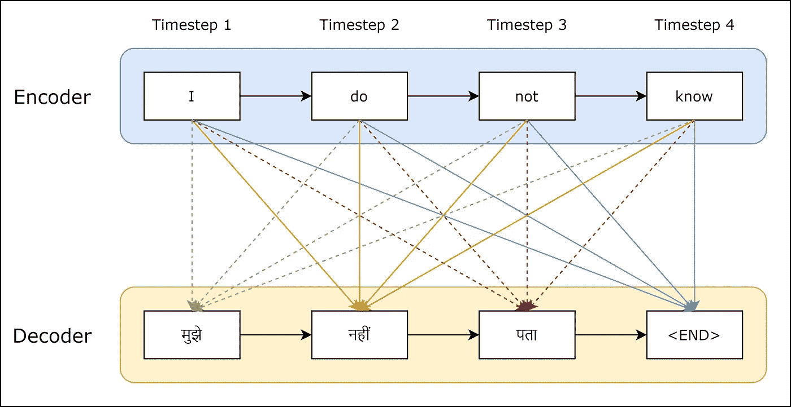

# 基于 seq2seq 模型的机器翻译:不同的方法

> 原文：<https://towardsdatascience.com/machine-translation-with-the-seq2seq-model-different-approaches-f078081aaa37?source=collection_archive---------22----------------------->

## 自然语言处理|深度学习

## 使用 seq2seq 模型讨论两种不同的机器翻译方法。


杰西卡·鲁斯切洛在 [Unsplash](https://unsplash.com?utm_source=medium&utm_medium=referral) 上的照片

机器翻译是计算语言学的一个子领域，它研究如何使用软件将文本或语音从一种语言翻译成另一种语言。机器翻译在简单的层面上用一种语言中的单词机械地替换另一种语言中的单词，但这本身很少能产生有效的翻译，因为它涉及到对整个句子及其在目标语言中最接近的对应物的理解。两种给定的语言可能具有完全不同的结构。一种语言中的单词在另一种语言中没有对应的单词。而且，许多单词有不止一个意思。用[神经](https://en.wikipedia.org/wiki/Machine_translation#Neural_MT)技术解决这个问题是一个快速发展的领域，可以带来更好的翻译，它可以处理[习语](https://en.wikipedia.org/wiki/Idiom)和[类型学](https://en.wikipedia.org/wiki/Linguistic_typology)翻译中的差异。

在本文中，我们将构建一个翻译器，可以将英语句子翻译成印地语句子。**您可以通过简单地更改我们将在这里使用的数据集，为不同的语言创建您的翻译器。**我们将使用递归神经网络主题— seq2seq，即编码器-解码器模型。在下面的文章中，seq2seq 模型用于构建一个生成性聊天机器人。

[](/generative-chatbots-using-the-seq2seq-model-d411c8738ab5) [## 使用 seq2seq 模型的生成型聊天机器人！

### 聊天机器人是一种为用户提供真实对话体验的软件。有封闭域聊天机器人…

towardsdatascience.com](/generative-chatbots-using-the-seq2seq-model-d411c8738ab5) 

机器翻译或多或少类似于上面文章中所做的。构建生成型聊天机器人和机器翻译器的主要区别在于数据集和文本预处理。也就是说，我们在这里遵循的步骤将类似于下面文章中的步骤。

这里有两种方法可以用来做机器翻译。我们将在接下来的章节中讨论它们。

# 机器翻译 seq2seq 方法简介

seq2seq 模型也称为编码器-解码器模型，使用长短期记忆 LSTM 从训练语料库中生成文本。seq2seq 模型在机器翻译应用中也很有用。seq2seq 或编码器-解码器模型用简单的话来说是做什么的？它预测用户输入中给定的单词，然后使用该单词出现的可能性来预测接下来的每个单词。在构建我们的生成式聊天机器人时，我们将使用这种方法来生成用户输入中给出的文本。



使用编码器-解码器模型的机器翻译

编码器输出最终状态向量(存储器),该向量成为解码器的初始状态。我们使用一种叫做 [*的方法，教师强迫*](/what-is-teacher-forcing-3da6217fed1c) 来训练解码器，使其能够按照前面单词中给定的目标序列来预测后面的单词。如上所示，状态通过编码器传递到解码器的每一层。“我”、“做”、“不”和“知道”被称为输入标记，而'मुझे'、'नहीं'和'पता'被称为目标标记。令牌'पता'的可能性取决于先前的字和编码器状态。我们正在添加'< END >'标记，让我们的解码器知道何时停止。你可以在这里了解更多关于 [seq2seq](https://blog.keras.io/a-ten-minute-introduction-to-sequence-to-sequence-learning-in-keras.html) 车型的信息。

让我们从头开始构建我们的翻译器吧！我们要做的第一项任务是预处理我们的数据集。

# 预处理数据集

这里使用的数据集是在 GitHub 上的一个公共存储库中的数据集[的帮助下自己创建的。您可以从本文末尾给出的项目链接中找到代码和数据集。该数据集包含 10，000 个英语句子和相应的印地语翻译。](https://github.com/tommytracey/AIND-Capstone/blob/master/data/small_vocab_en)

首先，我们必须在正则表达式的帮助下清理我们的语料库。然后，我们将需要像英语-印地语这样的配对，以便我们可以训练我们的 seq2seq 模型。我们将如下所示执行这些任务。

```
import re
import random
data_path = "/Data/English.txt"
data_path2 = "/Data/Hindi.txt"# Defining lines as a list of each line
with open(data_path, 'r', encoding='utf-8') as f:
  lines = f.read().strip().split('\n')
with open(data_path2, 'r', encoding='utf-8') as f:
  lines2 = f.read().strip().split('\n')lines = [" ".join(re.findall(r"[A-Za-z0-9]+",line)) for line in lines]
lines2 = [re.sub(r"%s|\(|\)|<|>|%|[a-z]|[A-Z]|_",'',line) for line in lines2]# Grouping lines by response pair
pairs = list(zip(lines,lines2))
random.shuffle(pairs)
```

创建对子后，我们也可以在训练前洗牌。我们的对子现在看起来像这样:

```
[('he disliked that old black automobile', 'उन्होंने उस पुराने काले ऑटोमोबाइल को नापसंद किया।'), ('they dislike peaches pears and apples', 'वे आड़ू, नाशपाती और सेब को नापसंद करते हैं।'),...]
```

这里，“他不喜欢那辆旧的黑色汽车”是输入序列，'उन्होंनेउसपुरानेकालेऑटोमोबाइलकोनापसंदकिया।'是目标序列。我们必须为输入序列和目标序列创建单独的列表，我们还需要为数据集中的唯一标记(输入标记和目标标记)创建列表。对于目标序列，我们将在序列的开头添加'<start>'，在序列的结尾添加'<end>'，以便我们的模型知道从哪里开始和结束*文本生成*。我们将这样做，如下所示。</end></start>

```
import numpy as np
input_docs = []
target_docs = []
input_tokens = set()
target_tokens = set()
for line in pairs:
  input_doc, target_doc = line[0], line[1]
  # Appending each input sentence to input_docs
  input_docs.append(input_doc)
  **# Splitting words from punctuation  
  target_doc = " ".join(re.findall(r"[\w']+|[^\s\w]", target_doc))**
  # Redefine target_doc below and append it to target_docs
  target_doc = '<START> ' + target_doc + ' <END>'
  target_docs.append(target_doc)
  # Now we split up each sentence into words and add each unique word to our vocabulary set
  for token in re.findall(r"[\w']+|[^\s\w]", input_doc):
    if token not in input_tokens:
      input_tokens.add(token)
  for token in target_doc.split():
    if token not in target_tokens:
      target_tokens.add(token)input_tokens = sorted(list(input_tokens))
target_tokens = sorted(list(target_tokens))
num_encoder_tokens = len(input_tokens)
num_decoder_tokens = len(target_tokens)
```

## 两种不同的方法

这里需要注意的一个关键点是，在创建 *target_doc* 时，我们将单词与标点符号分开。这意味着नाशपातीऔरसेबकोनापसंदकरतेहैं।''वेआड़ू的目标序列将变成नाशपातीऔरसेबकोनापसंदकरतेहैं।'.'वेआड़ू这是在我们执行字符级预测时完成的。预处理我们的目标序列的另一个选择是简单地按原样附加序列。当我们想要训练我们的模型来预测来自训练语料库的固定单词(单词级预测)时，就要这样做。要使用这种方法，请注释掉上面代码片段中的粗体语句。当我们进行字符级预测时，我们得到 200 个编码器标记和 238 个解码器标记，而在单词级预测中，我们得到 200 个编码器标记和 678 个解码器标记。我们将在后面的部分讨论这两个选项之间的性能差异，同时讨论模型的准确性和损失。现在，让我们坚持前一个(角色级别)选项。

现在，我们的数据集有了唯一的输入标记和目标标记。现在，我们将创建一个输入特征字典，将输入标记存储为键-值对，单词是键，值是索引。类似地，对于目标标记，我们将创建一个目标特性字典。特征字典将帮助我们把我们的句子编码成一个热点向量。毕竟计算机只懂数字。为了对句子进行解码，我们需要创建逆向特征字典，将索引存储为键，将单词存储为值。

```
input_features_dict = dict(
    [(token, i) for i, token in enumerate(input_tokens)])
target_features_dict = dict(
    [(token, i) for i, token in enumerate(target_tokens)])reverse_input_features_dict = dict(
    (i, token) for token, i in input_features_dict.items())
reverse_target_features_dict = dict(
    (i, token) for token, i in target_features_dict.items())
```

# 培训设置

为了训练我们的 seq2seq 模型，我们将使用三个独热向量矩阵，编码器输入数据、解码器输入数据和解码器输出数据。我们使用两个矩阵作为解码器的原因是 seq2seq 模型在训练*时使用的一种称为 [*的方法，即教师强制*](/what-is-teacher-forcing-3da6217fed1c) 。*这背后的想法是什么？我们有一个来自前一个[时间步](https://stackoverflow.com/questions/54235845/what-exactly-is-timestep-in-an-lstm-model)的输入令牌来帮助模型训练当前的目标令牌。让我们创建这些矩阵。

```
#Maximum length of sentences in input and target documents
max_encoder_seq_length = max([len(re.findall(r"[\w']+|[^\s\w]", input_doc)) for input_doc in input_docs])
max_decoder_seq_length = max([len(re.findall(r"[\w']+|[^\s\w]", target_doc)) for target_doc in target_docs])encoder_input_data = np.zeros(
(len(input_docs), max_encoder_seq_length, num_encoder_tokens), dtype='float32')
decoder_input_data = np.zeros(
(len(input_docs), max_decoder_seq_length, num_decoder_tokens),
dtype='float32')
decoder_target_data = np.zeros(
(len(input_docs), max_decoder_seq_length, num_decoder_tokens), dtype='float32')for line, (input_doc, target_doc) in enumerate(zip(input_docs, target_docs)):
  for timestep, token in enumerate(re.findall(r"[\w']+|[^\s\w]", input_doc)):
    #Assign 1\. for the current line, timestep, & word in encoder_input_data
    encoder_input_data[line, timestep, input_features_dict[token]] = 1.
  for timestep, token in enumerate(target_doc.split()):
    decoder_input_data[line, timestep, target_features_dict[token]] = 1.
    if timestep > 0:
      decoder_target_data[line, timestep - 1, target_features_dict[token]] = 1.
```

为了清楚地了解*编码器 _ 输入 _ 数据*的尺寸是如何工作的，请参见上述[文章](/generative-chatbots-using-the-seq2seq-model-d411c8738ab5)中的下图。*解码器 _ 输入 _ 数据*和*解码器 _ 目标 _ 数据*同样具有尺寸。


# 编码器-解码器模型的训练设置

我们的编码器模型需要一个输入层和一个 LSTM 层，输入层定义了一个用于保存独热向量的矩阵，而层具有一些隐藏状态。解码器模型结构与编码器几乎相同，但这里我们将状态数据与解码器输入一起传入。

```
from tensorflow import keras
from keras.layers import Input, LSTM, Dense
from keras.models import Model
#Dimensionality
dimensionality = 256
#The batch size and number of epochs
batch_size = 256
epochs = 100
#Encoder
encoder_inputs = Input(shape=(None, num_encoder_tokens))
encoder_lstm = LSTM(dimensionality, return_state=True)
encoder_outputs, state_hidden, state_cell = encoder_lstm(encoder_inputs)
encoder_states = [state_hidden, state_cell]#Decoder
decoder_inputs = Input(shape=(None, num_decoder_tokens))
decoder_lstm = LSTM(dimensionality, return_sequences=True, return_state=True)
decoder_outputs, decoder_state_hidden, decoder_state_cell = decoder_lstm(decoder_inputs, initial_state=encoder_states)
decoder_dense = Dense(num_decoder_tokens, activation='softmax')
decoder_outputs = decoder_dense(decoder_outputs)
```

您可以在这里了解更多关于如何编码编码器-解码器模型[的信息，因为对它的完整解释超出了本文的范围。](https://machinelearningmastery.com/develop-encoder-decoder-model-sequence-sequence-prediction-keras/)

# 建立和训练 seq2seq 模型

现在，我们将创建 seq2seq 模型，并使用编码器和解码器数据对其进行训练，如下所示。

```
#Model
training_model = Model([encoder_inputs, decoder_inputs], decoder_outputs)
#Compiling
training_model.compile(optimizer='adam', loss='categorical_crossentropy', metrics=['accuracy'], sample_weight_mode='temporal')
#Training
training_model.fit([encoder_input_data, decoder_input_data], decoder_target_data, batch_size = batch_size, epochs = epochs, validation_split = 0.2)
```

这里，我们使用*亚当*作为优化器，使用*分类交叉熵*作为损失函数。我们称之为*。*fit()【方法】通过给定编码器和解码器的输入数据(X/input)和解码器的目标数据(Y/label)。

## 两种不同的方法—性能比较

经过训练后，我们得到了 53.35%的训练准确率和 52.77%的验证准确率，而训练损失和验证损失分别为 0.0720 和 0.1137。看训练过程中准确率和损耗的曲线图。


我们得到的单词级预测的训练和验证准确率分别为 71.07%和 72.99%，而训练和验证损失分别为 0.0185 和 0.0624**。**看训练过程中准确率和损耗的曲线图。


在字符级预测的情况下，准确度曲线非常平滑，而在单词级预测的情况下，曲线包含许多尖峰。我们在开始时获得了非常高的精度，但损耗也很高，随着损耗的下降，精度也趋于波动和下降。这告诉我们不要依赖后一种方法，即使它的精度高于前一种方法，因为尖峰会给性能带来不确定性。

# 测试设置

现在，为了处理模型没有看到的输入，我们需要一个逐步解码的模型，而不是使用*教师强制*，因为我们创建的模型只有在目标序列已知的情况下才能工作*。*在生成型聊天机器人应用程序中，我们不知道对用户传入的输入会产生什么样的响应。为此，我们将不得不构建一个 seq2seq 模型。让我们首先用编码器输入和编码器输出状态构建一个编码器模型。我们将在之前训练好的模型的帮助下完成这项工作。

```
from keras.models import load_model
training_model = load_model('training_model.h5')encoder_inputs = training_model.input[0]
encoder_outputs, state_h_enc, state_c_enc = training_model.layers[2].output
encoder_states = [state_h_enc, state_c_enc]
encoder_model = Model(encoder_inputs, encoder_states)
```

接下来，我们将需要为解码器输入状态创建占位符，因为我们不知道我们需要解码什么或者我们将得到什么隐藏状态。

```
latent_dim = 256
decoder_state_input_hidden = Input(shape=(latent_dim,))
decoder_state_input_cell = Input(shape=(latent_dim,))
decoder_states_inputs = [decoder_state_input_hidden, decoder_state_input_cell]
```

现在，我们将借助之前培训的解码器 LSTM 和密集层来创建新的解码器状态和输出。

```
decoder_outputs, state_hidden, state_cell = decoder_lstm(decoder_inputs, initial_state=decoder_states_inputs)
decoder_states = [state_hidden, state_cell]
decoder_outputs = decoder_dense(decoder_outputs)
```

最后，我们有解码器输入层，来自编码器的最终状态，来自解码器密集层的解码器输出，以及解码器输出状态，它是网络从一个字到下一个字期间的存储器。我们现在可以将所有这些放在一起，并设置如下所示的解码器模型。

```
decoder_model = Model([decoder_inputs] + decoder_states_inputs, [decoder_outputs] + decoder_states)
```

# 测试我们的模型

最后，我们将创建一个函数，它接受我们的文本输入，并使用我们创建的编码器和解码器生成响应。在下面的函数中，我们传入表示文本句子的 NumPy 矩阵，并从中获取生成的响应。我为几乎每一行代码都添加了注释，以便您快速理解。下面的函数是这样的:1。)我们从编码器 2 中检索输出状态。)我们将输出状态传递给解码器(这是解码器的初始隐藏状态)，以逐字解码句子 3。)在解码每个字之后更新解码器的隐藏状态，以便我们可以使用先前解码的字来帮助解码新的字

一旦我们遇到我们在预处理任务中添加到目标序列的'<end>'标记，或者我们达到序列的最大长度，我们就会停止。</end>

```
def decode_response(test_input):
    #Getting the output states to pass into the decoder
    states_value = encoder_model.predict(test_input)
    #Generating empty target sequence of length 1
    target_seq = np.zeros((1, 1, num_decoder_tokens))
    #Setting the first token of target sequence with the start token
    target_seq[0, 0, target_features_dict['<START>']] = 1.

    #A variable to store our response word by word
    decoded_sentence = ''

    stop_condition = False
    while not stop_condition:
      #Predicting output tokens with probabilities and states
      output_tokens, hidden_state, cell_state = decoder_model.predict([target_seq] + states_value)
      #Choosing the one with highest probability
      sampled_token_index = np.argmax(output_tokens[0, -1, :])
      sampled_token = reverse_target_features_dict[sampled_token_index]
      decoded_sentence += " " + sampled_token#Stop if hit max length or found the stop token
      if (sampled_token == '<END>' or len(decoded_sentence) > max_decoder_seq_length):
        stop_condition = True
      #Update the target sequence
      target_seq = np.zeros((1, 1, num_decoder_tokens))
      target_seq[0, 0, sampled_token_index] = 1.
      #Update states
      states_value = [hidden_state, cell_state]
    return decoded_sentence
```

# 把它们放在一起——机器翻译

让我们创建一个包含运行翻译器所需方法的类。

```
class Translator:
  exit_commands = ("quit", "pause", "exit", "goodbye", "bye", "later", "stop")

  #Method to start the translator
  def start(self):
    user_response = input("Give in an English sentence. :) \n")
    self.translate(user_response)

  #Method to handle the conversation
  def translate(self, reply):
    while not self.make_exit(reply):
      reply = input(self.generate_response(reply)+"\n")#Method to convert user input into a matrix
  def string_to_matrix(self, user_input):
    tokens = re.findall(r"[\w']+|[^\s\w]", user_input)
    user_input_matrix = np.zeros(
      (1, max_encoder_seq_length, num_encoder_tokens),
      dtype='float32')
    for timestep, token in enumerate(tokens):
      if token in input_features_dict:
        user_input_matrix[0, timestep, input_features_dict[token]] = 1.
    return user_input_matrix

  #Method that will create a response using seq2seq model we built
  def generate_response(self, user_input):
    input_matrix = self.string_to_matrix(user_input)
    chatbot_response = decode_response(input_matrix)
    #Remove <START> and <END> tokens from chatbot_response
    chatbot_response = chatbot_response.replace("<START>",'')
    chatbot_response = chatbot_response.replace("<END>",'')
    return chatbot_response

  #Method to check for exit commands
  def make_exit(self, reply):
    for exit_command in self.exit_commands:
      if exit_command in reply:
        print("Ok, have a great day!")
        return True
    return False

translator = Translator()
```

在上面的代码中，所有方法都是不言自明的。下面是我们的翻译器的最终输出！

## 两种不同的方法—最终输出比较


**字级预测输出**


**字符级预测输出**

上面的快照显示了我们的翻译人员为两种不同的方法所做的翻译。


照片由[格雷格·布拉](https://unsplash.com/@gregbulla?utm_source=medium&utm_medium=referral)在 [Unsplash](https://unsplash.com?utm_source=medium&utm_medium=referral) 上拍摄

你可以找到上面所有的代码以及来自 [GitHub](https://github.com/jackfrost1411/machine-translation-english-to-hindi) 的数据集。你也可以在 LinkedIn 上和我联系。如果有任何疑问，您可以在这里或我的 LinkedIn 收件箱中回复。

# 结论

我们设法在字符级预测的情况下获得了大约 53%的准确率，在单词级预测的情况下获得了 73%的准确率。自然语言处理是一个需要大量数据的领域，尤其是机器翻译任务。它正在开发和训练神经网络，以模拟人脑处理语言的方式。这种深度学习策略可以让计算机更有效地处理人类语言。有像谷歌和微软这样的公司在机器翻译任务中提供人类水平的准确性。与我们在这里创建的网络相比，这些公司使用的网络要复杂得多。