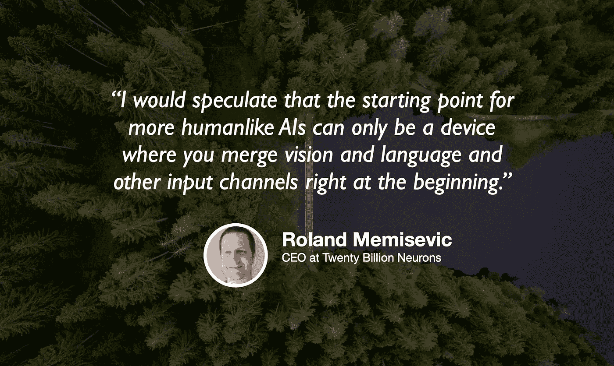

# 能看见和听见的机器

> 原文：<https://towardsdatascience.com/machines-that-can-see-and-hear-443d70852f19?source=collection_archive---------79----------------------->

## [苹果](https://podcasts.apple.com/ca/podcast/towards-data-science/id1470952338?mt=2) | [谷歌](https://www.google.com/podcasts?feed=aHR0cHM6Ly9hbmNob3IuZm0vcy8zNmI0ODQ0L3BvZGNhc3QvcnNz) | [SPOTIFY](https://open.spotify.com/show/63diy2DtpHzQfeNVxAPZgU) | [其他](https://anchor.fm/towardsdatascience)

## Roland Memisevic 在 [TDS 播客](https://towardsdatascience.com/podcast/home)上

*编者按:迈向数据科学播客的“攀登数据科学阶梯”系列由 Jeremie Harris 主持。Jeremie 帮助运营一家名为*[*sharpes minds*](http://sharpestminds.com)*的数据科学导师初创公司。可以听下面的播客:*

机器学习最近最有趣的趋势之一是将不同类型的数据结合起来，以便能够解锁深度学习的新用例。如果 2010 年是计算机视觉和语音识别的十年，那么 2020 年很可能是我们最终发现如何制造能够看到和听到周围世界的机器的十年，使它们更加具有上下文意识，甚至可能更像人类。

整合不同数据源的努力已经引起了学术界和企业的广泛关注。其中一家公司是 200 亿神经元公司，它的创始人 Roland Memisevic 是我们最新一集《走向数据科学》播客的嘉宾。罗兰是一名前学者，早在 2012 年 AlexNet 引发大肆宣传之前，他就已经深入深度学习了。他的公司一直在研究深度学习驱动的开发工具，以及结合视频和音频数据的自动化健身教练，以使用户在整个锻炼过程中保持参与。

以下是今天节目中我最喜欢的一些带回家的东西:

*   在 2012 年之前开始走深度学习道路的学者经常被嘲笑。2000 年代的世界由表格数据主导，决策树和支持向量机等简单模型非常适合这些数据，因此大多数人错误地从中归纳出经典的统计机器学习工具比神经网络更有前途。尽管遇到了所有这些阻力，但让深度学习爱好者继续前进的是一种信念，即深度学习应该有潜力处理人类一直在消耗的一种信息，但机器很少遇到，特别是在当时:视频和音频数据。
*   对于正在开发面向消费者的机器学习新应用的公司来说，移动设备带来的计算限制是一个重要的考虑因素。当 200 亿神经元启动时，移动设备无法处理他们需要的设备上的机器学习能力，如果他们要运行他们的自动化健身教练软件，那么他们面临着一个选择:找到一种压缩他们的模型的方法，以便他们可以在设备上运行，或者等待硬件赶上他们的软件。最终，200 亿美元选择了选项 2，这带来了回报:2018 年，苹果手机开始携带一种芯片，可以解锁他们所需的设备上处理。
*   如果你对试验包含多种数据类型的数据集感兴趣，Roland 推荐查看“某物某物”数据集，可从[这里](https://20bn.com/datasets/something-something)公开获得。

你可以在这里的 Twitter 上关注[的 200 亿神经元](https://twitter.com/twentybn)或者在 LinkedIn 上关注[这里](https://www.linkedin.com/company/twenty-billion-neurons-gmbh/?viewAsMember=true)你也可以在 Twitter 上关注我[这里](https://twitter.com/jeremiecharris)。

如果你对他们即将推出的健身应用感到好奇，你也可以在 Instagram 上点击关注他们。

**订阅《走向数据科学》的** [**月刊**](https://medium.com/towards-data-science/newsletters/monthly-edition) 直接在你的邮箱✨里接收我们最好的文章、视频和播客