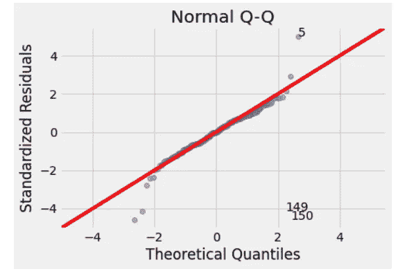
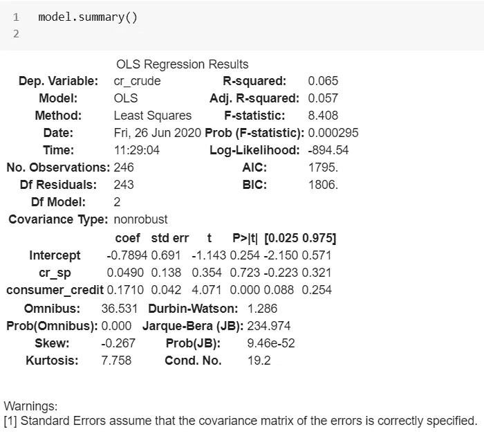

# 宏观经济和金融因素与普通最小二乘回归

> 原文：<https://towardsdatascience.com/macroeconomic-financial-factors-and-ordinary-least-square-regression-4831302e7b69?source=collection_archive---------32----------------------->

## 基于普通最小二乘回归的多因素模型

## 利用套利定价理论的计量经济学模型


图片由 Sarit Maitra 提供

一个目标定价理论被表示为一个带有跨方程限制的多元回归模型。它是一种多因素资产定价模型，认为资产的收益可以通过资产的预期收益与捕捉系统风险的宏观经济变量之间的线性关系来预测。

我们这里的数据是布伦特原油指数，S&P500 指数，美国国债利率 3 个月和 10 年(短期和长期)，美国国债利率(信用风险)，消费者价格指数，工业生产指数的月度股票价格。

> 我们想在这里检验一下，布伦特原油价格是否可以用一组宏观经济和金融变量的意外变化来解释。处理股票价格的最佳实践是使用调整值，因为它们考虑了可能的公司行为，如股票分割。

```
combine = pd.concat([h['SP500'], g, f['DGS10'], e['DTB3'], d['TEDRATE'], b['TOTALSL'],a['CPALTT01USM657N'], i['Brent spot price']], axis=1)
combine.set_index('DATE', inplace=True)
combine.index = pd.to_datetime(combine.index)
combine.dropna(inplace=True)
```


让我们为每个变量生成一组变化或差异。变量的意外值可以定义为变量的实际值与其期望值之间的差值。

> 陶和布鲁克斯发表了一篇很好的关于套利定价分析的文章，我在文章的最后添加了参考文献。

## 日志返回

我们将在这里使用对数回报，因为它们随着时间的推移而聚集；给定月份的日志回报是该月内各天的日志回报之和。


这里，rt 是收益，Pt 是资产在时间 t 的价格。

```
data = DataFrame({'ted_spread' : combine['TEDRATE'] - combine['TEDRATE'].shift(1), 'consumer_credit' : combine['TOTALSL'] - combine['TOTALSL'].shift(1),'indprod' : combine['INDPRO'] - combine['INDPRO'].shift(1),'cr_crude' : np.log(combine['Brent spot price'].diff().dropna()),# (cr_crude) continuously compounded returns for crude oil
'cr_sp' : np.log(combine['SP500']).diff().dropna()# (cr_sp) continuously compounded returns for S&P500
'inflation' : np.log(combine['CPALTT01USM657N']).diff().dropna(),# (inflation) continuously compounded returns for consumer price index
'dgs_dtb' : combine['DGS10'] - combine['DTB3'],
'inflation_diff' : np.log(combine['CPALTT01USM657N']).diff().dropna() - np.log(combine['CPALTT01USM657N']).diff().dropna().shift(1),
'dtb' : combine['DTB3']/12,
'dgs_dtb_shift' : (combine['DGS10'] - combine['DTB3']) - (combine['DGS10'] - combine['DTB3']).shift(1),
'crude_dtb' : np.log(combine['Brent spot price']).diff().dropna() - combine['DTB3']/12,# (crude_dtb3) to transform the returns, (Crude continuously compounded returns) - (3-month US Treasury bill rate)
# = risk free rate
'sp_dtb' : np.log(combine['SP500']).diff().dropna() - combine['DTB3']/12})# (sp_dtb3) (SP continuously compounded returns) - (3-month US Treasury bill rate)
```


## 普通最小二乘(OLS)回归

OLS 回归通常作为最大似然算法的一个很好的原型。这是一种受监督的算法，有一个训练过程和一个部署过程。在某些情况下，它可能会过度适合。它与其他更现代的函数逼近算法共享这些特性。然而，OLS 的局限性在于，当训练过度时，没有办法停止训练。

我们将使用普通最小二乘(OLS)回归来估计自变量和因变量(此处为原油)之间的关系，方法是最小化配置为直线的因变量的观察值和预测值之间的差值的平方和。

```
data = data[~data.isin([np.nan, np.inf, -np.inf]).any(1)]
X = data [['cr_sp', 'indprod', 'consumer_credit', 'inflation_diff', 'ted_spread', 'dgs_dtb_shift']]
y = data['cr_crude']
model = sm.OLS(y, sm.add_constant(X))
model_fit = model.fit()
model_fit.summary()
```


回归 F 统计值为 10.71。p 值< 0.05 for indprod & dgs_dtb_shift means, null hypothesis can be rejected for these variables. p-values for rest of the variables are > 0.05。让我们使用 f 检验来检验这四个变量的参数共同为零的零假设。


f 检验统计值为 2.764；p 值 0.028，有四个限制和 239 个可用观测值。这表明不能拒绝零假设。

# 诊断图

使用模型的残差绘制诊断图。让我们将这些图可视化，看看我们的回归模型如何拟合数据，以及是否违反了 OLS 模型的任何基本假设。诊断图以四种不同的方式显示残差。

```
# model values
y_fitted = model_fit.fittedvalues# model residuals
model_residuals = model_fit.resid# normalized residuals
model_norm_residuals = model_fit.get_influence().resid_studentized_internal# absolute squared normalized residuals
model_norm_residuals_abs_sqrt =np.sqrt(np.abs(model_norm_residuals))# absolute residuals
model_abs_resid = np.abs(model_residuals)# leverage, from statsmodels internals
model_leverage = model_fit.get_influence().hat_matrix_diag# cook's distance, from statsmodels internals
model_cooks = model_fit.get_influence().cooks_distance[0]
```

# 残差与拟合

```
dataframe = pd.concat([X, y], axis=1)
plot_lm_1 = plt.figure()
plot_lm_1.axes[0] = sns.residplot(y_fitted, dataframe.columns[-1], data=dataframe, lowess=True, scatter_kws={'alpha': 0.5}, line_kws={'color': 'red', 'lw': 1, 'alpha': 0.8})
plot_lm_1.axes[0].set_title('Residuals vs Fitted')
plot_lm_1.axes[0].set_xlabel('Fitted values')
plot_lm_1.axes[0].set_ylabel('Residuals');
```


虽然我们从上面的图中看不到任何独特的模式，但似乎模型的一些非线性特征没有被很好地捕捉，这意味着我们对模型拟合不足。但是，我们将检查 QQ 图以确定常态假设。

# 正常 Q-Q 图

此图显示残差是否呈正态分布。一个好的正常 QQ 图的所有残差都位于红线上或接近红线。

```
QQ = ProbPlot(model_norm_residuals)
plot_lm_2 = QQ.qqplot(line='45', alpha=0.5, color='#4C72B0', lw=1)
plot_lm_2.axes[0].set_title('Normal Q-Q')
plot_lm_2.axes[0].set_xlabel('Theoretical Quantiles')
plot_lm_2.axes[0].set_ylabel('Standardized Residuals');# annotations
abs_norm_resid = np.flip(np.argsort(np.abs(model_norm_residuals)), 0)
abs_norm_resid_top_3 = abs_norm_resid[:3]
for r, i in enumerate(abs_norm_resid_top_3):
plot_lm_2.axes[0].annotate(i,
xy=(np.flip(QQ.theoretical_quantiles, 0)[r],
model_norm_residuals[i]));
```



这里，大部分数据点落在红线上；当然，它们不会是一条完美的直线，看起来正态假设得到了满足。

让我们看看直方图，检查一个正态分布；这里我们期望残差的直方图是钟形的(没有异常值)。


直方图证实残差的分布大致类似于钟形；虽然，我们也发现有一些大的负异常值可能会导致相当大的负偏度。


SkewnKurtosis 测量任一尾部的极值。标准正态分布的峰度是 3。峰度值为 6.11 意味着残差超过正态分布的尾部。然而，一般来说，这些推论可能是错误的；我们的样本可能足够大，所以我们不需要像小样本那样担心。

# 比例位置

此图显示残差是否沿预测值范围平均分布。我们可以检验等方差的假设，即同方差。

```
plot_lm_3 = plt.figure()
plt.scatter(model_fitted_y, model_norm_residuals_abs_sqrt, alpha=0.5);
sns.regplot(model_fitted_y, model_norm_residuals_abs_sqrt, scatter=False, ci=False,lowess=True, line_kws={'color': 'red', 'lw': 1, 'alpha': 0.8});
plot_lm_3.axes[0].set_title('Scale-Location')
plot_lm_3.axes[0].set_xlabel('Fitted values')
plot_lm_3.axes[0].set_ylabel('$\sqrt{|Standardized Residuals|}$');# annotations
abs_sq_norm_resid = np.flip(np.argsort(model_norm_residuals_abs_sqrt), 0)
abs_sq_norm_resid_top_3 = abs_sq_norm_resid[:3]
for i in abs_norm_resid_top_3:
plot_lm_3.axes[0].annotate(i,xy=(model_fitted_y[i],model_norm_residuals_abs_sqrt[i]));
```


残差出现随机分布，这是同质性的指示。这里，误差项在自变量的所有值上都是相同的。这种同方差假设是线性回归模型的核心。

## 残差图

```
plt.figure(figsize = (20,5))
plt.plot(model_fit.resid)
plt.xlabel('Date')
plt.ylabel('Residuals')
plt.grid(True)
```


通过检查残差随时间变化的模式，我们还可以确认残差的同方差性质。

## **布鲁赫-异教徒测试**


从检验统计数据和 p 值来看，两个检验都得出结论:对于我们的模型，残差具有同方差性质，p 值分别为 0.0001 和 8.21。

# 残差与杠杆

该图有助于我们发现异常值(如果有的话)。即使数据有极值，它们也可能对确定回归线没有影响。这意味着，如果我们在分析中包括或排除它们，结果不会有太大的不同。我们检查右上角或右下角的异常值。这些点是案例对回归线有影响的地方。

```
plot_lm_4 = plt.figure();
plt.scatter(model_leverage, model_norm_residuals, alpha=0.5);
sns.regplot(model_leverage, model_norm_residuals,scatter=False, ci=False,lowess=True, line_kws={'color': 'red', 'lw': 1, 'alpha': 0.8});
plot_lm_4.axes[0].set_xlim(0, max(model_leverage)+0.01)
plot_lm_4.axes[0].set_ylim(-3, 5)
plot_lm_4.axes[0].set_title('Residuals vs Leverage')
plot_lm_4.axes[0].set_xlabel('Leverage')
plot_lm_4.axes[0].set_ylabel('Standardized Residuals');# annotations
leverage_top_3 = np.flip(np.argsort(model_cooks), 0)[:3]
for i in leverage_top_3:
plot_lm_4.axes[0].annotate(i,xy=(model_leverage[i], model_norm_residuals[i]));
```


我们只需要找到距离大于 0.5 的杠杆作用点。在这个情节中，所有的情况都在厨师的能力范围之内。该图将有影响的观察结果标识为#245。如果我们从分析中排除第 245 种情况，斜率和 R2 值可能会大大提高。

# 控制过拟合的正向逐步回归

通过一步一步，我们将迭代地构建回归模型，其中涉及自变量的自动选择。Python 的 statsmodels 没有通过正向选择选择线性模型的内置方法。我从 [*这里*](https://planspace.org/20150423-forward_selection_with_statsmodels/) 取了这段代码。我已经用 p 值阈值< 0.20 过滤了。

```
formula = 'cr_crude ~ cr_sp + indprod + consumer_credit + inflation_diff + ted_spread + dgs_dtb_shift'
results = smf.ols(formula, data).fit()def forward_selected(data, endog, exg):
remaining = set(data.columns)
remaining = [e for e in remaining if (e not in endog)&(e not in exg)]
exg = [exg]
scores_with_candidates = []
for candidate in remaining:
formula = '{} ~ {}'.format(endog,' + '.join(exg + [candidate]))
score = model_fit.pvalues[2]
scores_with_candidates.append((score, candidate))
scores_with_candidates.sort()
for pval,candidate in scores_with_candidates:
if pval < 0.2:
exg.append(candidate)
formula = '{} ~ {}'.format(endog, ' + '.join(exg))
model = smf.ols(formula, data).fit()
return modelmodel = forward_selected(data,'cr_crude','cr_sp')
print(model.model.formula)cr_crude ~ cr_sp + consumer_credit
```

可以看出，回归公式 crude ~ cr_sp + consumer_credit，表明 S&P500 和 CPI 是原油价格的唯一决定因素。



> 测试该模型中错误的最佳方法是不依赖模型的*F*-统计量、显著性或 R2，而是根据测试集评估模型。精确度通常以实际标准误差、MAPE(平均绝对百分比误差)或预测值与测试数据中的实际值之间的平均误差来衡量。

## 残差与拟合值


从图中，我们可以感觉到一些异常值的存在；尤其是在 2008 年相当明显。如果我们看看所有变量的 IQR 盒图，我们会有一个更好的想法。


在这里，我们可以清楚地看到一些异常值。让我们确定异常值的确切日期。


我们可以看到，两个最大的异常值出现在 2008 年 10 月和 11 月。让我们用异常值创建 5 个额外的变量，并将这些变量添加到现有的数据框中，再次运行回归。

```
data['nov_2008'] = np.where(data.index == '2008-11-01', 1, 0)
data['oct_2008'] = np.where(data.index == '2008-10-01', 1, 0)
data['dec_2014'] = np.where(data.index == '2014-12-01', 1, 0)
data['jan_2015'] = np.where(data.index == '2015-01-01', 1, 0)
data['apr_2000'] = np.where(data.index == '2000-04-01', 1, 0)formula = 'cr_crude ~ cr_sp + indprod + consumer_credit + inflation_diff + ted_spread + dgs_dtb_shift +nov_2008 + oct_2008 + dec_2014 + jan_2015 + apr_2000'
model = smf.ols(formula, data).fit()
model.summary()
```


这里，我们看到，所有增加的变量都是高度显著的 p 值< 0.05)。如果我们比较结果，我们可以看到，在这种情况下，其余变量的系数估计保持不变。重要参数保持与 indpro、dgs_dtb_shift 参数相同；可调 R2 值从 19.2%提高到 34.6%。

# 多重共线性

```
col = data[['indprod', 'consumer_credit', 'inflation_diff', 'ted_spread', 'dgs_dtb_shift']]plt.figure(figsize = (10,6))
pearsoncorr = col.corr(method='pearson')
sns.heatmap(pearsoncorr, xticklabels=pearsoncorr.columns,
yticklabels=pearsoncorr.columns,
cmap='RdBu_r',annot=True,linewidth=0.5)
```


这里，观察到的最大相关性是 consumer_credit 和 inddprod 变量之间的 0.37，以及 inddprod 和 inflation_diff 之间的-0.017。两者的实际价值都很小，可以忽略不计。

# 结论

我们使用了不同的宏观经济因素和金融变量来估计布伦特原油的月度回报是否可以考虑这些变量的意外变化。回归结果表明，原油收益率与我们选择的自变量之间存在相当小的差异。我们的统计分析表明，在我们选择用于分析布伦特原油价格月度回报的变量中，只有短期和长期美国国债收益率指数和工业生产指数的变化是显著的。然而，回归结果表明，股票收益率与所检验的宏观经济和金融变量之间不存在显著的定价关系。

**接我这里**[](https://www.linkedin.com/in/saritmaitra/)***。***

**参考:**

1.  **高斯，卡尔·弗里德里希。[1809] 2004.天体以圆锥曲线绕太阳运动的理论。纽约州米尼奥拉:多佛。**
2.  **陶，r .&布鲁克斯，C. (2019)。金融计量经济学导论 Python 指南。可向 SSRN 3475303 查询。**