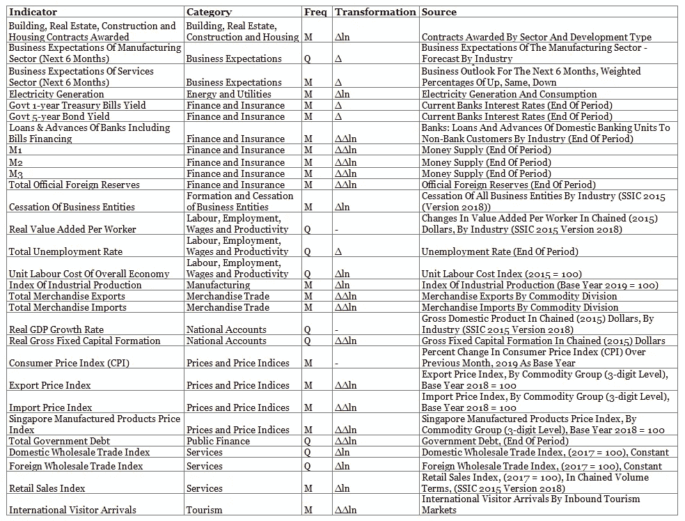
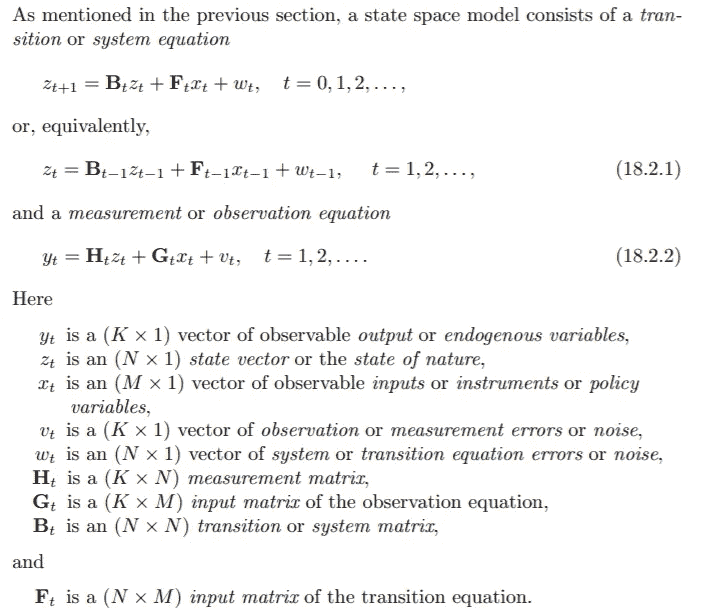
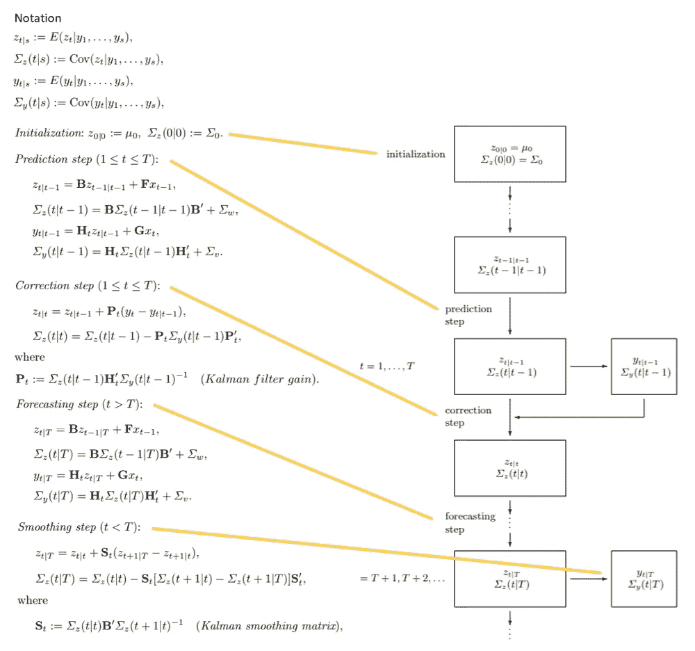
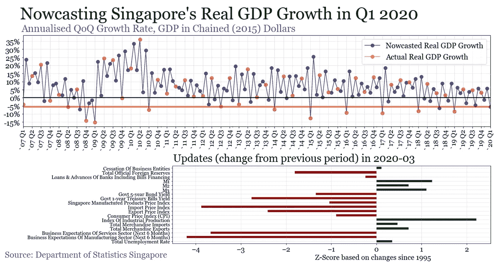

# 基于卡尔曼滤波的宏观经济临近预报

> 原文：<https://towardsdatascience.com/macroeconomic-nowcasting-with-kalman-filtering-557926dbc737?source=collection_archive---------28----------------------->

## 未来就在眼前

# 临近预测新加坡的实际 GDP 增长率

根据 MTI 的预先估计，2020 年 Q1 经济预计将收缩 10.6%(季度环比，经季节调整后的年化增长率&)。他们的方法主要涉及计算 2020 年 1 月和 2 月的数据，以作为该季度 GDP 增长的早期指标。当获得更全面的数据时，还会对其进行修订。GDP 是一个滞后指标，因为它是在季度后一个月[才正式发布的](https://www.singstat.gov.sg/whats-new/advance-release-calendar)，这使得它现在很难用于评估经济。新加坡政府机构定期发布宏观经济数据，研究分析师一直在试图解读这些数据，以评估当前的经济状况。他们试图从噪音中分离出有意义的信号，识别数据中的共同模式，检测商业周期的波动，形成对市场走向的预期，并在新的经济数据出人意料地出现时进行调整。

## 宏观经济临近预报

我受到了纽约联邦储备银行工作人员 now cast 的启发，模拟了分析师在本地背景下对实际 GDP 增长进行估计的行为。临近预报依赖于系统理论中的状态空间表示，以一种依赖于其过去值和其他变量演变的方式来表示变量随时间的演变。它是处理混合频率(每月/每季度/每年)和非同步数据发布的自然表示。然后使用卡尔曼滤波和平滑算法进行临近预报。它提取时间序列数据中的共同运动作为潜在因素，使用它来估计观察数据的过去和现在的值，在新数据到来时进行校正，并立即预测变量的当前状态和值。

## 数据

我参考纽约联邦储备银行的文件，从新加坡统计局选择了主要的宏观经济指标。通过取对数的差/差/对数的二阶差来转换指标，使其稳定(*，其中时间序列的统计特性不随时间变化*)，以产生更可靠的结果。

数据从 1995 年 3 月开始，到 2020 年 3 月结束(现有最新数据)。

## 状态空间模型

python 的“stats models . TSA . statespace . dynamic _ factor”模块根据[多时间序列分析新介绍](https://www.springer.com/gp/book/9783540401728)的第 18 节实现了表示和算法。

摘自[多时间序列分析新入门](https://www.springer.com/gp/book/9783540401728)

总的想法是，观察到的 y(经济因素)取决于未观察到的状态 z(潜在因素)，其中 v 和 w 是假设为噪声的误差。h 是当前状态和当前观察变量之间的无噪声连接。b 是当前状态和过去状态之间的无声联系。G / F 表示外生变量 x 与观察到的/状态的联系。然而，我们假设上表中没有外生变量，并且它们的值的变化相互依赖。

## 卡尔曼滤波和平滑

下面描述了在正态条件下，根据观察和潜在因素的条件期望和方差的观察和转移方程的形式。然后使用期望最大化(EM)算法获得所有参数的最大似然估计(MLE)。

摘自[多时间序列分析新入门](https://www.springer.com/gp/book/9783540401728)

每一步背后的直觉如下:

1.  **预测:**根据潜在因子的过去值估计潜在因子的当前值，根据潜在因子的当前值估计被观测的当前值。
2.  **校正:**根据估计观测值和实际观测值的误差，更新潜在因子的当前值。误差的影响取决于卡尔曼增益，卡尔曼增益是测量的相对可变性与状态的可变性。如果测量值的可变性相对较大，则估计值的可信度较低，误差的影响也较弱。
3.  **预测:**也是临近预测步骤，它根据当前潜在因子估计当前观测值(给出到目前为止的所有估计值)。
4.  **平滑:**根据在每个后续步骤中对潜在因素的最终估计程度，使用回顾的全部数据来更新潜在因素的过去估计值。

# 结果

*橙色圆点代表实际 GDP 增长，用于平滑步骤，以获得对潜在因素的更好估计。指标的变化用上表中的转换来表示。*

根据我的模型，2020 年新加坡在 Q1 的实际 GDP 增长现在预测为 **-5.55%** (季度环比，年化&未经季节调整)，而新加坡经济产业省的 **-10.6%** (季度环比，年化&经季节调整)，以及[彭博调查的经济学家预测中值 **-8.2%** 。2020 年 3 月的更新反映了外汇储备、国债收益率、价格水平和商业预期的大幅下降。由于最近工业生产和贸易的增长，这些更新可能呈现出稍微乐观的情景。即使这些指标可能也不能充分“实时”地反映当前市场。该模型仅限于我们输入的经济数据，最多只能估计推动我们经济的潜在力量。这个模型提出了一个系统化的方法，这个方法不受人为偏见的影响，并且有可能提供一个更加一致的替代方案来评估我们的经济。](https://www.bloomberg.com/news/articles/2020-03-26/singapore-sees-sharp-2020-contraction-as-quarterly-gdp-plunges)