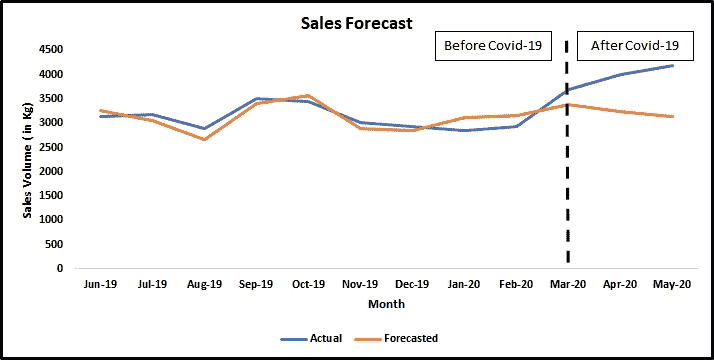
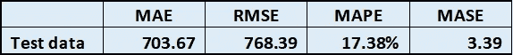
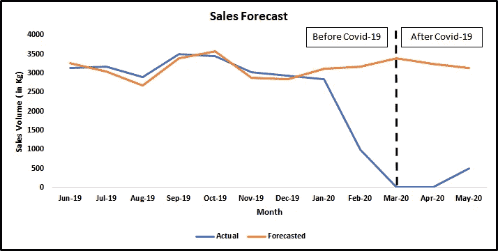
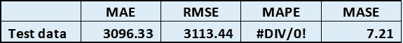
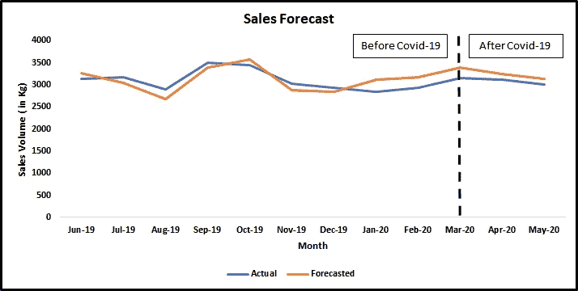
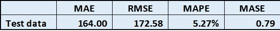

# 为 MAPE 疯狂？

> 原文：<https://towardsdatascience.com/mad-over-mape-a86a8d831447?source=collection_archive---------7----------------------->

## 或者使用哪些预测准确性指标？

来源:https://www.arymalabs.com/

在新冠肺炎疫情期间，世界各地的许多 CPG 品牌将专注于记录他们的销售和需求数字。在我的上一篇文章中，我谈到了在这些测试时期做[营销组合建模的要点。](https://medium.com/aryma-labs/market-mix-modeling-mmm-in-times-of-covid-19-4703dd501034)

这些品牌可能已经预测了 2020 年前 3-4 个月的销售或需求。但他们的预测可能遗漏了新冠肺炎的影响。

随着[销量的增长](https://retail.economictimes.indiatimes.com/news/food-entertainment/personal-care-pet-supplies-liquor/coronavirus-stockpiling-drives-best-nestle-sales-growth-in-years/75348917)被许多品牌报道，预测的销量将会大大偏离目标，并且预测的销量将会与实际情况有巨大的差异。

这种情况要求检验模型的预测准确性。

在本文中，我将讨论不同的预测准确性指标，以及如何评估这些预测准确性指标中哪一个是理想的选择。

**让我们从这些指标的简要概述开始:**

1.  **MAD/MAE:** 通过从预测销售额中减去实际销售额来计算。然后将误差项转换为绝对误差，并计算整个时间序列的绝对误差平均值。

这种预测测量取决于尺度，误差项也具有与数据相同的单位。例如，如果销售量以千克为单位，那么误差项也将以千克为单位。

这种方法不能用于在具有不同单位的时间序列之间进行比较，例如销售量(千克)误差不能与销售额(美元)进行比较。

这种精度测量的缺点是它平均了整个系列的误差，不能给出非常精确的结果。

当销售额为 2000 时，500 个单位的误差可能看起来很大，但是如果实际销售额为 20，000，同样的误差可能很小。

**2。RMSE:** 均方根误差是平均平方误差的平方根。

像 MAE 一样，这种方法依赖于尺度，不能用来比较不同尺度上的序列。并且误差项也具有与数据相同的单位。

**3。MAPE:** 平均绝对百分比误差是检验预测准确性最广泛使用的方法。它属于与尺度无关的百分比误差，可用于比较不同尺度上的序列。

其中，eᵢ是误差项，yᵢ是时间 I 的实际数据

MAPE 的缺点是，对于数据中的任何观察值，如果实际数值为 0，它就变得不确定。

**4。MASE:** 平均绝对标度误差是无标度误差。

基本上，MASE 只不过是测试数据的 MAE 除以在训练集上使用一步简单预测方法的 MAE 的比值。

在哪里，

这里，Q 是根据训练数据计算的简单预测。MAE 是根据测试数据计算的，而 Q 是根据训练数据计算的。

如果 MASE 小于 1，这意味着在训练数据上预测优于一步朴素方法。如果它大于 1，则意味着该预测方法比在训练数据上使用一步简单预测方法的预测差。

为了更好地理解这一点，下面是正确解释该公式的几个链接:

 [## 平均绝对标度误差(MASE)的解释

### 在链接的博客文章中，Rob Hyndman 呼吁参加旅游预测竞赛。本质上…

stats.stackexchange.com](https://stats.stackexchange.com/questions/124365/interpretation-of-mean-absolute-scaled-error-mase) 

https://robjhyndman.com/papers/foresight.pdf

现在我们已经介绍了误差指标，让我们来看看这些预测指标在哪些方面做得更好或更差。

**场景 1:预测与实际相差很大**

新冠肺炎之前被视为训练数据，新冠肺炎之后(3 月 20 日至 2020 年 5 月)被视为测试数据。

在这种情况下，MAPE 可以作为一个很好的准确性措施，因为它是独立的规模，可用于比较不同的序列或预测场景。

**场景 2:实际值骤降为零**

下图没有让你想起最近的新闻吗？….如果你猜是“原油”,那你就猜对了！！

在这种情况下，不幸的是，实际价格暴跌至零(非常意外的情况)。这种情况对于原油等行业来说是真实的，西德克萨斯中质油(WTI)价格基准暴跌至负，对于汽车行业来说也是如此，最近几个月的销售额为零。

对于这种情况，MAPE 不是一个好的衡量标准，因为它变得不确定**。**

MAE 或 RMSE 可以用来比较这里的预测准确性。MASE 似乎也不是一个好的 KPI，因为它大于 1。当 MASE 大于 1 时，意味着用于预测的方法比所用的原始方法更差。

**场景 3:理想场景(回到正常场景)**

在这种情况下，没有新冠肺炎的干涉(哦，我们多么希望那些正常的日子)。模特们表现正常。在这种情况下，可以使用任何措施。

**参考文献:**

1.  [https://robjhyndman.com/papers/forecast-accuracy.pdf](https://robjhyndman.com/papers/forecast-accuracy.pdf)
2.  https://robjhyndman.com/papers/foresight.pdf
3.  [https://qz . com/1841668/油价首次为负/](https://qz.com/1841668/oil-prices-are-negative-for-first-time-ever/)

你可以和我联系:

LinkedIn: [Ridhima Kumar](https://www.linkedin.com/in/ridhima-kumar7/)

推特: [@kumar_ridhima](https://twitter.com/kumar_ridhima)