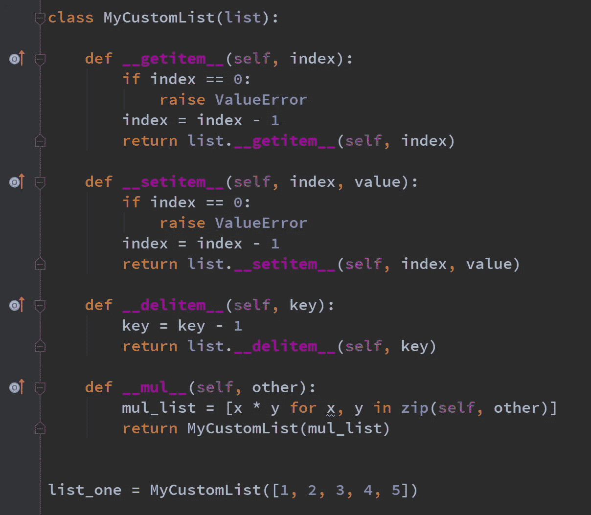
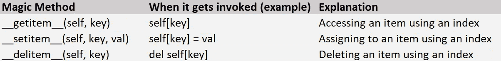
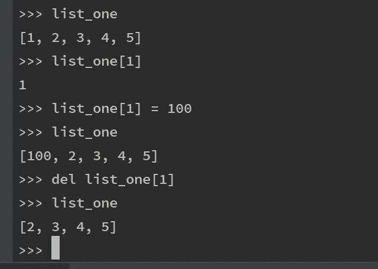
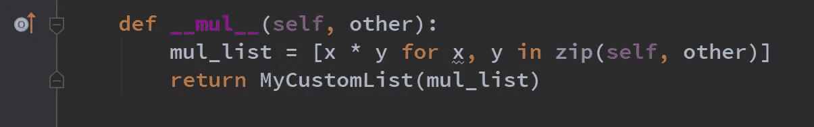
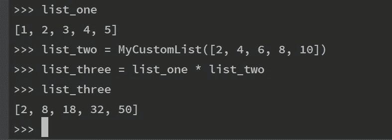
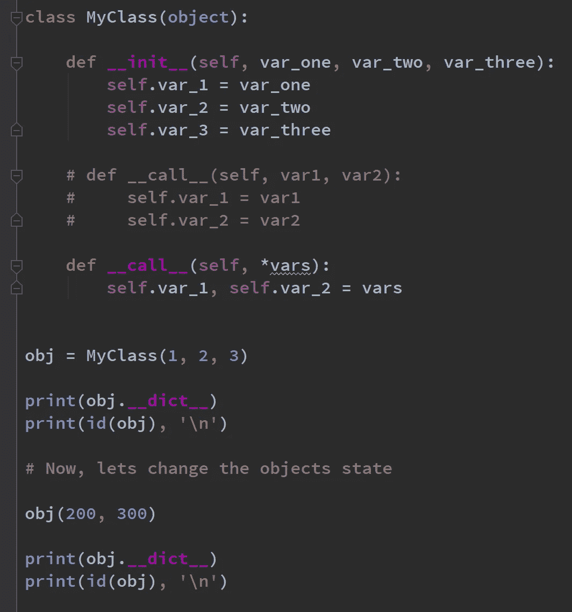
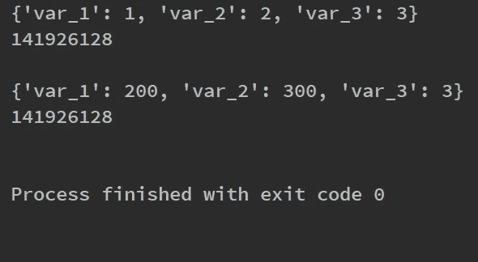

# 举例说明 Python 中的神奇方法

> 原文：<https://towardsdatascience.com/magic-methods-in-python-by-example-16b6826cae5c?source=collection_archive---------4----------------------->

# 在我们的类设计中使用魔法方法

图片由[克里斯蒂安·埃斯科瓦尔](https://unsplash.com/@cristian1)通过 Unsplash 提供

## 使用魔法改变内置行为

魔术方法是特殊的方法，你可以定义它来给你的类添加“魔术”。它们总是被双下划线包围，例如 __init__ 和 __str__ magic 方法。神奇的方法可以通过让我们访问 Python 的内置语法特性来丰富我们的类设计。

Python 让我们的类从内置类继承。内置的继承子类共享所有相同的属性，包括内置的方法。我们可以利用核心的内置功能，但是通过使用*魔法方法*来定制选择的操作。

在本教程中，我将把这两个想法结合在一起，展示我们如何从内置列表类*和*中继承，并在我们的类设计中使用神奇的方法。我将修改控制列表索引的三个神奇方法。通过结合这些特性，我们可以构建一个简单易用的类，并且我们可以给我们想要的方法添加行为。所有 Python 开发人员都熟悉内置行为；反过来，这使得我们的继承类易于学习。

最后，将演示两个更广泛的例子，说明如何在广播操作中使用魔法方法以及如何改变实例的状态。所有附带的代码都可以通过 [GitHub](https://gist.github.com/StephenFordham) 获得。

## 示例 1:列表索引

可以操纵神奇的方法来修改列表索引。MyCustomList 类继承自内置列表类型。这意味着通过 MyCustomList 类创建的任何对象都将像列表一样工作，除非我们选择有选择地自定义方法。

getitem、setitem 和 delitem 是在我们访问列表索引时调用的神奇方法。这些神奇方法的行为是可以修改的。

在下面的例子中，我们放弃了从第 0 个索引开始的列表索引的想法。如果用户试图使用第零个索引访问列表中的元素，将会引发 ValueError 异常，程序将会终止。如果用户输入一个大于一的列表索引，这些方法会将索引减一，然后用这个索引调用父类列表。

要展示如何使用 MyCustomList 类中定义的这些方法，请参见 Python 交互式提示中的以下内容。

该示例显示了如何调用 getitem、setitem 和 delitem。魔术方法可以被隐式调用。对于 __getitem__，要访问第一个索引，只需在方括号中写下对象的名称，后跟索引位置。

最有趣的是，当我们请求索引位置 1 的元素时，返回的是整数值 1，尽管 1 是第*个第 0 个*元素。我们这里有一个列表，它从 1 开始索引。事实上，它弥补了我们第一次学习列表索引时的困惑。

现在，让我们将列表中的整数值 1 改为 100。为此，我们需要调用 setitem。为此，我们只需写下对象的名称，后跟方括号和赋值。*再次*，为了改变列表中的第一个元素，我们使用索引位置 1。当我们再次输出列表时，我们可以清楚地看到第一个元素从 1 变成了 100。

最后，要从列表中删除一个元素，可以定义 __delitem__。当我们使用解析为 __delitem__ 方法调用的 del python 关键字时，调用 __delitem__ magic 方法。为了进一步构建我们的列表索引示例，让我们删除索引中的第一个元素，即整数值 100。当我们调用 del 时，后面是对象和我们要删除的元素的索引位置，在这个例子中，是列表 100 中的第一个元素，我们现在可以看到 100 实际上已经被删除了！

神奇的方法提供了修改默认行为的机会。最重要的是，不需要学习新的方法名或新的接口，因此可以直观地实现这些方法。下表给出了使用 MyCustomList 中实现的这些神奇方法的指南。

如何调用神奇的方法，getitem，setitem 和 delitem

## 示例 2:mul 魔术方法

我们也可以在我们的类设计中使用乘法运算符。因为我们继承了内置的 List 类，所以我们可以将两个 MyCustomList 对象压缩在一起(因为它们的行为类似于 list 对象)并遍历 zip 对象。在迭代过程中，我们可以用广播的方式将每个列表中的元素乘以另一个列表中相应的元素(参见下面的 __mul__ magic method 代码片段)。这种广播行为类似于在数据分析包(如 Pandas 和 Numpy)中发现的行为。

该示例显示，我们可以使用*符号将两个 MyCustomList 对象放在一起。如果我们在一个名为 list_three 的变量中捕获返回值，并打印 list_three，就会输出一个新的列表。这个列表是另外两个列表中的元素相乘的结果。

__mul__ 是 MyCustomList 类中的一个方法。在这里，它是孤立显示的。

乘法运算符*解析为 __mul__ magic 方法调用，我们可以对其进行定制以返回我们想要的行为。

本例中使用的类 MyCustomList 的完整源代码如下所示:

## 示例奖励:call 魔术方法

最后，我将说明如何调用 Python 中的 __call__ magic 方法。`__call__`在需要经常改变状态的类中特别有用。“调用”实例可以是改变对象状态的一种直观而优雅的方式。

考虑所示的例子。这里，类 MyClass 有一个 init 构造函数，它期望传递三个参数。这三个参数可以在 init 方法签名中传递，并作为属性分配给对象。

当我们想要改变一个实例的状态，而不需要实际创建一个新的实例时，call magic 方法非常有用。

当实例第一次初始化时，我传入整数 1、2 和 3，它们在实例中分别被赋值为属性 var_1、var_2 和 var_3。当我使用 print 语句显示实例 obj 的输出时，通过使用 __dict__ 属性，我可以看到 var_1 被赋值为 1，var_2 被赋值为 2，var_3 被赋值为 3。

现在，让我们假设我想要更改这个实例的 var_1 和 var_2 属性值，同时保持 var_3 属性与最初构造实例时一样。

做到这一点很简单。我定义了一个调用魔术方法，它允许重新定义 var_1 和 var_2 属性。魔术方法可以隐式调用，这意味着我只需调用 obj(200，300)，调用方法就会被调用。当然，也可以显式调用 call 方法，例如 obj。__call__(200，300)，但第一种方法似乎更直观。最后，出于演示的目的，我打印了实例的 id 以明确显示我们操作了同一个对象。

调用方法可以用两种方式定义。参数可以直接传递给调用方法签名。或者，可以使用*vars 参数，它捕获传递的所有参数，并将它们存储在一个元组中，可以像上面所示的那样进行解包。

这个例子的源代码可以在下面找到。

## 摘要

神奇的方法可以让我们访问核心语法特性，从而丰富我们的类设计。在第一个例子中，我们拥有两个世界的精华。我们可以从内置的 list 类继承，并修改该类中的特定方法来定制行为。getitem、setitem 和 delitem 都被修改了，但是通过继承，我们仍然能够利用列表的内置 init 和 repr()方法。

我们可以非常容易地与其他开发人员交流对象的使用。在提供的例子中，我们需要告诉开发人员的是，我们的类像一个列表，只是有一点不同，这里我们放弃了第零个索引的想法。不需要学习新的方法名或新的接口。

此外，还演示了调用魔术的方法。调用实例可以是改变对象状态的一种直观而优雅的方式。