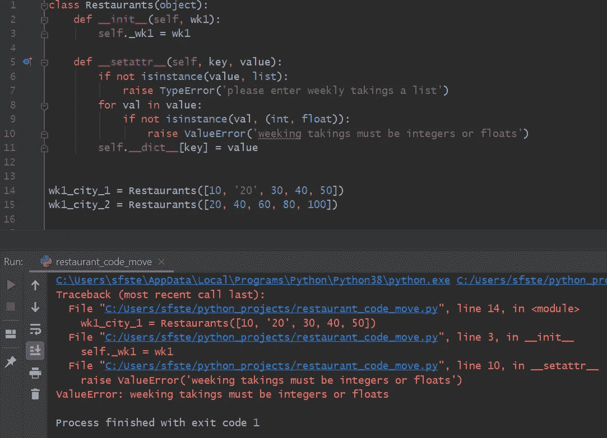
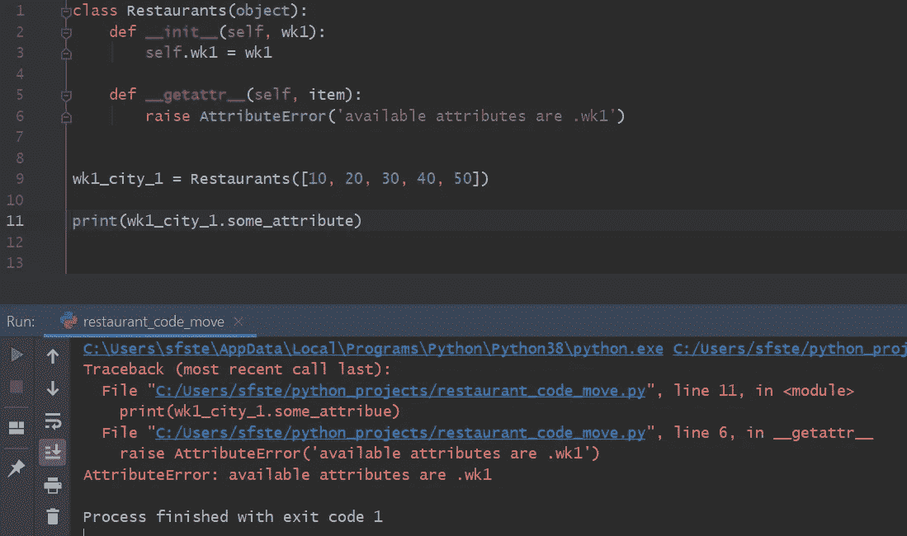
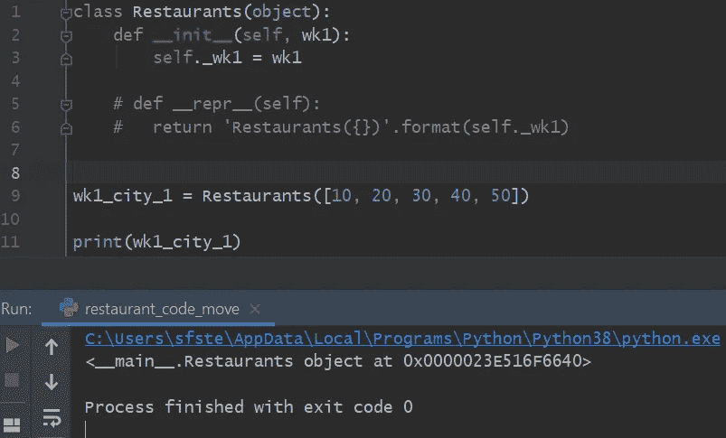

# 通过小代码片段实现 Python 中的神奇方法

> 原文：<https://towardsdatascience.com/magic-methods-in-python-through-small-code-snippets-6a18ed0a150?source=collection_archive---------63----------------------->

## 了解如何使用神奇的方法来丰富您的代码设计

图片由 Artem Maltsev 通过 [Unsplash](https://unsplash.com/photos/3n7DdlkMfEg) 提供

## Python 中的 Magic/Dunder 方法

Magic 或 dunder 方法是内置的方法，在一个类具体化后，用户可以自动使用。神奇的方法通常在方法名的两边都有双下划线。大家都知道最基本的魔法方法，`__init__`。这是我们定义对象初始化行为的方式。然而，还有更多神奇的方法。要找到您可用的神奇方法的目录，只需在您的类名上运行内置的 Python 函数`dir()`。

这里，当`dir()`函数在两个内置类`dict`和`list.`上运行时，属性目录，包括魔法方法，作为一个列表输出

为了帮助用户更好地理解魔术方法，我创建了一个简短的以示例为导向的指南，详细介绍了如何操作内置魔术方法的标准默认行为来选择有用的魔术方法。

然而，贯穿始终的例子都带有警告。如果您修改了一个神奇方法的行为，并且将您的代码打包到一个模块中供其他程序员使用，他们可能会合理地期待神奇方法的默认行为。因此，我的建议是，如果任何方法的默认行为被覆盖了，就要让受众清楚明白。

本教程的目的是提供一些简短的例子，说明如何有选择地定制魔术方法。给出的例子故意很短，以帮助展示内部工作原理。

## 餐馆类和魔术方法

## 1.__ 添加 _ _(自己，其他)

首先，我将创建一个基于餐馆的虚构示例。在这个例子中，我有一个类，用户可以将工作日的收入作为列表传递给 init 构造函数。传递的列表被设置为对象中的一个属性。

假设我们在两个城市有两家餐馆，我们想知道周一到周五每天的总收入。通过重写神奇的方法`__add__(self, other)`，我们可以很容易地在我们的类中实现这种行为。

在 magic add 方法中，我们执行一个列表理解，其中我们将两个列表压缩在一起，迭代现在压缩的列表，并对压缩的元素求和以产生一周中每一天的单个数字整数。列表理解被分配给变量 retval。最后，该方法可以返回一个餐馆对象，并传递这个新列表(retval)。

为了得到我们想要的输出，我们现在必须实现另一个神奇的方法，即`__str__(self)`方法。此方法获取列表属性并将其返回。当 str 方法被调用时，这是我们打印一个对象时所发生的，新的列表将被显示，如下面的代码片段所示。

为了便于理解，当我们使用加号运算符时，对 add 方法的调用是在这里进行的`__add__(self, other).`, self 和 other 都表示餐馆类的对象。下面的例子很好地说明了这一点。我们可以显式调用 add 方法，如第 4 行所示，但是这似乎不太“神奇”。

## 2.__iadd__(自己，其他)

__iadd__ method 方法也可以在 Restaurants 类中实现。为了演示 __iadd__ 的用法，我们假设在同一个城市中有两家餐馆，我们希望这两家餐馆的收入是一个单一的数字整数。

我们可以重写 __iadd__ 方法。我们可以使用内置的 Python sum 函数对两家餐馆第 1 周的条目求和，并将结果保存在名为 retval 的变量中，然后可以返回该变量。

现在，当我们在对象上调用赋值操作“+=时，这个调用将解析为方法调用 iadd。对于这个例子，可能有更简单的方法来获得所请求的答案，但是我想演示 __iadd__ 方法的工作原理。

## 3.__getitem__(self，key)

我们还可以在餐馆类中定制索引。假设我们希望有两种情况，用户可以使用我们在对象创建时传递的列表的标准索引来索引工作日的收入，或者选择通过键入工作日的名称来索引工作日的晚上，以检索当天的收入。

为此，我们可以为 getitem 方法定义自定义行为。当一个容器被索引时，这个方法被调用。在 getitem 方法中，定义了一个字典，将一周中的日期作为键，将值作为相应的数字整数。

当 getitem 被调用时(这发生在我们索引我们的对象时，如图所示)，如果传入的星期几与 weekday_dict 中的任何键匹配，我们从提供的 weekday 键中检索值。这将返回一个数字整数，可用于索引我们的原始收入列表。

如图所示，我们可以用“星期一”索引 wk1_city_1，并得到值 10。我们还可以选择通过包含所示的 else 语句来保留原始的索引方法。这样，我们通过多种索引方式为我们的类引入了更大的灵活性。

## 4.__ge__(自己，别人)和 __le__(自己，别人)

我们还可以在我们的类设计中实现大于或等于和小于或等于魔术方法。假设我们想确定城市 1 和城市 2 中哪家餐馆在收入方面表现更好。我们可以通过实现以下返回布尔值的方法来实现这一点:

`__ge__(self, other)`

定义大于或等于运算符`>=`的行为。

`__le__(self, other)`

定义小于或等于运算符`<=`的行为。

当我们使用这些操作符时，它们解析到相应的、ge/le 的魔法方法调用。

现在，我们可以在对象上使用大于、小于或等于运算符。如图所示，当对 wk1_city_2 调用操作符`>=`时，wk1_city_1 返回一个布尔值 False。

相等运算符`==, __eq__(self, other)`、不相等运算符`!=, __ne__(self, other)`以及小于运算符`<, __lt__(self, other)`和大于运算符`>,__gt__(self, other)`的工作方式与此处所示的示例完全相同。

## 5.__setattr__(自身，关键字，值)

当在对象中设置属性时，可以实现自定义行为。在我们在本教程中一直使用的虚构的餐馆示例中，我们合并到类中的神奇方法依赖于一个被传递并设置为对象中的属性的列表。此外，我们希望列表中的所有元素都是数字整数。这两个条件可以在神奇的 setattr 方法中定义。

首先，我们检查在 setattr 方法中传递给 value 参数的实参是否是一个使用内置 isinstance 方法的列表。如果用户传入任何其他对象，将引发一个 TypeError 异常，并用一条有用的消息通知用户打算如何使用该类。接下来，我们可以遍历列表，确保每个元素实际上都是整数或浮点数。这在衡量餐馆工作日收入的背景下是有意义的。

如果两个条件都满足，我们可以使用以下语法在对象字典中设置属性:

自我。__dict__[key] =值

如图所示，如果将一个元素(如 20)作为字符串“20”传递，将引发 valueError 异常，并提醒用户预期的输入应该是什么。

请注意如何调用 setattr。在下面的第一个例子中，object.attribute 语法将调用您已经使用的方法。在这种情况下，将会调用一个无限的递归循环。

## 6.__getattr__(self，name)

当用户试图访问一个不存在的属性(或者根本不存在，或者还不存在)时，可以调用自定义行为。这对于捕捉和重定向常见的拼写错误非常有用，可以给出关于使用不推荐使用的属性的警告。

这可以通过神奇的方法 getattr 来实现。在该示例中，当用户调用对象上正确命名的属性时，将返回对象属性的值。

如果他们在对象上调用的属性不存在，自定义 getattr 方法可以引发 AttributeError 异常，通知用户可以访问哪些属性。

## 7.__repr__(self)

__repr__ 方法定义了在类的实例上调用 repr 时的行为。str 和 repr 魔术方法之间的主要区别在于目标受众。repr 旨在产生机器可读的输出，例如它可以是有效的 Python 代码，而 str 输出旨在是人类可读的。

在没有为 repr 定义自定义行为的情况下，当我们打印对象时，控制台输出通知用户该对象是一个餐馆对象，并用十六进制代码给出内存中的地址。这可以通过定制 repr 来构建更丰富的信息。可以返回类名，后跟列表。打印出来后，如下所示，我们现在有了有效的 Python 代码，相当于我们创建了一个餐馆类的实例。

## 摘要

魔法方法可以扩展我们类的功能，并且在某些情况下保留现有的默认行为。当使用 getitem 实现自定义行为来索引容器时，就采用了这种方法。

使用魔法方法时，有一点需要注意，用户可能会期望默认行为，所以你必须通过错误消息或自述文件来解释这一点。如果使用得当，魔术方法确实有直观的好处。例如，add 方法给出了用户可能期望的输出。此外，用户不需要学习新的方法名称。

本教程是演示如何使用魔法方法的入门书。这些例子的完整代码可以在[这里](https://gist.github.com/StephenFordham/de6d189a14dcd3978719784efab893f0)找到。喜欢在你的类设计中使用魔法方法！