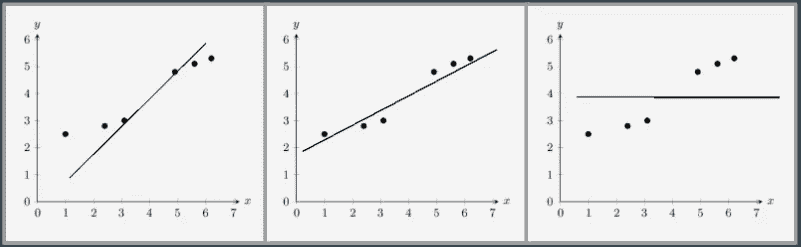
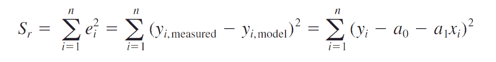
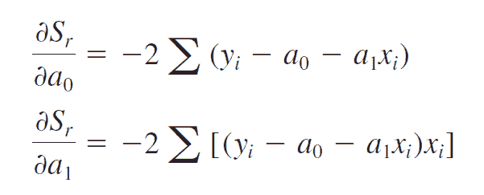
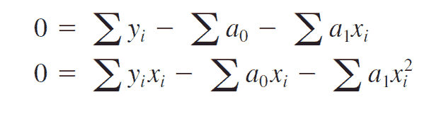
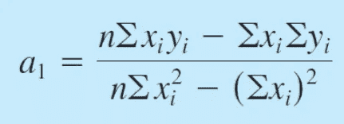
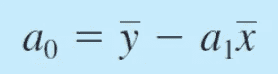

# 微积分的魔力:线性回归

> 原文：<https://towardsdatascience.com/magic-of-calculus-linear-regression-ad84686371c3?source=collection_archive---------47----------------------->

人类行为拥有异常丰富的知识和技术储备。我们正试图从人脑中了解和产生尽可能多的东西。我觉得操纵人脑的一个突破是数据科学。数据科学是一个故事，是人类大脑、机器和直觉的进化。

为了开始这个故事，数据科学家所做的是用数学的基础来描绘猜测的行为。最基础的代数是从线性代数开始的，所以机器学习最基础的发电站就变成了线性回归。

在这篇文章中，我们将看到线性回归的基本直觉和发展，以及今天我们如何使用线性回归。当我阅读时，我发现它非常有趣，我相信你也会如此。

# 人类有线性直觉力吗？

这一切都始于观察，如果 1 公斤苹果成本卢比。100 那两公斤苹果要花卢比。200.但是如果我是一个很好的讨价还价者呢？我 100 卢比买了 1 斤，200 卢比买了 2 斤，450 卢比买了 5 斤，那 10 斤要多少钱？实际值可以是任何值，但我们的直觉告诉我们它可能在 Rs 左右。900 左右。

观察很清楚，当我们有一个精确的线性关系时，我们预测一个精确的值，当我们有一组非线性的点时，我们试图得出一个最适合给定点的线性方程。

**最合适的**，现在这个术语可以有很多意思和解释，有些人从这个术语中什么也看不懂。

“最佳匹配”仅仅意味着良好的**直觉**。如果我们举一个例子，考虑一组点，我们需要一条穿过大多数点或接近最大点数的线。

对于给定的一组问题，可以使用多行进行预测建模。

我想我们都能说出哪条线“最适合”给定的点集。这是第三个，也是我们的第一个直觉，满足标准— **接近最大点数。**

这就是线性回归模型的作用。这是线性回归背后的基本直觉。然后是机器学习在起作用。通过人类的行为，我们可以创造一条生产线，而不是机器，并在这条生产线上改进。

# 直觉到智力

但是我们需要改进一些东西，那就是所谓的**错误**。因此，我们建立了一个度量标准来计算误差，然后我们试图将其最小化。简单地说，误差就是实际值和预测值之间的偏移或偏差。误差越小，现实和可预测性之间的偏差就越小。

我们简单地通过估计实际点和预测点之间的垂直差来计算误差。

现在我们可以将所有误差相加，我们可以将绝对误差相加，但我们要做的是找出误差平方和。选择这个错误模型并拒绝其他模型的背后有很多理论。

最基本的理论是矛盾论。每当我们发现一个漏洞或更好的技术，我们修改现有的技术。

考虑误差的总和，如果我们在数据集中有两个大小相同但符号相反的误差，净误差将为零。在这种情况下，我们没有正确估计模型的准确性。因此，我们建议取误差的绝对值，并将它们相加。增加绝对值可能是一个好的选择，但我们有一个更好的选择。

与其他误差分析相比，采用一些平方误差有两个重要的优势，一是不需要采用绝对值，因为它已经被平方了，二是当它表现出色时，即在异常值的情况下，它会惩罚模型。对大误差求平方将导致大的整体误差。

现在我们有了一个误差的度量，其中 y *i* 是实际值，a0 — a1x *i* 是输入为 x *i* 时的预测值，a0 和 a1 是线系数。

平方误差项

是时候改进模型了。我们希望将误差降至最低，误差是线路系数的函数。很简单，差异化。

偏导数最小化误差项

一旦我们得到了微分，我们就使它们等于零，以获得系数的值，从而使误差最小。

当我们把等式等于零时，神奇的事情发生了。所有的微分方程现在都被转换成一个线性方程，它的变量是线的系数。

因此，通过求解这些方程，我们可以获得系数的值，使得误差值最小，或者换句话说，我们获得了最佳拟合线

# 很少欣赏

这就是我们如何获得最佳拟合线。线性回归背后的数学很简单，但值得一提，因此我称之为数学的魔力。对于更高级的方法来说，这是一个很好的起点，事实上，许多新奇的统计学习技术可以被视为线性回归的扩展。因此，在进入更复杂的方法之前，理解这个简单的模型将建立一个良好的基础。