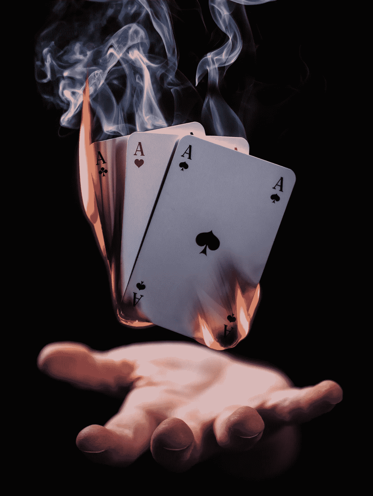
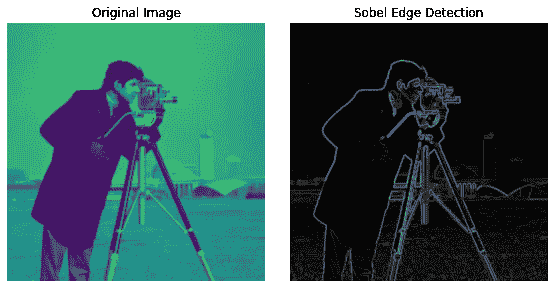

# Sobel 算子的魔力

> 原文：<https://towardsdatascience.com/magic-of-the-sobel-operator-bbbcb15af20d?source=collection_archive---------34----------------------->

## 无监督贝叶斯推理(降低维度和挖掘特征)

## 使用边缘的低级特征检测

图片由朱利叶斯·德罗斯特在 T2 Unsplash 上拍摄

最后，你们一直在等待的时刻到了，这是我们无监督贝叶斯推理系列的下一步:我们对 Sobel 算子的深入研究。

一种真正神奇的边缘检测算法，它实现了低级特征提取和降维，从本质上降低了图像中的噪声。它在面部识别应用中特别有用。

1968 年 Irwin Sobel 和 Gary Feldman(斯坦福人工智能实验室)的爱子，该算法是许多现代边缘检测技术的灵感。通过在给定图像上卷积两个相对的核或掩模(例如，见左下)(每个都能够检测水平或垂直边缘)，我们可以创建一个噪声更小、平滑的表示(见右下)。

图片由作者提供，使用 [Scikit-Image](https://scikit-image.org/) 生成

[Sobel 算子实现](https://scikit-image.org/docs/dev/auto_examples/edges/plot_edge_filter.html)示例由 [SciKit-Image](https://scikit-image.org/) 作者修改

作为用于图像强度函数的梯度近似计算的离散微分算子技术，用简单的英语来说，该算法通过对每个像素(锚像素)与其周围像素(基本上近似图像的导数)之间的差异进行微分来检测像素通道值(通常是亮度)的变化。

这导致平滑原始图像并产生较低维度的输出，其中可以更清楚地看到低级几何特征。然后，这些输出可以用作更复杂的分类算法的输入，或者作为通过 KLD(kull back-lei bler Divergence)进行无监督概率聚类的示例(T10)。

# 那么它是如何工作的呢？

生成低维输出需要我们对图像求导。首先，我们计算 x 和 y 方向的导数。我们创建两个 3×3 的内核(见矩阵)，在相应轴的中心有 0，在垂直于中心 0 的中心正方形有 2，在每个角上有 1。每个非零值应该在零的顶部/右侧为正(取决于轴),在相应侧为负。这些内核被命名为 Gx 和 Gy。

这些以下列格式出现:

作者代码

然后，这些核将在我们的图像上进行卷积，将每个核的中心像素放置在图像中的每个像素上。对于每个内核，我们使用矩阵乘法来计算输出图像中新的对应像素的亮度值。因此，我们最终得到两个输出图像(每个笛卡尔方向一个)。

目的是找到图像中的像素和梯度矩阵(核)(Gx 和 Gy)中的所有像素之间的差异/变化。更精确地说，这可以表示为。

## 旁注:

严格来说我们没有召集任何人。虽然我们喜欢在人工智能和机器学习领域提到“卷积”，但卷积会涉及翻转原始图像。从数学上来说，当我们提到卷积时，我们实际上是在计算输入的每个 3×3 区域和每个像素的掩模之间的互相关。输出图像是遮罩和输入之间的总体协方差。这就是检测边缘的方法。

## 回到我们的索贝尔解释…

对掩码和输入的 3×3 部分之间的每个矩阵乘法的计算值求和，以产生输出图像中像素的最终值。这将生成一个新图像，该图像包含原始图像中存在的垂直和水平边缘的信息。这是原始图像的几何特征表示。此外，因为该算子保证每次产生相同的输出，所以该技术允许对图像分割任务进行稳定的边缘检测。

根据这些输出，我们可以计算任意给定像素(x，y)处的梯度幅度和梯度方向(使用反正切运算符):

作者代码

由此我们可以确定，那些具有大幅度的像素更可能是图像中的边缘，而方向通知我们关于边缘的方向(尽管方向对于生成我们的输出是不需要的)。

# 一个简单的实现:

下面是 Sobel 操作符在 python 中的一个简单实现(使用 NumPy ),让您对这个过程有一个大致的了解(对于所有初学编码的人来说)。

作者代码

该实现是 Wikipedia 伪代码示例的 python 变体，旨在展示如何实现该算法，同时演示该过程中的各个步骤。

# 我们为什么关心？

尽管该算子产生的梯度近似相对粗糙，但它确实提供了一种计算图像的边缘、角和其他几何特征的极其高效的计算方法。反过来，它为许多降维和特征提取技术铺平了道路，如局部二进制模式 **(** [**)有关这种技术的更多详细信息，请参见我的另一篇博客**](/the-power-of-local-binary-patterns-3134178af1c7) **)** 。

仅依赖几何特征确实有在数据编码过程中丢失重要信息的风险，但是，这种权衡允许数据的快速预处理，进而允许快速训练。因此，这种技术在纹理和几何特征被认为对定义输入非常重要的情况下特别有用。这就是为什么使用 Sobel 算子可以以相对高的准确度完成面部识别。但是，如果试图对使用颜色作为主要区分因素的输入进行分类或分组，这种技术可能不是最佳选择。

在使用其他分类器或用于贝叶斯推理方法之前，这种方法对于获得几何特征的低维表示以及维数和噪声减少的极好起点仍然是非常有效的。

# 参考资料:

[1] D. Kroon，2009，短文大学特文特，基于核的图像导数的数值优化。

[https://en.wikipedia.org/wiki/Sobel_operator](https://en.wikipedia.org/wiki/Sobel_operator)