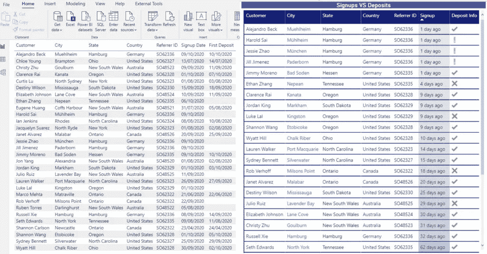
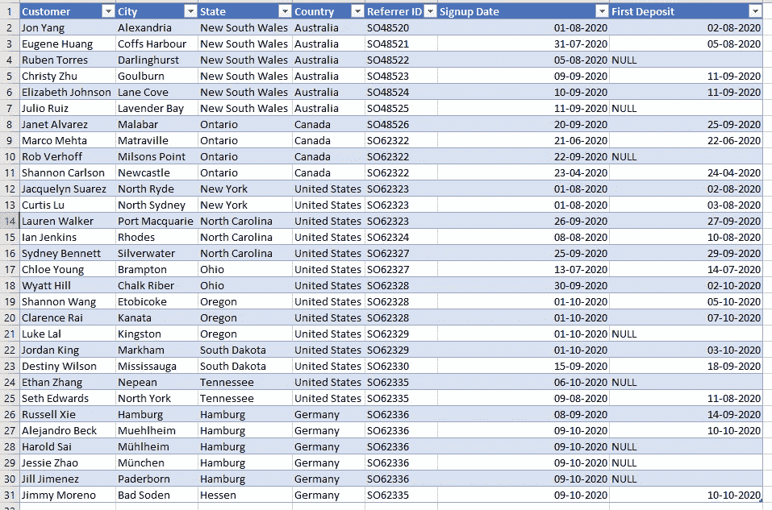
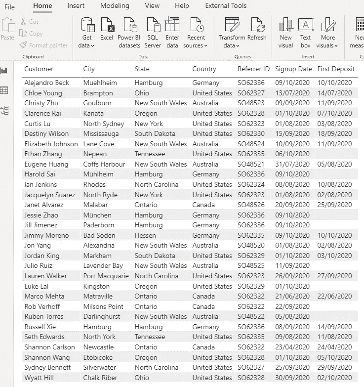
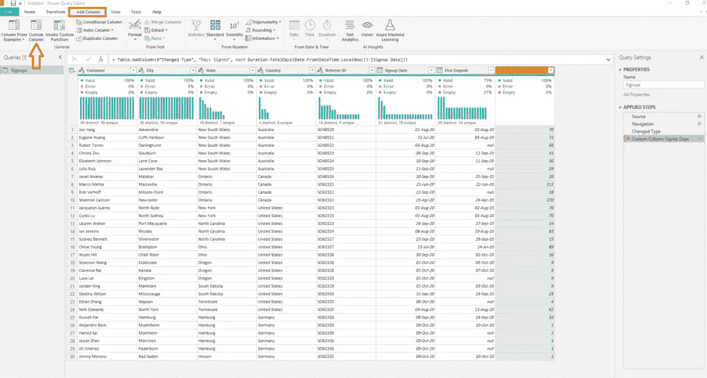
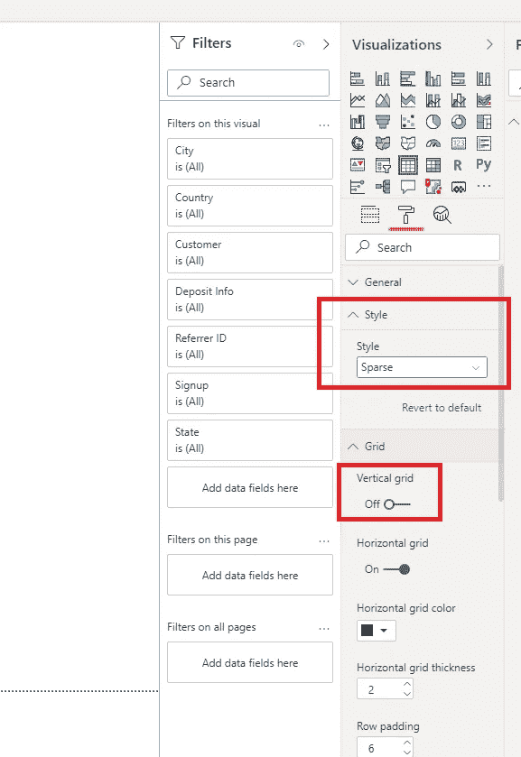
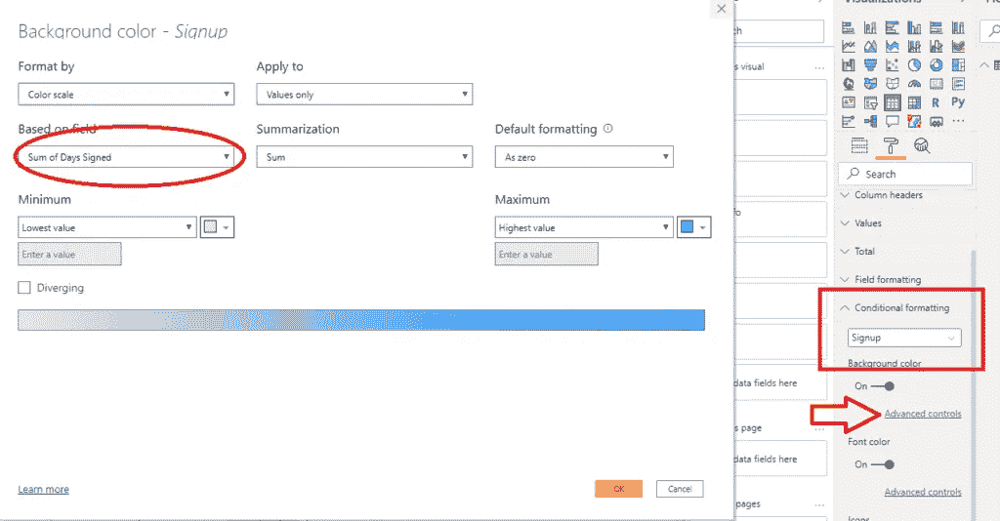
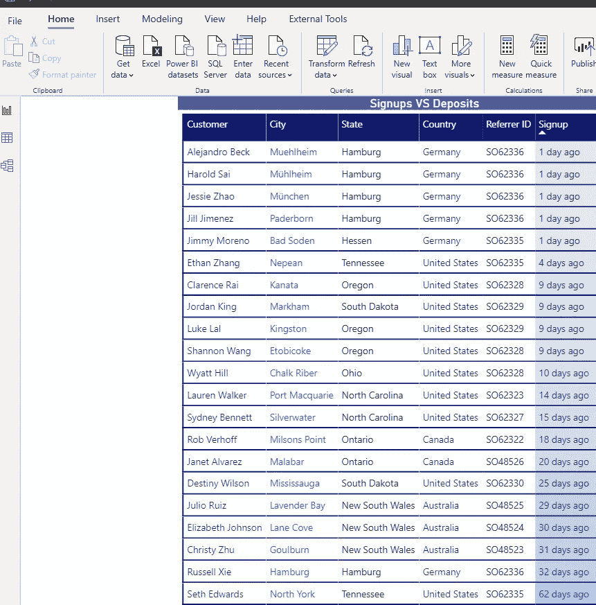
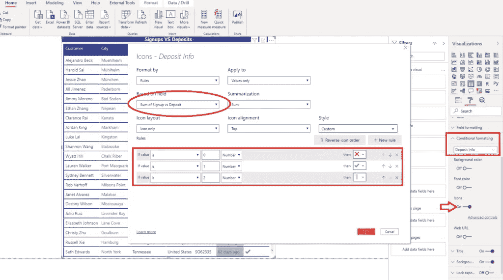
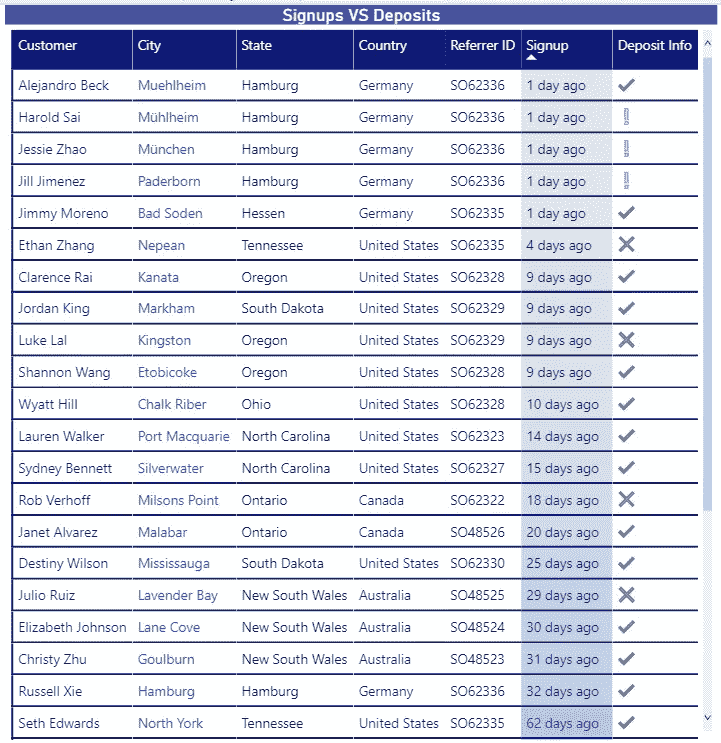
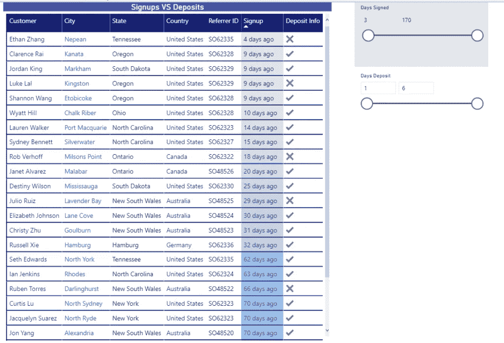

# Power BI 中的魔表

> 原文：<https://towardsdatascience.com/magic-tables-in-power-bi-ab4e8dd9af38?source=collection_archive---------10----------------------->

## 您的 Power BI 报告中的表格不需要是老式的枯燥视觉效果。查看如何为用户创建令人惊讶的表格！



桌子，桌子，桌子…爱他们，或者恨他们，我们，Power BI 开发者，离不开他们。我们的用户也是。你有多少次听到你的用户，这样的一句话:*嘿，那些图表很酷，这些颜色也很好看……但是，给我表格里我的数据。你知道，我是一个“Excel 人”,喜欢看到我的数据排成行和列* …

这完全没问题——当你收到这样的请求时，不要感到不安。然而，世卫组织说我们必须给我们的用户“正常”的表格。如果我们可以满足他们的要求，但只需要一点创意和魔法，同时将他们的桌面体验提升到一个全新的水平，会怎么样？

## 把我的桌子给我…

这是一个商业场景。我们有关于通过推荐计划注册我们服务的客户的数据。如果这些客户为我们的服务进行了第一次存款，我们也有数据，因此我们可以轻松跟踪客户注册但没有存款的情况，我们的客户支持部门可以联系他们，检查他们在注册后是否面临任何问题。



在我的例子中，数据来自 Excel 文件，但在现实生活中，它存储在 SQL Server 数据库中。

我们可以在 Power BI 中基于上图中看到的数字创建一系列可视化效果，但是我们的用户很固执，想要他的表。好了，这就对了:



如果你问我，那看起来比在 Excel 中稍微好一点，但是它仍然——丑陋！我的意思是，我们可以对表格应用一些格式并添加一些颜色，但它仍然是一个普通的旧表格。

## 阿布拉卡达布拉——让这张桌子闪闪发光！

正如我已经提到的，通过一些想象力和创造力，我们可以让这张桌子脱颖而出。所以，我们先给底层数据添加一些逻辑。我将打开超级查询编辑器，在“添加列”选项卡下，我将选择“自定义列”:



然后，由于我们已经学习了[电力查询](/power-query-tips-for-every-power-bi-developer-da9ebd3dcd93)中的一些基本时间操作，我将编写下面的 M 公式来计算今天的日期与客户签约的日期之间的天数:

```
Duration.TotalDays(Date.From(DateTime.LocalNow())-[Signup Date])
```

此外，我想计算注册和首次存款之间的天数。这可以通过使用下面的 M 语句来完成:

```
Duration.TotalDays(Date.From([First Deposit])-[Signup Date])
```

现在，由于我已经用两个额外的列扩展了我的数据模型，我可以执行一系列不同的计算，例如注册日期和第一次存款日期之间的平均数。此外，我可以在我的报告中使用这些列作为切片器，例如，只检查那些在注册后 3-6 天内没有存款的客户！

现在让我们把重点放在增强我们原来的“丑陋”的表。为了让我们的表格更加“用户友好”，我们需要应用一些[特定的格式](/5-tips-to-boost-your-power-bi-development-a44d7e782037)，包括常规格式和条件格式。

我将首先创建一个列来保存自客户注册以来的天数的文本值:

```
Signup Text = IF(Signups[Days Signed] = 1,
            "1 day ago",
            Signups[Days Signed]&" days ago"
)
```

这个公式将帮助我们处理复数和单数文本定义。我将需要另一个计算列来跟踪客户-如果他存款或没有:

```
Signup vs Deposit = IF(Signups[Days Deposit] < 1 && Signups[Days Signed] < 3,
                        2,
                        IF(Signups[Days Signed] >= 3 && Signups[Days Deposit] < 1,0,1)
)
```

基本上，这个想法是有三个层次的标记:第一个是客户谁存款，不管什么时候。第二层是前 2 天报名，但还没有订金的客户。最后，最后一组是两天前注册但仍未存款的客户。而且这个群体应该很容易被我们的客户支持识别出来，这样他们就可以很快隔离那些客户并联系他们。

该公式将这三个级别分开，为每个级别分配一个数字(0，1，2)，该数字将在以后用于条件格式。

第一步，在样式下设置稀疏，关闭垂直网格。这里有一个简短的声明:*你可以按照你喜欢的方式格式化你的表格，你不需要遵循我选择的所有风格*。



现在，最重要的部分是根据特定的值有条件地格式化我们的字段。首先，我将设置我的注册栏的格式，使用一些渐变的颜色，这样当客户注册时就可以立即看到:



下面是我的表现在的样子:



它已经看起来更好了，自从客户注册以来，这种颜色渐变为我们的桌子增加了额外的质量。

现在，最后的接触是标记“目标”客户。为了实现这一点，我们将再次使用条件格式，这一次是针对具有 0、1、2 值的列。打开图标，在“高级控制”下，定义每个特定值的图标:



最后，我们的表看起来像这样:



绿色符号表示该客户进行了存款。黄色感叹号表示该客户尚未存款，但他在前两天注册了。最后，我们的“目标”群体是一个带有红色符号的客户，他不久前注册了，但仍未存款。

正如您可能看到的，这仍然是一个表，但它比我们开始使用的那个表更友好。当然，我们可以通过让用户使用切片器来操作数据，为我们的报告添加一些额外的逻辑:



通过这种方式，我们的报告用户可以轻松地过滤掉不感兴趣的数据进行分析，并专注于他们的目标。

## 结论

正如你所看到的，桌子不一定需要是老式的无聊的视觉效果。通过一些小小的调整和对不同属性应用条件格式，您可以创建出引人注目的闪亮表格。更重要的是，它们肯定会丰富你的用户体验。

感谢阅读！

成为会员，阅读 Medium 上的每一个故事！

订阅[这里](http://eepurl.com/gOH8iP)获取更多有见地的数据文章！