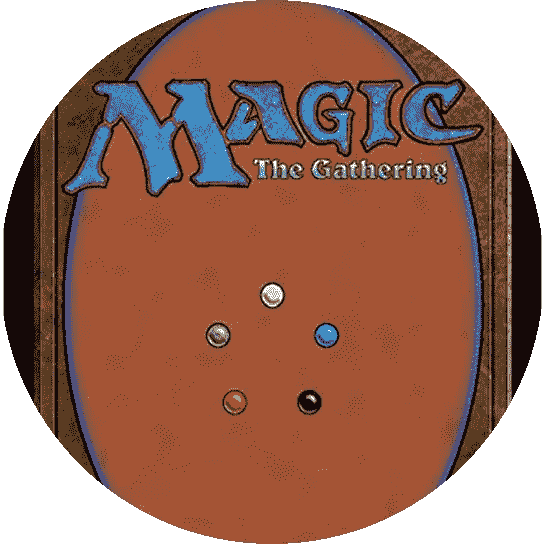
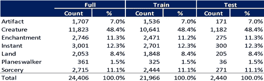
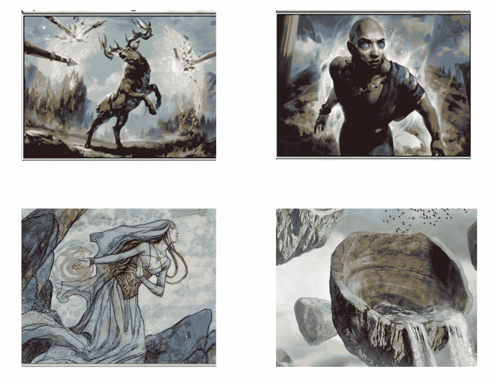
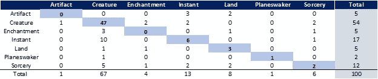
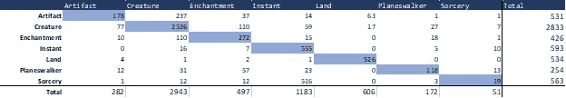
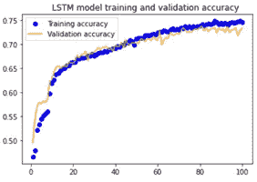

# 魔术:聚会——在艺术指导中利用神经网络

> 原文：<https://towardsdatascience.com/magic-the-gathering-leveraging-neural-nets-in-art-direction-e2d852d6d89f?source=collection_archive---------57----------------------->

## 鲁，迪伦·韦伯，鲁斯兰·阿斯克洛夫，埃里克·权，乐·迈克尔·宋

**一.** **简介**

[魔术:聚会](https://magic.wizards.com/en)(被称为“魔术”或“MTG”)是世界上最古老的交易纸牌游戏，其出版公司海岸巫师(WotC)是世界上最大的奇幻艺术专员之一。在过去的 26 年里，WotC 委托制作了数千件原创艺术品，这些艺术品在 20，000 多张独特的卡片中找到了归宿。每张卡可以有多种语言的多种印刷，这就创造了一个全球奇幻艺术生态系统。

魔法卡有与其游戏机制相关的总体分类器。主要的七种类型是**神器、生物、结界、地、旅法师、瞬发和魔法**。事实上，每一张印刷卡片都至少可以分为这些类型中的一种。凭借其 26 年的历史，魔术已经形成了一种独特的美学，使其有别于其他纸牌游戏。每张新卡都需要以某种方式适应这种审美，并捕捉卡的游戏性。当一个艺术家收到 WotC 的委托时，他们被指派为某个特定的卡片印刷创作艺术品。这项任务从设计概要开始，其中包括对卡的游戏性、提议的艺术描绘、调色板、以前的参考和卡类型的描述。艺术家有一定程度的创作自由，但通常被期望坚持设计大纲。一旦艺术家完成了他们的草图，他们将把草图发给艺术总监，征求反馈和修改意见。WoTC 提供的反馈越少，艺术家在印刷前就有越多的时间处理他们的作品，这通常会导致更高质量的作品。

为了帮助艺术家社区更好地满足 WotC 的要求，我们的目标是使用 CNN 模型将任何作品归类到上述七种类型之一。如果草稿图像属于简报类型(或任何类型)的可能性很低，则艺术家在等待 WotC 拒绝或接受他/她的作品之前会知道需要做更多的工作。换句话说，CNN 可以补充艺术家和艺术总监之间的第一接触点。如果在设计过程中的正确时间使用，图像分类可以导致反馈周期的减少，为艺术家提供更多的时间来创作高质量的魔术艺术

**二。**数据**数据**

**a .**图像分类

纵观 Magic 的历史，已经设计了许多工具来帮助社区成员分析卡片和建立卡片组。使用 [Scryfall API](https://scryfall.com/docs/api) ，我们能够拉出魔法卡的整个目录&对应的艺术。Scryfall 卡对象包括艺术重定向和类型标识。JPG 文件是我们解释变量的基础，而卡的类型是我们的响应变量。在将 JPG 卡文件组织成各自的类型后，我们使用 90:10 的分割将每种类型分割成训练集和测试集(**表 1** )。从训练数据中删除了某些类型的卡片，包括拆分卡片和翻转卡片。这些卡片有两种类型的艺术，很难把它们归为一类。具有多个主要类别的牌，如神器生物，根据最合适的艺术指导，被重新标记为一个主要类别。举个例子，在神器生物双重类型中，美术指导会强调神器而非生物。

**表 1**

**培训-测试拆分**

**b .**LSTM 文本标签分类

使用 Scryfall API，我们使用牌名、甲骨文文本和风味文本作为解释变量，并使用与图像分类相同的生物类型。神谕文字解释了该卡的能力，如果有的话，而风味文字仅仅是为了增加建造世界的天赋。许多卡片没有甲骨文或风味文字，但每张卡片都有一个名字。甲骨文中经常提到卡的类型，但其方式并不总是表明卡的类型本身。该文本只进行了最低程度的预处理—所有输入标记都被转换为小写字母。

对于这个模型，我们在 20，000 张卡上进行训练，在 5，734 张卡上进行验证[链接到 Eric 的驱动器]，验证集由游戏中最新发布的卡组成。

**四。** **方法和分析**

**a .**图像分类

对于我们的 CNN 图像识别模型，我们决定选择迁移学习。这是因为我们可以处理的图像数量有限，而公开可用的模型(如 ImageNet)已经用数百万个数据点进行了训练。对于我们的第一个模型，我们在 VGG-16 (Simonyan，Karen & Zisserman，Andrew。(2014).用于大规模图像识别的非常深的卷积网络。arXiv 1409.1556。)我们尝试重新训练模型的最后四层，并决定重新训练产生最高准确度的最后两层。在 VGG 的顶部，我们添加了一个展平层，一个 relu 激活的密集层，一个 dropout 层，和另一个 softmax 激活的密集层用于分类。图像尺寸调整为 224 x 224 x 3，训练集和验证集的批量大小均为 16。

我们在 VGG 遇到的最大问题是训练速度。训练模型的一个时期大约需要三个小时。对于我们的第二个模型，我们决定采用 InceptionV3 (Szegedy，Vanhoucke，Ioffe，Schlens，Wojna，2015)。它产生了大致相同的精度，但时间从三个减少到一个时代一个小时。我们保持所有其他参数不变；我们重新训练了最后两层，增加了一个展平层，一个 relu 激活的密集层，一个 dropout 层，最后是另一个 softmax 激活的密集层。

**b .**T2【LSTM】模式

这里，我们使用一个具有两个 LSTM 层和一个学习嵌入层的模型，所有输出维度为 10。我们使用比率为 0.3 的辍学和经常性辍学，以及权重为 0.01 的核心 L2 正则化。这种轻量级模型架构训练速度非常快，100 个训练时期在 CPU 上耗时约 1-2 小时，在验证集上实现了 72%的预测准确率。LSTM 体系结构是从包括简单 RNN 在内的几个简单语言模型体系结构中挑选出来的，因为在 10 个时期的训练后具有最佳性能而被选中。

**诉**结果

****a .**图像分类**

**我们的目标是让艺术家相信他们的草图符合 WotC 标准。我们通过考虑验证集和人类专业知识来分析我们的模型性能。在模型性能上，我们的第一个模型 VGG 产生了 55%的验证精度，这是第二个纪元以来的最高精度。有过度拟合的迹象，导致训练精度增加，而验证精度保持不变。初始模型产生了同样的 55%的验证准确性，但是，正如前面提到的，训练速度提高了三倍。两个模型都显示出非常明显的过度拟合的迹象。因此，我们决定实施正则化方法。我们使用 30%的辍学率和 L1 正则化。这些技术的实施有助于减少过拟合，但不能完全消除过拟合。我们让几个魔术师对以下四张卡片进行不同程度的分类。正如你所看到的，其中一些图像很难分类。**

****

**你能猜出这里显示的每张魔法卡的类型吗？(答案在底部)**

**为了与人类专家进行比较，我们将我们的模型性能与一位经验丰富的魔术师进行了比较。拒不合作的数据来自玩家和 CNN 都没有看到的即将到来的一集。基于表 2 所示的混淆矩阵，该模型的总体准确率为 59%，而人类分类的准确率为 76%(**表 2 &表 3** )。模型未能正确识别单张卡片的一个方面是伪影。与此同时，玩家被观察到在所有潜在的类别中有更好的类型识别。**

****表二****

****模型混淆矩阵****

****

****表 3****

****魔法玩家混淆矩阵****

****

****b .**LSTM 模式**

**经过 100 个时期的训练后，LSTM 模型达到了 73%的验证准确率。这个模型很难识别魔法，经常会在一瞬间混淆它们。同样，这个模型也受到了神器和魔法的挑战，经常把这两者都误认为是生物。关于验证集上最终 LSTM 模型的混淆矩阵，参见**表 4** 。有关显示 LSTM 模型在 100 个训练时期的训练和验证准确性的图表，请参见**图 1** 。**

****表 4****

****5700 张最新卡片验证集上 LSTM 模型的混淆矩阵****

****

****图 1****

****LSTM 模特培训历史****

****

**六。结论**结论****

**我们观察到，我们的模型可以合理地识别生物艺术，但对其他类型的牌却没有表现出类似的表现。考虑到我们训练的数据，这是意料之中的。42%的魔法卡属于生物分类器。我们将为未来的模型考虑的可能性是故意减少生物样本，训练一个没有任何生物的模型，或者增加非生物类型的训练数据。我们希望提高非生物的分类精度，这将从整体上提高模型的性能。近期的目标是达到 70-75%的准确率，我们发现这是我们测试的所有有经验的魔术玩家的范围。**

**这篇文章来自我们在弗吉尼亚大学数据科学学院的机器学习项目。**

****魔法卡类型答案**:**

**左上角:即时**

**右上:魅力**

**左下角:生物**

**右下角:土地**

****参考文献****

**法洛米尔、佐伊、莱多·穆塞罗斯·卡韦多、伊斯梅尔·桑斯和路易斯·冈萨雷斯·阿布里尔。"根据定性的颜色描述符、定量的全局特征和机器学习(QArt-Learn)对绘画进行艺术风格分类."专家系统。97(2018):83–94。**

**齐利奥、费利佩、马塞洛·普拉特斯和路易斯·兰姆。"分析魔术的神经网络模型:收集卡片." *ICONIP* (2018)。**

**克里斯蒂安·塞格迪，文森特·万霍克，谢尔盖·约菲，黄邦贤·施伦斯，兹比格涅夫·沃伊纳。重新思考计算机视觉的初始架构(2015)**