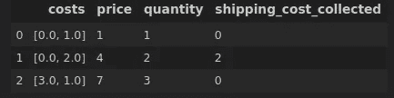
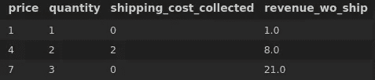
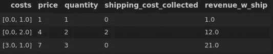
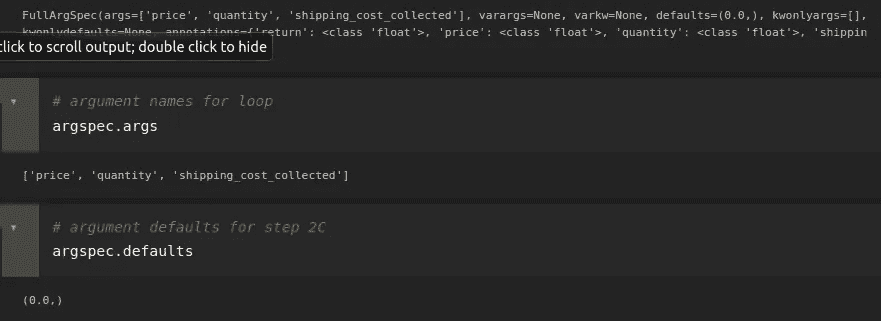
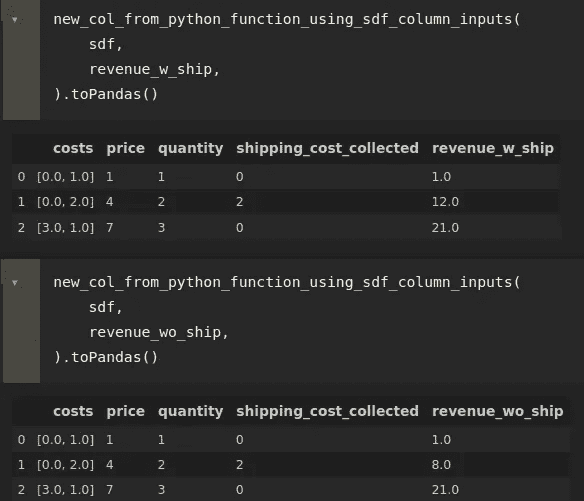
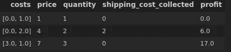
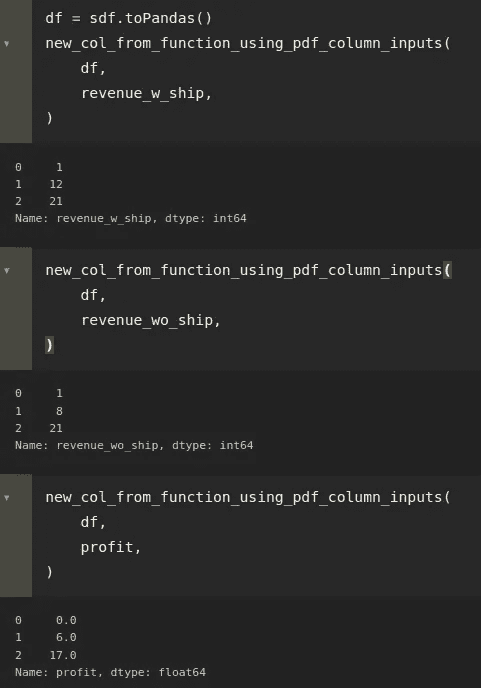

# 神奇地拉出 PySpark UDFs 和 Pandas 函数的参数

> 原文：<https://towardsdatascience.com/magically-pull-arguments-for-pyspark-udfs-and-pandas-functions-8f85f6b893f2?source=collection_archive---------29----------------------->

## 在不替换参数的情况下更改函数

让参数名流动起来[https://pix abay . com/photos/prairie-river-stream-curved-sunset-679014/](https://pixabay.com/photos/prairie-river-stream-curved-sunset-679014/)

PySpark 用户定义函数(UDF)允许您使用 python 函数，并将其应用于 PySpark 数据帧的行。当您使用的功能变化很大时，必须更新功能和使用位置可能会很烦人。这篇文章将解释给定函数如何自动提取参数。该方法也适用于将 Pandas 系列作为输入的函数(见本文末尾)。

**设置**

让我们从一些设置开始:导入我们将会用到的东西，并创建一个玩具数据集。假设我们的数据包含关于价格、销售量、从客户那里收集的运输成本以及其他成本的列表的信息。我们将制作一些简单的 UDF 来从这些数字中计算收入和利润。

**UDF 税务局**

假设我们想要创建一个简单的 UDF，它使用`price` 和`revenue`列来创建一个新的`revenue_wo_ship`列。

**变更 UDF 收入**

在许多情况下，当前的需求可能会发生变化。例如，假设我们更改了收入的定义，不仅包括商品的价格，还包括我们从客户那里收取的运费。这需要两个变化

1.  调整函数以将运输成本添加到收入计算中
2.  调整`withColumn`调用以更改参数

**用**移除第二步 T4

在这种情况下，额外的信息已经存在于我们的数据框架中，不得不进行这两种代码更改是很烦人的。我们应该能够改变函数，让参数通过名称自动提取。

为此，我采取了以下策略:

1.  从函数开始。当它的定义改变时，我们应该能够自动改变要拉取的参数。
2.  对函数参数进行循环。

A.如果参数是传入字典中的键，则使用该键的值。否则，

B.如果 spark 数据框中的任何列的名称与参数名称相匹配，则使用它们作为参数。否则，

C.如果参数有函数指定的默认值，则使用它。否则，

D.抛出一个异常，因为我们不知道该为参数使用什么值。

该策略通过循环函数的参数名来实现。这就是`inspect`的用武之地:它允许我们获取函数的参数名和默认值。

**放在一起:功能**

现在，我们可以将所有这些放入一个函数中，来为我们处理这个策略。注释可以在整个代码中为您提供指导。

我们从一个助手函数开始，它将常量值作为参数输入到 UDF 中，以处理上述策略中的 2A 和 2C。

然后，真正的魔术:

**看到它在行动**

现在，我们可以对这个函数进行简单的调用，而无需改变我们向 UDF 输入内容的方式:

它也适用于列表输入。例如，如果我们想将利润定义为价格和数量的乘积与成本列之和之间的差值:

这就是了。魔法

照片由[阿尔莫斯·贝托尔德](https://unsplash.com/@almosbech?utm_source=medium&utm_medium=referral)在 [Unsplash](https://unsplash.com?utm_source=medium&utm_medium=referral) 上拍摄

**扩展:熊猫**

请注意，这种方法同样适用于熊猫:

