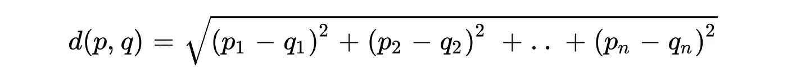
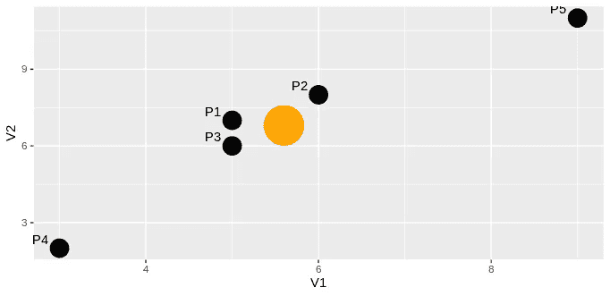
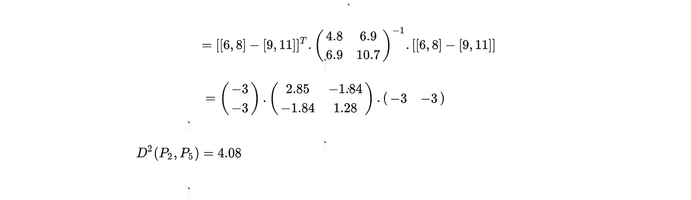
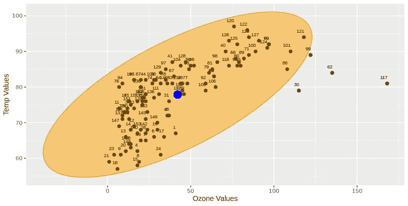

# R 中的马氏距离和多元异常检测

> 原文：<https://towardsdatascience.com/mahalonobis-distance-and-outlier-detection-in-r-cb9c37576d7d?source=collection_archive---------4----------------------->

## 寻找破坏线性的异常值

马哈拉诺比斯距离(MD)是一种有效的距离度量，用于计算点和分布之间的距离([参见](https://en.wikipedia.org/wiki/Mahalanobis_distance))。它对多元数据非常有效。MD 之所以对多元数据有效，是因为它利用变量之间的协方差来求两点的距离。换句话说，Mahalanobis 通过考虑标准差(P1 离 P2 有多少标准差)来计算“P1”点和“P2”点之间的距离。当异常值被认为是多元的时，MD 也给出可靠的结果。为了通过 MD 发现离群点，计算 n 维数据中每个点与中心的距离，并通过考虑这些距离来发现离群点。


照片由[威尔·迈尔斯](https://unsplash.com/@will_myers?utm_source=unsplash&utm_medium=referral&utm_content=creditCopyText)在 [Unsplash](https://unsplash.com/s/photos/outliers?utm_source=unsplash&utm_medium=referral&utm_content=creditCopyText) 上拍摄

## 目录

*   马氏距离和欧氏距离
*   用 MD 求两点间的距离
*   利用 R 中的马氏距离发现异常值
*   结论

如果您对如何使用 Python 中的 Mahalanobis 距离来检测异常值感兴趣，您可以查看我下面的另一篇文章。

[](/multivariate-outlier-detection-in-python-e946cfc843b3) [## Python 中的多元异常检测

### Python 中的多元异常值和马氏距离

towardsdatascience.com](/multivariate-outlier-detection-in-python-e946cfc843b3) 

## 马氏距离和欧氏距离

欧几里德距离也通常用于寻找 2 维或 2 维以上空间中两点之间的距离。但是，与欧几里得不同，MD 使用协方差矩阵。正因为如此，当两个或多个变量高度相关时，即使它们的尺度不同，MD 也能很好地工作。但是，当两个或多个变量不在同一尺度上时，欧几里得距离结果可能会误导。因此，在找到这些点之间的距离之前，必须计算变量的 Z 得分。此外，如果变量高度相关，欧几里得就不够好。

让我们检查欧几里得和 MD 公式，



n 维欧氏距离公式


马氏距离公式

从公式中可以看出，与欧几里得不同，MD 使用协方差矩阵(位于 C ^(-1 的中间)。在欧几里得公式中，p 和 q 代表要计算距离的点。“n”代表多元数据中变量的个数。

**通过 MD 寻找两点间的距离**

假设我们有 5 行 2 列数据。正如您所猜测的，数据中的每一行都代表二维空间中的一个点。

```
 V1    V2
    ----- -----
 P1   5     7  
 P2   6     8  
 P3   5     6
 P4   3     2
 P5   9     11
```

让我们画一个 V1 和 V2 的散点图，



V1 和 V2 散点图

橙色点表示这两个变量的中心(平均值),黑点表示数据框中的每一行。现在，让我们试着找出 P2 和 P5 之间的马氏距离；



根据上面的计算，P2 和 P5 之间的距离为 4.08。

## 利用 R 中的马氏距离发现异常值

如前所述，MD 对于发现多元数据的异常值非常有效。特别是，如果变量之间存在线性关系，MD 可以计算出哪些观察值破坏了线性关系。与另一个例子不同，为了找到异常值，我们需要找到每个点和中心之间的距离。中心点可以表示为多元数据中每个变量的平均值。

在这个例子中，我们可以使用 R 中预定义的数据，称为“空气质量”。我们将“温度”和“臭氧”值作为我们的变量。这是我们需要遵循的步骤列表；

*   找到“臭氧”和“温度”的中心点。
*   计算“臭氧”和“温度”的协方差矩阵。
*   求各点到中心的马氏距离。
*   从卡方分布中寻找临界值
*   选择小于截止值的距离(这些值不是异常值)。

这是计算中心和协方差矩阵的代码；

在计算距离之前，让我们绘制数据，并通过考虑中心点和协方差矩阵绘制一个椭圆。我们可以通过使用“car”包中的椭圆函数来找到椭圆坐标。“椭圆”函数有 3 个重要参数；中心、形状和半径。中心代表变量的平均值，形状代表协方差矩阵，半径应该是具有 2 个自由度和 0.95 概率的卡方值的平方根。我们采用概率值 0.95，因为超出 0.95 将被视为异常值，自由度为 2，因为我们有两个变量“臭氧”和“温度”。

找到我们的椭圆坐标后，我们可以用“ggplot2”包创建我们的散点图；

上面，代码片段将返回散点图下方；



臭氧和风变量散点图

图上的蓝点表示中心点。黑点是臭氧——风变量的观测值。如您所见，点 30、62、117 和 99 位于橙色椭圆之外。这意味着这些点可能是异常值。如果我们认为这个椭圆是在协方差、中心和半径上绘制的，我们可以说我们可能已经找到了与 Mahalanobis 距离的异常值相同的点。在多维中，我们不画椭圆，但是我们计算每个点和中心之间的距离。找到距离后，我们使用卡方值作为截止值，以识别异常值(与上面示例中的椭圆半径相同)。

stats 包中 R 附带的“mahalanobis”函数返回每个点和给定中心点之间的距离。这个函数也有 3 个参数“x”、“center”和“cov”。你可以猜到，“x”是多元数据(矩阵或数据框)，“center”是变量中心点的向量，“cov”是数据的协方差矩阵。这一次，在获得卡方截止值时，我们不应该求平方根。因为，MD 已经返回了 D(平方)距离(从 MD 公式可以看出)。

终于！我们已经确定了多元数据中的异常值。发现异常值 30。62.99.117.观察值(行)与散点图中椭圆外的点相同。

## 结论

在这篇文章中，我们讨论了从理论到实践的“马哈拉诺比斯距离”。除了从公式计算两点之间的距离，我们还学习了如何使用它来发现 r 中的异常值。虽然 MD 在机器学习中不太常用，但它在定义多元异常值时非常有用。

如果您有任何问题，请随时留下您的意见。但是，您可能会对我的另一篇文章感兴趣，这篇文章讲述了如何从头开始使用 Python 中的 Mahalonobis 距离来检测异常值。

[](/multivariate-outlier-detection-in-python-e946cfc843b3) [## Python 中的多元异常检测

### Python 中的多元异常值和马氏距离

towardsdatascience.com](/multivariate-outlier-detection-in-python-e946cfc843b3)