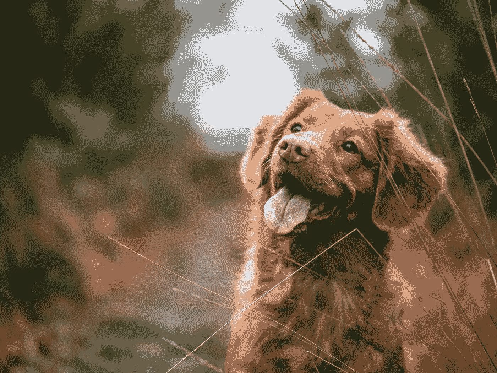
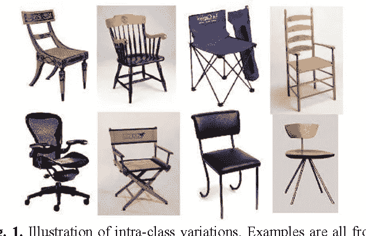
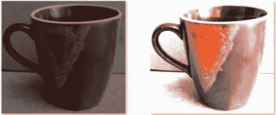
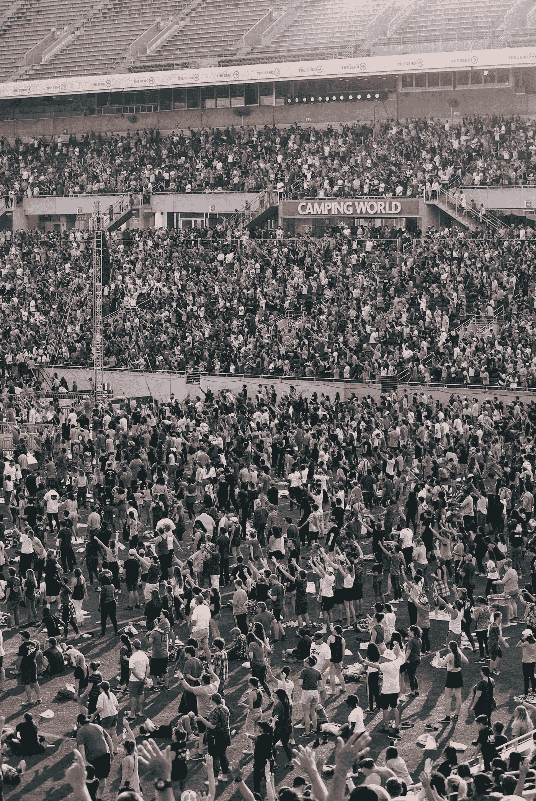
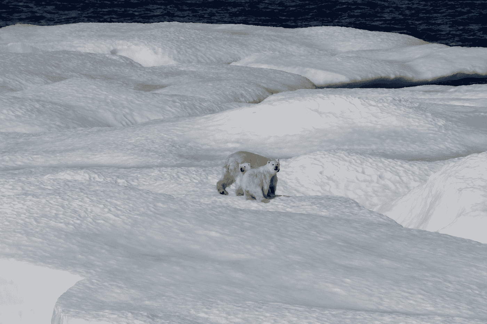

# 图像分类的主要挑战

> 原文：<https://towardsdatascience.com/main-challenges-in-image-classification-ba24dc78b558?source=collection_archive---------20----------------------->

## 什么是图像分类，我们在图像分类中面临的主要问题是什么？

塞巴斯蒂安·赫尔曼在 [Unsplash](https://unsplash.com?utm_source=medium&utm_medium=referral) 上的照片

图像分类是根据图像的类型(类别)给图像分配标签的过程。

假设我们有以下几类图像:猫和狗

因此，当我们向图像分类系统提供给定类别的图像时，系统会根据类别给图像分配标签。

例如，如果我们将下面给出的图像提供给“图像分类系统”。系统应该将标签“狗”分配给图像。

照片由 Unsplash 上的 Jamie Street 拍摄

**图像分类的挑战:**

图像分类面临以下主要挑战:

**1。类内变异**

**2。标度变化**

**3。视点变化**

**4。遮挡**

**5。照明**

**6。背景杂乱**

让我们分别看看图像分类中的这些挑战。

1.  **类内变异**

类内变化是同一类图像之间的变化。类内变化的例子是在我们的数据集中有多种类型的椅子。椅子可以是“办公椅”、“舒适椅”、“餐桌椅”、“装饰椅”等。

图片来源([语义学者](https://d3i71xaburhd42.cloudfront.net/291555346159ba4efb753c057be74fc039cdfa7b/1-Figure1-1.png)

在上图中，我们有不同类型的椅子。所以我们的图像分类系统应该能够解决类内变异的问题。

**2。标度变化**

这个问题在图像分类中很常见。尺度变化实际上是同一物体的图像具有多种尺寸。

下图显示的是同一物体 __ 勺子的尺度变化，但它们都是不同尺寸的勺子。

照片由 [Dstudio Bcn](https://unsplash.com/@dstudiobcn?utm_source=medium&utm_medium=referral) 在 [Unsplash](https://unsplash.com?utm_source=medium&utm_medium=referral) 上拍摄

**3。视点变化**

我们有视点变化，其中对象可以相对于如何在图像中拍摄和捕捉对象而在多个维度上定向/旋转。无论我们从哪个角度捕捉椅子的图像，它仍然是一把椅子。

费德里卡·坎帕纳罗在 [Unsplash](https://unsplash.com?utm_source=medium&utm_medium=referral) 上的照片

**4。遮挡**

在图像中有很多我们想要分类的物体是不能被完全观察到的。大部分藏在其他物体后面。

Tatianaаzatskaya 摄于 [Pexels](https://www.pexels.com/photo/orange-tabby-cat-on-gray-blanket-3616232/?utm_content=attributionCopyText&utm_medium=referral&utm_source=pexels)

给定的是猫的图像，但请注意它是如何在封面下休息的，从我们的视野中被遮挡。这意味着它不是完全可见的，但我们的图像分类系统应该能够检测到它并将其归类为猫。

**5。照明**

我们的图像分类还应该能够处理光照的变化。

作者图片

这两个图像是同一个杯子，但是像素的强度水平不同。我们的图像分类系统应该能够处理光照的变化。因此，当我们将任何具有不同亮度级别(照度)的相同物体的图片提供给我们的图像分类系统时，系统应该能够给它们分配相同的标签。

**6。背景杂乱**

这意味着图像中有很多物体，对于观察者来说，很难找到特定的物体。这些图像非常“嘈杂”。

但是我们只对图像中的一个特定对象感兴趣；然而，由于所有的“噪音”，不容易挑出特定的对象。

对于人类来说这是非常困难的任务，所以想象一下对于一台对图像没有语义理解的计算机来说有多难。

乔尔·莫特在 [Unsplash](https://unsplash.com?utm_source=medium&utm_medium=referral) 上拍摄的照片

但是在某些情况下，图像中存在某个目标，但该目标的外观与背景非常相似，因此图像分类系统很难对该目标进行分类。

美国国家海洋和大气管理局在 [Unsplash](https://unsplash.com?utm_source=medium&utm_medium=referral) 拍摄的照片

在某些情况下，即使图像中没有物体，例如如果我们向图像分类系统显示只有冰的图像，系统也会将其标记为熊。这是因为图像分类系统在训练过程中已经学习了图像中的模式，并且有白熊和没有熊的冰的模式非常相似。

所以我们的图像分类系统也应该能够解决背景混乱的问题。

这就是图像分类系统面临的挑战。我希望现在你对这些挑战有了更好的理解。感谢阅读！

如果你想阅读更多的文章，可以考虑使用我的[推荐链接](https://rafaey.medium.com/membership)成为[媒体会员](https://rafaey.medium.com/membership)。你将有机会接触到所有的媒体文章，每月只需 5 美元。我会赚它的一小部分作为佣金，没有额外的费用给你。快乐阅读！