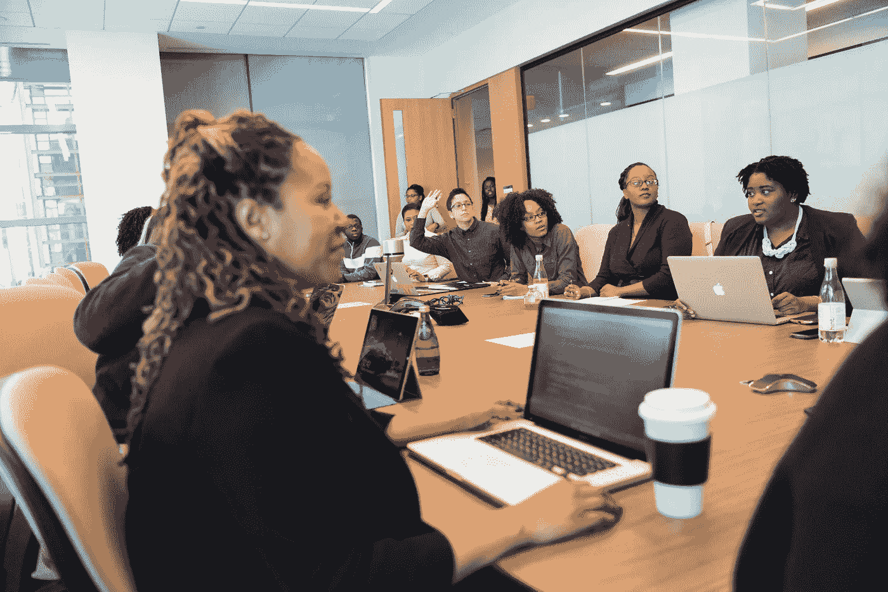

# 保持良好的“彩票因素”

> 原文：<https://towardsdatascience.com/maintaining-a-good-lottery-factor-1eeb2b2f52a6?source=collection_archive---------50----------------------->

## 确保没有单一的人为故障点

克里斯蒂娜@ wocintechchat.com 在 [Unsplash](https://unsplash.com/s/photos/diversity-team?utm_source=unsplash&utm_medium=referral&utm_content=creditCopyText) 上的照片

# 彩票因素是什么？

彩票因素，通常被称为[公共汽车因素](https://en.wikipedia.org/wiki/Bus_factor)，是一个数字，代表有多少人不再参与某个项目会使该项目处于危险之中。它源于这样一个概念，即如果项目中的特定人员中了彩票并离开了(或被公共汽车撞了)，剩下的人将没有足够的知识来继续项目。因此，低彩票系数是不好的，因为人们确实会因为许多原因离开项目，而让一个项目依赖于一两个关键人物是有风险的。这个概念适用于许多行业和学科的项目，但我在这里的重点是软件工程。

除了由于人员离开而使项目面临风险之外，如果某些领域的工作只能由可能已经在其他地方忙碌的特定人员来完成，那么低的抽签系数还会减缓项目的开发。

因此，作为经理和/或项目领导，确保项目在继续进行所需的知识和技能方面有冗余是很重要的。无论是继续建设、运营还是维护项目。我在以前的文章中详细介绍了如何建立一个好的彩票因素，但是如何保持一个好的彩票因素呢？

 [## 建立良好的“彩票因素”

### 确保没有单一的人为故障点

medium.com](https://medium.com/dev-genius/building-a-good-lottery-factor-bf67f7de04d8) 

# 如何保持良好的因子

建立一个好的彩票因素所需要的一切也是维持它所需要的。随着团队的发展和项目的变化，这些努力应该是连续的。一旦一个好的彩票因素已经实现，它将不可避免地随着时间的推移而减少。这可能是由于人员流失，或者仅仅是团队专注于一个项目或新项目的新方面。然而，作为一个团队，你可以做一些事情来减缓彩票因素的下降。

> “对于必须处理现场事故的人来说，了解最近发生的变化是至关重要的。”

## 拉式请求(PRs)/代码审查

为了使共享的项目知识与正在进行的变更保持同步，让团队成员参与 PRs 的评审( *Pull Requests* 或代码评审)是非常重要的。在代码投入生产之前，让多个工程师批准代码变更有很多好处[，知识共享是其中之一。](/the-other-reasons-code-reviews-are-a-good-idea-e57399499558)

除了给其他人提供对项目即将发生的变化的反馈的机会之外，PRs 还让那些待命的人洞察到正在发生的变化。对于必须处理现场事故的人来说，了解最近发生的变化是至关重要的。SME ( *主题专家*)和待命人员都不希望由于缺乏知识而导致问题升级。

最后，PRs 为可能在项目的其他领域工作的团队成员提供了一种方法，让他们可以在闲暇时看到其他地方发生了什么变化。而不需要将他们实时包括在每个会议或讨论中。

> “PRs 有助于保持详细的低级知识流动，协作、反馈和设计评审有助于高级知识的传播。”

## 设计协作

确保新功能的设计是以协作的方式完成的，让项目中的其他人参与进来，有助于从一开始就分享新的全局知识。PRs 有助于保持详细的低级知识的流动，协作、反馈和设计评审有助于高级知识的传播。接受和促进对设计和计划的反馈也鼓励了项目中其他人的参与，这促进了共享所有权和责任。这些方面有助于随着事情的发展保持团队知识的更新，从而避免重新构建你的彩票因素的需要。

这不仅适用于系统架构设计，也适用于任何*计划的*项目。无论是用户体验提案、流程变更、业务方向变更还是营销活动。在它们付诸行动之前，开放它们进行更广泛的讨论和反馈，是开始播种最终需要分享的新知识的好方法。在早期获得不同的反馈当然比太迟了要好。

 [## 通过我的推荐链接加入媒体-罗伊·赫罗德

### 作为一个媒体会员，你的会员费的一部分会给你阅读的作家，你可以完全接触到每一个故事…

medium.com](https://medium.com/@royherrod/membership) 

> “让工程团队中的人员围绕团队负责的多个领域进行轮换是一个好主意。”

## 工作区域的轮换

虽然让专门的中小型企业长期负责某个项目的特定领域确实有一些好处，但这也增加了他们成为有能力管理一个领域的人的风险。可怕的彩票因素之一。为了帮助缓解这种情况，让一个工程团队中的人围绕一个团队负责的多个领域进行轮换是一个好主意。这种轮换不应该只是小的、无足轻重的工作，它应该给人们机会真正投资于一个领域，并交付有意义的东西。但是，知道工作将被传递，知识将被分享，这又一次鼓励了信息的公开，并强化了记录的需要。

有些情况下，专业的、非常深入的知识是必不可少的，为了建立这种知识，人们需要长时间专注于某个特定的领域。这没关系。让工程师轮换的目的不需要适用于每个工程师。事实上，如果某个领域最有知识的人专注于其他领域，那么过多的变动会使工程师很难进入新的领域。让轮岗集中在初级工程师身上实际上有很多额外的好处。这是一个很好的方式，让他们获得更广泛的经验，并帮助他们找出自己的优势和激情所在，同时也建立对各个领域的运作的理解。

在这种情况下，知识的主要来源在一个人身上是可以接受的。但是，为了保持一个良好的彩票因素，这种知识也应该在许多其他人之间进行分段复制。这意味着在主要 SME 离开的情况下，没有立即的单一替代，但是知识确实存在，并且需要从许多其他工程师组合。在这种情况下，需要决定一个单一的替代 SME 整理所有知识成为替代是否是期望的结果。或者，新常态是否应该让它分散成片段，并确保每个片段在多人之间复制，以保持彩票因素。这里的正确选择将取决于项目的状态及其未来发展的计划。

为了保护你的团队和项目，保持一个良好的抽奖因素是一个持续的练习。它需要一个平衡的团队，既有新成员，也有老成员。这需要在团队中培养知识共享和协作的文化。这是一个整个团队都需要经历的旅程，而不是一个经理可以决定的。