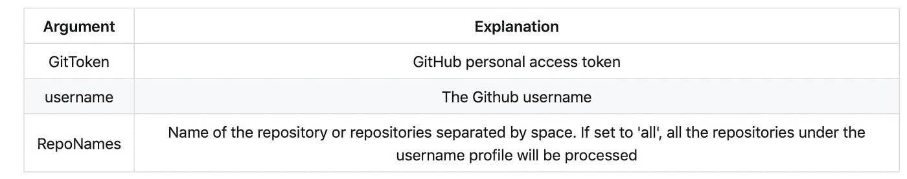
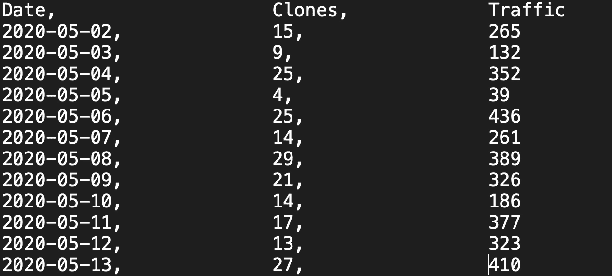
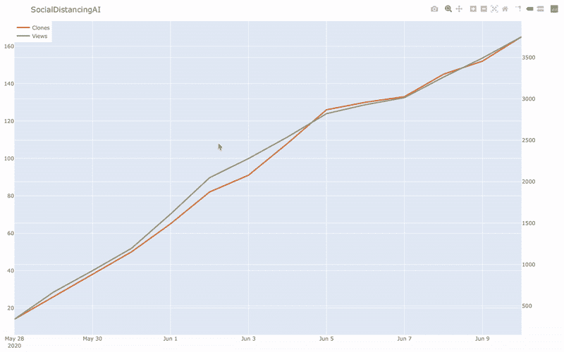
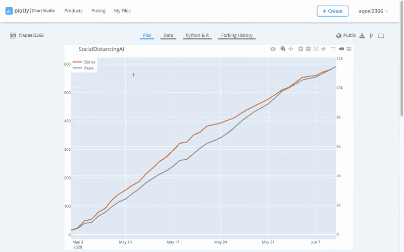

# 维护 GitHub 统计数据超过 14 天

> 原文：<https://towardsdatascience.com/maintaining-github-stats-for-more-than-14-days-31653bd1d7e1?source=collection_archive---------44----------------------->


## 用于维护 Github 克隆和视图统计数据超过 14 天的 Python 代码。

GitHub 是一个帮助开发人员存储和管理代码的伟大平台。目前，GitHub 仅提供最近 14 天的统计数据。这些统计数据包括视图、唯一视图、克隆和唯一克隆的数量。作为一名开发人员，我发现看不到我的 GitHub 库的终生统计数据有点令人不安。这些终身统计将帮助开发人员了解他们的存储库的重要性。基于流量，开发人员可以给予某些存储库更多的关注。此外，有时开发人员可能希望在他们的网站上显示这些统计数据。

在本文中，我将详细介绍如何维护超过 14 天的存储库的 GitHub 统计数据，并显示网站的这些图表。完整的代码可以在[这里](https://github.com/aqeelanwar/StatTheGit)找到。

# StatTheGit

StatTheGit 是一个基于 python 的工具，用于获取、维护和显示 GitHub 克隆和视图统计数据。该存储库可用于维护存储库统计信息的本地副本。

## 步骤 1 —克隆存储库

```
git clone [https://github.com/aqeelanwar/StatTheGit.git](https://github.com/aqeelanwar/StatTheGit.git)
```

## 步骤 2 —安装所需的软件包

```
cd StatTheGit
pip install -r requirements.txt
```

## 步骤 3 —获取统计数据

```
python fetch_stats.py \
--GitToken <GitToken> \
--username <GitHub Username> \
--RepoNames <Repository name>
```



python 文件 fetch_the_stats.py 的参数详细信息

**gitToken:** GitToken 是一个 40 个字符的十六进制 Git 访问令牌，用来代替密码来执行 Git 操作。要从 GitHub 帐户获取统计数据，您需要创建一个 Git 访问令牌。关于如何从你的个人资料中创建一个的细节可以在 GitHub 网站的[这里](https://help.github.com/en/github/authenticating-to-github/creating-a-personal-access-token-for-the-command-line)找到。

**用户名:**这是您的 GitHub 用户名。

**RepoNames:** 可用于限制您要获取统计数据的存储库。要获取多个存储库的统计数据，只需用空格将它们分隔开，如下例所示

```
python fetch_stats.py \
--username <username> \
--GitToken <GitToken-here> \
--RepoNames reponame1 reponame2 reponame3
```

运行 fetch_stats.py 将在父目录中创建一个文件夹 repo_stats/ <username>。上述存储库的视图和克隆统计数据将从 GitHub 概要文件中获取，并保存为一个. txt 文件。如果。存储库的 txt 文件已经存在。代码将获取的数据附加到现有的统计数据中，处理重复统计数据、缺少日期等问题。至少每两周运行一次 fetch_stats 将确保从 GitHub 获取统计数据(在它们被丢弃之前)并附加到当前统计数据中。</username>

```
# Generic
|-- repo_stats
|    |-- <username>
|    |    |-- <repository 1>.txt
|    |    |-- <repository 2>.txt
|    |    |-- <repository 3>.txt# Example
|-- repo_stats
|    |-- aqeelanwar
|    |    |-- PEDRA.txt
|    |    |-- SocialDistancingAI.txt
```



存储库统计信息的示例文本文件—socialdinstancingai . txt

## 步骤 4 —显示统计数据

StatTheGit 可以用来创建和更新 GitHub 库的离线图和在线图，然后可以显示在你的网站上[，就像这个](http://www.aqeel-anwar.com/#GitHubStat)。Plotly 被用作图形库，主要是因为它支持在线图形，可以嵌入到您的网站。

**离线图形:**基于图形的交互式图形，可以在本地机器上查看。

```
python display_stats.py \
--stat_folder repo_stats \
--display_type 'offline'
```

这将为考虑中的每个存储库打开一个浏览器选项卡，并显示存储库克隆和视图统计的交互式图形



**在线图表:**要在你的网站上显示这些图表，你需要把它们放在你的 Plotly 账户上。可以采取以下步骤

1.  在这里创建 Plotly 账户[(*Plotly-用户名*)](https://chart-studio.plotly.com/feed/#/)
2.  在这里生成 API Key[(*plotly-API _ Key*)](https://plot.ly/settings/api)

一旦您有了用户名和 API 密钥，您就可以使用以下命令来创建在线图表，然后可以在网站上共享。

```
python display_stats.py \
--stat_folder repo_stats \
--display_type 'online' \
--username <plotly-username> \
--api_key <plotly-api-key
```

运行此命令将在 web 浏览器中打开每个考虑的存储库的图形。要在您的网站上显示这些图表，您可以复制 iframe 或 HTML 代码(基于您的网站设计)并在您的网站上使用它。



重新运行该命令时，链接不会改变，网站上显示的图形会自动更新，因此无需再次复制粘贴链接。

## 第 5 步—更新统计数据:

从现在开始，每当你需要更新你的网站上显示的 GitHub 统计数据时，你只需要运行 fetch_stats 和 display_stats

```
**# Step 1:**python fetch_stats.py \
--GitToken <GitToken> \
--username <GitHub Username> \
--RepoNames <Repository name>**#Step 2:**python display_stats.py \
--stat_folder repo_stats \
--display_type 'online' \
--username <plotly-username> \
--api_key <plotly-api-key
```

这将自动更新图表。

# 总结:

[StatTheGit](https://github.com/aqeelanwar/StatTheGit) 可用于维护并自动更新您网站上 GitHub 存储库的**终生**统计数据。

如果这篇文章对你有帮助，请随意鼓掌、分享和回复。如果你想了解更多关于机器学习和数据科学的知识，请关注我@[**Aqeel an war**](https://medium.com/u/a7cc4f201fb5?source=post_page-----31653bd1d7e1--------------------------------)**或者在**[***LinkedIn***](https://www.linkedin.com/in/aqeelanwarmalik/)***上与我联系。***