# 使用 R & Python 代码的主要数据框操作—第 1 部分

> 原文：<https://towardsdatascience.com/major-data-frame-operations-with-r-python-code-part-1-686f6d34ff5e?source=collection_archive---------14----------------------->


[活动发起人](https://unsplash.com/@campaign_creators?utm_source=unsplash&utm_medium=referral&utm_content=creditCopyText)在 [Unsplash](https://unsplash.com/s/photos/data-transformation?utm_source=unsplash&utm_medium=referral&utm_content=creditCopyText) 上的照片

当谈到数据分析时，数据争论的知识或以正确的形式和格式放置可用数据集与数据分析的实际操作一样必要。

通常，数据不会以我们想要的形式出现，因此知道如何做到这一点变得至关重要。尽管我们有很多软件工具来处理数据，但在本文中，我将向您展示如何使用 R 和 Python 来完成这项工作。

将要讨论的主要操作有:

1.  数据帧子集化
2.  对行和列应用函数
3.  分组和应用聚合函数
4.  数据框旋转
5.  数据帧熔化
6.  将多个数据框连接/合并在一起

所用数据:**泰坦尼克号数据集**

使用的 Python 包:**熊猫**

使用的 r 库: **Dplyr，reshape2**

**设置环境和导入数据**

分析任何数据的第一步是将数据导入到您想要用于分析的环境中。因为我将在整篇文章中讨论 R & Python 的两种变体，所以让我们先导入数据和所需的库。您可以使用 Python 的 R 或 Sci-kit learn 包中内置的 titanic 数据集，但更方便的方法是通过使用下面代码中提到的 URL 来使用我在 Github 帐户上托管的数据。

**R —版本:**

```
library(dplyr)library(reshape2)titanic <- read.csv(‘https://raw.githubusercontent.com/hurratanvir/algo-trade/master/titanic.csv')
```

**Python —版本:**

```
import pandas as pdtitanic = pd.read_csv(‘https://raw.githubusercontent.com/hurratanvir/algo-trade/master/titanic.csv')
```

现在，由于我们手里有 titanic variable 中的数据，让我们跳到分析部分，但在此之前，让我们尝试理解数据(至少我们将使用的几列)。直接在任意 Python IDE 中运行数据框变量的名称，在 R Studio 中运行 *View(titanic)* ，就可以在 Python 中查看数据框。

泰坦尼克号的数据集包含了乘客的数据(姓名，票价等。以及他们是否幸存)谁在 1912 年登上了著名的泰坦尼克号。数据框中的各列如下:

**PassengerId** :认为是数据记录的序列号。在数据帧中，每个乘客都有一个唯一的 id。

**生还:** 0 表示没有生还，1 表示乘客生还

**Pclass** :乘客等级(1-一等，2-二等，3-三等)

**性别**:乘客的性别

**年龄**:乘客的年龄

**票价**:乘客支付的票价

**1。** **数据帧子集化**

在数据分析中经常需要数据帧子集化。举个例子，在泰坦尼克号的数据框中，假设你想只使用男性乘客的数据，或者那些幸存的乘客的数据，或者那些支付了高于某个特定金额的票价的乘客的数据。如果在所有数据集中，您只想使用姓名列或票价列等，该怎么办？上面提到的所有情况都要求您根据给定的条件对数据进行子集划分。所以让我们看看它是如何在 R 和 Python 中实现的

**R —版本:**

在 R 中，您可以使用已经导入的 dplyr 库来完成这项工作。这个库中有两个主要函数在这种情况下会很有用， *select()* 和 *filter()* 。现在让我们看看它们是如何使用的:

```
#Selecting only PassengerId and Name columnsselect(titanic, c(PassengerId, Name))#Selecting only those records where sex is malefilter(titanic, Sex == ‘male’)#Selecting the record of only those males who survivedfilter(titanic, Sex == ‘male’ & Survived == 1)
```

**Python —版本:**

在 Python 中，您可以使用已经作为 **pd** 导入的 Pandas 包来为您完成任务。

```
#selecting only PassengerId and Name column#simply pass the list containing column names as data frame indextitanic[[‘PassengerId’, ‘Name’]]
```

在 python 中，基于特定条件过滤行是通过布尔屏蔽完成的。首先生成一系列真、假值，然后将该系列作为原始数据框的索引进行传递。

```
#Selecting only those records where sex is maletitanic[titanic[‘Sex’] == ‘male’]
```

注意在上面代码行 titanic['Sex'] == 'male '首先生成一系列真-假值。当满足条件时，输出值为 True，否则为 False(尝试单独运行此命令)。然后，该序列作为索引传递给 titanic 数据帧以获得结果。

```
#Selecting the record of only those males who survivedtitanic[(titanic[‘Sex’] == ‘male’) & (titanic[‘Survived’]==1)]
```

注意每个条件周围的普通括号。

**2。** **对行和列应用函数**

除非您学会通过某种数学或逻辑运算将值放入数据框中，否则您无法通过浏览数据框或仅取出数据框的一部分来从数据框中提取大量信息。数据框中的数据是按行和列排列的，当要对其执行某些操作或应用任何函数时，通常只在这两个维度上完成。简而言之，我们可以在行方向或列方向对数据帧应用函数。我们将尝试在泰坦尼克号数据框架的背景下回答几个问题，以使其更加清晰。假设我们有两列，年龄和费用**来自我们的整个 titanic 数据集，我们希望首先按行检查值的总和，然后按列检查，如下所示:**

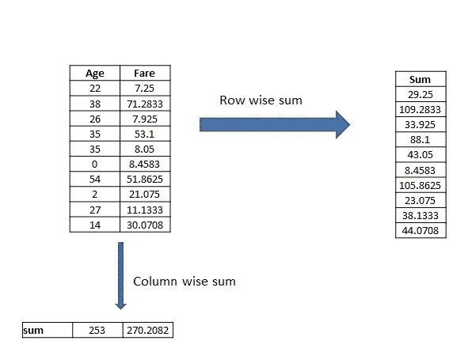

来源:Self

虽然结果没有太多的实际用途，但可以很好地证明我们正在学习的任务。此外，为简化起见，仅显示了每个变量下的前 10 个值。现在让我们看看上面的过程是如何在 R 和 Python 中完成的

**R —版本**

在 R 中，任何函数都可以通过使用 *apply()* 函数应用于数据帧，该函数是 R 基础包的一部分。 *apply()* 函数的语法是: *apply(数据帧，边距，函数)*。第一个参数是我们希望对其应用函数的数据帧或数据帧子集。Margin 控制函数是按行还是按列应用，Margin = 1 表示按行操作，Margin = 2 表示按列操作。让我们看看 apply()函数的运行情况:

```
# calculating sum of Age and Fare column (Column wise)apply(select(titanic, Age, Fare), 2, sum, na.rm = TRUE)# calculating sum of Age and Fare column (Row wise)apply(select(titanic, Age, Fare), 1, sum, na.rm = TRUE)
```

我们首先使用 *select()* 函数从 titanic 数据集中取出 Age 和 Fare 列，然后使用 *apply()* 函数，将 sum 函数作为数据的第三个参数，首先按列(Margin = 2)，然后按行(Margin = 1)。na.rm = TRUE 的参数用于告诉 *apply()* 函数忽略任何遇到的 na 值。

**Python —版本**

在熊猫中，我们有一个类似的函数叫做 *apply()* 来完成任务。我们将看到它的运行，但在此之前，让我们了解它的论点。我们必须将想要应用于数据框和轴信息的函数作为参数传递给 *apply()* 函数。Axis = 0 表示按行操作，axis = 1 表示按列操作。

```
# calculating sum of Age and Fare column (Column wise)titanic[[‘Fare’, ‘Age’]].apply(‘sum’, axis = 1)# calculating sum of Age and Fare column (Row wise)titanic[[‘Fare’, ‘Age’]].apply(‘sum’, axis = 0)
```

引号中的第一个参数“sum”告诉 pandas 执行 sum 操作。虽然，你可以使用任何你选择的功能，除了熊猫已经提供的功能。

**3。** **分组并应用聚合函数**

在回答某些值/每个分类变量值等问题时，对数据框进行分组变得至关重要。在 titanic 数据集的情况下，如果我们被问及每种性别的平均票价是多少，那么我们需要首先根据性别对数据进行分组，然后执行 Fare 列中每个相应值的平均值计算操作。这个问题可以如下图所示:

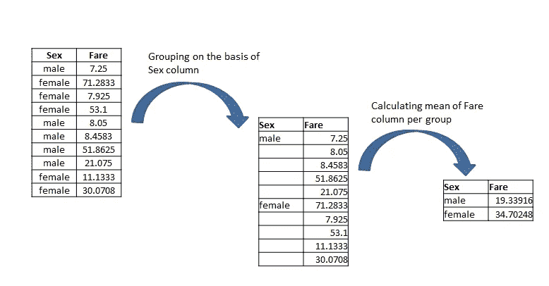

来源:Self

为了简化，上述过程考虑了 titanic 数据集的性别和票价列的前 10 个值。我们首先根据某个分类变量的值(在当前情况下为性别)进行分组，然后计算总值(平均值、总和、最大值、最小值等。)的一些其他变量，票价在当前情况下。

此外，上面显示了 Fare 列，因为我们计划以后使用它，但是您可以按照相同的分组过程用男性和女性值来可视化每个其他列。到目前为止，分组和在每个组上使用聚合函数的过程必须是清楚的。现在让我们看看这一切是如何在 R 和 Python 中完成的。

**R —版本:**

在 R 中，我们将首先使用 *group_by()* 函数对数据进行分组，然后使用*summary()*函数对票价列应用平均值聚合函数，这两个函数都是 dplyr 包的一部分。

```
titanic %>% group_by(Sex) %>% summarise(mean(Fare))
```

注意使用管线操作器， **% > %** 。这个操作符极大地简化了 R 代码。它被称为管道是有原因的，管道顶部的输出被输入到管道底部的函数。作为实例 *titanic % > % group_by(..)*表示将 titanic 传递给 group_by 函数。

**Python —版本:**

在 python 中，我们将使用 *groupby()* 函数，该函数是 pandas 包的一部分，用于对性别列上的数据帧进行分组。在我们将数据分组后，我们将对其使用 *apply()* 函数来计算 Fare 列的平均值。

```
g = titanic.groupby(‘Sex’)g[[‘Fare’]].apply(‘mean’)
```

Pandas 的默认特征是将分组后的列作为分组数据框的索引。您应该运行以上两个命令，以了解这有多有用。

**4。** **数据框旋转**

旋转数据框对于从中提取信息非常有用。为了理解旋转，让我们尝试回答一个与泰坦尼克号数据框相关的问题。

乘坐三等舱的男性乘客中有多少人幸存？

解决这个问题的一种方法是，首先按性别对数据进行分组，然后按 Pclass 进行另一轮分组，然后计算包含 Pclass 组 3 的男性组中 1 的数量。如下图所示:

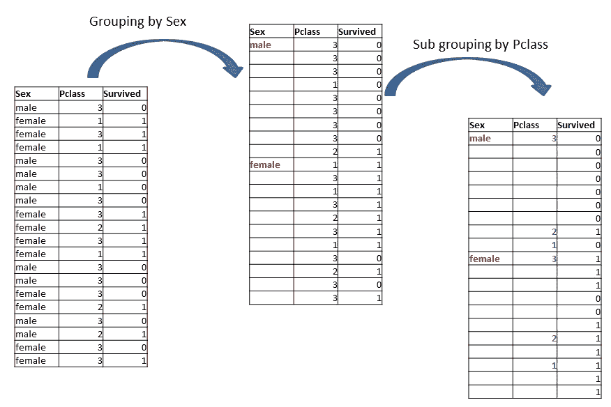

来源:Self

你现在可以很容易地回答这个问题，通过找出对应于 Pclass = 3 的幸存列(= 0)下的 1 的数量，对应于性别=男性。为了简化，上面只考虑了 20 个记录。

因为在组内分组的过程可以回答我们的问题，但是有一个更简单的方法来解决这样的问题，通过旋转。相同的数据如果进行透视，看起来应该是这样的:

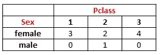

来源:Self

上表显示了在不同的性别和性别值下 1 的数量。旋转既方便又容易解释。所以让我们看看 R & Python 中的旋转是如何完成的

**R —版本:**

在 R 中，为了制作数据透视表，我们将使用 reshape2 库中的函数以及 dplyr 中的函数。在 R 中制作像 excel 一样的数据透视表有点棘手，让我们看看如何制作一个

```
x <- select(titanic, Sex, Pclass, Survived)y <- x %>% group_by(Sex, Pclass) %>% summarise(sum(Survived))pt <- dcast(y, Sex~Pclass)
```

我们首先在性别列上对数据进行分组&再次在 Pclass 列上。在分组数据上，我们使用 *sum()* 函数来计算幸存列的总和(因为 0 代表未幸存，1 代表幸存，所以总和将给出幸存人员的总数)。一旦数据被分组，我们将使用 reshape2 库的 *dcast()* 函数将数据框转换成典型的数据透视表的形状。

**Python 版本:**

在 Python (Pandas)中，从数据生成数据透视表比 R 相对容易。可以使用的函数是 *Pandas.pivot_table()* 。调整该表需要一些参数，但我们将在 titanic data frame 上使用其中的 4 个参数来生成我们想要的数据透视表。这些论点是:

**数据**:要使用的数据集，**索引**:将在数据透视表中用作索引的列名，**列**:其值将在数据透视表中用作列名的列名，**值**:将用于计算数据透视表的值的列名， **aggfunc** :对值列的值使用的聚合函数

现在让我们从 Sex，Pclass & Survived 列创建一个数据透视表:

```
pt = pd.pivot_table(titanic, index = ‘Sex’, columns = ‘Pclass’, values = ‘Survived’, aggfunc = ‘sum’)
```

正如我所说的，这比 R 版创建数据透视表相对容易。

**5。** **数据帧融化**

数据帧融合可以被视为旋转的相反过程。随着旋转向数据框添加更多列并减少行数，数据框的融合意味着在减少列数的同时添加更多行。作为一个例子，我们上面创建的数据透视表在融化时可以是这样的:

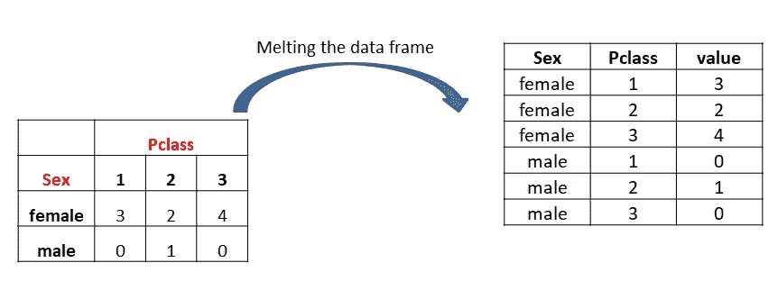

来源:Self

Melting 只是选取了列名&用它们制作了一个单独的列，保持了所有信息的完整性。现在让我们看看数据帧是如何在 R 和 Python 中融合的

**R —版本:**

在 R 中我们可以使用 reshape2 库的 *melt()* 函数来一次性融化一个数据帧。假设我们上面创建的数据透视表被分配给变量 pt，我们将使用这个 pt 来演示熔化

```
melt(pt, variable.name = ‘Pclass’)
```

variable.name 参数将是新创建的列的名称，其中的值是从现有的列名中选取的。

**Python 版本:**

在 python 中，pandas 包的 melt()函数用于融合透视数据框，如下所示:

```
pd.melt(pt, ignore_index=False)
```

ignore_index 默认为 True &我们必须将其设置为 False，因为在我们之前创建的数据透视表中，性别列被视为索引。

6。 **将多个数据帧合并在一起**

当信息分布在不同的数据帧中时，我们需要将两个或更多的数据帧合并在一起，并且我们需要将它们组合在单个数据帧中以进行数据分析。为了更清楚地理解这一点，假设我们想在 titanic 数据框中添加另一列，该数据框包含有关旅行等级的信息，如下图数据框所示:

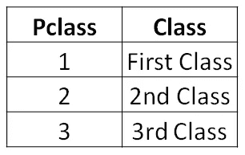

来源:Self

我在下面贴了一部分泰坦尼克号的数据框，让问题更清晰。我们有 PassengerId、Name 和 Pclass 列，我们希望向其中添加另一列，其中 Pclass 被转换为基于上表的类名。

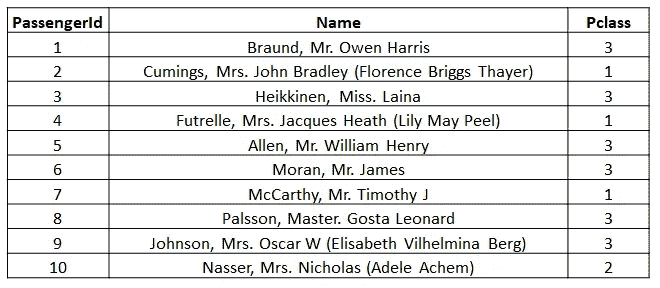

来源:Self

简而言之，我们想要一个如下所示的新数据框:

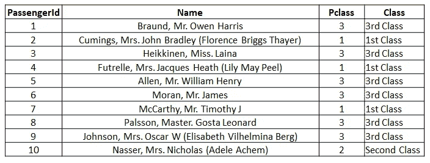

来源:Self

到目前为止，合并的好处肯定是显而易见的，同时，您可能已经猜对了，为了合并两个数据框，它们必须至少有一个公共列。如下所述，可以更清楚地理解合并过程:

*   我们有两个数据框共享一个公共列(您可以称之为关键列)
*   左数据框中的关键字与右数据框中的关键字一一匹配
*   在每次匹配时，根据正在执行的合并/连接过程的类型返回结果。

在开始编码练习之前，让我们先了解不同类型的合并/连接过程:

1.  **左连接**:在左连接中，即使没有找到匹配，也会返回左数据框的行。左列中所有与右列不匹配的值将在右数据框的列下获得 Nan 或 Null 值，如下所示:

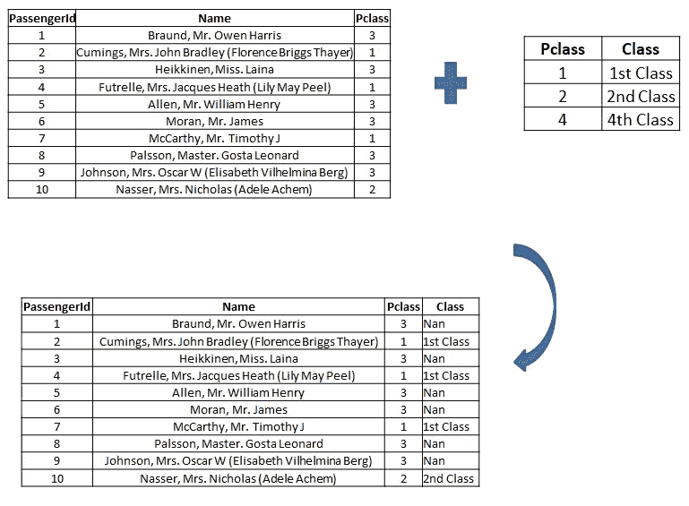

来源:Self

2.**右连接**:在右连接中，即使右数据框中的行在左数据框中没有匹配项，也会返回右数据框中的行。右数据框中所有与左数据框不匹配的值将在左数据框的列下获得 Nan/Null 值，如下所示:

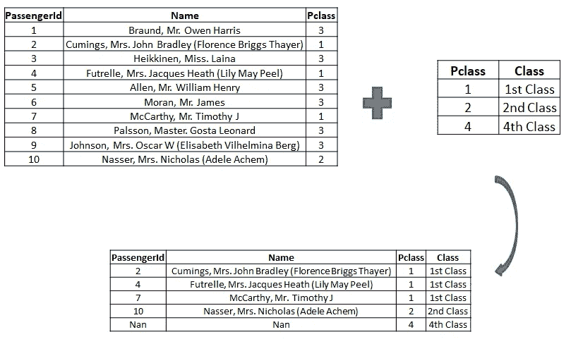

来源:Self

3.**内连接**:内连接是最常用的连接技术。仅返回找到匹配项的行，如下所示:

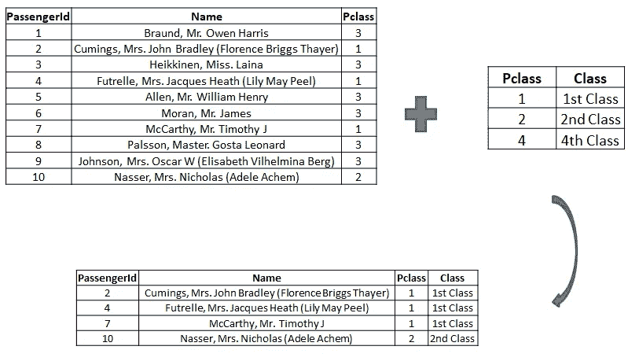

来源:Self

4.**外部/完全连接**:在外部连接中，无论是否找到匹配，都返回两个数据帧的所有行。特定数据框中与另一个数据框不匹配的所有行在另一个数据框的列下都为 Nan 或 Null，如下所示:

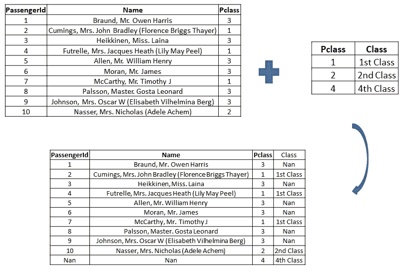

来源:Self

现在我们知道了连接的含义和它的不同类型，让我们看看所有这些是如何在 Python 和 R 中完成的

**R —版本:**

在 R 中，我们在基础包中提供了 *merge()* 函数，其主要参数如下:

**x** :左数据框， **y** :右数据框， **by** :要进行合并的列(必须为两个数据框所共有)，all.x:如果我们想要左数据框中的所有行(左连接)，则设置为 TRUE， **all.y** :如果我们想要右数据框中的所有行(右连接)，则设置为 TRUE。

注意:默认情况下， *merge()* 将执行内部连接，如果我们想要外部连接，我们需要将 all.x 和 all.y 都设置为 TRUE。

```
#We will first create the other data frame that we will merge with the titanic data framey = data.frame(Pclass = c(1,2,4), Class = c(‘1st Class’, ‘2nd Class’, ‘4th Class’))#Left Join:merge(titanic, y, by = ‘Pclass’, all.x = TRUE)#Right Join:merge(titanic, y, by = ‘Pclass’, all.y = TRUE)#Inner Join:merge(titanic, y, by = ‘Pclass’)#Outer/Full Join:merge(titanic, y, by = ‘Pclass’, all.x = TRUE, all.y = TRUE)
```

**Python —版本:**

在 Pandas 中，我们有一个 *Pandas.merge()* 函数来处理所有的合并需求。主要论点是:

**on** :需要合并的列(必须为两个数据框所共有)， **how** :合并类型，可以是“左”、“右”、“内”或“外”。

现在让我们看看如何使用它

```
#We will first create the other data frame that we will merge with the titanic data framey = pd.DataFrame({‘Pclass’:[1,2,4], ‘Class’:[‘1st Class’, ‘2nd Class’, ‘4th Class’]})#Left Join:pd.merge(titanic, y, on=’Pclass’, how = ‘left’)#Right Join:pd.merge(titanic, y, on=’Pclass’, how = ‘right’)#Inner Join:pd.merge(titanic, y, on=’Pclass’, how = ‘inner’)#Outer/Full Join:pd.merge(titanic, y, on=’Pclass’, how = ‘outer’)
```

**结论:**

尽管除了强调各种数据转换技术之外，这个主题并不需要一个结论，但是本文在数据转换方面对 R 和 Python 进行了比较。虽然我们只讨论了 6 种数据框架转换技术，对其做出判断是不公平的，但有一点我们可以肯定，Python 和 R 都足够强大，可以非常轻松地处理任何复杂的数据转换任务。到目前为止，我的个人观点是，对于数据分析和可视化，R 比 Python 容易得多，当谈到机器学习时，Python 占了上风。但是，这也是我个人的观点，也是可以争论的。