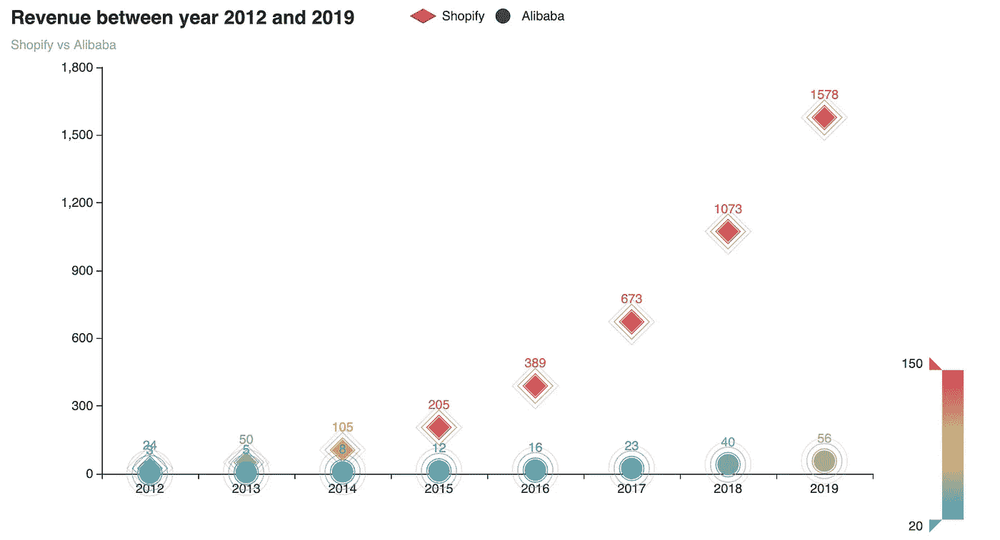
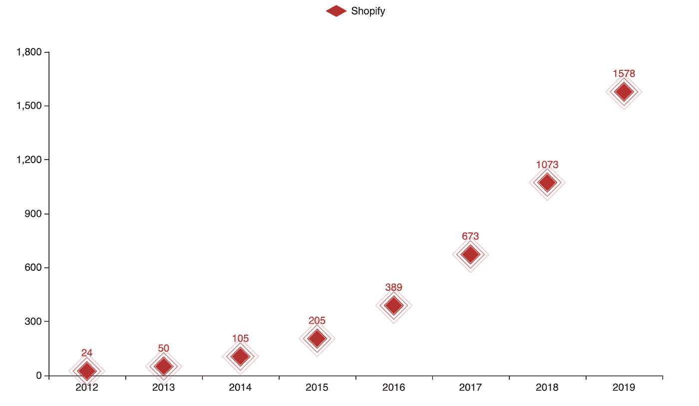
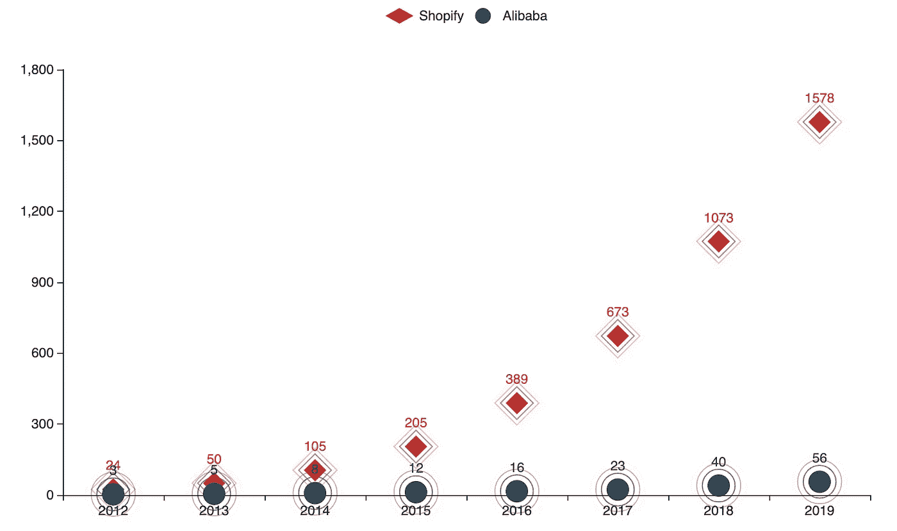
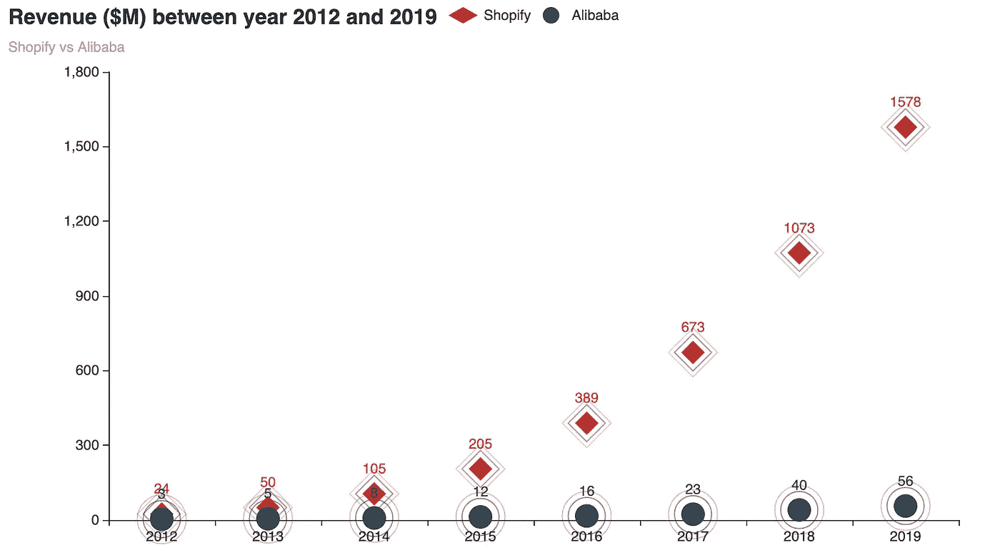
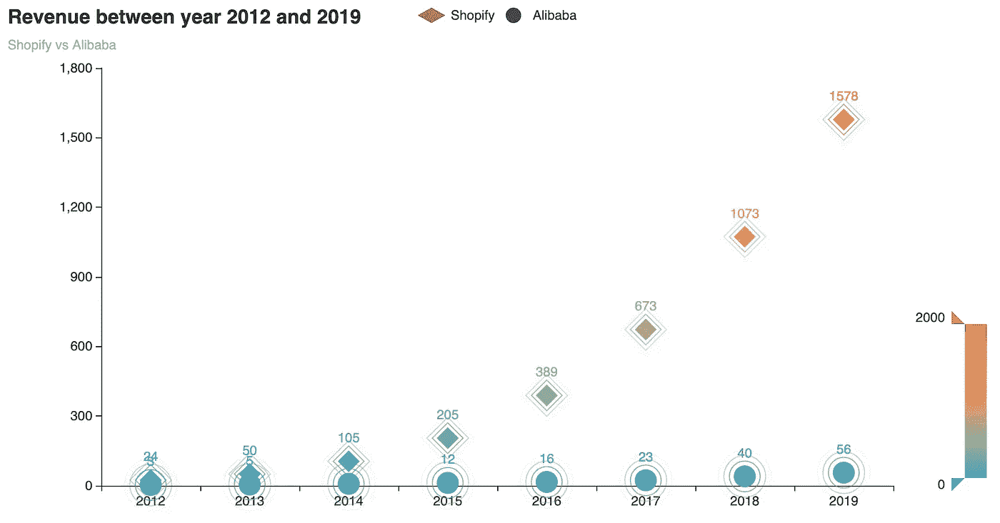
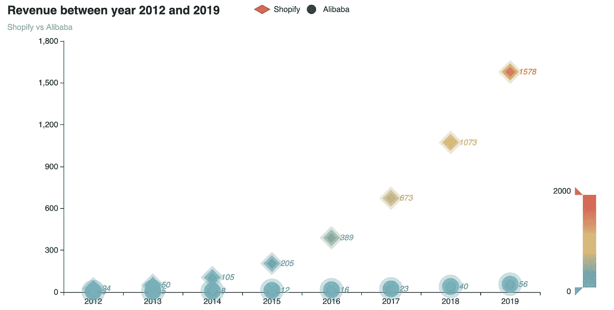

# 用 Python 制作几行漂亮的散点图，让你的报告出类拔萃

> 原文：<https://towardsdatascience.com/make-a-beautiful-scatterplot-in-in-a-few-lines-in-python-to-make-your-report-outstanding-f47db0532094?source=collection_archive---------58----------------------->

## 由 Pyechart 库支持

每个人都知道散点图是什么样子——几个点分散在具有水平轴和垂直轴的平面上。散点图是说明趋势的有用数据可视化工具。

我在本教程中将要介绍的散点图比普通的散点图更吸引人。它是动态的，每个点都有涟漪效应，你可以滑动滚动条来过滤数据。下面的图表是我们要做的。要创建这个图表，您只需要几行 Python 代码。



在编写这几行代码之前，您需要安装名为 Pyechart 的可视化软件包。这是一个 Python echarts 绘图库。它提供了 30 多种图表。最新版本是 1.7.1，发布于 2020 年 3 月 12 日。你可以 pip 安装它。

```
pip install pyecharts==1.7.1
```

安装完库后，我们可以开始构建漂亮的条形图:

```
#import libraries
from pyecharts.charts import Bar
from pyecharts import options as opts#create dataset for the chart, v1 is the revenue of Shopify in million dollars, x is the year
v1 = [24,50,105,205,389,673,1073,1578]
x = [“2012”, “2013”, “2014”, “2015”, “2016”, “2017”,”2018",”2019"]from pyecharts.charts import EffectScatter
from pyecharts.globals import SymbolType
from pyecharts import options as optsc = (
 EffectScatter()
 .add_xaxis(x)
 .add_yaxis(“Shopify”, v1,is_selected = True,symbol_size = 20, symbol=SymbolType.DIAMOND)
 )
c.render_notebook()
```

只用三行代码，你就会得到这样一个图表，



您可以添加另一系列数据来比较两家公司的收入表现。我准备再加一个电商——阿里巴巴。

```
v1 = [24,50,105,205,389,673,1073,1578] @Shopify revenue
v2 = [3,5,8,12,16,23,40,56,72]. #Alibaba revenue
x = [“2012”, “2013”, “2014”, “2015”, “2016”, “2017”,”2018",”2019"]from pyecharts.charts import EffectScatter
from pyecharts.globals import SymbolType
from pyecharts import options as optsc = (
 EffectScatter()
 .add_xaxis(x)
 .add_yaxis(“Shopify”, v1,is_selected = True,symbol_size = 20, symbol=SymbolType.DIAMOND)
 .add_yaxis(“Alibaba”, v2,is_selected = True,symbol_size = 20)
 )
c.render_notebook()
```



Pyechart 库提供了许多种形状，如“圆形”、“矩形”、“圆形矩形”、“三角形”、“菱形”、“大头针”、“箭头”和“无”。您需要使用大写字母将这些值传递给参数，例如 SymbolType.DIAMOND。

现在让我们添加标题和副标题来完成图表。

```
v1 = [24,50,105,205,389,673,1073,1578]
v2 = [3,5,8,12,16,23,40,56,72]x = [“2012”, “2013”, “2014”, “2015”, “2016”, “2017”,”2018",”2019"]from pyecharts.charts import EffectScatter
from pyecharts.globals import SymbolType
from pyecharts import options as opts

c = (
 EffectScatter(opts.InitOpts(width = ‘900px’,height = ‘500px’))
 .add_xaxis(x)
 .add_yaxis(“Shopify”, v1,is_selected = True,symbol_size = 20, symbol=SymbolType.DIAMOND)
 .add_yaxis(“Alibaba”, v2,is_selected = True,symbol_size = 20)
 .set_global_opts(
 title_opts=opts.TitleOpts(title=”Revenue ($M) between year 2012 and 2019", subtitle=”Shopify vs Alibaba”,pos_left=”left”),
 )
 )
c.render_notebook()
```



我们可以进一步美化图表，让图表更具互动性。我们将添加一个滑动条。

要添加滑动条，我们需要添加选项。全局选项设置中的 VisualMapopts 函数。

```
 v1 = [24,50,105,205,389,673,1073,1578]
v2 = [3,5,8,12,16,23,40,56,72]
x = [“2012”, “2013”, “2014”, “2015”, “2016”, “2017”,”2018",”2019"]from pyecharts.charts import EffectScatter
from pyecharts.globals import SymbolType
from pyecharts import options as optsc = (
 EffectScatter(opts.InitOpts(width = ‘900px’,height = ‘500px’))
 .add_xaxis(x)
 .add_yaxis(“Shopify”, v1,is_selected = True,symbol_size = 20, symbol=SymbolType.DIAMOND)
 .add_yaxis(“Alibaba”, v2,is_selected = True,symbol_size = 20)
 .set_global_opts(
 title_opts=opts.TitleOpts(title=”Revenue between year 2012 and 2019", subtitle=”Shopify vs Alibaba”,pos_left=”left”),
 **visualmap_opts=opts.VisualMapOpts(pos_left=”right”,type_=”color”,  max_=2000, min_=0, pos_bottom=50)** 
 )
 )
c.render_notebook()
```

pos_left 是定义滑动条的位置。

类型是定义滑动条的类型，可以是“颜色”或“大小”。

max_ 和 min_ 限制滑动条的最大值和最小值。

pos_bottom 用于定义到底部的距离。



Pyechart 提供了美化标签和涟漪效果的选项。

使用标签选项，您可以定义位置、字体、大小、粗细、颜色、对齐等。

使用效果选项，你可以改变笔刷类型，颜色，符号，符号大小等来获得你想要的动画效果。

我给标签和效果选项添加了一些参数，如下所示。

```
v1 = [24,50,105,205,389,673,1073,1578]
v2 = [3,5,8,12,16,23,40,56,72]
x = [“2012”, “2013”, “2014”, “2015”, “2016”, “2017”,”2018",”2019"]from pyecharts.charts import EffectScatter
from pyecharts.globals import SymbolType
from pyecharts import options as opts

c = (
 EffectScatter()
 .add_xaxis(x)
 .add_yaxis(“Shopify”, v1,is_selected = True,symbol_size = 15, symbol=SymbolType.DIAMOND)
 .add_yaxis(“Alibaba”, v2,is_selected = True,symbol_size = 15)
 .set_global_opts(
 title_opts=opts.TitleOpts(title=”Revenue between year 2012 and 2019", subtitle=”Shopify vs Alibaba”,pos_left=”left”), 
 visualmap_opts=opts.VisualMapOpts(pos_left=”right”,type_=”color”, max_=2000, min_=0,pos_bottom=50))
 .set_series_opts(
 **label_opts=opts.LabelOpts(is_show=True, #whether the label will be shown
 position=’right’, #location of the label
 font_style=’italic’), #font of the label
 effect_opts = opts.EffectOpts(scale = 3, #scale of ripples
 period=5, #period of the animation
 brush_type=’fill’), #either ‘stroke’ or ‘fill’
 )**
)
c.render_notebook()
```

你会有一个更加引人注目的图表。



有许多选项和参数，你可以探索和尝试，以美化你的图表。

如果你对制作其他类型的漂亮图表感兴趣，你可以看看我的其他帖子。

1.  [用 python 制作美丽的 Nightinggale 玫瑰图-可视化 covid19 死亡率](https://medium.com/python-in-plain-english/make-beautiful-nightingale-rose-chart-in-python-covid-19-death-rate-141a7a49bb61)
2.  [用 Python 用几行字做一个漂亮的水球图](https://medium.com/python-in-plain-english/make-beautiful-water-polo-chart-in-a-few-lines-in-python-5d04f3f9335d)
3.  [用 Python 中的几行代码制作一个漂亮的条形图](https://medium.com/@han.candice/make-a-beautiful-bar-chart-in-just-few-lines-in-python-5625ebc71c49)
4.  [用 Python 制作的动画泡泡图——灵感来自汉斯·罗斯林教授](https://medium.com/@han.candice/animated-bubble-chart-with-plotly-in-python-inspired-by-professor-hans-rosling-b7262298dd03)
5.  [用 Python 制作最可爱的图表——用手绘图表可视化你的数据](https://medium.com/p/make-the-cutest-chart-in-python-visualize-your-data-with-hand-drawn-charts-f21157f76b4b)
6.  [使用 Python 中的 Matplotlib 绘制一个独特的柱状图](https://medium.com/python-in-plain-english/draw-a-unique-barplot-using-matplotlib-in-python-f6b88b4a6f89)