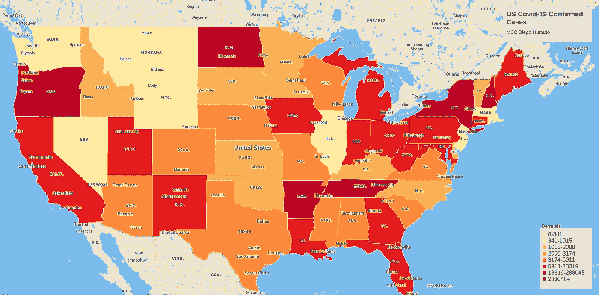
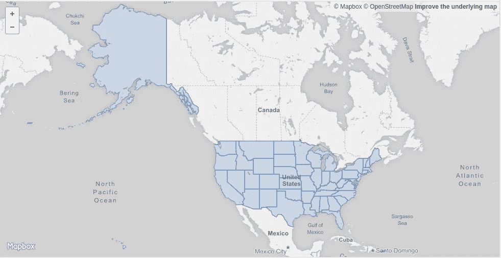
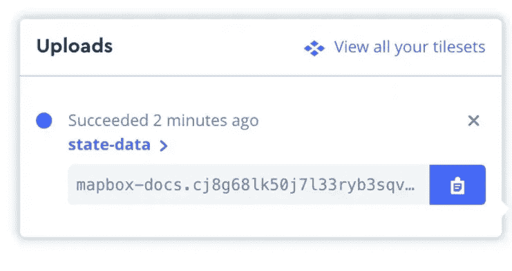
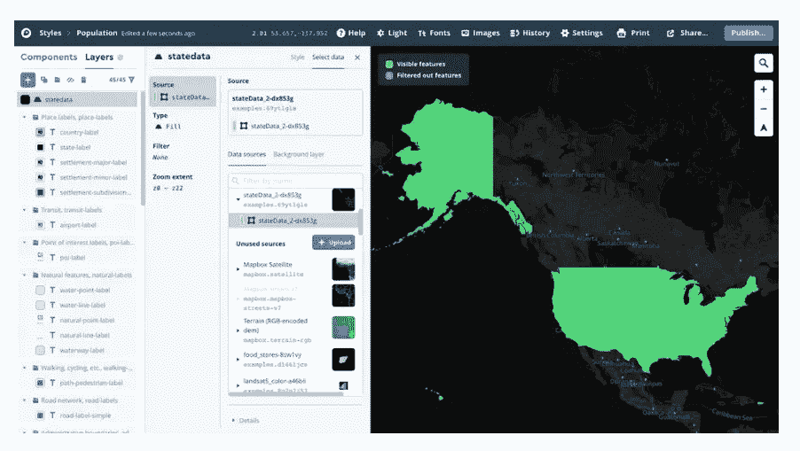
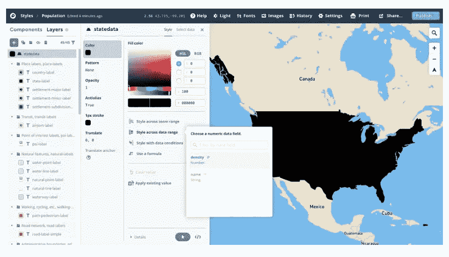
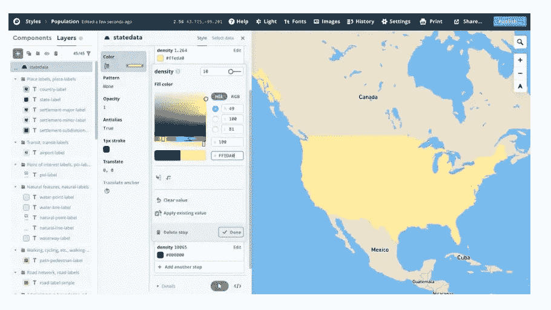
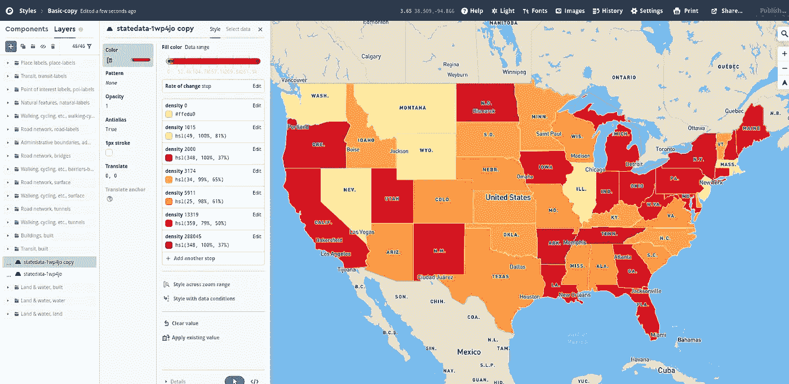
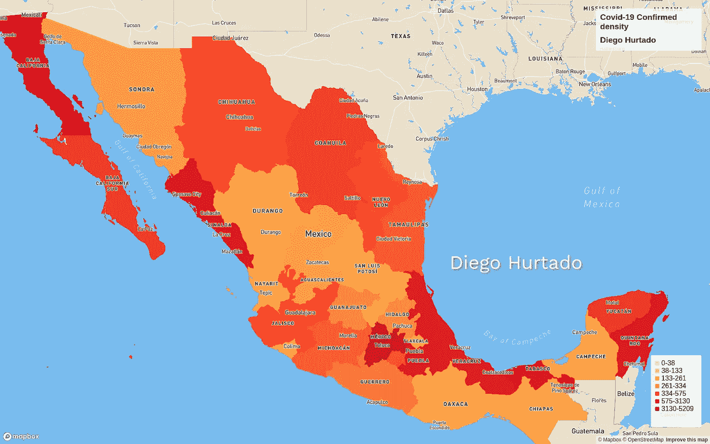

# 在 Mapbox 中制作新冠肺炎地图

> 原文：<https://towardsdatascience.com/make-a-covid-19-choropleth-map-in-mapbox-5c93ac86e907?source=collection_archive---------36----------------------->

## 美国各州新冠肺炎比率的可视化



美国新冠肺炎确诊病例。(迭戈·乌尔塔多)

作者:[迭戈·乌尔塔多](https://medium.com/u/3b572bafb88a?source=post_page-----5c93ac86e907--------------------------------)

在地图上显示数据分布的一种方法是使用 choropleth，这是一种专题地图，其中的区域根据特定值进行着色。Choropleth 地图提供了一种简单的方法来直观显示某个地理区域内的测量值如何变化或显示某个区域内的可变性水平，是一种[专题地图](https://en.wikipedia.org/wiki/Thematic_map)，其中各个区域按照代表每个区域内地理特征汇总的统计变量(如人口密度或新冠肺炎病例)的比例进行着色或图案化。在本指南中，您将使用 Mapbox Studio 和 Mapbox GL JS 制作显示新冠肺炎确诊病例密度的美国各州地图。


美国各州显示新冠肺炎确诊病例密度(迭戈·乌尔塔多)

# **入门**

在本指南中，您将使用两种地图框工具:

*   [Mapbox Studio](https://docs.mapbox.com/help/glossary/mapbox-studio) 添加您的数据并创建您的地图样式。
*   [Mapbox GL JS](https://docs.mapbox.com/help/glossary/mapbox-gl-js) 为您的地图添加交互性，并将其发布到 web 上。

# 处理数据

首先，从[美国新冠肺炎追踪](https://covidtracking.com/api/states/daily) API、[美国各州首府](https://vega.github.io/vega-datasets/data/us-state-capitals.json)和 [GeoJSON](https://raw.githubusercontent.com/DiegoFurtt/Covid-19-Choropleth-Map/master/covidData.geojson) 表示美国空间(几何图形)的对象下载。根据 [GeoJSON 规范(RFC 7946)](https://tools.ietf.org/html/rfc7946) :

> GeoJSON 是一种用于编码各种地理数据结构的格式[…]。GeoJSON 对象可以表示一个空间区域(几何)、一个空间有界实体(要素)或一组要素(要素集合)。GeoJSON 支持以下几何类型:点、线串、面、多点、多线串、多面和 GeometryCollection。GeoJSON 中的要素包含几何对象和附加属性，FeatureCollection 包含要素列表。



美国空间几何 geoJson (Diego Hurtado)

我们甚至可以使用这些属性来设计我们的传单向量。这里有一个 GeoJSON 的例子:

```
var geojsonFeature = {     
    "type": "Feature",     
    "properties": {         
    "name": "Alabama",         
    "density": 6270,         
    "geometry": { "type": "Polygon", "coordinates": []} 
};
```

# 数据清理

下载文件后，过滤并清理数据。这个过程的某些部分是完全可选的，比如重命名或过滤字段。但是，过滤声明 API 没有信息(' AS '，' GU '，' MP '，' VI ')。过滤掉美国投影中未显示的不需要的要素，如关岛和其他美国领土。如果不像关岛那样对这些州进行过滤，重新投影后将会得到空的几何，这会给信息的索引带来问题。

清理数据后，用每个州的确认数据替换 geoJSON 的密度值。

```
for i in range(1,len(s_array)):
    features = data_geo['features'][i]
    features['properties']['density'] = int(s_array[i])

    data_geo['features'][i]['properties']['density'] =    int(confirmedCasesStates[i])
```

更新数据的示例:

```
data_geo['features'][Alabama]['properties'][6270] =    int(confirmedCasesStates[6500])
```

# 在 Studio 中上传并设计风格

要学习重新投影您的数据以添加到您的投影中，请跟随我们的如何在 Mapbox Studio 中创建 choropleth 地图的操作视频，跟随[本教程](https://www.youtube.com/watch?v=HZpNeQC0Obg&feature=emb_title)使用 map box Studio 创建 choropleth 地图，如果您错过了某些步骤。来源:[地图框](https://www.mapbox.com/videos/how-to/create-a-choropleth-map-in-mapbox-studio/)

要将 GeoJSON 文件上传到 Mapbox，将其直接拖放到 [tileset dashboard](https://studio.mapbox.com/tilesets/) 中，或者如果文件太大或几何图形需要简化，使用 Tippecanoe 将其平铺。

在您的 Tilesets 页面上，单击**新建 tileset** 按钮。选择[文件](https://raw.githubusercontent.com/DiegoFurtt/Covid-19-Choropleth-Map/master/covidData.geojson) `covidataStates.geojson`并上传至您的账户。

上传完成后，单击文件名旁边的箭头打开其信息页面。



来源:地图框

# 创建新样式

检查完数据后，是时候创建新的样式了，这样您就可以将它放在地图上了！转到您的[风格页面](https://studio.mapbox.com/)。点击**新样式**按钮。找到*基础模板*样式，点击**自定义基础模板**。


来源:地图框

# 添加新层

要添加人口密度数据并设置其样式，您需要向地图添加新图层:

1.  如果造型面板显示**组件**选项卡，切换到**层**选项卡。
2.  在图层面板的顶部，点击 **+** 按钮添加一个自定义图层。

在*新图层*面板中，在*数据源*列表中查找`statedata`源。单击 tileset，然后选择源图层作为此新样式图层的源。

默认的基本地图视图不以美国为中心。Mapbox Studio 识别出您上传的数据集中在不同的位置，因此它显示消息*“此 tileset 在您的地图视图中不可用。”*点击**转到数据**，地图视图将重新聚焦美国。

您的新图层将在 x 射线图上高亮显示。



来源:地图框

点击**样式**标签，地图将切换回样式模式显示你的新图层。您将在地图上看到默认样式的州数据(100%不透明度的黑色)。


# 设置图层样式

在 Mapbox Studio 样式编辑器中，您可以根据新冠肺炎确诊病例密度为每个州指定一种颜色。在`statedata`图层中点击**样式**链接。接下来，点击**数据范围样式**。

选择一个数字数据字段，选择`density`,因为您想要根据其新冠肺炎确诊病例密度设置每个州的样式。



变化率为*线性*。点击**编辑**并改为选择**步骤**。点击**完成**。由于您已将变化率设置为步长，因此停止点之间的每个密度范围的颜色将是一致的。


现在是时候开始添加停止和颜色了！您将创建几个停靠点，将各州分成具有相似新冠肺炎确诊病例密度的组。在第一个密度停止点点击**编辑**。第一站固定在 *1.264* ，基于你上传的数据集中的信息。点击它，改变颜色为`#FFEDA0`。点击**完成**。

将下一站的*密度*改为 361，颜色也改为`#FFEDA0`。点击**完成**。



点击 **+添加另一个停止点**。将*密度*改为 361(数据最小值)，将颜色改为`#FED976`。点击**完成**。

根据确诊病例的数量创建以下附加步骤示例:

*   `341` : `#FED976`
*   `1050` : `#FEB24C`
*   `2000` : `#FD8D3C`
*   `5911` : `#FC4E2A`
*   `13319` : `#E31A1C`
*   `288054` : `#BD0026`



# 发布样式

现在你的地图看起来不错，是时候发布了！点击屏幕右上角的**发布**按钮，然后在下一个提示下再次点击**发布**。


# 网页

以下是您需要开始的内容:

下载[模板](https://github.com/DiegoFurtt/Covid-19-Choropleth-Map/blob/master/choroplethMapbox.html):

*   [**一个访问令牌**](https://docs.mapbox.com/help/glossary/access-token) 。您可以在您的[帐户页面](https://www.mapbox.com/account/)上找到您的访问令牌。
*   [**样式 URL**](https://docs.mapbox.com/help/glossary/style-url) 为您的样式。从你的[样式](https://www.mapbox.com/studio)页面，点击你的人口密度样式旁边的**菜单**按钮，然后点击剪贴板图标复制**样式 URL** 。
*   [**Mapbox GL JS**](https://www.mapbox.com/mapbox-gl-js) 。用于构建 web 地图的 Mapbox JavaScript API。
*   **一个文本编辑器**。毕竟，您将编写 HTML、CSS 和 JavaScript。

现在，您已经为页面添加了结构，您可以开始编写一些 JavaScript 了！您需要做的第一件事是添加您的访问令牌。没有这一点，其余的代码将无法工作。*注意:下面所有的代码都应该在* `*script*` *标签之间。*:

```
mapboxgl.accessToken = 'pk.......';
```

现在您已经添加了页面的结构，您可以向`map` div 添加一个 map 对象。对于您在本指南第 1 部分中创建的样式，一定要用[样式 URL](https://docs.mapbox.com/help/glossary/style-url) 替换`your-style-url`——否则，代码将无法工作！

```
var map = new mapboxgl.Map({
  container: 'map', // container id
  style: 'your-style-url' // replace this with your style URL
});
```

# 创建间隔和颜色数组

创建包含州数据的图层样式时使用的停靠点列表，将允许我们在后续步骤中向地图添加图例。

```
var layers = ['0-10', '10-20', '20-50', '50-100', '100-200', '200-500', '500-1000', '1000+'];
var colors = ['#FFEDA0', '#FED976', '#FEB24C', '#FD8D3C', '#FC4E2A', '#E31A1C', '#BD0026', '#800026'];
```

# 任务完成

您已经创建了一个交互式 choropleth 地图！


美国各州新冠肺炎比率的可视化(Diego Hurtado)

要学习重新投影您的数据以添加到您的投影中，请跟随我们的操作视频[“如何在 Mapbox Studio 中创建 choropleth 地图”。](https://www.youtube.com/watch?v=HZpNeQC0Obg&feature=emb_title)

另一个例子是[墨西哥](/analyze-and-visualize-data-for-covid-19-mexico-b33cddf386bf)各州新冠肺炎比率的可视化。



墨西哥新冠肺炎率的可视化

领英:【https://www.linkedin.com/in/diego-gustavo-hurtado-olivares/ 

[#BuiltWithMapbox](https://twitter.com/hashtag/BuiltWithMapbox?) 。