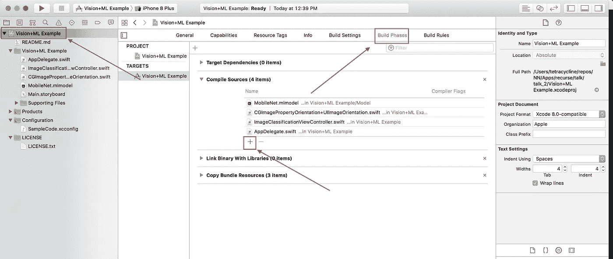
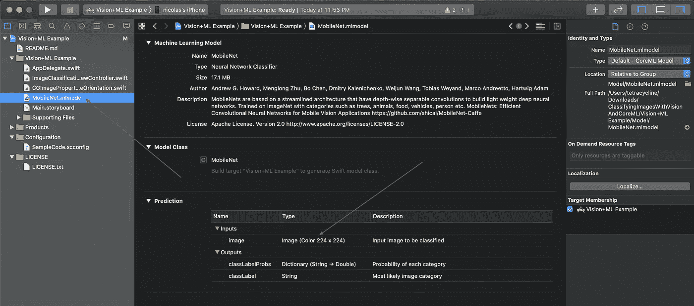

# 五分钟做一个深度学习 iOS App

> 原文：<https://towardsdatascience.com/make-a-deep-learning-ios-app-in-five-minutes-b05a5c6b03a4?source=collection_archive---------19----------------------->

## 制作一个深度学习应用程序可能看起来令人生畏，但实际上并没有那么糟糕。


照片由 [**泰勒·拉斯托维奇**](https://www.pexels.com/@lastly?utm_content=attributionCopyText&utm_medium=referral&utm_source=pexels) 发自 [**佩克斯**](https://www.pexels.com/photo/black-iphone-7-on-brown-table-699122/?utm_content=attributionCopyText&utm_medium=referral&utm_source=pexels)

# 介绍

深度学习现在真的很热，人们似乎喜欢 iPhones。
放在一起吧:)。不久前还没有很多关于如何做这件事的教程，现在有很多了。我想用
增加一个最高效的最小工作示例。我们将建立一个深度学习 iOS 应用程序，它可以在五分钟内对 CIFAR10 进行分类。深度学习和 iOS 开发可能看起来很可怕，但一旦开始，它们并不那么糟糕。本教程结束时，您应该有一个工作的 iPhone 应用程序，您可以使用 Keras 训练的自定义模型在内置仿真器中运行。

如果你想看本教程的现场代码演示，请查看下面的视频，我现场编码本教程，并证明它真的只需要五分钟。

本教程的视频演示。

# 设置

按照本教程，你需要 Python3 和一台运行最新 XCode 的 MacBook。你可以通过购买一台 Mac 来获得 XCode，通过运行
安装必要的 Python3 库:

```
pip install keras coremltools
```

# 培训/准备模型

我们没有时间从头开始设计模型！我们只有 5 分钟了！让我们从 Keras 文档中偷[一个。如果您熟悉 Keras，您会看到它只是加载到 CIFAR 数据集中，然后在其上训练一个简单的 CNN。为了快速完成本教程，我们需要做一些调整。首先，将第 19 行中的 epochs 数改为只有 1。这将使我们的模型在 Macbook Pro 上大约 3 分钟内完成训练。](https://github.com/keras-team/keras/blob/master/examples/cifar10_cnn.py)

接下来，将第 20 行的 data_augmentation 参数更改为 False。这将使它根据提供的数据进行训练，并且不会翻转或调整任何训练图像。这只是加快了一点速度，但在现实中，如果你想训练一个好的模型，你绝对应该离开这些设置。

最后，去掉第 121 行及以后的内容，我们不需要保存我们的模型，也不需要(想)知道有多好(坏？)是。我们只是需要一个模型快！

在我们开始培训之前，还有最后一件事，我们需要把这个经过培训的模型做成史蒂夫·乔布斯能够理解的形式。为此，我们向[苹果寻求指导](https://developer.apple.com/documentation/coreml/converting_trained_models_to_core_ml)。在页面的底部，你会看到一个“转换你的模型”部分窃取了这些代码行，并将它们粘贴在我们窃取的 Python 脚本的底部。我们需要做一些小的改动，使它们能够与 Keras 模型一起工作，因为这些模型是为 Cafe 编写的。如下更新它们。基本上，我们只需要将转换器调用改为 Keras，而不是 Caffe。然后我们需要填充一些关于我们模型的信息。

将 Keras 模型转换为 CoreML 以用于 iOS。

这个 convert 方法有几个值得解开的字段。第一个参数是我们想要转换的模型，它应该是一个 Keras 模型。

*   **input_names** 是可选名称，将在核心 ML 模型的接口中使用，以引用 Keras 模型的输入。对于这个例子，我把它们都叫做“图像”。
*   **image_input_names** 是 Keras 模型的输入名称列表，这是上面 input_names 字段的子集。核心 ML 可以将这些名称视为图像
*   **class_labels** 是模型将使用的类标签列表。对于 CIFAR10，该列表是飞机、汽车、鸟、猫、鹿、狗、青蛙、马、船、卡车

# 构建一个 iOS 应用程序

当我们的模型正在酝酿时，让我们建立一个用于分类图像的 iOS 应用程序。我没有时间设计应用程序，所以我打算偷一个苹果认可的。此命令将下载一个使用图像分类模型的 iOS Xcode 项目。

```
wget [https://docs-assets.developer.apple.com/published/a6ab4bc7df/ClassifyingImagesWithVisionAndCoreML.zip](https://docs-assets.developer.apple.com/published/cdf821b12b/ClassifyingImagesWithVisionAndCoreML.zip)unzip ClassifyingImageswithVisionandCoreML.zip
```

人们似乎喜欢苹果，所以它不会太差，对不对？现在只要打开这个
花哨的新 Xcode 项目，我们就完成了我们的应用程序！

(注意，有时苹果喜欢毫无理由地更改他们链接的名称，所以如果上面的 wget 命令不起作用，你也可以在这里下载这个 Xcode 项目

# 修理坏掉的东西

有几件事不太适合这个应用程序，我们需要注意。

1.我们需要将新训练的模型添加到 Xcode 项目中，并更新代码以使用我们的模型。

2.CIFAR 中使用的图片大小与您的 iPhone 拍摄的图片大小不同。我们需要缩放图像。

## 添加模型

将我们刚刚用 Keras 训练的新模型复制到我们的应用程序项目中的文件夹，该文件夹位于*Vision+ML Example/Model/cifar . ML Model*下，并通过单击下图中概述的链接使用 Xcode 的构建阶段来链接它。



如何将训练好的 Keras 模型添加到 Xcode 项目中。

现在，我们已经将新训练的模型放在项目可以访问的地方，让我们更新 imageclassificationviewcontroller . swift 中的代码，以识别我们的新模型更改行 30(可能会更改)为:

```
let model = try VNCoreMLModel(for: CIFAR().model)
```

我们只是将模型名称从 MobileNet 更改为我们在上一步中所称的模型，在本例中，我们将其命名为 CIFAR。就这样，我们的模型现在在代码中链接起来了。最后一步是管理图像大小。

## 修复规模问题

我们的 Keras 模型期望图像是 64 x 64 x 3 的图像。我们需要让代码反映这一点。默认值为 224 x 224 x 3。您可以通过在 Xcode 中单击 MobileNet.mlmodel 模型文件来查看这一点。在预测下，您将看到预期的图像大小。



如何在默认机型上查看图像输入尺寸？

幸运的是 StackOverflow 在这里支持我们，我刚刚谷歌了一下“在 swift 中调整图像大小”,这个方便的解决方案就出现了，它确实做了我们需要的事情。将 Swift3 代码复制到第 20 行。

调整图像大小的 Swift 代码。

现在我们只需要在我们的应用程序中调用这个新功能。将 updateClassifications 的前几行改为:

这将在通过我们的模型运行之前调整所有图像的大小。现在只需点击播放按钮，享受你的应用程序！

# 结束了

我们完了！现在就建 app:)。你可以把任何简单的 Keras 型号
放到 iOS 应用程序中。试着把模型做的更好，或者把其他东西分类。希望这篇教程展示了在 iPhone 上部署深度学习模型是多么简单。