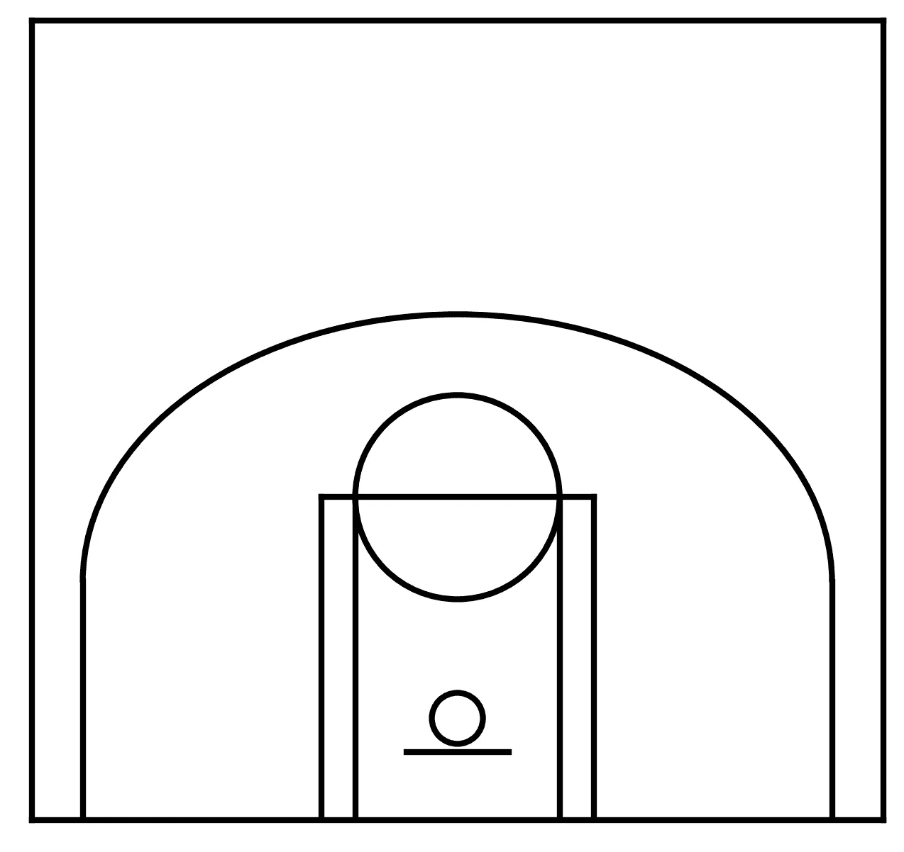
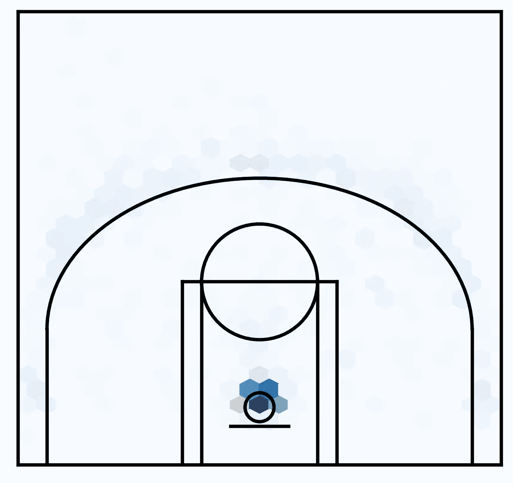
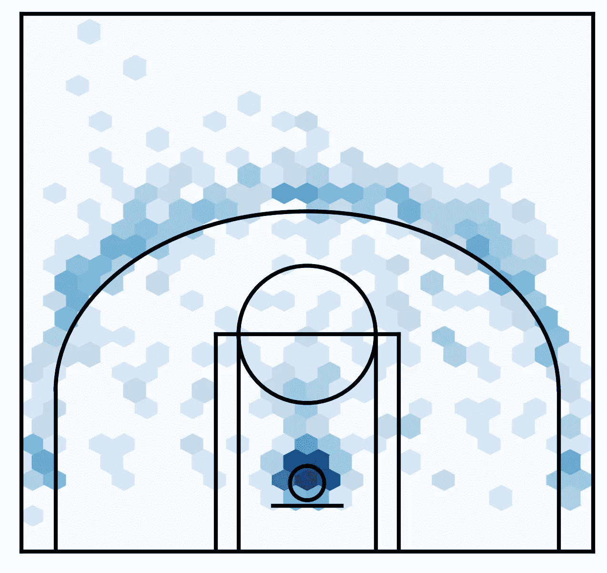
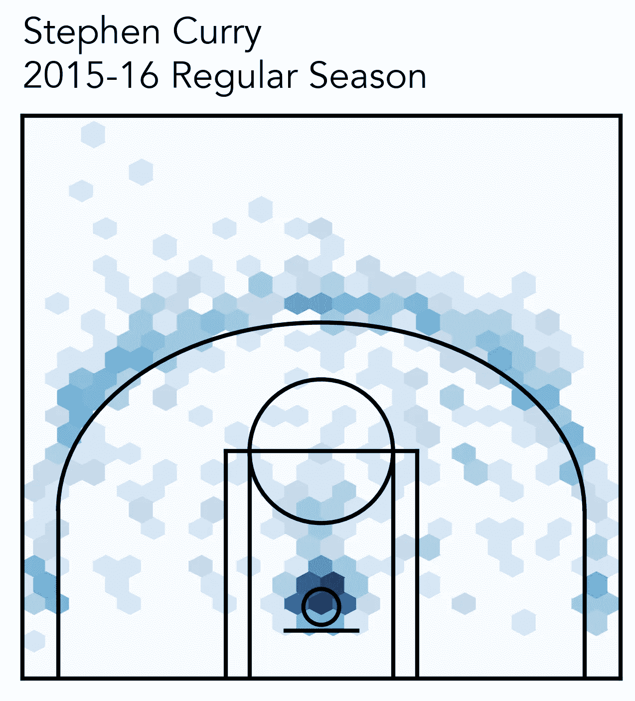
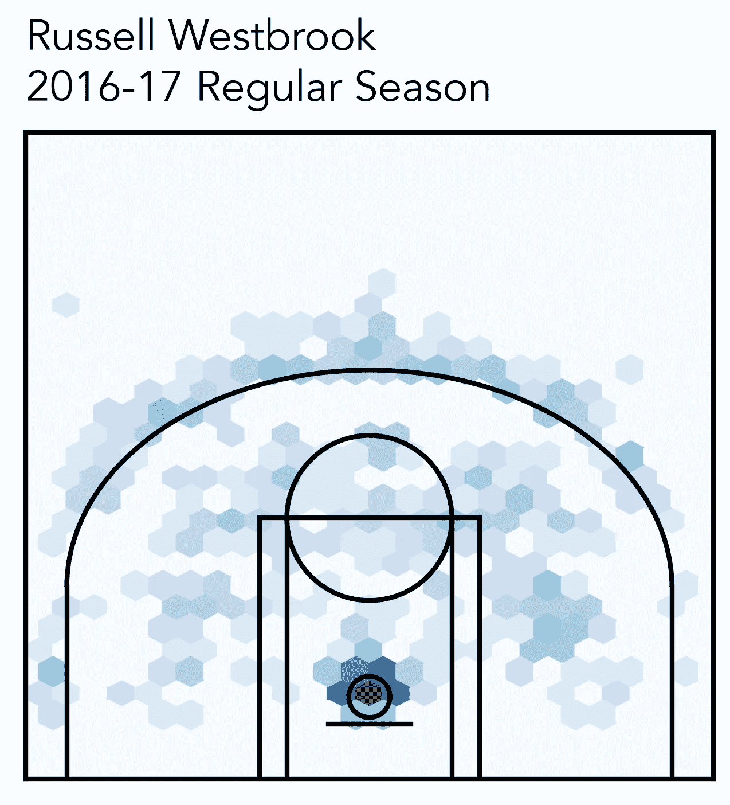
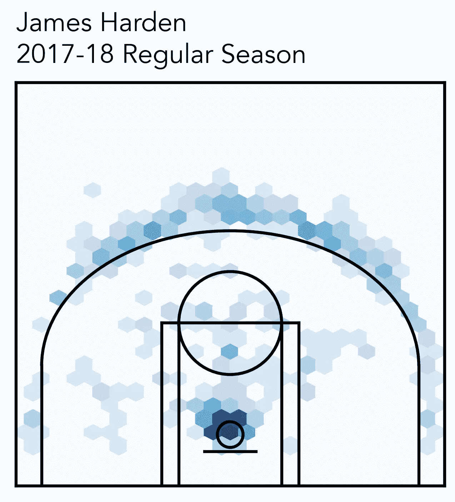
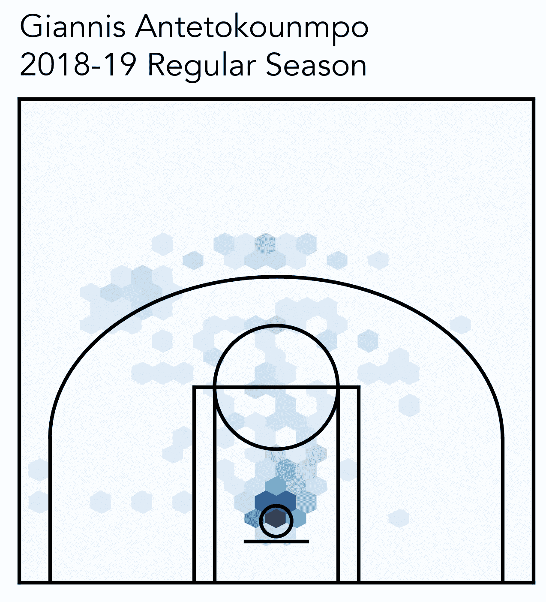

# 用 Python 制作一个简单的 NBA 投篮图

> 原文：<https://towardsdatascience.com/make-a-simple-nba-shot-chart-with-python-e5d70db45d0d?source=collection_archive---------17----------------------->

## 你曾经想制作一个好看的 NBA 投篮图表吗？比以往任何时候都简单！


在 [Unsplash](/s/photos/basketball-shot?utm_source=unsplash&utm_medium=referral&utm_content=creditCopyText) 上由 [Tamarcus Brown](https://unsplash.com/@tamarcusbrown?utm_source=unsplash&utm_medium=referral&utm_content=creditCopyText) 拍摄的照片

最近，我偶然发现了这个名为`nba_api`的精彩 Python 包，可以在这里[找到](https://github.com/swar/nba_api)，它作为一个非常简单的 API 客户端从`www.nba.com`检索统计数据。我个人一直想创建像网上一样的球员投篮图表，但收集投篮位置数据似乎是一项艰巨的任务。这就是`nba_api`来救援的地方！首先，让我们安装软件包:

```
pip install nba_api
```

现在我们已经安装了`nba_api`，我们现在可以导入所有需要的包来制作我们自己的拍摄图。

```
**# Import packages** from nba_api.stats.endpoints import shotchartdetail
import json
import requests
import pandas as pd
import matplotlib as mpl
import matplotlib.pyplot as plt
```

# **加载数据**

要发出我们的 API 请求，我们需要一个球员 ID 号和球队 ID 号，这两个号码都用于检索投篮数据。为了方便地提取这些值，我们可以利用另一个 Github 库[这里是](https://github.com/bttmly/nba)。有两个 JSON 文件，`team.json`和`players.json`，包含了我们需要的所有球员和球队 ID 号。我们将使用 Python 将这些 JSON 文件加载到 dictionary 对象数组中。

```
**# Load teams file** teams = json.loads(requests.get('[https://raw.githubusercontent.com/bttmly/nba/master/data/teams.json').text](https://raw.githubusercontent.com/bttmly/nba/master/data/teams.json').text))**# Load players file** players = json.loads(requests.get('[https://raw.githubusercontent.com/bttmly/nba/master/data/players.json').text](https://raw.githubusercontent.com/bttmly/nba/master/data/players.json').text))
```

现在我们已经加载了所有的球员和球队数据，我们可以创建助手函数，它接受球队名称和球员名称的输入，并返回他们各自的 ID 号。在这两种情况下，如果找不到球员或球队名称，函数返回-1:

```
**# Get team ID based on team name**
def get_team_id(team):
  for team in teams:
    if team['teamName'] == team:
      return team['teamId']
  return -1**# Get player ID based on player name**
def get_player_id(first, last):
  for player in players:
    if player['firstName'] == first and player['lastName'] == last:
      return player['playerId']
  return -1
```

现在让我们来看看我们的功能:

```
**# Get the team ID number for the Knicks**
get_team_id('New York Knicks')
>>> 1610612752**# Get the player ID number for LeBron James**
get_player_id('LeBron', 'James')
>>> 2544
```

现在我们有了收集特定 NBA 球员投篮数据所需的所有数据。让我们现在做一个例子——作为一个湾区本地人和金州勇士队的球迷，我有兴趣为斯蒂芬·库里令人难以置信的 2015-16 年一致 MVP 赛季创建一个投篮图表。我们首先按如下方式构建我们的 JSON 请求:

```
**# Create JSON request** shot_json = shotchartdetail.ShotChartDetail(
            team_id = get_team_id('Golden State Warriors'),
            player_id = get_player_id('Stephen', 'Curry'),
            context_measure_simple = 'PTS',
            season_nullable = '2015-16',
            season_type_all_star = 'Regular Season')
```

`context_measure_simple` —这决定了使用哪个“上下文”来搜索镜头。点数(PTS)是默认的，将导致所有*投篮。如果你想要所有的尝试(成功的和失败的)，你可以使用“FGA”作为你的上下文。*

`season_nullable` —我们感兴趣的季节(2015–16)

`season_type_all_star` —我们对这个季节的哪个部分感兴趣(`Pre Season`、`Regular Season`、`Playoffs`、`All Star`)

`ShotChartDetail()`的文档可以在[这里找到](https://github.com/swar/nba_api/blob/master/docs/nba_api/stats/endpoints/shotchartdetail.md)——正如你将看到的，我只涉及了你可以通过你的请求做的事情的一小部分，而可能性几乎是无穷无尽的！

现在我们可以将 JSON 数据加载到一个 dictionary 对象中:

```
**# Load data into a Python dictionary** shot_data = json.loads(shot_json.get_json())
```

我们的相关数据可以在`resultSets`键下找到，它本身就是一个数组——我们需要这个数组的第一个元素。

```
**# Get the relevant data from our dictionary** relevant_data = shot_data['resultSets'][0]
```

变量`relevant_data`本身是一个字典，键`headers`对应于列标题，`rowSet`对应于实际的数据行。

```
**# Get the headers and row data**
headers = relevant_data['headers']
rows = relevant_data['rowSet']
```

最后，我们可以将这些数据放入一个`pandas`数据帧中，如下所示:

```
**# Create pandas DataFrame**
curry_data = pd.DataFrame(rows)
curry_data.columns = headers
```

好了，现在我们可以看看在新创建的数据框架中我们可以访问哪些列了！

```
**# Print the columns of our DataFrame**
curry_data.columns
>>> Index(['GRID_TYPE', 'GAME_ID', 'GAME_EVENT_ID', 'PLAYER_ID', 'PLAYER_NAME', 'TEAM_ID', 'TEAM_NAME', 'PERIOD', 'MINUTES_REMAINING', 'SECONDS_REMAINING', 'EVENT_TYPE', 'ACTION_TYPE', 'SHOT_TYPE', 'SHOT_ZONE_BASIC', 'SHOT_ZONE_AREA', 'SHOT_ZONE_RANGE', 'SHOT_DISTANCE', 'LOC_X', 'LOC_Y', 'SHOT_ATTEMPTED_FLAG', 'SHOT_MADE_FLAG', 'GAME_DATE', 'HTM', 'VTM'], dtype='object')
```

由于数据帧中的所有行都对应于拍摄镜头，我们可以使用`LOC_X`和`LOC_Y`来绘制它们。通过检查数据，x 坐标从-250 到 250(每 1/10 英尺)，y 坐标从 0 到 940(也是每 1/10 英尺)。我们可以利用这些信息在一个 NBA 球场的覆盖图上画出拍摄地点。但首先，让我们创建一个篮球场！

# **创建篮球场**

为了创建我们的篮球场，我们将编写一个函数，它接受一个`matplotlib`轴对象和一种颜色(用于球场标记),并生成一个球场的绘图。我将快速浏览一遍，但它基本上是一种将 NBA 球场的真实世界尺寸映射到我们情节中的线条和形状的练习。我们从函数定义开始:

```
**# Function to draw basketball court** def create_court(ax, color):
```

我们现在继续绘制单个元素。首先，我们创建一条 22 英尺长的短角三分线，并向球场内延伸 14 英尺(请记住，我们将使用击球坐标，因此我们使用 1/10 英尺的单位)。

```
**# Short corner 3PT lines**
ax.plot([-220, -220], [0, 140], linewidth=2, color=color)
ax.plot([220, 220], [0, 140], linewidth=2, color=color)
```

现在，我们可以连接三点弧的其余部分，它距离篮筐中心 23.75 英尺。边缘本身在球场内 6 英尺，因为我们知道角落三分线延伸 14 英尺，我们可以创建一个从该点垂直延伸 15.75 英尺的弧线。

```
**# 3PT Arc**
ax.add_artist(mpl.patches.Arc((0, 140), 440, 315, theta1=0, theta2=180, facecolor='none', edgecolor=color, lw=2))
```

接下来是车道和钥匙顶端的圆圈。球道由两个长方形组成，一个宽 16 英尺，另一个宽 12 英尺，都延伸到球场内 19 英尺。钥匙顶部的圆圈半径为 6 英尺。

```
**# Lane and Key**
ax.plot([-80, -80], [0, 190], linewidth=2, color=color)
ax.plot([80, 80], [0, 190], linewidth=2, color=color)
ax.plot([-60, -60], [0, 190], linewidth=2, color=color)
ax.plot([60, 60], [0, 190], linewidth=2, color=color)
ax.plot([-80, 80], [190, 190], linewidth=2, color=color)
ax.add_artist(mpl.patches.Circle((0, 190), 60, facecolor='none', edgecolor=color, lw=2))
```

现在让我们添加篮框和篮板——篮板进入球场 4 英尺，篮框中心 6 英尺，半径 0.75 英尺。

```
**# Rim**
ax.add_artist(mpl.patches.Circle((0, 60), 15, facecolor='none', edgecolor=color, lw=2))

**# Backboard**
ax.plot([-30, 30], [40, 40], linewidth=2, color=color)
```

最后，我们移除刻度线并设置轴限制——在本例中，x 从[-250，250]开始，y 从[0，470]开始(球场的一半)。

```
**# Remove ticks**
ax.set_xticks([])
ax.set_yticks([])

**# Set axis limits** ax.set_xlim(-250, 250)
ax.set_ylim(0, 470)
```

现在，为了检查我们是否做得正确，我们可以创建一个空白图形，并在上面绘制我们的球场。为了保持真实的比例，我们设置了`figsize`,这样我们就有了正确的纵横比:

```
**# General plot parameters**
mpl.rcParams['font.family'] = 'Avenir'
mpl.rcParams['font.size'] = 18
mpl.rcParams['axes.linewidth'] = 2**# Draw basketball court**
fig = plt.figure(figsize=(4, 3.76))
ax = fig.add_axes([0, 0, 1, 1])
ax = create_court(ax, 'black')
plt.show()
```



# **创建拍摄图表**

为了创建我们的拍摄图表，我们将使用一个名为`hexbin`的图，它内置了`matplotlib`。这个函数会根据位置将所有的镜头分入六边形的箱子中，然后根据每个箱子中物品的数量给它们上色。按照上面的方法画出球场后，我们使用下面的线来创建我们的 hexbin 图。我们在 y 坐标上加 60，因为数据集中的所有坐标都是相对于边缘中心的，我们知道边缘位于基线内 6 英尺处:

```
**# Plot hexbin of shots**
ax.hexbin(curry_data['LOC_X'], curry_data['LOC_Y'] + 60, gridsize=(30, 30), extent=(-300, 300, 0, 940), cmap='Blues')
```

`gridsize` —六边形箱子的尺寸(x 尺寸，y 尺寸)

`extent` — (xmin，xmax，ymin，ymax) —我们使用比轴限制更大的值来确保六边形一直到达我们绘制区域的边界(绘图区域之外的六边形被剪裁，因此我们看不到它们)



我们的 hexbin 图似乎工作得很好，但有太多的对比——即使三分球数很大(库里投了 400 多个)，靠近篮筐的投篮支配了颜色。由于这个拍摄图纯粹是眼睛的指南(我们不能通过观看拍摄图来容易地做出定量的决定)，我们可以使用对数宁滨来提高对比度。为此，我们使用以下代码行:

```
**# Plot hexbin of shots with logarithmic binning**
ax.hexbin(curry_data['LOC_X'], curry_data['LOC_Y'] + 60, gridsize=(30, 30), extent=(-300, 300, 0, 940), bins='log', cmap='Blues')
```



好多了！现在，我们可以做的最后一件事是在图表顶部添加带有球员姓名和赛季的文本注释:

```
**# Annotate player name and season**
ax.text(0, 1.05, 'Stephen Curry\n2015-16 Regular Season', transform=ax.transAxes, ha='left', va='baseline')
```



# **其他 MVP 拍摄图**

我们可以对此进行延伸，绘制出库里 2015-16 赛季以来的 3 个 MVP 的投篮图表，供我们参考。

## **2017 —拉塞尔·维斯特布鲁克**

```
**# JSON request for Russell Westbrook**
shot_json = shotchartdetail.ShotChartDetail(
            team_id = get_team_id('Oklahoma City Thunder'),
            player_id = get_player_id('Russell', 'Westbrook'),
            context_measure_simple = 'PTS',
            season_nullable = '2016-17',
            season_type_all_star = 'Regular Season')
```



## **2018 —詹姆斯·哈登**

```
**# JSON request for James Harden** shot_json = shotchartdetail.ShotChartDetail(
            team_id = get_team_id('Houston Rockets'),
            player_id = get_player_id('James', 'Harden'),
            context_measure_simple = 'PTS',
            season_nullable = '2017-18',
            season_type_all_star = 'Regular Season')
```



## **2019 —扬尼斯·阿德托昆博**

```
**# JSON request for Giannis Antetokounmpo** shot_json = shotchartdetail.ShotChartDetail(
            team_id = get_team_id('Milwaukee Bucks'),
            player_id = get_player_id('Giannis', 'Antetokounmpo'),
            context_measure_simple = 'PTS',
            season_nullable = '2018-19',
            season_type_all_star = 'Regular Season')
```



# **结束语**

感谢您的阅读！本文的所有分析都可以在这个 [Github 库](https://github.com/venkatesannaveen/medium-articles)中找到。我感谢任何反馈，你可以在 [Twitter](https://twitter.com/naveenv_92) 上找到我，并在 [LinkedIn](https://www.linkedin.com/in/naveenvenkatesan/) 上与我联系以获取更多更新和文章。