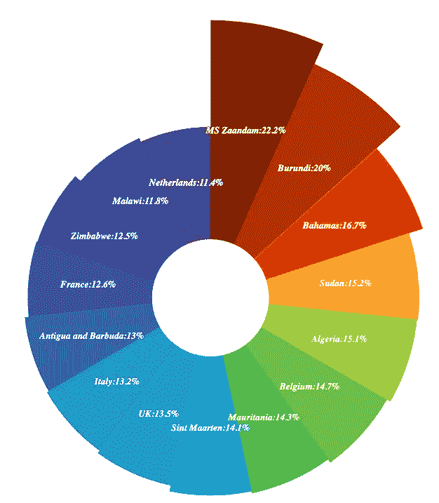
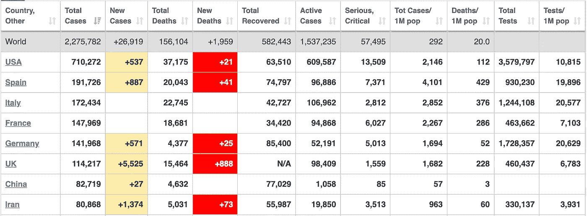
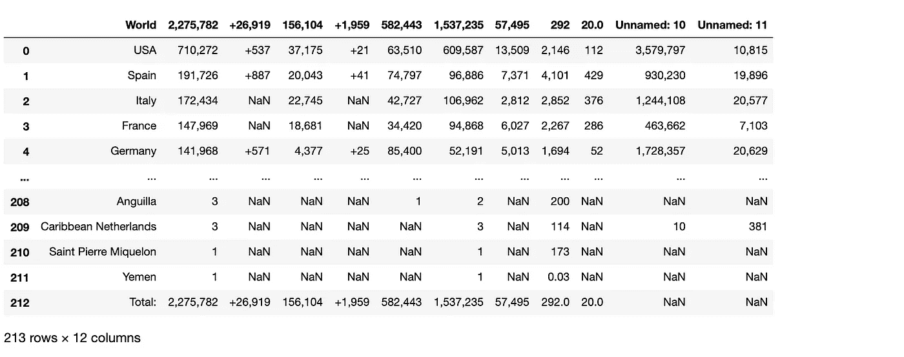
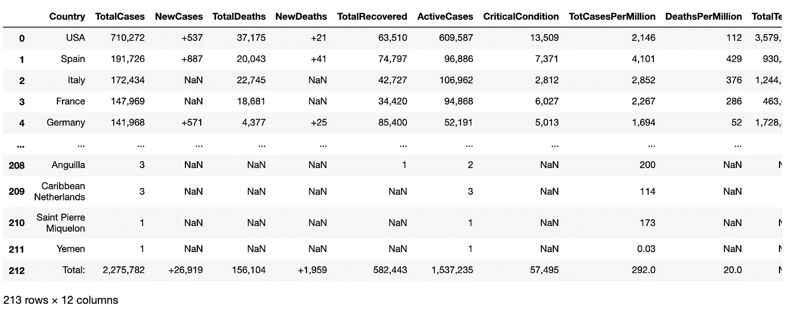
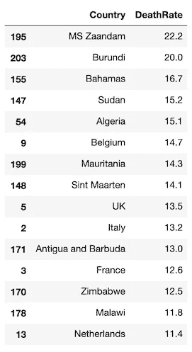
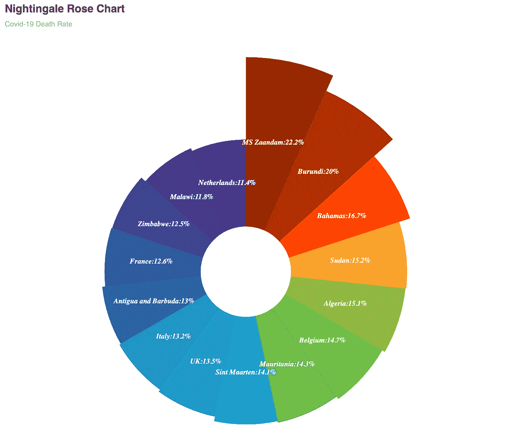

# 用 Python 制作一个漂亮的夜莺玫瑰图

> 原文：<https://towardsdatascience.com/make-beautiful-nightingale-rose-chart-in-python-covid-19-death-rate-141a7a49bb61?source=collection_archive---------22----------------------->

## **设想新冠肺炎的死亡率**

南丁格尔的玫瑰图，也被称为“极区图”或“鸡冠图”，是一个圆形图，结合了雷达图和柱形图的元素。这张特殊的图表是以护士、统计学家和改革家弗洛伦斯·南丁格尔的名字命名的。她发明了一种彩色统计图表，名为“东部军队的死亡原因图表”,生动地描述了在第二次世界大战(1954-1956)期间英国军队医院中不必要死亡的程度。图表显示，在战争过程中，流行病造成的英国人死亡比战场上受伤的多。

在本教程中，我们将使用 Pyechart 库用 Python 创建一个南丁格尔玫瑰图。我们甚至不需要导入数据！只需要几个步骤，你就会有一个这样的玫瑰图！



夜莺玫瑰图

步骤 1:导入库

```
import numpy as np
import pandas as pd
from pyecharts.charts import Pie
from pyecharts import options as opts
```

第二步:打开网站，通过剪贴板功能获取数据

```
import webbrowser
website = ‘[https://www.worldometers.info/coronavirus/'](https://www.worldometers.info/coronavirus/')
webbrowser.open(website)
```

Worldmeters 每天都以良好的格式更新新冠肺炎信息，因此本教程的数据来自该网站。Pandas 中的 read_clipboard()可以读取、复制、粘贴表格数据，并将其解析到一个数据框中。如果你想在小数据集上练习，这是一个非常有用的函数。其中一个限制是它不能处理合并的单元格。



来自 worldmeters.info 的快照

当您从 Worldmeters 复制表格时，请不要包括第一行，它有列名。第一行中的每个单元格都是合并单元格，clipboard()无法处理它。它将返回错误。

在复制了除第一行以外的整个表之后，执行下面的代码

```
data = pd.read_clipboard()
data
```

你会得到一张这样的桌子



第三步:第一行将被正确的列名替换

```
data.columns = [‘Country’,’TotalCases’,’NewCases’,’TotalDeaths’,’NewDeaths’,’TotalRecovered’,’ActiveCases’,’CriticalCondition’,‘TotCasesPerMillion’,’DeathsPerMillion’,’TotalTests’,’TestsPerMillion’]
data
```

然后，数据帧看起来更好。



步骤 4:数据操作

```
# remove "," from the dataset
for x in range(1,len(data.columns)):
 data[data.columns[x]] = data[data.columns[x]].str.replace(‘,’,’’) #replace NaNs with zeros
data = data.fillna(0)#change the datatype from object to integer
for i in range (1,len(data.columns)):
    data[data.columns[i]] = data[data.columns[i]].astype(float).astype(int)#create a column 'Death Rate'
data['DeathRate'] = data['TotalDeaths']/data['TotalCases']#sort the data frame by 'Death Rate' in descending order
data.sort_values(by=['DeathRate'], inplace=True, ascending=False)
```

步骤 5:选择死亡率最高的前 15 个国家

```
df=data[[‘Country’,’DeathRate’]].head(15) #select two columns and top 15 rowsdf[‘DeathRate’] = (df[‘DeathRate’]*100).round(1)
df
```

用于进一步可视化的数据框已准备就绪。



步骤 6:可视化数据

```
c = df[‘Country’].values.tolist()
d = df[‘DeathRate’].values.tolist()#create the color_series for the rosechart
color_series = [‘#802200’,’#B33000',’#FF4500',’#FAA327',’#9ECB3C’,
 ‘#6DBC49’,’#37B44E’,’#14ADCF’,’#209AC9',’#1E91CA’,
 ‘#2C6BA0’,’#2B55A1',’#2D3D8E’,’#44388E’,’#6A368B’,
 ‘#D02C2A’,’#D44C2D’,’#F57A34',’#FA8F2F’,’#D99D21']rosechart = Pie(init_opts=opts.InitOpts(width='1350px', height='750px'))
# set the color
rosechart.set_colors(color_series)
# add the data to the rosechart
rosechart.add("", [list(z) for z in zip(c, d)],
        radius=["20%", "95%"],  # 20% inside radius，95% ourside radius
        center=["30%", "60%"],   # center of the chart
        rosetype="area")# set the global options for the chart
rosechart.set_global_opts(title_opts=opts.TitleOpts(title='Nightingale Rose Chart',subtitle="Covid-19 Death Rate"),
                     legend_opts=opts.LegendOpts(is_show=False),
                     toolbox_opts=opts.ToolboxOpts())# set the series options
rosechart.set_series_opts(label_opts=opts.LabelOpts(is_show=True, position="inside", font_size=12,formatter="{b}:{c}%", font_style="italic",font_weight="bold", font_family="Century"),)
rosechart.render_notebook()
```

最后生成美丽的夜莺玫瑰图！



从图表中很容易看出，MS Zaandam 号游轮的死亡率最高。旁边是布隆迪、巴哈马和苏丹。据《纽约时报》报道，前 15 个国家的死亡率都超过了 10%，大大高于普通季节性流感的死亡率，美国的死亡率通常在 0.1%左右。

所以，呆在家里享受学习数据可视化吧！

如果你对制作其他类型的漂亮图表感兴趣，你可以看看我的其他帖子。

1.  [用 Python 用几行字做一个漂亮的水球图](https://medium.com/python-in-plain-english/make-beautiful-water-polo-chart-in-a-few-lines-in-python-5d04f3f9335d)
2.  [用 Python 制作一个只有几行的漂亮条形图](https://medium.com/@han.candice/make-a-beautiful-bar-chart-in-just-few-lines-in-python-5625ebc71c49)
3.  [用 Python 制作几行漂亮的散点图，让你的报告出类拔萃](https://medium.com/@han.candice/make-a-beautiful-scatterplot-in-in-a-few-lines-in-python-to-make-your-report-outstanding-f47db0532094)
4.  [用 Python 语言 Plotly 制作令人印象深刻的动画泡泡图——灵感来自汉斯·罗斯林教授](https://medium.com/python-in-plain-english/animated-bubble-chart-with-plotly-in-python-inspired-by-professor-hans-rosling-b7262298dd03)
5.  [用 Python 制作最可爱的图表——用手绘图表可视化你的数据](https://medium.com/p/make-the-cutest-chart-in-python-visualize-your-data-with-hand-drawn-charts-f21157f76b4b)