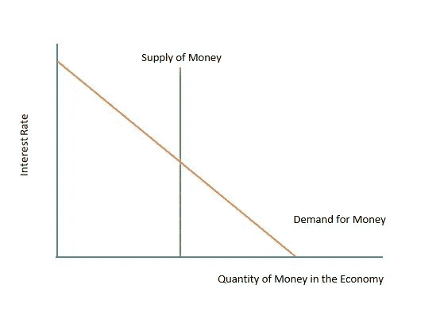
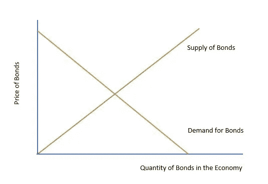
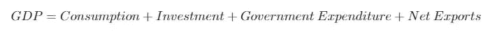
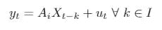
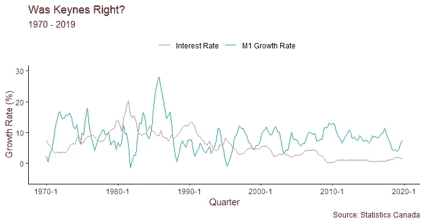
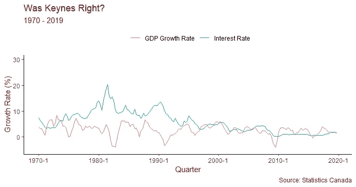
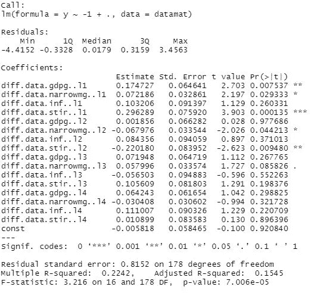
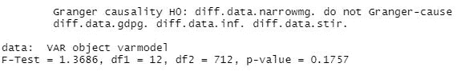
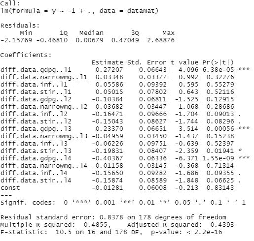
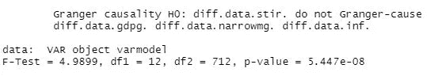

# 将因果关系作为你下一个数据科学项目的目标

> 原文：<https://towardsdatascience.com/make-causation-the-goal-for-your-next-data-science-project-77bdd95ef80d?source=collection_archive---------45----------------------->

## 货币与利率的案例研究


莎伦·麦卡琴在 [Unsplash](https://unsplash.com/s/photos/rich?utm_source=unsplash&utm_medium=referral&utm_content=creditCopyText) 上的照片

# 序文

预测是大多数数据科学项目的目标。

虽然这导致了一些有趣的工作，但也导致了抑制因素:

1.  理解机器学习模型背后的数学原理，
2.  充分理解数据分析过程的各个方面；而且，
3.  建立可理解的模型

这篇文章的目的是鼓励更多有抱负的(和当前的)数据科学家完成以**因果关系**为既定目标的项目。

为什么？

> 因为说服读者在 *X* 和 *Y* 之间存在因果关系通常比说服读者某个 ML 模型具有强大的预测能力更困难，后者通常是通过最小化(或在某些情况下最大化)一个不透明的度量来实现的。

数据科学家必须证明以下几点，以说服读者两个变量有因果关系:

1.  ***建立一个****的时间顺序。也就是说，如果 *X 导致 Y* ，那么 *X 必须在 Y* 之前。*
2.  ****建立变量之间的关系*** *。我们的变量必须是相关的。这种关系一定不是由第三个混淆变量造成的。**
3.  ****建立因果理论*** 。数据科学家必须*解释*与现有(或新)理论的因果关系。*

*满足这些条件在几个方面有利于数据科学家的教育:*

*   *他们迫使数据科学家理解其模型背后的数学原理。你不能把随机的模型拼凑在一起，直到你得到你想要的结果。你必须解释你的模型将如何回答你的研究问题。*
*   ***他们提高了数据科学家的沟通技巧**。*
*   *他们激励数据科学家获取领域知识。很多时候，雇主要求求职者除了技术技能 之外，还要有特定行业的知识 ***。****

*在本文的剩余部分，我将(尝试)证明利率和货币供应量之间的因果关系。*

*具体来说，我测试了两个假设:*

> *1.对一个国家货币供应的积极冲击会降低利率*
> 
> *2.较低的利率在短期内会扩张经济*

*这里的希望是，我试图证明货币供应和利率之间的因果关系，这将向你展示如何构建你的下一个“以因果关系为重点”的数据科学项目。*

*文章的其余部分分为以下几个部分:*

1.  *货币供应量和利率之间的关系*
2.  *模型的解释*
3.  *数据的解释*
4.  *分析*
5.  *结果*
6.  *结论*

*请随意跳到你觉得最有趣的部分。*

# *货币供应量和利率之间的关系*

*凯恩斯认为，消费者需求的货币数量取决于当前的利率。具体来说，较低的利率意味着消费者会要求更多的钱*

**

*作者图片*

*两种效应改变了货币需求:一种是**收入效应**，另一种是**价格水平效应**。*

*收入效应表明，当消费者财富增加时，货币需求也会增加。也就是说，当人们拥有更高的净值时，他们想买更多的东西；他们要求更多的现金来购买这些东西。*

***收入效应**导致**物价水平** **效应**。当支出增加时，价格就会上涨(通货膨胀)。因此，人们需要更多的钱来维持他们在价格上涨前的购买力。*

*注意，货币供给曲线是一条垂直线。竖线表示货币供给是*外生*。*

*换句话说，货币供应不受货币市场变动的影响。*

*该理论认为，当货币供应量增加时，利率就会下降(在上图中向右移动)。*

*为什么？*

> *如果货币供应量增加，那么经济中的货币就会过剩。消费者将多余的钱投资到债券市场(那里是安全的)。这增加了对债券的需求，从而提高了债券的价格。当债券价格上涨时，该债券的利率(或收益率)就会下降。*

**

*作者图片*

*因此，货币供应量的增加导致债券市场利率下降。这种现象被称为 ***流动性效应。****

*我们可以将经济产出建模为:*

**

*作者图片*

*当利率下降时，债务变得更便宜。因此，消费、投资和政府支出都会增加，从而增加经济产出。*

# *模型*

*为了证明上述理论，我需要首先检验几个变量(货币供给、利率和经济产出)之间的关系，其次证明一个变量(货币供给冲击)先于其他变量(利率和经济产出变化)。*

*因此，我使用的模型必须显示多个变量*和*之间的相互作用，它必须考虑到**动态**行为(动态行为是指模型允许以前时间段的值影响未来时间段的值)。*

*向量自回归(VAR)模型非常适合这一点！*

## *增值转销公司*

*我们的风险值模型看起来像这样:*

**

*作者图片*

*在哪里*

*   **yt* 是因变量的向量*
*   *Ai 是一个系数矩阵*
*   **X_(t-k)* 是自变量的向量，包括因变量的滞后阶*
*   **ut* 是误差向量*
*   **k* 是滞后订单的长度*

> *VAR 模型是对我们正在研究的每个变量进行的线性回归模型。一个线性回归模型中的每个自变量都会成为另一个线性回归模型中的因变量。*

*因此，VAR:*

*   *向我们展示了变量之间的多重关系；而且，*
*   *允许滞后运算符的动态行为*

*完美！*

# *数据*

*我将重点放在加拿大进行分析。请随意尝试不同的国家。*

*我使用加拿大统计局和圣路易斯联邦储备银行 1970 年至 2019 年的季度数据。有 200 个观察值。*

*感兴趣的变量有:*

*   *M1 的增长率(M1 是货币供应量的狭义定义，包括活期存款和支票账户中的货币量)*
*   *三个月期国库券的收益率(通常用于模拟利率)*
*   *实际国内生产总值的增长率*

*我控制:*

*   *消费者价格指数*
*   *通货膨胀率*

*所有增长率均以同比百分比变化计算。季度 CPI 和三个月期国库券的收益率是通过对加拿大统计局的月度数据进行季度平均计算得出的。*

# *分析*

*在深入研究 VAR 之前，让我们先了解一些数据可视化。*

*具体来说，我们想知道:*

> *货币供应量的变化发生在利率变化之前还是之后？*

```
*library(readxl)
library(ggplot2)
library(zoo)data <- read_excel(file.choose(), sheet = 'Data')# Set the time variable
data$qrtr <- as.yearqtr(1970 + seq(0,199)/4)# Make a new theme for ggplot to use.
new_theme <- theme_classic() + theme(text = element_text(color = "darkred")) + theme(legend.position="top") + theme(legend.title = element_text(color = "black"), legend.text = element_text(color = "black"))
theme_set(new_theme)# Create the graph 
p <- ggplot(data, aes(x = qrtr)) + ylim(-5, 30) + geom_line(aes(y = narrowmg, color = "M1 Growth Rate")) + geom_line(aes(y = stir, color = "Interest Rate")) + labs(x = "Quarter", y = "Growth Rate (%)", title = "Was Keynes Right?", subtitle = "1970 - 2019", caption = "Source: Statistics Canada")
p + theme(legend.title = element_blank())*
```

**

*作者图片*

*在 20 世纪 80 年代中期之前，货币供应量的变化和利率的变化之间的关系是一致的。当然，这种关系是不完美的，这意味着其他变量也会影响利率。*

*至少从 2000 年开始，货币供应量的变化似乎对利率没有什么影响。事实上，尽管这一时期货币供应量波动很大，但利率仍保持负斜率。*

*GDP 增长率和利率之间的关系如何？*

**

*作者图片*

*在整个研究期间，这种关系似乎比利率和货币供应量之间的关系更加一致。一般来说，利率下降会导致 GDP 增长率上升，反之亦然。*

*上述形象化的观点对货币供应量的变化是否先于利率的变化产生了相当大的怀疑(事实上，相反的情况可能是正确的)。然而，利率的变化确实出现在经济增长率变化之前。*

*此外，我们已经为变量之间的关系建立了一个理论解释。*

*最后，我们必须确定我们的变量*是*相关的。更具体地说，我们必须确认这种关系不是第三个混淆变量的结果。*

*这是最难满足的条件。*

*我发现所有变量在一阶差分后都是稳定的。*

```
*library(VARS)
library(tseries)
library(lmtest)# Use VARselect to find the optimal lag length for which to test for stationarity.VARselect(data$stir, lag.max = 20, type = "const")
VARselect(data$gdpg, lag.max = 20, type = "const")
VARselect(data$narrowmg, lag.max = 20, type = "const")
VARselect(data$inf, lag.max = 20, type = "const")# Run Adjusted Dickey-Fuller to test for stationarity. We find that # some of our variables are non-stationary. However, our variables 
# are stationary after first-differencing.adf.test(data$stir, alternative = "stationary", k = 2)
adf.test(data$gdpg, k = 14, alternative = "stationary")
adf.test(data$narrowmg, k = 18, alternative = "stationary")
adf.test(data$inf, k = 10, alternative = "stationary")

*# Find optimal lag length again.*

VARselect(diff(data$stir), lag.max = 20, type = "const")
VARselect(diff(data$gdpg), lag.max = 20, type = "const")
VARselect(diff(data$narrowmg), lag.max = 20, type = "const")
VARselect(diff(data$inf), lag.max = 20, type = "const")
VARselect(diff(data$xrusd), lag.max = 20, type = "const")
*# Conduct ADF test again.*
adf.test(diff(data$stir), k = 1, alternative = "stationary")
adf.test(diff(data$gdpg), k = 13, alternative = "stationary")
adf.test(diff(data$narrowmg), k = 16, alternative = "stationary")
adf.test(diff(data$inf), k = 9, alternative = "stationary")*
```

*接下来，我们创建一个保存静态变量的新数据框。然后，我们将该数据帧传递给 VARselect 函数，以获得 VAR 的最佳滞后长度。*

*最后，我们将新的数据框架和最佳滞后长度传递到 VAR 函数中。*

```
*newdata <- data.frame(diff(data$gdpg), diff(data$narrowmg), diff(data$inf), diff(data$stir), diff(data$xrusd))
VARselect(newdata, lag.max = 20, type = "const") # Find optimal lag
varmodel <- VAR(newdata, p = 4, type = "const") # optimal lag is 4*
```

# *结果*

*回想一下我们的假设。*

*首先，我们想测试货币供应量的增加是否会降低利率。*

*查看以利率( *stir* )为因变量的系数:*

**

**Narrowmg* 是 M1 的增长率。L1…L4 是滞后长度。只有滞后 2 和滞后 4 与利率负相关；此外，滞后 4 在统计上并不显著。*

*然而，我们想知道滞后长度是否*共同*具有统计显著性。*

*我们可以用格兰杰因果检验来检验联合统计的显著性。零假设是变量没有联合显著性；另一种假设是，他们是。*

```
*causality(varmodel, cause = "diff.data.narrowmg.")$Granger*
```

**

*根据格兰杰因果关系检验，我们不能拒绝零假设，即货币供应量的变化对利率(或其他变量)的变化没有预测能力。*

*以下是以 GDP 增长率为因变量的线性模型的结果:*

**

*作者图片*

*滞后 2 到 4 为利率变量(*拨* ) 有负系数。因此，利率的提高会降低经济增长。*

*检查利率滞后是否共同显著:*

```
*causality(varmodel, cause = "diff.data.stir.")$Granger*
```

**

*作者图片*

*我们可以拒绝零假设，即利率的变化不会导致经济增长或其他变量的变化。*

*有趣的是，因为利率的变化也预示着货币供应量的变化，我们不能否认利率的变化先于货币供应量的变化。*

*然而，我们应该小心假设检验；p 值并不完美。*

*[](/youre-probably-misusing-the-p-value-fef44d665955) [## 你可能滥用了 P 值

### 为什么我不在乎你的 p 值小于 0.05

towardsdatascience.com](/youre-probably-misusing-the-p-value-fef44d665955) 

然而，由于早期的数据可视化表明货币供应的变化对利率的影响为零，至少在 2000 年后，我们可以假设格兰杰因果检验是准确的。

# 结论

诚然，上述项目存在一些问题。一方面，M1 可能不是货币供应量的准确指标；同样，VAR 可能不是检验两个均衡变量(利率和货币供应量)之间关系的最佳模型。

那很好。本文的目的是向您展示它对您的数据科学发展的好处。

希望你也学到了一些关于货币和利率的有趣的东西！*