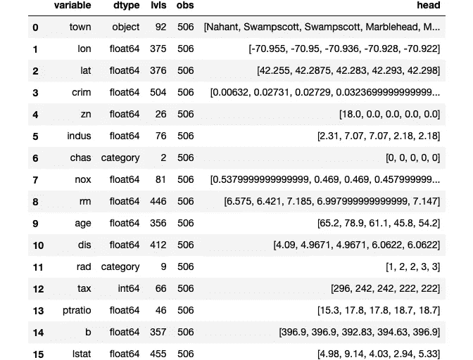
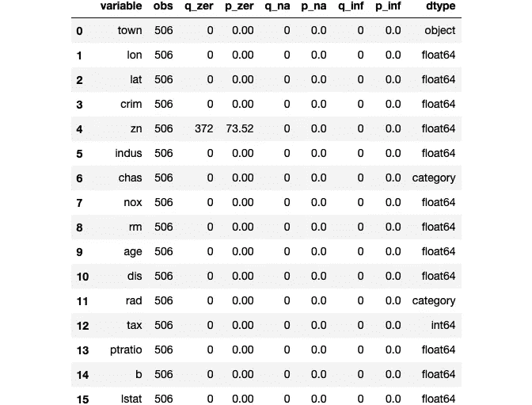
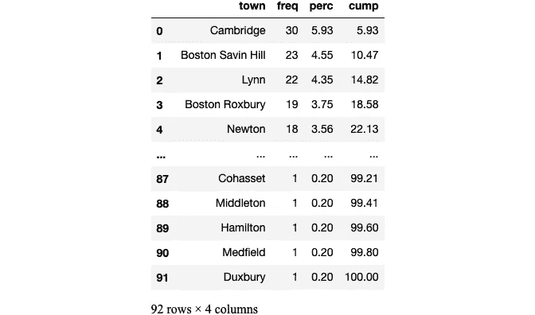
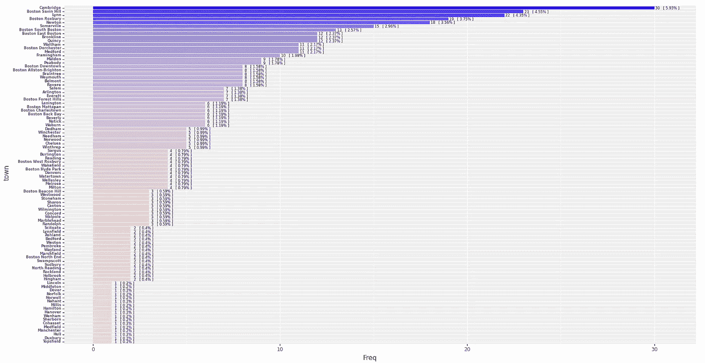
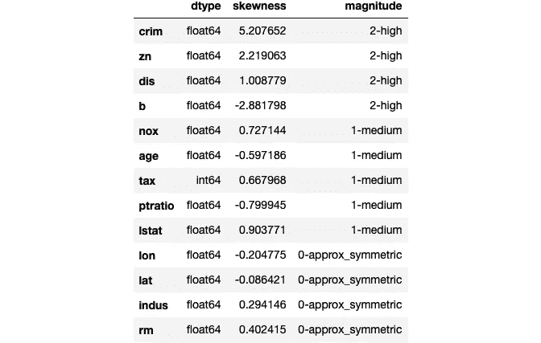
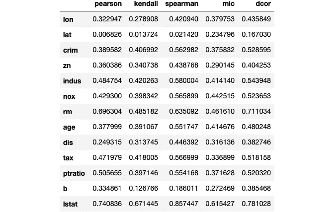
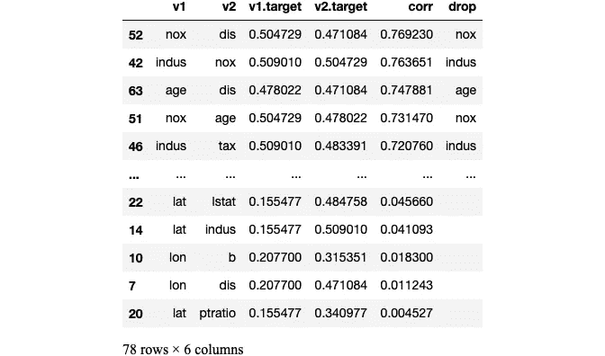
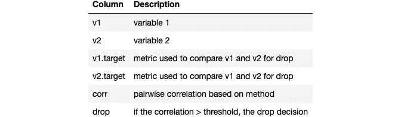
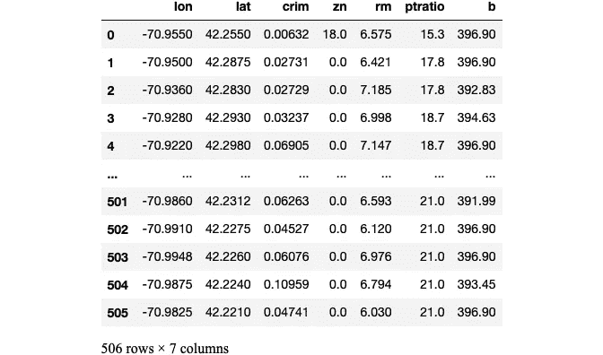

# 加速您的探索性数据分析(EDA)

> 原文：<https://towardsdatascience.com/make-exploratory-data-analysis-eda-faster-74c434595bcf?source=collection_archive---------43----------------------->

## Python 的 exploretransform 包简介


由 [Unsplash](https://unsplash.com?utm_source=medium&utm_medium=referral) 上的 [Element5 数码](https://unsplash.com/@element5digital?utm_source=medium&utm_medium=referral)拍摄

# **总结:**

*   数据科学家花 60%的时间清理和组织数据。收集数据集排在第二位，占他们时间的 19%，这意味着数据科学家花费大约 80%的时间来准备和管理用于分析的数据
*   76%的数据科学家认为数据准备是他们工作中最不愉快的部分

在本文中，我将展示 Python 的 exploretransform 包。它可以节省数据探索和转换的时间，并有望使您的数据准备更愉快！

# **概述:**

我最初开发 exploretransform 是为了在我自己的项目中使用，但我认为它可能对其他人有用。我的意图是创建一组简单的函数和类，以常见的 Python 数据格式返回结果。这将使从业者能够容易地利用输出或扩展原始功能，作为其工作流程的一部分。

# 如何使用 exploretransform:

安装和导入

```
!pip install exploretransformimport exploretransform as et
```

让我们从加载波士顿校正数据集开始。

```
df, X, y = et.loadboston()
```

在这个阶段，我喜欢检查数据类型是否与数据字典和前五个观察值一致。此外，lvl 的数量可以指示潜在的分类特征或具有高基数的特征。这里还可以检测到任何需要重新格式化的日期或其他数据。我们可以在这里使用 peek()。

```
et.peek(X)
```



分析完数据类型后，我们可以使用 explore()来识别缺失值、零值和无穷大值。

```
et.explore(X)
```



前面，我们看到城镇可能是一个具有高基数的分类特征。我们可以使用 freq()来分析分类或顺序特征，提供每个级别的计数、百分比和累积百分比

```
t = et.freq(X['town'])t
```



为了可视化 freq()的结果，我们可以使用 plotfreq()。它生成一个条形图，以降序显示各个级别。

```
et.plotfreq(t)
```



为了与您通常检查的直方图配对，skewstats()返回每个数字特征的偏度统计数据和大小。当您有太多的特征而无法轻松绘制时，此功能会变得更加有用。

```
et.skewstats(N)
```



为了确定预测值和目标值之间的关联，ascores()计算 pearson、kendall、pearson、spearman、mic 和 dcor 统计值。这些分数的多样性是有用的，因为某些分数测量线性关联，而其他分数将检测非线性关系。

```
et.ascores(N,y)
```



一旦我们达到一定数量的特征，相关矩阵就会变得难以处理。虽然波士顿数据集远低于这个阈值，但可以想象，在处理高维数据时，表可能比矩阵更有用。Corrtable()返回所有成对相关的表，并使用中的行和列的平均相关来决定潜在的删除/筛选候选项。您可以使用任何您通常使用 pandas corr 函数的方法:

*   姓氏
*   肯德尔
*   枪兵
*   请求即付的

```
N = X.select_dtypes('number').copy()c = et.corrtable(N, cut = 0.5, full= True, methodx = 'pearson')c
```



根据 corrtable()的输出，calcdrop()确定应该删除哪些要素。

```
et.calcdrop(c)['age', 'indus', 'nox', 'dis', 'lstat', 'tax']
```

ColumnSelect()是一个自定义转换器，它为管道选择列

```
categorical_columns = ['rad', 'town']cs = et.ColumnSelect(categorical_columns).fit_transform(X)cs
```


CategoricalOtherLevel()是一个自定义转换器，它根据阈值在分类/序号数据中创建“其他”级别。这在具有高基数预测值的情况下以及未来数据中可能出现新类别的情况下非常有用。

```
co = et.CategoricalOtherLevel(colname = 'town', threshold = 0.015).fit_transform(cs)co.iloc[0:15, :]
```


CorrelationFilter()是一个自定义转换器，它根据成对相关性过滤数字要素。它使用 corrtable()和 calcdrop()来执行 drop 评估和计算。有关它如何工作的更多信息，请参见:[您是否放弃了太多相关功能？](/are-you-dropping-too-many-correlated-features-d1c96654abe6)

```
cf = et.CorrelationFilter(cut = 0.5).fit_transform(N)cf
```



# 结论:

在本文中，我展示了 exploretransform 包如何帮助您加速探索性数据分析。我很乐意听到任何改进的反馈或建议。请随时通过 [LinkedIn](https://www.linkedin.com/in/brianpietracatella/) 或 [GitHub](https://github.com/bxp151/exploretransform) 联系我。

# **参考文献**:

[https://www . Forbes . com/sites/Gil press/2016/03/23/data-preparation-most-time-consumption-least-enjoy-data-science-task-survey-says/# 69883 CD 6 f 637](https://www.forbes.com/sites/gilpress/2016/03/23/data-preparation-most-time-consuming-least-enjoyable-data-science-task-survey-says/#69883cd6f637)

同上