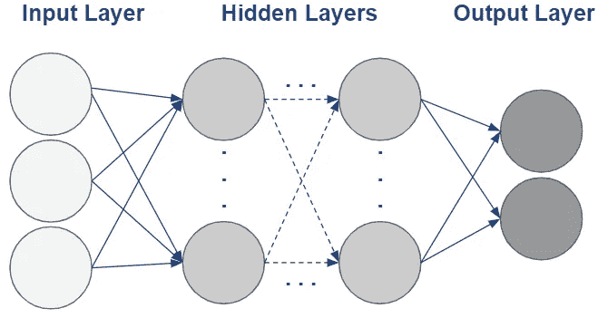
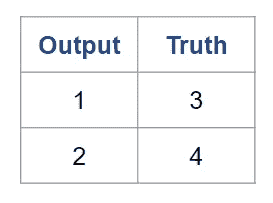
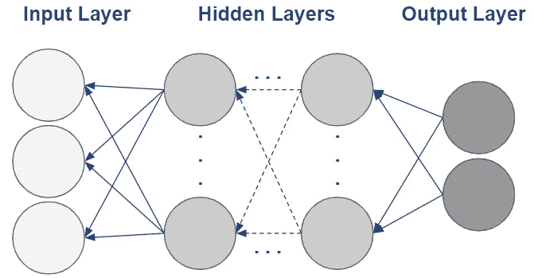

# 简单点:神经网络

> 原文：<https://towardsdatascience.com/make-it-simple-neural-networks-23c56819354b?source=collection_archive---------79----------------------->

## 识别神经网络的基本组件

***摘要***

*这篇文章将提供神经网络的概述。它将帮助有或没有数学背景的人在一个最有前途的研究领域应用他们的具体知识。*

**动机**

我最初是作为一名政治科学家开始的，我很快对定性方法论产生了兴趣。所以本科毕业后，我决定学统计学。在攻读统计学硕士期间，我对数学知识产生了浓厚的兴趣。

大约在同一时间，我开始在一家大型德国研究所的软件管理领域工作。这是我第一次接触机器学习。在午休期间，我听到同事们谈论损失函数，比如均方差，作为一名统计学家，我更清楚这是一种衡量变异的方法。反复讨论引发了逼近方法，这显然是用于神经网络中函数的机器学习，但我知道它是用于逼近复杂分布的。

渐渐地，我鼓起了勇气，令我惊讶的是，我能够在讨论中提出一些当时软件开发人员没有考虑到的观点。因此，我决定花些时间去了解神经网络。我找到了许多带有具体数学推导的文章和书籍，这有助于我更好地进行自下而上的理解。然而，我无法在很长一段时间内捕捉到总体概念。

出于这个原因，我将提供一个主要是叙述性的神经网络概述，以便对整个概念有一个自上而下的视角，作为个体适应的有效起点。

**术语**

图 1(作者的图片)

我需要克服的一个主要问题是理解术语*机器学习*、*深度学习、*和*神经网络*(图 1)之间的实际差异。这些术语在文献中经常被不一致地使用，就像我在上一节中使用它们一样。然而，我认为有效的学习必须对特定的术语有一致的理解。我不会说我的定义是详尽无遗的，并且把所有可用的文献都结合起来了，但是如果有人问我这些术语的区别是什么，我能够给出一致的答案。

图 2(作者的图片)

我喜欢把定义想象成一个俄罗斯娃娃(图 2)。最大的娃娃代表了术语*机器学习*【1】，它概括了算法随着时间的推移而学习的能力。术语*深度学习*【2】由中间的娃娃代表。深度学习代表计算广泛的机器学习程序。而最小的娃娃可以被认为是术语*神经网络*【3】。神经网络是深度学习模型的架构。

**神经网络的组件**

通常，包括神经网络在内的机器学习算法有三个共同点:映射输入和输出的函数、测量信息损失的函数和最小化信息损失的函数[4]。第一种也称为链函数，第二种称为损失函数，最后一种称为优化算法。

现在我们知道神经网络是深度学习领域的架构，深度学习是机器学习的子领域，我们需要确定最初呈现的组件在神经网络的情况下是什么样子的。

*   **连锁功能**

类似于统计学，其中模型选择取决于用例，在机器学习中也存在大量不同的神经网络架构。在本教程中，我将重点介绍一种极其简化的全连接架构。

图 3(作者的图片)

图 3 的快速详细描述:神经网络通常由三种类型的层组成[5]。输入层在神经网络中处理矩阵、向量，甚至标量和输入数据。输出层返回具有预定义形状的输出值。隐藏层将两者连接起来。它们被称为隐藏层，因为通常它们没有预定义的输出。然而，一旦我们从数学上理解了每一层，我们就理解了每一层中的输出维度。圆点表示隐藏层可能有不确定的形状。通常，隐藏层的数量被称为网络的深度，而一层中的圈数代表网络的宽度。如果有人说深度神经网络，一是指有很多隐含层的神经网络。蓝色箭头称为权重，它们是网络的参数。

输入值和输出值通过隐藏层连接。每个隐藏层可以表示为一个函数。据此，链函数是来自隐藏层的所有函数的连接。

还有许多不同的功能可用。它们的共同点是都是矩阵或向量乘法。所以，这些隐藏层的每一层都可以用线性代数的基础知识来理解。

*   **损失函数**

假设现在我们在神经网络中走了一遍。我们将得到一个具有预定义形状的输出。但是这个输出会有多好呢？这个问题的答案正是损失函数的目的[6]。

图 4(作者的图片)

神经网络至少在所谓的监督学习过程中试图最小化它们的输出(图 4，第一列)和基本事实(图 4，第二列)之间的距离。

在我们能够考虑最小化目标之前，我们需要一个策略来测量偏差。还有各种不同的方法。一个简单的方法是均方误差，它将每一行的真实值和网络输出的平方差相加，然后将这个结果除以行数。在图 4 的例子中，平方差的和是 8。由于我们有 2 行，均方差将导致 4。

*   **优化算法**

我们现在知道，我们的神经网络只不过是矩阵或向量乘法的组合，而且通常是相当复杂的聚合。此外，我们知道我们需要损失函数来估计输出值和期望值之间的距离。现在我们正在寻找最小化估计距离的程序[7]。在我看来，这是神经网络中最复杂的一点，因为所用的优化算法通常非常复杂。冒着重复我自己的风险:有大量不同的优化算法可用。仅举两个常用的算法:随机梯度下降和 Adam 优化器。

所有这些优化算法都寻求调整权重，使得损失函数最小化。几乎所有的优化算法都是估计链函数中每个权重的梯度。在这一步中，我们反向遍历神经网络，如图 5 所示。

图 5(作者本人*法师)*

与图 3 中的线相比，图 5 中的反向线意味着我们估计了链函数的每个参数的梯度。每个优化算法然后提供关于如何使用该梯度信息来更新权重的指令。

**结论**

就是这样！这些是对神经网络基本组件的叙述性解释。重复通过神经网络首先向前然后向后并随后更新权重的整个过程，直到损失函数最小化。

请让我知道你如何喜欢将复杂的数学主题分解成简单的叙述性解释的想法。如果你有任何我应该在*文章中使用的其他流行词汇，请告诉我，让它变得简单*文章。

**参考文献**

[1] E. Alpaydin，《机器学习导论》(2014)，第 3 版。剑桥，马萨诸塞州，伦敦，英国:麻省理工学院出版社，ISBN: 9780262325745

[2] Y. LeCun，Y. Bengio，和 G. Hinton，深度学习(2015)，自然。第 521 卷，第 7553 号，第 436-444 页

[3] J. Schmidhuber，神经网络中的深度学习:概述(2014)，arXiv: 1404.7828

[4] I .古德费勒、y .本吉奥和 a .库维尔，《深度学习》(2016)，麻省理工学院出版社，中国。5.10

[5] I .古德费勒、y .本吉奥和 a .库维尔，《深度学习》(2016)，麻省理工学院出版社，第 164 页及其后

[6] I .古德费勒、y .本吉奥和 a .库维尔，《深度学习》(2016)，麻省理工学院出版社，第 80 页及其后

[7] I .古德费勒、y .本吉奥和 a .库维尔，《深度学习》(2016 年)，麻省理工学院出版社，中国。8