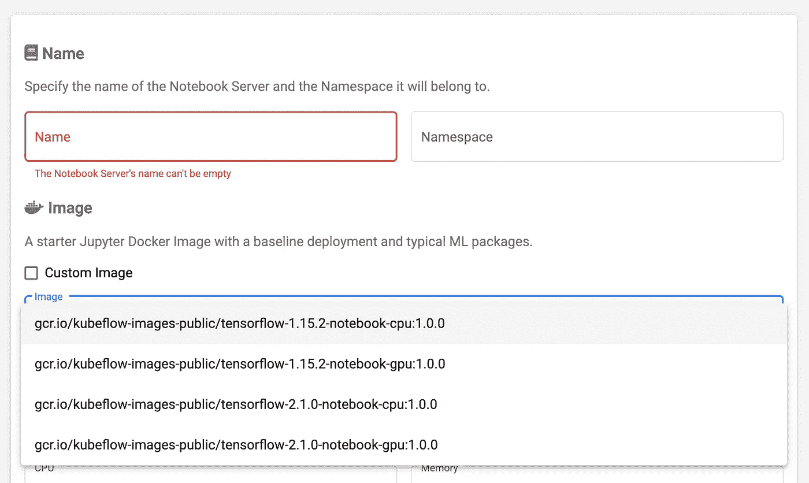
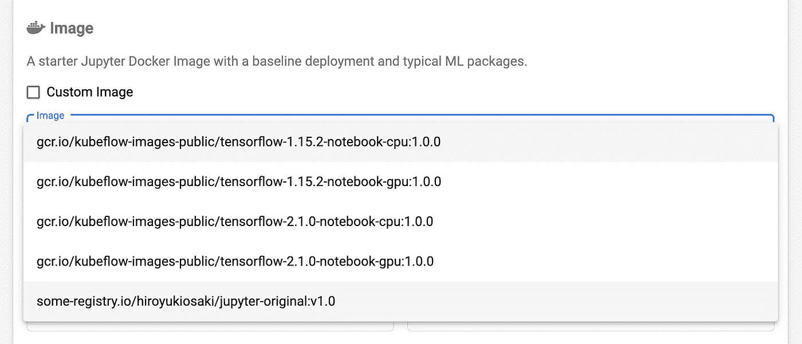

# 让 KubeFlow 成为您自己的数据科学工作空间

> 原文：<https://towardsdatascience.com/make-kubeflow-into-your-own-data-science-workspace-cc8162969e29?source=collection_archive---------40----------------------->

## 1.带上你自己的 Jupyter 图片


[毛绒设计工作室](https://unsplash.com/@plushdesignstudio?utm_source=medium&utm_medium=referral)在 [Unsplash](https://unsplash.com?utm_source=medium&utm_medium=referral) 上的照片

> 好的工作来自好的工作空间。

这种实践可能也适用于数据科学。

# 必需品；要素

1.  **Jupyter**；*作为你的笔记本*
    Jupyter notebook 是数据科学写作事实上的标准工具。您可以创建一个 Python 程序，以图表的形式查看结果，并添加关于结果的注释。
2.  **数据管理**；*作为你的实验资源*
    数据科学离不开数据。数据应该存储在可扩展的数据存储中，比如 AWS S3、Azure BlobStore、Google 云存储、MINIO 等等。
3.  **工作室环境**；*作为你的书桌*
    你可以从一台笔记本切换到另一台笔记本。根据您的任务，您可以轻松选择您的工作空间。亚马逊 SageMaker 工作室，Azure 机器学习，谷歌数据实验室。KubeFlow 是一个新兴的 OSS 工具。

# 了解容器图像的重要性

在工作室中，多个 Jupyter 笔记本作为容器分别运行。容器是一种将计算机工作空间分成具有不同软件栈和独立计算机资源的多个工作空间的技术。在一个容器中，你可以运行 Jupyter notebook，用`apt`或`yum`命令安装一些需要的软件。在另一个容器中，您可以安装另一个版本的工具。它们没有被混淆或污染。你可以随意切换这些容器。

容器从**图像**运行。图像就像软件安装的压缩文件。当您从现有映像运行容器时，您需要的所有软件都已经安装。集装箱可以在几秒钟内启动。

所以集装箱图像就像你的瑞士军刀。当您需要软件时，您可以从您的容器映像运行容器。当你不再需要它的时候，你就把它扔掉。非常方便。

## 有用图像的例子

*   **默认 Jupyter 图片**
    Jupyter 提供[他们的容器图片](https://hub.docker.com/r/jupyter/datascience-notebook/)。`pip`有资格安装许多软件包到 Jupyter 服务器。但是有一些限制；一个是唯一的用户账号`jovyan`没有访问 root 权限。另一个是 Jupyter 中的 python 环境是普通的，所以不需要安装额外的包。
*   **定制启用** `**sudo**` **无密码**
    与默认图像不同，我们可以使用这种图像执行`sudo`无密码。例如，`mount`命令可以运行为 [@shakedko 提到的](https://twitter.com/shakedko/status/1245774300306644993)。在另一种情况下，您可以运行`apt`或`yum`命令按需安装新的库。
*   **预安装一些** `**pip**` **包和库** 与默认映像不同，定制的容器允许您开始工作，而无需任何`pip`命令来安装所需的包。您可以将`pip`包预安装到映像中。例如，`TensorFlow`或`Pandas`可以预装安装。
*   **更多随心定制**
    如果深度定制你的容器镜像，可以改变目录结构、环境变量、设备驱动等等。

# 自定义您的容器图像

如何准备自己的容器图像？别担心。很简单。

你所需要的只是一台安装了 docker 的笔记本电脑。

首先，您**创建 Dockerfile** 。Dockerfile 是一个用于创建容器图像的脚本。不需要从头开始。Dockerfile 允许导入现有图像作为开始行。您只需添加命令行进行区分。

[](https://docs.docker.com/develop/develop-images/dockerfile_best-practices/) [## 编写 docker 文件的最佳实践

### 本文档涵盖了构建高效映像的推荐最佳实践和方法。Docker 构建图像…

docs.docker.com](https://docs.docker.com/develop/develop-images/dockerfile_best-practices/) 

接下来，您用 docker 文件构建一个容器映像。你只要运行这个命令`docker build`。你将在你的 docker 里面有你的容器图像。并且你命名相同的图像名和标签像`some-registry.io/hiroyukiosaki/jupyter-original:v1.0`。

最后，您**将容器映像上传到注册表**。这种操作叫做“T4 推”。 [Dockerhub](https://hub.docker.com/) 是公众中最著名的容器注册表。如果你需要自己的容器注册表，或者你可以试试 [docker image registry](https://docs.docker.com/registry/) 或者 [harbor](https://goharbor.io/) 。推送映像后，您可以将映像下载到任何容器环境中。为了在稍后描述的 KubeFlow 上使用您的图像，您必须将图像注册到注册表。

# 使用您自己的 Jupyter 图像到 KubeFlow

现在是时候准备你的工作室环境了。让我们使用您的容器图像来 KubeFlow。这一步允许您在 KubeFlow 上轻松运行容器。当您在 KubeFlow 上创建新的笔记本服务器时，会出现下面的对话框，您可以从中选择想要运行的容器映像。



通过勾选`Custom Image`，您可以在下面的文本框中输入您的图像名称和标签。


[我之前的帖子](https://medium.com/scientya/share-ml-with-kubeflow-and-mlflow-71ec13ebf9c9)展示了如何在只安装了 docker 的机器上准备 KubeFlow。

**注意:如果 Jupyter 映像支持 KubeFlow 路径的环境值，则 KubeFlow 可以与您的 Jupyter 映像无缝集成。**请参考 [KubeFlow 官方文件](https://www.kubeflow.org/docs/notebooks/custom-notebook/)。

## 更改默认图像列表

如果您是 KubeFlow 环境的管理员，您可以将一些图像添加到默认图像列表，如下所示。

1.  编辑命名空间“kubeflow”中的配置映射“”

```
kubectl edit cm jupyter-web-app-config -n kubeflow
```

这样修改

```
data:
  spawner_ui_config.yaml: |
    # (ellipsis)
    spawnerFormDefaults:
      image:
      # (ellipsis)
        **options**:
        - gcr.io/kubeflow-images-public/tensorflow-1.15.2-notebook-cpu:1.0.0
        - gcr.io/kubeflow-images-public/tensorflow-1.15.2-notebook-gpu:1.0.0
        - gcr.io/kubeflow-images-public/tensorflow-2.1.0-notebook-cpu:1.0.0
        - gcr.io/kubeflow-images-public/tensorflow-2.1.0-notebook-gpu:1.0.0
        # **you can add your image tag HERE like
        -** some-registry.io/hiroyukiosaki/jupyter-original:v1.0
```

2.重新启动一个标有“app . kubernetes . io/name = jupyter-we B- app”的 pod，它会重新加载 1。配置。

```
kubectl delete po -l app.kubernetes.io/name=jupyter-web-app -n kubeflow
```

运行该命令后，请检查是否创建了一个新的 pod，并且它的状态正在变得`Running`。

```
kubectl get po -l app.kubernetes.io/name=jupyter-web-app -n kubeflow -w    

NAME                                          READY   STATUS    RESTARTS   AGE
jupyter-web-app-deployment-679d5f5dc4-zzn7b   1/1     Running   0          3m
```

重新访问创建笔记本服务器的对话框，您将看到默认图像列表包括您刚刚添加的图像名称和标记。



您的图像已添加

# 摘要

对于数据科学家来说，为了加快他们的工作，准备他们自己的 Jupyter 环境和容器映像以便按需创建是很重要的。

使用 docker，您可以定制和构建自己的图像。注册表使您能够管理这些图像。而如果用 KubeFlow 做工作室，可以按需启动自己的镜像。为了方便使用，您可以在 KubeFlow 上编辑默认图像列表。