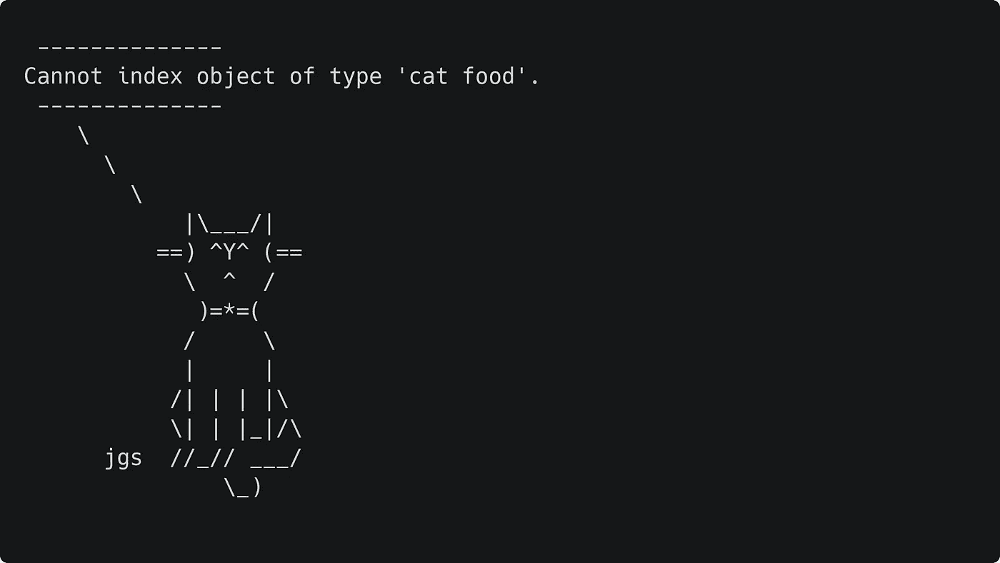

# 用这 5 个包让学习变得有趣

> 原文：<https://towardsdatascience.com/make-learning-r-fun-with-these-5-packages-3c3f6ca82c96?source=collection_archive---------22----------------------->

## 初学者友好的方式添加音乐，扫雷，和更多到您的项目。


图片:安东尼·福明/ Unsplash

有时候，学习编程很容易受挫。也许你已经在同一个概念上工作了一两个小时。也许你的进步很慢。也许这一切都发生在一个全球疫情的周五下午 6 点。我去过那里，我想我并不孤单。

幸运的是，对于 R 程序员来说，有一些软件包可以帮助他们将快乐带回到学习过程中。更重要的是，它们很容易理解，可以为娱乐项目增添趣味。

下面，我整理了五个我最喜欢的“只是为了好玩”的包。每个示例对初学者来说都非常友好，不过要确保在运行示例代码之前安装每个包。您可以通过为每个示例运行函数`install.packages("packagenamehere")`来做到这一点，将包名更改为下面列出的名称之一。

# 1.beepr

“ [beepr](https://www.rdocumentation.org/packages/beepr/versions/1.3) 包只包含一个函数:`beep`。调用时会发出声音，并加载一些有趣的通知。如果你曾经想在脚本中听到威廉的尖叫或《塞尔达传说》中的“获得物品”的声音，这是给你的包。如果你给它一个有效的 URL，它还会播放来自互联网的. wav 文件的声音。只要用一个数字或有效的网址作为参数调用`beep`，它就会发出相应的声音。

```
library(beepr)

# Play Zelda treasure notification
beep(5)
# Play Wilhelm scream
beep(9)
```

与我下面提到的一些其他包不同，beepr 实际上在严肃的工作中非常有用。在运行需要很长时间才能执行的代码时，我经常在等待代码完成的同时做其他事情。在我的脚本末尾调用 beep 表示我的长进程已经完成。在一个长时间的分析或模拟结束时听到一些 8 位的大喇叭是非常令人满意的。

# 2.乐趣

名副其实的' [fun](https://www.rdocumentation.org/packages/fun/versions/0.2) '包是各种功能和游戏的集合。如果你需要另一个拖延的工具，这个包里就有。值得注意的包括一个整洁版本的扫雷，在 R 窗口运行，以及其他游戏，如滑动拼图，和' 5 在一排'。运行这些游戏很容易，只需要下面的代码。加载软件包后，条件语句根据您的操作系统打开正确的交互式图形设备。然后你可以通过调用它的函数来启动这个包中的任何游戏(比如滑动拼图)。

```
library(fun)

# Open the right interactive graphics device
if (.Platform$OS.type == "windows") {
  x11()
} else {
  x11(type = "Xlib")
}

# Start game of choice (sliding puzzle)
fun::sliding_puzzle()
```

这个包还包含一些其他杂项功能和演示。有没有想过在 R 里面画一只乌龟？老年痴呆症测试？关闭你的操作系统？这些都是你可以用‘乐趣’做的事情。虽然阻止你的操作系统可能不会带来笑声，但是这个包中的许多其他有趣的游戏和娱乐是很有趣的。

# 3.命运

[福运](https://www.rdocumentation.org/packages/fortunes/versions/1.5-4)是另一个功能单一的包；`fortune`。当在没有争论的情况下被调用时，它会从 R-help 论坛和其他 R 相关的站点中随机地抛出幽默和智慧的金块。要获得更具体的运气，可以在函数调用中添加一个字符串参数(例如`fortune("divide")`)。这经常会产生一些有趣的输出，下面是我最喜欢的一个:

> 科琳娜·施密特:我怎样才能把 0.285 除以 2 呢？我需要一个函数。
> 结果:0.285 / 2 = 0.1425
> Gabor Csardi:嗯，我觉得
> 0.285 的一半<-function(){
> 0.1425
> }
> 就可以了。Corinna Schmitt 和 Gabor Csardi R-help(2007 年 4 月)

作为一个额外的学习激励，随着你对 R 和它的社区了解的越来越多，许多引用变得越来越有趣。但是，无论你的技能水平如何，幸运之神选择幽默的旁白会让你从原本打算做的事情中分心。

# 4.考赛

一个简洁的软件包，它在控制台的文本输出中添加了字符，'[cow say【T16]'让您可以打印由 ASCII 字符绘制的动物所说的消息。想减轻警告信息的打击吗？用下面的代码让一只猫说出来。](https://www.rdocumentation.org/packages/cowsay/versions/0.8.0)

```
say(what = "Cannot index object of type 'cat food'.", by = "cat", type = "warning")
```



非常可爱的警告信息。

say 函数还可以处理未定义为警告的消息，默认情况下打印普通文本。它还集成了“财富”包；当运行`say(what = "fortune")`时，一个随机的命运将由一个动物来说。因为大家都想看一只鸭子哀叹 R 用户的愚蠢。

# 5.崇拜

最后，有时候接受一句赞美真好。“[赞](https://www.rdocumentation.org/packages/praise/versions/1.0.0)”套餐通过生成随机赞来促进这一点，让您在每次通话中都能获得新的鼓励。在使用`${}`语法指定要动态生成的词性时调用`praise`,会产生如下语句:

```
praise("${Exclamation}! Kind reader, you're ${adjective}!")
```


某种输出。

在我的例子中，我将感叹号大写，而出于语法目的，将形容词小写。动态生成的短语可以完全大写以获得额外的热情(例如`${EXCLAMATION}`)。虽然我看不到这在许多严肃的生产级脚本中获得牵引力，但有时表扬自己的努力也是不错的。今天学了一个新的分析？干得好，冠军。

在我们当前的经济环境下，人们学习编程主要是为了职业发展。当前关注的是学习获得工作的技巧，而不是建设带来快乐的项目。我觉得这也不是完全没有道理。毕竟，大多数 R 程序员并不是为了让 ASCII 动物与用户对话而获得报酬的。他们靠分析数据获得报酬。

也就是说，我喜欢这些包，因为它们再次证明了我当初为什么被编程吸引。这很有趣，让我做出有趣的东西。当我第一次开始学习编程时，我并不是在寻找一份高强度的工作。我很高兴能创造出有趣的小规模项目来应用我的新技能。即使我现在在职业生涯中喜欢写代码，偶尔找回那种感觉也很好。

所以，本着好玩的精神:`say(praise("Thanks for reading, and have fun ${creating} your own ${adjective} R code!"))`

想阅读我所有关于编程、数据科学等方面的文章吗？在[这个链接](https://medium.com/@roryspanton/membership)注册一个媒体会员，就可以完全访问我所有的作品和媒体上的所有其他故事。这也直接帮助了我，因为我从你的会员费中得到一小部分，而不需要你额外付费。

只要我通过[在这里订阅](https://roryspanton.medium.com/subscribe)，你就可以将我所有的新文章直接发送到你的收件箱。感谢阅读！