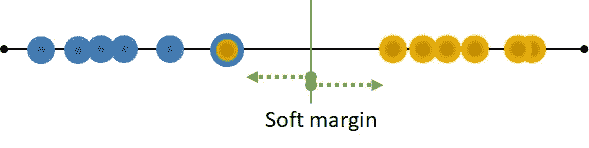
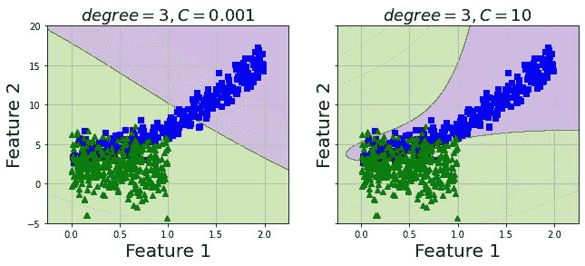

# 让支持向量机完全按照你想要的方式工作

> 原文：<https://towardsdatascience.com/make-support-vector-machine-work-exactly-the-way-you-want-96a1ef69b6d6?source=collection_archive---------45----------------------->

## 支持向量机的概念是如何工作的，以及如何用它来解决你的数据问题

在分类任务中，有几种方法可以做到这一点。可以通过用线性(直)线分隔类，或者用一棵树按照一定的阈值拆分属性直到达到期望的程度，或者计算事件属于哪个类的概率来解决。

支持向量机(Support Vector Machine)是一种**非概率二元线性分类器**，是一种通用的机器学习算法，可以**执行分类和回归任务**。SVM 的另一个优势是它能够**解决线性和非线性数据集**。

鉴于这些众多的好处，在 SVM 有许多概念和解决方案，我发现只有几篇文章/视频真正给出了容易理解的解释，特别是针对那些对 SVM 不熟悉的人。我希望这篇文章以最全面的方式到达你的手中。

# **原始概念**

所有这一切都始于使用一条线(具有 2D 数据集)或一个超平面(超过 3D)将实例分成两类，并尝试**最大化线和最近实例之间的距离**。这个距离被表示为**余量**。下图说明了这一点。


为什么它需要最大化这个利润？原因是一个决策边界正好位于两个类之间比一个更靠近一个类要好得多。

然而，想象有一个橙色类的**异常值**,它比它自己更接近蓝色类。如果我们严格地将上面的概念强加于这个数据集，就会产生下图。现在，差额满足要求，但结果比上面的差额小得多。这被称为**硬边界**


如果有一个新的蓝色类数据落在这个橙色实例附近，则该新数据将被误分类为橙色，换句话说，这意味着模型在新数据上的性能比在训练 1 上的性能差(我们的模型中从来不希望有训练 1)。


# **软余量**

有一种方法可以解决这个问题，即允许对训练集的异常值进行一些错误分类，以最大化其余训练数据的差值。这个概念被命名为**软间隔**或者换句话说，**支持向量机。**



一旦有新数据，就会被正确分类为蓝色。


于是，一个问题出现了。我们如何决定软利润？(我们如何知道哪些实例在训练中会被错误分类？).

其实这个没有完美的答案。你训练数据的几个值的差距决定使用最佳的一个为您的问题。超参数在 scikit-learn 的 VC 模型中控制这一点，表示为 *C.* 如果模型过度拟合，减少 *C.*

这也是因为 SVM 只使用一条直线或超平面来做分类工作，它是一个二元分类求解器。在多类问题的情况下，将采用一对所有(或一对其余)的策略。

> **因此，SVM 算法最重要的规则之一就是它试图在最大化边缘街道和限制边缘违规(误分类)之间找到一个好的平衡。**

# 非线性数据集上的 SVM

但是，对于非线性可分数据，怎么用这一招呢？请看下图，我们需要 3 行来将数据分成 2 个类，对于更复杂的数据，我们需要更多。这在计算上是低效的。


然后，**内核绝招**来了。**内核技巧**将添加其他特性，如多项式特性，然后 SVM 将利用超平面将数据分成两类，而不是在 2D 数据上教授模型。添加 2 次多项式特征后的上述数据将如下所示:


在添加了二次特征之后，实例现在被明显地分成两类

让我们用数据来进一步理解这一点。

```
import random
np.random.seed(42)
m = 500
X1 = 2 * np.random.rand(m, 1)
X2 = (4 + 3 * X1**2 + np.random.randn(m, 1)).ravel()
X12 = np.column_stack((X1,X2))
y1 = np.zeros((500))
X3 = np.random.rand(m, 1)
X4 = (1 + X1**1 + 2*np.random.randn(m, 1)).ravel()
X34 = np.column_stack((X3,X4))
y2 = np.ones((500))
X = np.concatenate((X12, X34), axis=0)
y = np.concatenate((y1, y2), axis=0)def plot_dataset(X, y, axes):
    plt.plot(X[:, 0][y==0], X[:, 1][y==0], "bs")
    plt.plot(X[:, 0][y==1], X[:, 1][y==1], "g^")
    plt.axis(axes)
    plt.grid(True, which='both')
    plt.xlabel("Feature 1", fontsize=20)
    plt.ylabel("Feature 2", fontsize=20, rotation=0)
plot_dataset(X, y, [-1.5, 2.5, -1, 1.5])
plt.show()
```


## **多项式内核**

我在 scikit 中使用了 *SVC* 类——学习 3 次多项式核，其中 *coef* 超参数等于 1(它控制模型受高次和低次多项式影响的程度)。*linear SVC(loss = " hinge ")*具有先验的*多项式 features(degree = 3)*transformer 会做同样的把戏。

如果你有一个非常大的数据集，继续使用 *LinearSVC* ，因为它在处理大数据方面比 *SVC* 更快。

> 需要记住的一点是，在训练 SVM 之前，一定要缩放数据

```
poly_kernel_svm_clf = Pipeline([
	("scaler", StandardScaler()),
	("svm_clf", SVC(kernel="poly", degree=3, coef0=1, C=0.001))
])
poly_kernel_svm_clf.fit(X_train, y_train)
poly_kernel_svm_clf10 = Pipeline([
	("scaler", StandardScaler()),
	("svm_clf", SVC(kernel="poly", degree=3, coef0=1, C=10))
])
poly_kernel_svm_clf10.fit(X_train, y_train)# Plot the model overall prediction
def plot_predictions(model, axes):
    """
    Vizualize the classification result of the model to see how it
    corresponds to training data
    """
    x0s = np.linspace(axes[0], axes[1], 1000)
    x1s = np.linspace(axes[2], axes[3], 1000)
    x0, x1 = np.meshgrid(x0s, x1s)
    X = np.c_[x0.ravel(), x1.ravel()]
    y_pred = model.predict(X).reshape(x0.shape)
    y_decision = model.decision_function(X).reshape(x0.shape)
    plt.contourf(x0, x1, y_pred, cmap=plt.cm.brg, alpha=0.2)
    plt.contourf(x0, x1, y_decision, cmap=plt.cm.brg, alpha=0.1)fig, axes = plt.subplots(ncols=2, figsize=(10.5, 4), sharey=True)
plt.sca(axes[0])
plot_predictions(poly_kernel_svm_clf, [-0.25,2.25,-5,20])
plot_dataset(X_train, y_train)
plt.title(r"$degree=3, C=0.001$", fontsize=18)plt.sca(axes[1])
plot_predictions(poly_kernel_svm_clf10, [-0.25,2.25,-5,20])
plot_dataset(X_train, y_train)
plt.title(r"$degree=3, C=10$", fontsize=18)
plt.show()
```



C 值等于 10 的模型似乎很好地抓住了要点，让我们在测试集上测量它的性能。

```
from sklearn.metrics import f1_score
model_list = [rbf_kernel_svm_clf,rbf_kernel_svm_clf10]
for model in model_list:
    y_pred = model.predict(X_test)
    print(f1_score(y_test, y_pred, average='weighted'))0.6459770114942529
0.8542027171311809
```

## **高斯 RBF 核**

现在，我想用这个数据尝试不同的核，我将使用**高斯 RBF 核。这里是维基百科上对这个内核的解释[https://en.wikipedia.org/wiki/Radial_basis_function_kernel](https://en.wikipedia.org/wiki/Radial_basis_function_kernel)**

由于我的数据不是太大，*高斯 RBF 核*并不需要太多时间。但是，对于大型数据集，*高斯 RBF 核*会消耗你相当多的时间。

```
from sklearn.svm import SVC
from sklearn.preprocessing import StandardScaler
from sklearn.pipeline import Pipeline
from sklearn.model_selection import train_test_splitX_train, X_test, y_train, y_test = train_test_split(X, y, test_size=0.33, random_state=42)# Create pipeline for training
rbf_kernel_svm_clf = Pipeline([
	("scaler", StandardScaler()),
	("svm_clf", SVC(kernel="rbf", gamma=0.1, C=0.001))
])
rbf_kernel_svm_clf.fit(X_train, y_train)
rbf_kernel_svm_clf10 = Pipeline([
	("scaler", StandardScaler()),
	("svm_clf", SVC(kernel="rbf", gamma=5, C=10))
])
rbf_kernel_svm_clf10.fit(X_train, y_train)# Plot the model overall prediction
fig, axes = plt.subplots(ncols=2, figsize=(10.5, 4), sharey=True)
plt.sca(axes[0])
plot_predictions(rbf_kernel_svm_clf, [-1.5, 2.5, -1, 1.5])
plot_dataset(X_train, y_train)
plt.title(r"$gamma=5, C=0.001$", fontsize=18)plt.sca(axes[1])
plot_predictions(rbf_kernel_svm_clf10, [-1.5, 2.5, -1, 1.5])
plot_dataset(X_train, y_train)
plt.title(r"$gamma=5, C=10$", fontsize=18)
plt.show()
```


2 值的 C 似乎产生了一个类似的模型。让我们预测测试集，并用度量标准进行评估

```
from sklearn.metrics import f1_score
model_list = [rbf_kernel_svm_clf,rbf_kernel_svm_clf10]
for model in model_list:
    y_pred = model.predict(X_test)
    print(f1_score(y_test, y_pred, average='weighted'))0.8417207792207791
0.8544599213495534
```

正如所料，2 个模型的性能相当，C = 10 的值略高，也略高于上面的多项式核模型。

我们可以通过调整超参数、交叉验证、添加另一种类型的特征转换来改善这一点(希望如此)。我们自己试试吧。