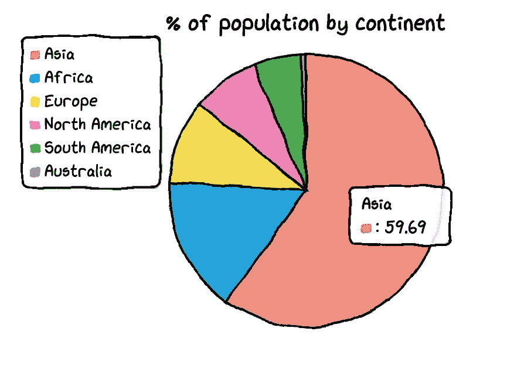
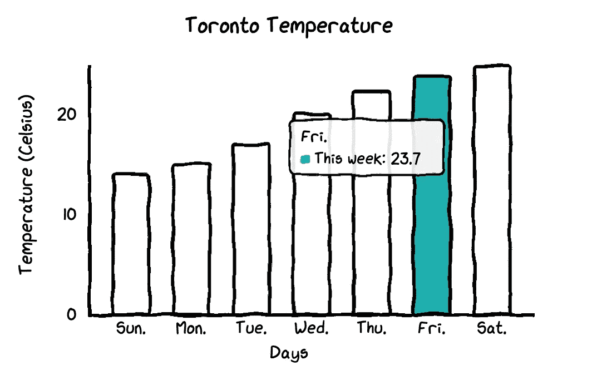
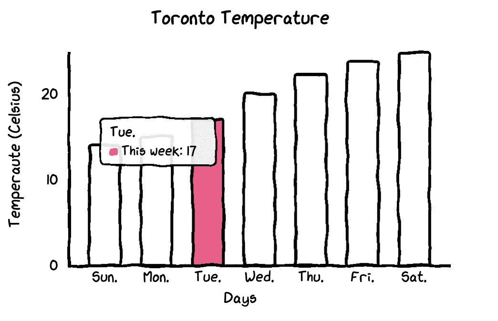
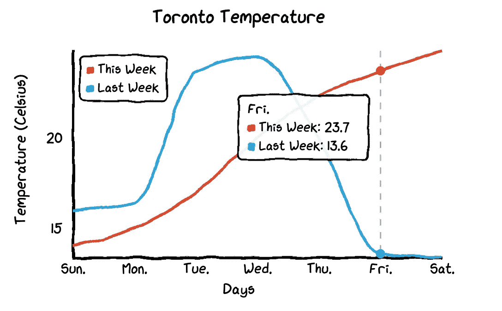
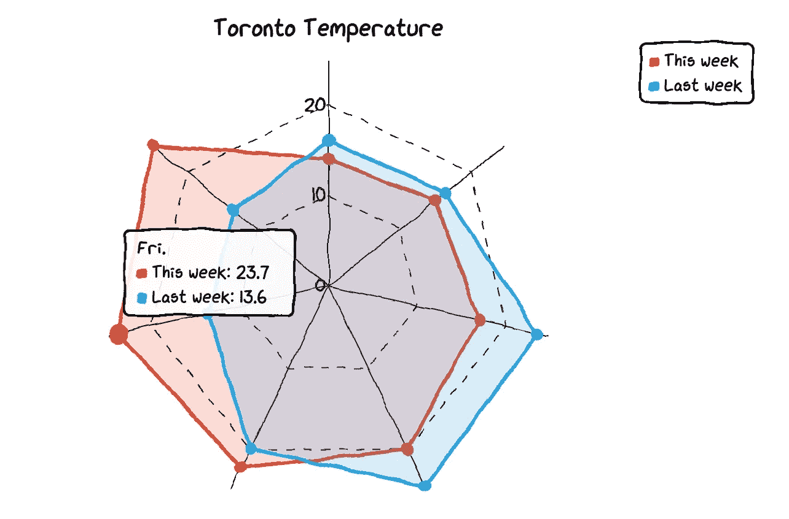
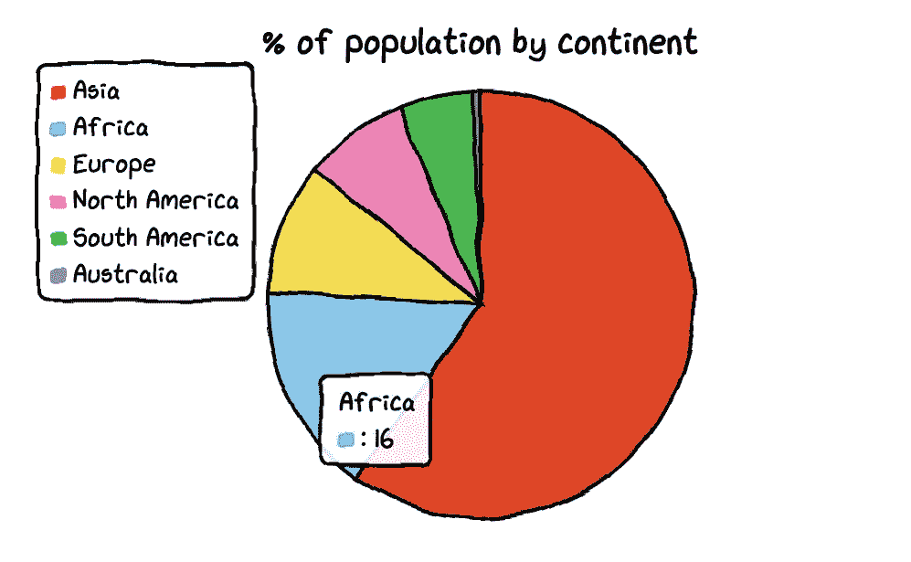
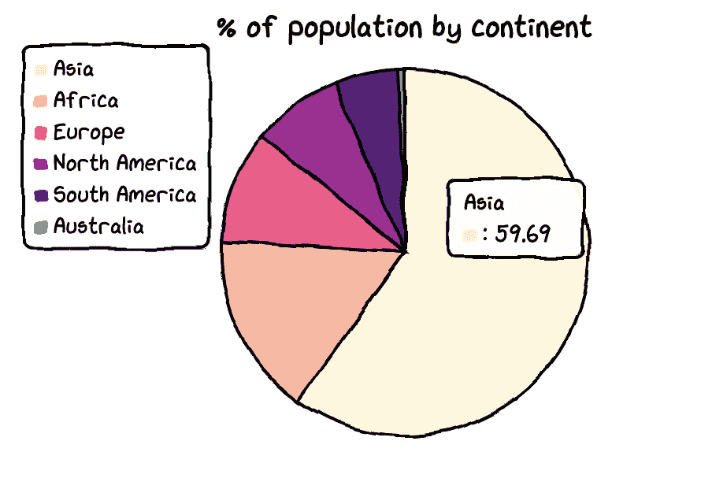
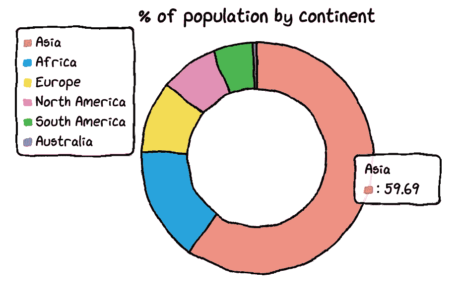
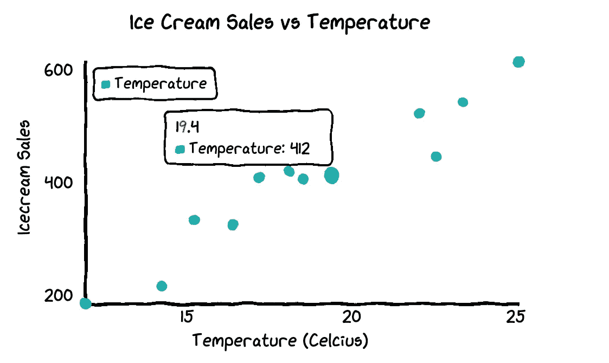
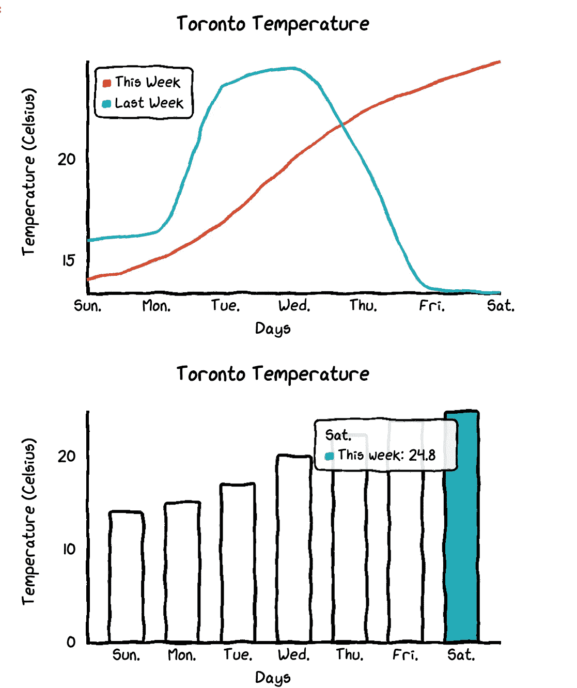

# 用 Python 制作最可爱的图表

> 原文：<https://towardsdatascience.com/make-the-cutest-chart-in-python-visualize-your-data-with-hand-drawn-charts-f21157f76b4b?source=collection_archive---------36----------------------->

## 用手绘图表可视化您的数据

在本教程中，我要介绍一个非常酷的 Python 手绘风格可视化包:cutecharts。

与常见的图表如 Matplotlib 和 seaborn 不同，这个包可以用来生成以下几种看起来像手绘的图表，在某些场景下效果可能会更好。可爱的图表也是互动的，动态的。每当鼠标悬停在图表上时，数字就会显示出来。

要创建这个图表，您只需要几行 Python 代码。



目前，这个库支持五种图表——条形图、折线图、饼图、雷达图和散点图。它还支持图表的组合。让我们逐一探究。

在我们开始绘制可爱的图表之前，我们需要安装 cutechart 库。

```
$ pip install cutecharts
```

让我们用多伦多气温的数据集来画条形图和折线图。

```
#import library and dataimport cutecharts.charts as ctc
df=pd.DataFrame({
 ‘x’:[‘Sun.’,’Mon.’,’Tue.’,’Wed.’,’Thu.’,’Fri.’,’Sat.’],
 ‘y’:[14,15,17,20,22.3,23.7,24.8],
 ‘z’:[16,16.4,23.6,24.5,19.9,13.6,13.4]})
```

1.  **条形图**

```
chart = ctc.Bar(‘Toronto Temperature’,width=’500px’,height=’400px’)
chart.set_options(
 labels=list(df[‘x’]),
 x_label='Days',
 y_label='Temperature (Celsius)' ,
 colors=[‘#1EAFAE’ for i in range(len(df))]
 )
chart.add_series('This week',list(df[‘y’]))
chart.render_notebook()
```



在这个条形图中，所有的条形都有相同的颜色。如果你想定制每个条的颜色，你只需要改变代码中的一行。

```
chart = ctc.Bar(‘title’,width=’500px’,height=’400px’)
chart.set_options(
 labels=list(df[‘x’]),
 x_label=”Days”,
 y_label=”Temperature (Celsius)” ,
 colors=**[‘#FFF1C9’,’#F7B7A3',’#EA5F89',’#9B3192',’#57167E’,’#47B39C’,’#00529B’]**
 )
chart.add_series(“This week”,list(df[‘y’]))
chart.render_notebook()
```



**2。折线图**

为我们的数据集绘制折线图更有意义，这样我们可以看到上周和本周的温度差异。

```
chart = ctc.Line(“Toronto Temperature”,width=’500px’,height=’400px’)
chart.set_options(
 labels=list(df[‘x’]), 
 x_label=”Days”,
 y_label=”Temperature (Celsius)” )
chart.add_series(“This Week”, list(df[‘y’])) 
chart.add_series(“Last Week”, list(df[‘z’]))
chart.render_notebook()
```



当您将鼠标悬停在图表上时，图表会自动显示带有数字的标签，并且还会绘制一条虚线，以便更直观地显示本周和上周的气温差异。

**3。雷达图**

要将折线图更改为雷达图，只需将图表类型更改为 ctc.Radar 即可。

```
chart = **ctc.Radar**(‘Toronto Temperature’,width=’700px’,height=’600px’)
chart.set_options(
 labels=list(df[‘x’]),
 is_show_legend=True, #by default, it is true. You can turn it off.
 legend_pos=’upRight’  #location of the legend
 )
chart.add_series(‘This week’,list(df[‘y’]))
chart.add_series(“Last week”,list(df[‘z’]))
chart.render_notebook()
```



**4。饼状图**

我们需要另一个数据集来制作饼图和圆环图。

```
df=pd.DataFrame({‘x’:[‘Asia’, ‘Africa’, ‘Europe’, ‘North America’, ‘South America’, ‘Australia’],
 ‘y’:[59.69, 16, 9.94, 7.79, 5.68, 0.54]})
```

数据集包含各大洲的名称及其人口百分比。

```
chart = ctc.Pie(‘% of population by continent’,width=’500px’,height=’400px’)
chart.set_options(
 labels=list(df[‘x’]),
 inner_radius=0
 )
chart.add_series(list(df[‘y’])) 
chart.render_notebook()
```



您可以更改饼图中每个部分的颜色。



将饼图转换成圆环图也非常容易。你只需要改变内半径的参数。

```
df=pd.DataFrame({‘x’:[‘Asia’, ‘Africa’, ‘Europe’, ‘North America’, ‘South America’, ‘Australia’],
 ‘y’:[59.69, 16, 9.94, 7.79, 5.68, 0.54]})chart = ctc.Pie(‘% of population by continent’,width=’500px’,height=’400px’)
chart.set_options(
 labels=list(df[‘x’]),
 **inner_radius=0.6**
 )
chart.add_series(list(df[‘y’])) 
chart.render_notebook()
```



**5。散点图**

为了绘制散点图，我将创建一个新的数据集来绘制温度和冰淇淋销售额之间的关系。

```
Temperature = [14.2,16.4,11.9,15.2,18.5,22.1,19.4,25.1,23.4,18.1,22.6,17.2]
Sales = [215,325,185,332,406,522,412,614,544,421,445,408]
```

然后，我们可以创建散点图。

```
chart = ctc.Scatter(‘Ice Cream Sales vs Temperature’,width=’500px’,height=’600px’)
chart.set_options(
 x_label=”Temperature (Celcius)”,
 y_label=”Icecream Sales” ,
 colors=[‘#1EAFAE’],
 is_show_line = False,
 dot_size=1)
chart.add_series(“Temperature”, [(z[0], z[1]) for z in zip(Temperature, Sales)])
chart.render_notebook()
```



我们很容易看出，天气变暖会带来更多的销售。

**6。组合图表**

您还可以将多个图表组合在一起。

```
chart1 = ctc.Line(“Toronto Temperature”,width=’500px’,height=’400px’)
chart1.set_options(
 labels=list(df[‘x’]), 
 x_label=”Days”,
 y_label=”Temperature (Celsius)” )
chart1.add_series(“This Week”, list(df[‘y’])) 
chart1.add_series(“Last Week”, list(df[‘z’]))chart2 = ctc.Bar(‘Toronto Temperature’,width=’500px’,height=’400px’)
chart2.set_options(
 labels=list(df[‘x’]),
 x_label=”Days”,
 y_label=”Temperature (Celsius)” ,
 colors=[‘#1EAFAE’ for i in range(len(df))]
 )
chart2.add_series(“This week”,list(df[‘y’]))
chart2.add_series(“Last week”,list(df[‘z’]))page = Page()
page.add(chart1, chart2)
page.render_notebook()
```



如您所见，cutechart 包确实可以提供令人印象深刻的可爱图表。这个软件包的限制是它只能生成五种不同的图表。

如果你对制作其他类型的漂亮图表感兴趣，你可以看看我的其他帖子。

1.  [用 python 制作美丽的 Nightinggale 玫瑰图——可视化 covid19 死亡率](https://medium.com/python-in-plain-english/make-beautiful-nightingale-rose-chart-in-python-covid-19-death-rate-141a7a49bb61)
2.  [用 Python 制作一个几行字的漂亮水球图](https://medium.com/python-in-plain-english/make-beautiful-water-polo-chart-in-a-few-lines-in-python-5d04f3f9335d)
3.  [用 Python 用几行代码制作一个漂亮的条形图](https://medium.com/@han.candice/make-a-beautiful-bar-chart-in-just-few-lines-in-python-5625ebc71c49)
4.  [用 Python 制作几行漂亮的散点图，让你的报告出类拔萃](https://medium.com/@han.candice/make-a-beautiful-scatterplot-in-in-a-few-lines-in-python-to-make-your-report-outstanding-f47db0532094)
5.  [受汉斯·罗斯林教授的启发，用 Python 语言 Plotly 制作令人印象深刻的动画泡泡图](https://medium.com/python-in-plain-english/animated-bubble-chart-with-plotly-in-python-inspired-by-professor-hans-rosling-b7262298dd03)
6.  [使用 Python 中的 Matplotlib 绘制唯一的条形图](https://medium.com/python-in-plain-english/draw-a-unique-barplot-using-matplotlib-in-python-f6b88b4a6f89)