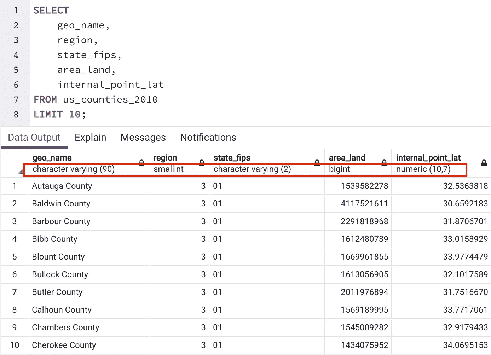
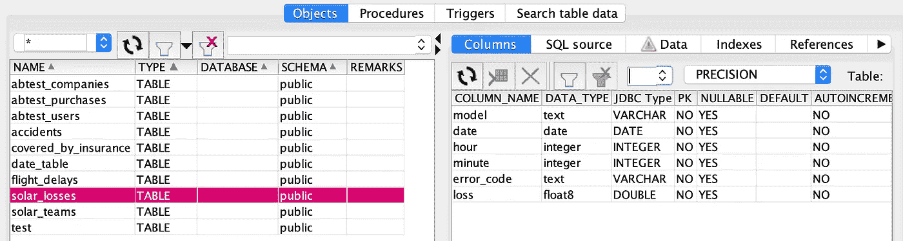

# 向 SQL 的伟大飞跃

> 原文：<https://towardsdatascience.com/make-the-leap-to-sql-greatness-7e536d33def1?source=collection_archive---------22----------------------->

## 一些需要了解的微妙之处，以提高您的 SQL 技能

当我试图弥补我的 SQL 技能从不稳定的中级到自信的数据专家之间的差距时，我发现中级学习者缺乏资源。大多数 SQL 书籍要么是为了让业务分析师编写他们的第一本`SELECT *`书，要么是为了让经验丰富的数据库管理员(DBA)编写 DDL 来建立和维护数据库。这根本不符合我的需求——数据科学家和数据分析师需要知道如何处理复杂的表连接，并且不需要更改模式或修改数据。

我自学了 SQL。我有必要查看我负责的报告后端的数据。通过这样做，我一头扎进了一个由连接、聚合等组成的复杂世界。很多。桌子。(如果您只学习了示例数据库中最多有 5 个表的 SQL 类，那么您还没有看到任何东西——相当确切地说。)

这篇文章总结了我最近获得的一些技巧、诀窍和微妙之处，并希望与其他希望跨越 SQL 平庸和伟大之间鸿沟的人分享。


实现 SQL 的飞跃。由[亚历克斯·拉德里奇](https://unsplash.com/@alexradelich?utm_source=medium&utm_medium=referral)在 [Unsplash](https://unsplash.com?utm_source=medium&utm_medium=referral) 拍摄的照片

# SQL 语法是温和的，令人沮丧的不同。了解不同之处。

ANSI SQL(美国国家标准协会)是事实上的“标准”,所有数据库管理系统(DBMS)在创建特定于 DBMS 的 SQL 时都遵循这一标准。然而，它们似乎是以最高级的、切向的方式排列的。我看到过关于堆栈溢出的回答，坚持认为不同变体之间的语法差异非常接近，可以忽略，但是当我试图在不同的设置(PostgresSQL)中使用我在工作中(使用 SQL Server)学到的语法时，我已经陷入了太多次的忽略。

最大的问题是，我使用的语法在其他方面是有效的——网上有大量的资料来源——所以很难确切地看出为什么查询不起作用。这让我怀疑自己的技能，而不是意识到我需要使用不同的语法或找到不同的解决方案。

令人惊讶的是，我还没有找到一份完整的语法差异列表！以下是我个人遇到的一些不同之处。让我知道过去有哪些不同之处让你感到沮丧，这样我就可以添加它们了！

如果您知道任何其他可能会使您出错的语法差异，请告诉我！

# 百分位数函数&寻找中位数

这篇文章——实际上也是我在过去一周半时间里为提高 SQL 技能所做的尝试——是因为一个 SQL 挑战要求我找出中间值。用 *Python* 编写一个中值函数是我的专长，但是我对用 SQL 编写感到害怕。事实上，我在网上搜索时发现，Median 函数并不是 ANSI SQL 标准，Postgres 也没有它的实现。

## 有用的 ANSI SQL 标准函数

这个问题让我发现了`percentile_cont()`和`percentile_disc()`，其中*是* ANSI SQL 标准函数。语法对你来说可能是新的，但是值得记住:

```
SELECT percentile_cont(.5)
       WITHIN GROUP (ORDER BY *column_name*)
FROM *table_name*
```

`column_name`是要计算中值的列，`table_name`是该列所在的表。请注意我们通常使用的聚合函数是如何将`column_name`作为函数输入的(例如`MAX(cost)`或`AVG(distance)`，但是`percentile_cont(n)`取的是您想要计算的百分比。在我们的例子中，我们使用 50%来获得中位数。

`percenticle_disc(n)`是一个类似的函数，但它仅限于数据集中实际存在的值。也就是说，如果有偶数个列，`percentile_disc(0.5)`将取位于数据集中间的两个值中的较小值，而`percentile_cont(0.5)`将返回平均值。

要知道，还有其他 ANSI SQL 标准函数可以让您计算相关性和协方差，甚至回归线斜率，而无需从数据库中取出数据。作为参考，简单看看中的 [SQL。](https://www.oreilly.com/library/view/sql-in-a/9780596155322/ch04s02.html)

## 创造性地使用常见的聚合函数

如果你创造性地思考，你实际上可以用普通的聚合函数解决中位数问题:

```
-- Solution #1, doesn't work in MS SQL ServerSELECT AVG(*column_name)*
FROM *table_name*
ORDER BY *column_name*
LIMIT 1 *--If you have an even number of data points, use LIMIT 2*
OFFSET (SELECT COUNT(*)/2
                FROM *table_name)*;-- Solution #2, doesn't work in PostgresSQLSELECT
(
 (SELECT MAX(*column_name*) 
  FROM (
        SELECT TOP 50 PERCENT *column_name* 
        FROM *table_name* 
        ORDER BY *column_name* ) AS BottomHalf)
 +
 (SELECT MIN(*column_name*) 
  FROM (
        SELECT TOP 50 PERCENT *column_name* 
        FROM *table_name* 
        ORDER BY *column_name* DESC
        ) AS TopHalf)
) / 2 AS Median
```

解决方案#1 更简单，尽管它需要人工干预来确保计算是正确的。如果您有奇数个数据点，这很容易—首先，找出哪一行描述了数据集的前 50%。这是使用内部子查询`SELECT COUNT(*)/2 FROM *table_name*`完成的。例如，如果有 4，383 行数据，子查询将返回第 2，191 行。因为您正在进行整数除法，所以该值是 floored(一个细微的差别，我将在后面说明)。然后，您可以编写外部查询，其中您将`LIMIT 1`获得您的中值，并`OFFSET`通过子查询的结果进行选择。(注:这也是`OFFSET`进来离合的绝佳例子。)

请注意，解决方案#1 仅适用于奇数个数据点。如果您想处理偶数个数据点，您需要将其修改为`LIMIT 2`，并计算这两个中间值的平均值。虽然在生产中这不是一个很好的解决方案，但在面试中这是一个容易记住的解决方案。

解决方案#2 是 Jeff Atwood 的[堆栈溢出响应，它更复杂，但不知道数据点的数量。不幸的是，它在 PostgresSQL 或 MySQL 中不起作用，因为它们不支持`TOP`或`PERCENT`关键字。(还是那句话，知道自己的不同！)](https://stackoverflow.com/a/2026609)

# 定点和浮点数据类型。或者，为什么你的计算总是错的。

当我在一家银行担任业务分析师时，我写了一份 FSD(功能规范文档),概述了如何从各种产品数据库中获取和计算现金流。当我的开发伙伴使用 FSD 来编码计算时，我注意到这些值稍微有些偏差。数百万的交易额相差几分或几美元，但这种差异令人不安——为什么价值不匹配？

事实证明，它与数字在数据库中的存储方式以及计算中使用的数据类型都有关系。像`float`、`real`和`double precision`这样的浮点数据类型被不精确地存储，随着时间的推移，小的不精确性会被放大。一般来说，您应该使用像`numeric`这样的定点数据类型来进行任何精确的计算。关于为什么永远不应该使用浮点数据类型来进行计算——尤其是数字类型——的更多信息，请查看[这个伟大的堆栈溢出响应](https://stackoverflow.com/questions/3730019/why-not-use-double-or-float-to-represent-currency/)。要点是如果

## 顺便说一句，整数除法就是地板除法

与从 Python 2 到 Python 3 所做的[改变不同，除法不再默认为整数除法](https://stackoverflow.com/questions/1282945/python-integer-division-yields-float)，SQL 仍然假设两个整数之间的除法是底数除法。也就是说，余数被丢弃，只返回一个整数。(例如`SELECT 7/3`返回`2`)

如果你想在你的值没有被平均分配时也获得十进制值，不要忘记先把一个值转换成数据类型。例如:

```
-- Example #1
SELECT 7/CAST(3 AS float);-- Example #2
SELECT 7/3::float;
```

在上面的两个例子中，函数`CAST()`和符号`::`都可以用于类型转换。关于如何使用`CAST`得到浮点答案的详细说明，我推荐[这个堆栈溢出答案](https://stackoverflow.com/questions/3443672/integer-division-in-sql-server)。

# 铅字铸造。或者，如何修正你的计算。

类型转换一开始可能会感觉棘手，尤其是因为 SQL DBMS 标准之间的数据类型是不同的。但是我建议您弄清楚哪些数据类型——尤其是数值型——对于您选择的 SQL 是有效的，并确保您知道计算的结果是什么数据类型！即使您没有对结果中的每一个数值或每一列进行强制转换，您至少应该知道您将得到什么。使用默认结果很容易给你错误的答案。

## 使用 CAST 函数

强制转换的语法很简单:

```
CAST(*expression* AS *datatype(length)*)
```

其中`*expression*` 可以是列名，也可以是列间的计算。`*datatype*`是您希望将表达式`CAST`成的数据类型，`(*length*)`是可选的，但是可以用于指定`varchar(25)`的字符限制或类似于`numeric(8,1)`的数字精度。

## 使用::符号

`::`符号的工作方式与`CAST`函数完全一样，所以如果你看到的是它而不是`CAST`，就知道它们都在进行类型转换:

```
-- Using ::
SELECT a.count::Float / (b.count + a.count) * 100 AS ratio-- Using CAST()
SELECT CAST(a.count AS Float) / (b.count + a.count) * 100 AS ratio
```

请注意，在上面的示例中，我们在计算比率之前将被除数转换为浮点数，因此我们的结果是浮点数而不是整数。

## 如何检查数据类型

一些数据库管理系统，如 pgadmin4，会在查询结果窗口中显示数据类型:



一些 DBMS 很友好地向您展示了数据类型

其他时候，您需要研究元数据指定的数据类型。您可以通过 DBMS GUI 做到这一点，例如，SQL Workbench 允许您通过数据库浏览器查看表元数据:



通过 SQL Workbench 中的数据库浏览器查看的数据类型

否则，如果您有足够的权限，可以使用以下 SQL 来查看数据类型:

```
SELECT COLUMN_NAME,
       DATA_TYPE,
       CHARACTER_MAXIMUM_LENGTH
FROM information_schema.columns
WHERE TABLE_NAME = '*table_name*';
```

# 你在纠结什么？

我很想听听 SQL 技巧真正提升了您的游戏水平——尤其是我在本文中没有提到的那些——或者您仍在努力解决的问题！