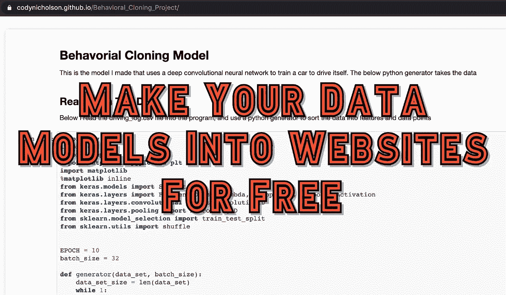
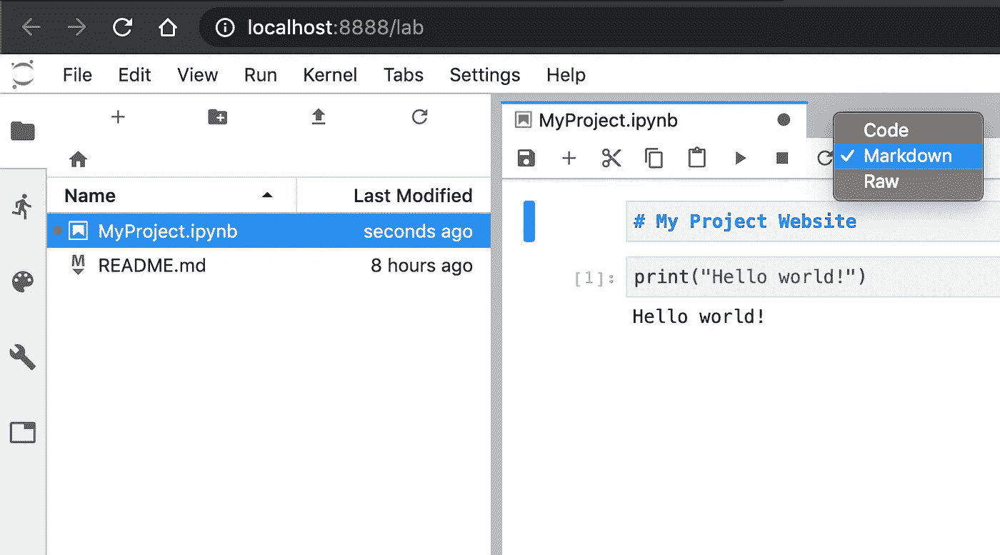
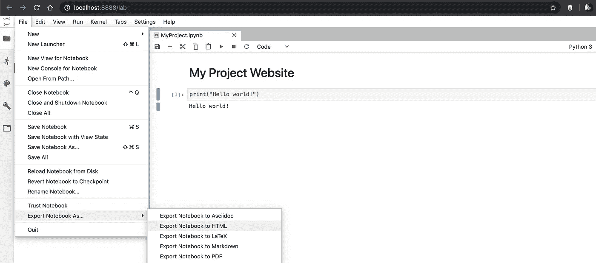
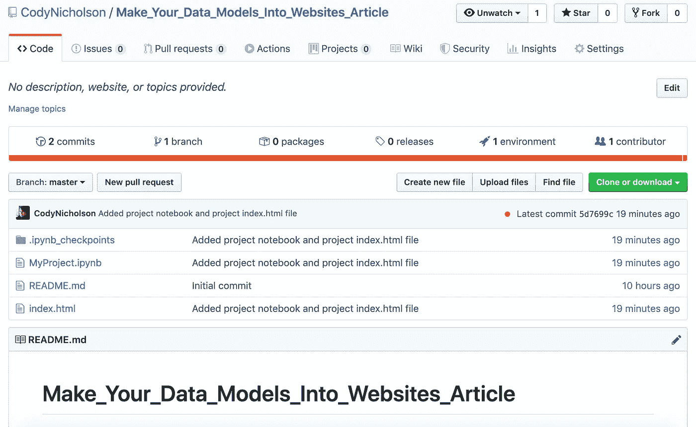
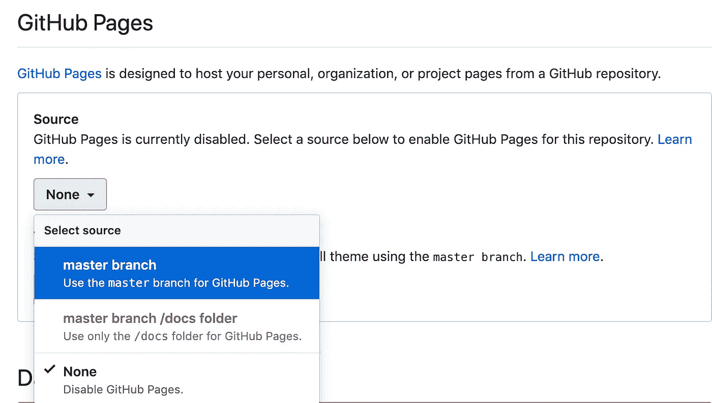
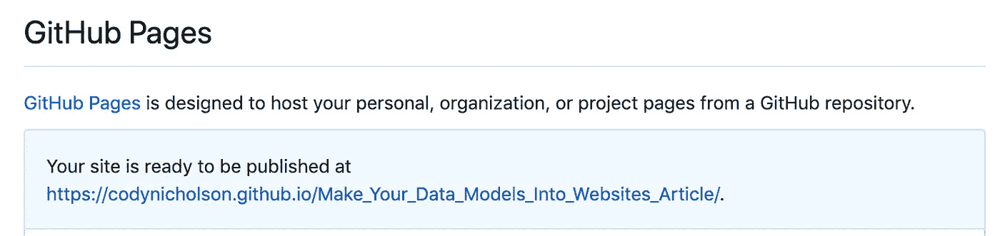
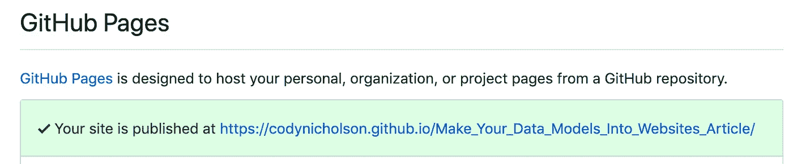
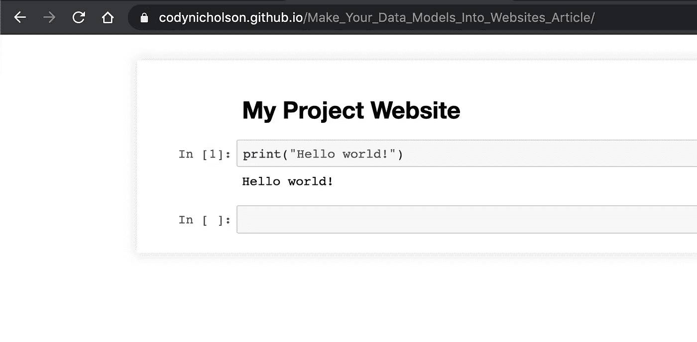

# 将您的数据模型制作成网站

> 原文：<https://towardsdatascience.com/make-your-data-models-into-websites-d7260956c6d7?source=collection_archive---------33----------------------->



## 数据可视化

## 使用 GitHub 部署您的 jupyter 笔记本，让任何人都可以免费查看

你做到了！由于你的分析天才，你成功地确定了预测你所在地区未来十年房地产价格的主要因素，或者气候变化的主要原因，或者你可以在亚马逊上与最高销售额相关的产品描述中使用的词语。只有一个小问题:你需要与世界分享你的发现！

在这篇文章中，我将向您展示如何使用工具免费将您的数据模型部署为网站: **Python、Jupyter Lab/Notebook、Git、**和 **GitHub** 。点击以下任何链接，查看我在过去几年中参与的项目网站:

[Seaborn 演示项目](https://codynicholson.github.io/Seaborn_Sample_Project/)，[车道线寻找项目](https://codynicholson.github.io/Lane_Line_Finding_Project/)，[人物分类器项目](https://codynicholson.github.io/Character_Classifier_Project/)，[车辆检测项目](https://codynicholson.github.io/Vehicle_Detection_Project/)，[交通标志分类器项目](https://codynicholson.github.io/Traffic_Sign_Classifier_Project/)，[高级车道线寻找项目](https://codynicholson.github.io/Advanced_Lane_Line_Finding_Project/)，[行为克隆项目](https://codynicholson.github.io/Behavioral_Cloning_Project/)

> **先决条件:** [安装 Python](https://www.python.org/downloads/release/python-376/) ，[安装 jupyterlab](https://jupyterlab.readthedocs.io/en/stable/getting_started/installation.html) ，[安装 Git](https://git-scm.com/downloads) ，[拥有 GitHub 账号](https://github.com/)

## **如果您已经准备好了一个 jupyter 笔记本和一个 GitHub 存储库，请跳到第三步**

# 1.创建您的仓库

在你的 GitHub 账户上，你应该创建一个新的库，然后 **git 将这个库克隆到你的电脑上**。

> **如果您对本文的 Git & GitHub 部分有任何疑问，请参见“** [**掌握 Git 的基础知识&GitHub**](https://medium.com/@clairvoyantcoding/getting-started-with-git-github-6235f5ae3a0b)

**您将使用的命令应该如下所示:**

```
**git clone** [**https://github.com/CodyNicholson/Make_Your_Data_Models_Into_Websites_Article.git**](https://github.com/CodyNicholson/Make_Your_Data_Models_Into_Websites_Article.git)*(Replace my URL with the URL you copied from your repo)***cd** [**Make_Your_Data_Models_Into_Websites_Articl**](https://github.com/CodyNicholson/Make_Your_Data_Models_Into_Websites_Article.git)**e/** *(Replace my repository name with yours)***jupyter lab**
```

> **您现在应该看到 Jupyter 实验室，它应该已经在您的默认浏览器中打开了一个选项卡**

**如果您在使用 **git clone** 命令时遇到问题:确保您已经使用上面提供的链接安装了 git。确保您提供的链接是您通过点击 GitHub 资源库中的绿色**“克隆或下载”**按钮复制的 *HTTPS* 链接。**

**如果您在使用 **jupyter lab** 命令时遇到问题:确保您正确安装了 jupyter lab。当你点击上面的安装链接时，我使用了他们提供的各种选项中的“*pip install jupyterlab”*选项。**

# **2.创建 Jupyter 笔记本**

**在你新打开的 Jupyter 实验室中，点击 ***【笔记本】*** 标题下的**【Python 3】**框。这将创建一个新的 **Untitled.ipynb** 文件并打开它。从这个新文件中，您可以在代码单元格中编写和运行 Python 代码，并在 markdown 单元格中添加标题和描述。**

****

**在上图中，你会看到我已经创建了两个单元格。第一个单元格是一个 Markdown 标题单元格，我在其中添加了标题“我的项目网站”,它将作为标题出现，因为我在单词前加了“#”。运行该单元格将产生一个格式良好的标题。在这个单元格下面，我创建了一个代码单元格，只打印“hello world”。以您选择的任何名称保存该文件将结束我们的 Jupyter 笔记本的创建。请参阅本文开头的“我的项目”链接，了解将来可以添加到笔记本中的更高级逻辑的示例。**

# **3.将我们的笔记本导出为 HTML 文件**

**在我们打开的 Jupyter Lab 选项卡中，转到:**文件→将笔记本导出为… →将笔记本导出为 HTML** 。这将下载一个与您的 ipynb 文件同名的 HTML 文件。**

****

**一旦我们下载了这个文件，你应该把它移到你的仓库里，并且**确保你重命名了这个文件:*index.html*****

# **4.向 GitHub 添加、提交和推送更改**

**在您的终端或 git bash 窗口中——确保您在您的 git 存储库中。然后，我们应该运行这个命令来选择我们的存储库中所有要提交的更新文件:**

```
**git add .**
```

**接下来，我们将运行此命令提交所有已更改的文件，并给出一条有用的消息:**

```
**git commit -m "Added project notebook and project index.html file"**
```

**最后，我们可以使用以下命令将其向上推:**

```
**git push**
```

**如果我们在这之后去我们的 GitHub 仓库，我们应该看到:**

****

*   ***如果你不小心犯了”。DS_Store”文件—不要害怕，忽略它。这是一个临时文件，您可以在以后删除它。***

# **5.启用项目网站**

**回到我们的 GitHub 在线资源库，我们将点击页面顶部“**用户名/资源库名称**”链接下工具栏中的最后一个选项“T2【设置”按钮。**

**在以下设置页面—向下滚动到“**选项**菜单的“ **GitHub 页面**”部分。您应该会看到一个“ **Source** ”标题，下面是一个下拉菜单，默认选项为“ **None** ”。**

****

**从下拉菜单中选择**总分行**，刷新您的设置页面。向下滚动到“ **GitHub Pages** ”部分，现在应该会显示这条以蓝色突出显示的消息:**

****

**这意味着该网站仍在设置中，您需要等待大约一分钟。持续刷新页面，直到“ **GitHub 页面**”部分的蓝色阴影框再次变为高亮绿色，如下所示:**

****

**单击已发布的网站链接应该会将您带到新的项目网站！我的网站可以在:[**https://clairvoyantcoding . github . io/Make _ Your _ Data _ Models _ Into _ Websites _ Project/**](https://clairvoyantcoding.github.io/Make_Your_Data_Models_Into_Websites_Project/)**

****

**你可以为你的每个 GitHub 库建立一个网站，就像这个一样，把一个**index.html**文件放在你的库的根目录下，然后像这样启用 GitHub 页面。**

# **6.免费网站的限制和提示**

**令人惊讶的是，GitHub 为你创建的每个项目提供这些免费网站——但它也有一些限制。对于每个项目，除了你的**index.html**页面，你不能有更多的页面。因此，如果你添加**page2.html**并试图从你的**index.html**引用它，你将无法到达第 2 页。**

**如果一个文件叫做**。DS_Store** "出现在你的储存库中确保你删除它。它是自动创建的，可以包含您不希望通过将其部署到 GitHub 页面与外界共享的文件路径。**

**该项目网站的另一个常见错误或限制是，您的主 HTML 文件必须命名为“**index.html**”，并且它必须位于您的存储库的根目录下，这意味着它不能从您的存储库中的另一个文件夹中引用。**

**最后，尝试在你网站的每个代码单元前加上一个标题和/或描述标记单元。能够轻松创建项目网站并与世界共享是一件好事，但是您的内容需要能够被您网站的任何访问者所理解。即使是不懂 Python 的人。因此，为了获得最佳的用户体验，总是要尝试并总结你做得好的地方。**

> **这里是本文的存储库:[https://github . com/ClairvoyantCoding/Make _ Your _ Data _ Models _ Into _ Websites _ Project](https://github.com/ClairvoyantCoding/Make_Your_Data_Models_Into_Websites_Project)**

**感谢阅读！我很乐意听到你的反馈或者回答任何关于本教程的问题，所以请在下面评论，我会尽力帮助你。**