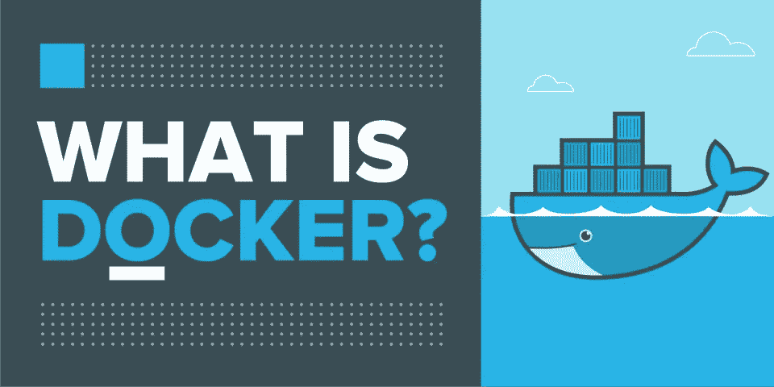
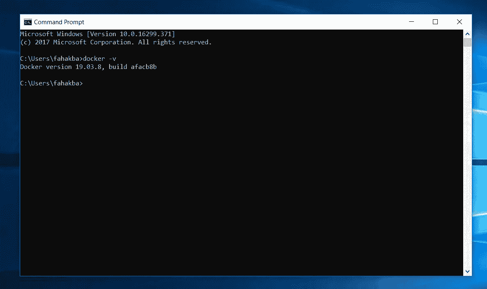
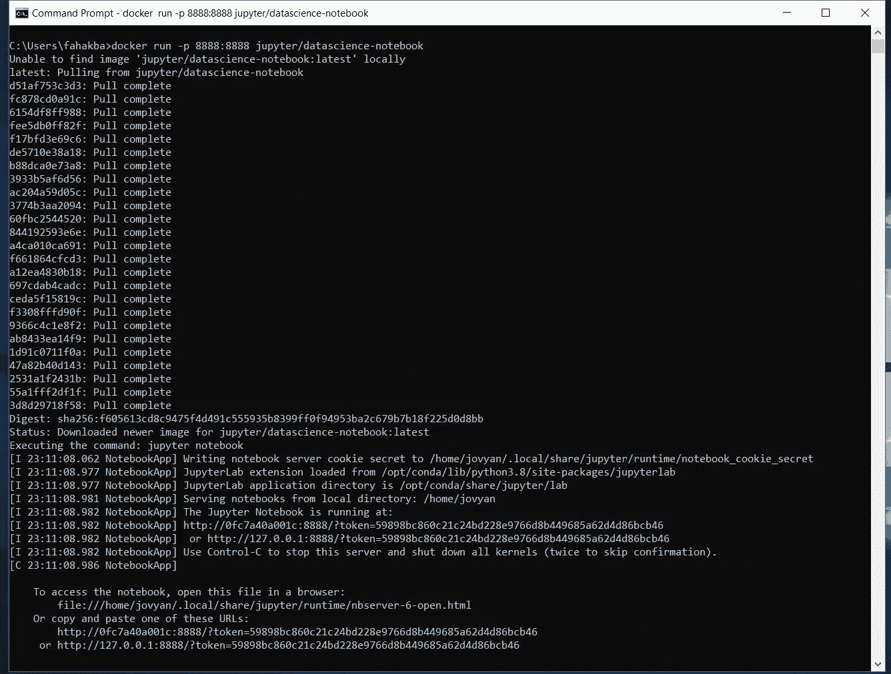
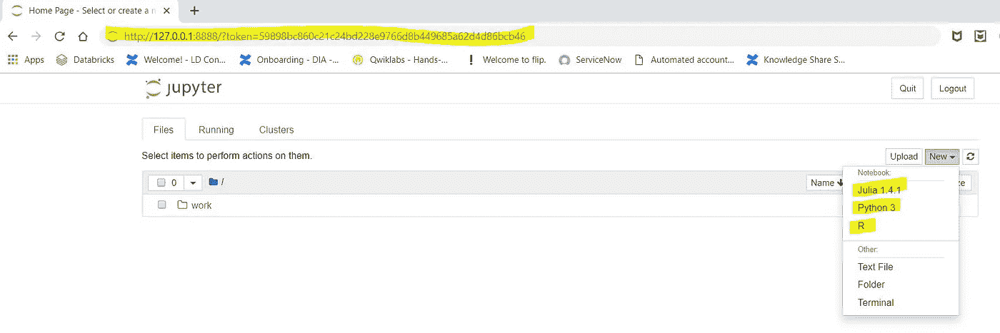
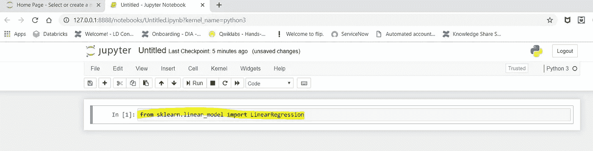
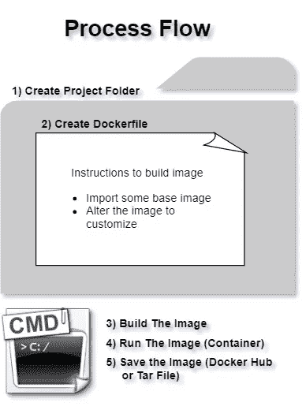
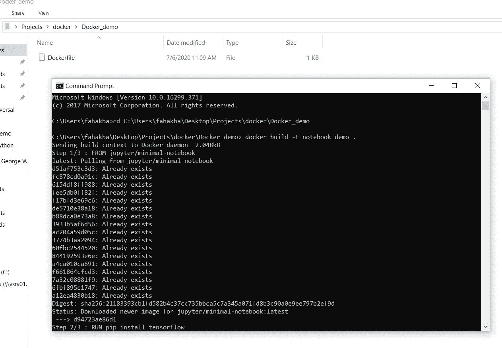
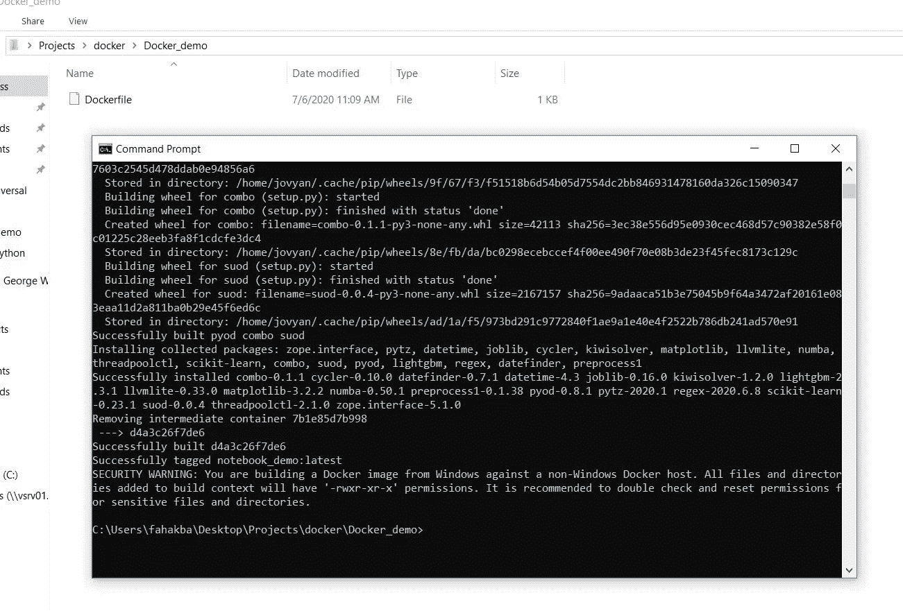
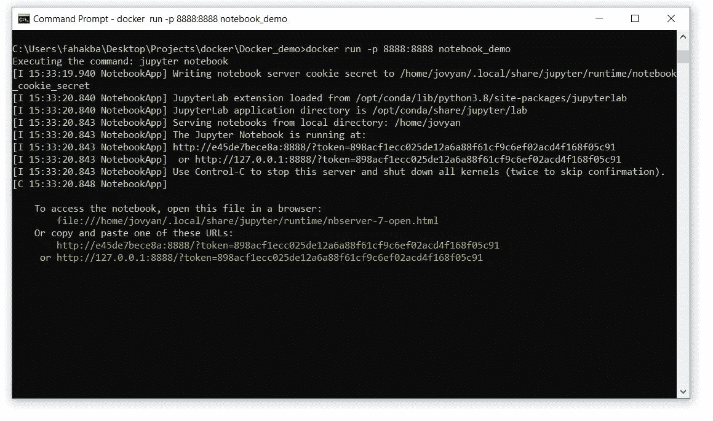
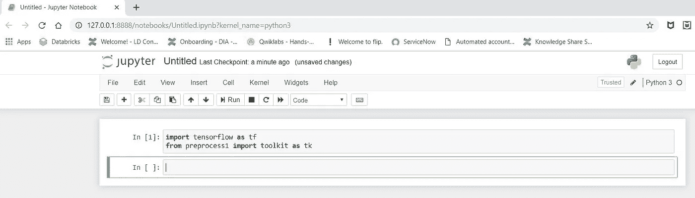

# Docker 让您的数据科学生活变得简单

> 原文：<https://towardsdatascience.com/make-your-data-science-life-easy-with-docker-c3e1fc0dee59?source=collection_archive---------15----------------------->

## 理解、构建和使用 Docker 映像和容器用于数据科学

## 介绍 Docker 容器用于数据科学需求和项目的迷你指南


[https://unsplash.com/photos/eIjIn7zln2U](https://unsplash.com/photos/eIjIn7zln2U)

O 当你开始你的数据科学之旅时，首先要做的是安装不同的软件，比如 Python、Jyupter Notebook、一些 ide 和无数的库。一旦您成功地通过了这一关，您经常会遇到这样的情况:您的代码在您的计算机上似乎工作得很好，但是当您与他人共享它时，它似乎会无缘无故地崩溃。**好吧，你并不孤单！**

好消息是，有一些令人印象深刻的解决方案，它们在便利性、可访问性和易用性方面有所不同。谷歌 Colab 就是其中之一。它已经准备好启动，加载了许多有用的库，并有 GPU 支持。它也有其局限性。但不是今天文章的主题。可以在这里 ***学习体验 Google Colab [***。***](https://research.google.com/colaboratory/faq.html)***

[](https://research.google.com/colaboratory/faq.html) [## 合作实验室-谷歌

### 什么是协同实验室？Colaboratory，简称“Colab”，是谷歌研究院的产品。Colab 允许任何人…

research.google.com](https://research.google.com/colaboratory/faq.html) 

在本文中，我们将采取不同的方法。我们先动手，后面再来解释。这种方法将展示它有多简单，以及为什么要成为一名精通数据的科学家，您应该学习更多的相关知识。

下面是我们今天要学习的主要概念和任务列表:

1️⃣***docker 是什么？***

2️⃣ ***安装 Docker 桌面***

3️⃣ ***运行数据科学加载 Jupyter 笔记本***

4️⃣ ***理解容器***

5️⃣ ***什么是图像& Dockerfile？***

6️⃣ ***创建一个定制的 Docker 图像***

7️⃣ **保存&分享你的图片 t47】**

➖➖➖➖➖➖➖➖➖➖➖➖➖➖➖➖➖➖➖➖➖➖➖➖

让我们开始逐一讨论。

# Docker 是什么？



版权所有 Akhil Bhadwal (hacker.io)

D ocker 是一家提供解决方案的公司(解决方案的名字也是 Docker！)到我们上面描述的问题。事实上，它不仅如此，而且是开发人员工具箱中的一个优秀工具，但我们将坚持它与我们的数据科学相关问题的相关性。这是一个帮助我们构建“映像”和运行“容器”的软件，以支持和更好地交付数据科学项目。我们将在本文后面解释“图像”&“容器”的概念。如上所述，我们先动手，解释随后就到。你可以在这里 阅读更多关于 Docker [***。***](https://www.docker.com/why-docker)

[](https://www.docker.com/why-docker) [## 为什么是 Docker？码头工人

### 2013 年，Docker 推出了集装箱行业标准。集装箱是一个标准化的单位…

www.docker.com](https://www.docker.com/why-docker) 

在我们开始之前，我还建议在 Docker 上创建一个帐户(免费版本也可以)来保存你在 Docker Hub 上的项目。

# **安装 Docker 桌面**

Vis it this[***链接***](https://www.docker.com/products/docker-desktop) 并安装 Docker 桌面。它与任何其他软件安装没有什么不同。可以选择 Windows 版本或者 Mac 版本。对于我们的演示，我们将使用 Windows 版本。Mac 的过程几乎是相同的。下载完成后，单击下载的文件进行安装，并按照说明进行操作。这个过程很简单，应该会很顺利。如果你想在安装前看看这个过程，我在 YouTube 上找到了一个很好的 11 分钟的视频，带你完成安装过程。

视频作者:编程知识

安装完成后，您可以进行一些检查，看看一切是否正常。打开您的命令提示符/终端，编写以下代码并按 enter 键:

```
docker -v
```

这将通过向您提供我们安装的 Docker 版本来确认安装是否成功。



作者图片:Docker 版本和安装检查

# 运行加载了数据科学的 Jupyter 笔记本

我的魔术时间到了。打开命令提示符/终端，写下以下代码:

```
docker run -p 8888:8888 jupyter/minimal-notebook
```

我稍后会解释这段代码，现在只需遵循这些步骤。我们是第一次这样做，所以需要一些时间来准备。下一次，重新运行这个命令不会花费更多的时间，因为所有必需的文件都已经下载了。此外，你也不需要任何互联网连接(不像谷歌的 Colab)。该过程结束后，输出应该是这样的:



图片作者:拉&运行数据科学加载 Jupyter 笔记本与一个单一的命令

复制最后三行中的任何一行(这些是地址)并粘贴到您的任何浏览器中(保存令牌供以后使用，在单词“token”后面的地址中提供)。这将在您的浏览器中打开一个 Jupyter 笔记本。

你会注意到笔记本自带 Python3，Julia & R，不仅如此，很多流行的数据科学库都已经安装好了，随时可以导入！



作者图片:通过复制粘贴地址在浏览器中打开 Jupyter 笔记本



作者图片:这个 Jupyter 笔记本装载了许多数据科学库

*😯😲 😯 ***部分是，*** 这些程序实际上都没有安装在你的机器上！*

*所以如果你试图在你的电脑上找到 Python/Julia/R 或者 Jupyter 笔记本，祝你好运！即使您之前在计算机上安装了这些程序，这些“dockerized”安装也是独立安装，与您计算机上已安装(或未安装)的应用程序 ***无关*** 。*

*这意味着，如果您使用我们刚刚创建的 Jupyter 笔记本创建一个程序或编写一段代码，测试它，并与您的朋友或同事共享(所有这些内容将在本文后面介绍),只要您的朋友或同事像我们一样启动他们的 Jupyter 笔记本，它就一定会工作。*

# *了解容器*

*故事从容器的概念开始。不过，这个想法并不新鲜；你可能已经熟悉了“环境”这个概念。几乎是一回事。在适当的时候，数据科学家将创建和开发许多模型，这些模型将依赖于许多库或许多其他数据科学家的工作(我们称之为依赖)。随着依赖性的发展和增长，这将不可避免地导致所有这些模型之间的“矛盾”。*

*先说一个很一般化的例子。想象你有很多💰💰💰并决定建立一个工厂来生产商业用途的东西。你建了一个工厂(目前只是一个大厅)，安装了各种不同的机器和工作场所。然后你雇佣熟练工人来做这项工作。当你的生意是新的，没有规模的时候，事情就不复杂，而且进展顺利。但是，随着业务的增长和竞争的加剧，您决定增加更复杂的技术和先进的流程。问题来了；当你适应这些新技术时，你会意识到这些过程中的一些根本不能在一个屋檐下工作，例如，一种技术需要干燥的环境，而相反，另一种技术在更潮湿的环境中工作。人也一样，一些人需要安静的环境，而另一些人需要在嘈杂的机器前工作(或者出于其他一些随机的原因)*

**

*两个技术高超的人一起工作却无法共事(来源:P[**【ixabay.com】**](https://pixabay.com/vectors/co-workers-argument-argue-worker-294266/)**)***

*那么你想到的最直观的解决方案是什么？*

*显然，您将简单地建造单独的房间(而不是建造单独的建筑)和大厅，以确保每个过程和部门都得到它所需要的环境。这个解决方案类似于“容器”的概念。*

*继续我们的示例，现在您想要在另一个国家或地理区域建立具有完全相同设置的相同设施。想象一下，一种技术可以以某种方式克隆您现有的生产设置，并且您可以简单地将其移植到所需的位置。这类似于“共享容器”。*

*一个与数据科学更相关的例子是您使用 sklearn 版本 x 为用例 a 创建的模型。五个月后，sklearn 有了一个新的改进版本 x+1。您更新了您的库，并使用新版本为另一个用例 b 创建了另一个模型。每个人都很高兴，直到您为用例 A 运行您的模型，该模型崩溃并不运行。结果是新的 sklearn 版本不再支持旧的模型。因此，您只能运行旧模型(如果您回去安装较旧的 sklearn 版本)或新模型，而不能同时运行两者。*

*再次，试着想一个可能的解决方案。一个简单的方法是再买一台电脑，在上面安装新的 sklearn 版本。这肯定会解决问题。❌Please 不要向任何人建议这个！❌，因为你还能坚持多久？每次更新你的 sklearn 库都买新电脑，更别说其他几百个库了，绝对不是一个实用的解决方案。*

> *如果我们将特定项目所需的所有软件和库都安装在一台计算机或操作系统中，并“隔离”在它们自己的空间中，会怎么样？这样，你的模型将只停留在它的边界之内，而不会干扰它之外的任何东西。*

**

*作者图片:隔离拯救了生命，也解决了一些编程/数据科学问题*

*这就是你们所说的容器；项目及其所有依赖项都封装/隔离/隔离在一个操作系统中。我们可以向前一步，与他人共享该容器，然后他人可以在他们的机器上添加和运行该容器，并执行相同的实验，而不必担心所有涉及的依赖关系。*

## *👉👉👉**这正是我们之前通过 Docker 所做的，在命令提示符下运行一行代码。Jupyter 的开发人员将 Python、Julia、R 和其他库放在一个容器中，在云上共享，我们通过 Docker 拉取并运行它。**👈👈👈*

*至此，我们准备再引入两个概念，以获得一个完整的图景；图像和 Dockerfile。*

# *什么是图像和 Dockerfile 文件？*

*图像是容器的种子。它是项目在某个时间点的“快照”。只有当我们“运行”它时，它才成为一个容器。把它想象成你给你朋友的漂亮房间拍的照片，然后你计划用同样的方式布置你的房间。它的美妙之处在于，我们可以在运行图像并将其转换为容器之前对其进行修改。这种改变来自于一个**文档**。Dockerfile 是一个扑克脸文件(它没有任何扩展名，如 csv，txt 等。)包含对 Docker 的指令。*

*在我们的演示中，Jupyter 拍摄了项目的快照，制作了图像，并以“jupyter/datascience-notebook”的名称发布在 Docker Hub 上。我们提取并运行图像，将其放入一个容器中。但是，我们没有改变图像；我们只是照原样运行。这就是为什么没有涉及 Dockerfile。*

*在下一节课中，我们将展示一个示例，在该示例中，我们将在运行容器之前修改笔记本并添加 Tensorflow 和一个名为 preprocess1 的数据预处理库。这次为了让事情变得更轻更快，我将使用 Jupyter 笔记本的另一个图像(称为 jupyter/minimal-notebook)。如果您愿意，您可以保留我们之前使用的图像。*

# ****创建定制的 Docker 图像****

*让我们继续前面的例子，在这个例子中，我们从 Docker Hub 中“拉出”了加载了数据科学的 Jupyter 笔记本。只是这一次，我们会通过 Dockerfile 将 Tensorflow & preprocess1 库添加到其中。但是首先，让我们看看这个过程会是什么样子。*

**

*作者的图像:构建和运行自定义图像的流程*

*📔如果你有并且知道如何操作 MS Visual Studio 代码，这个过程会变得容易得多。现在，假设我们没有 VS 代码，我们将执行这些步骤。*

*   *1️⃣创建项目文件夹:在你的电脑上，创建一个空文件夹，你想保存你的项目文件。*
*   *2️⃣创建 Dockerfile:在文件夹内，创建一个文本文件。打开文件，写下下面的代码(以#开头的行只是注释)*

```
**# import pre-built image from data science notebook* FROM jupyter/minimal-notebook*# Install required libraries* RUN pip install tensorflow
RUN pip install preprocess1*
```

*如您所见，到目前为止，代码很容易阅读和理解。我们只做了导入 Jupyter 笔记本并使用“FROM”和“RUN”命令安装我们想要的库。*

*   *3️⃣保存 Dockerfile:关闭文件，右键单击将其重命名为“Dockerfile”(确保遵循准确的拼写和大小写)，删除扩展名(。txt)并保存它。你的 Docker 文件准备好了！*

*➖➖➖➖➖➖➖➖➖➖➖➖➖➖➖➖➖➖➖➖➖➖➖➖*

*➕奖金:通常，我们通过一个名为“需求”的文本文件来完成所有这些库安装(尽管名字并不重要)。您只需将库名与您想要的任何特定版本放在一起，并将文件保存在 Dockerfile 所在的同一文件夹下。文件中的库要求如下:*

```
*tensorflow==2.2.0
preprocess1==0.0.38*
```

*下面是将这个文本文件“添加”到 Jupyter 图像中的代码。*

*[](https://jupyter-docker-stacks.readthedocs.io/en/latest/using/recipes.html) [## 投稿食谱- docker-stacks 最新文档

### 用户有时会分享使用 Jupyter Docker 堆栈的有趣方式。我们鼓励用户贡献这些…

jupyter-docker-stacks . readthedocs . io](https://jupyter-docker-stacks.readthedocs.io/en/latest/using/recipes.html) 

➖➖➖➖➖➖➖➖➖➖➖➖➖➖➖➖➖➖➖➖➖➖➖➖

*   4️⃣火了你的命令提示符，并'光盘'的文件夹中，我们创建了 docker 文件。在那里，我们运行下面的命令来构建我们的映像。

```
docker build -t notebook_demo .
```

同样，代码非常直观；这是一个 docker 命令，用来构建一个名为 notebook_demo 的映像。“-t”是用于命名/标记图像的标志词。最后,“点”意味着我们使用的 Dockerfile 在 active directory 中。按回车键执行命令行。它应该是这样的:



作者的图像:在通过 Dockerfile 构建图像的过程中



作者的图像:在图像建立之后

*   5️⃣运行图像:我们现在准备运行我们刚刚创建的图像。在命令提示符/终端中运行以下命令:

```
docker run -p 8888:8888 notebook_demo
```

这个命令意味着它是运行名为 notebook_demo 的映像的 docker 命令。标志字“-p”表示将其映射到容器和主机之间的端口 8888。

完成后，复制所提供的三个地址中的任何一个，并在您的浏览器中粘贴它，以打开和访问您的 Jupyter 笔记本(保存令牌供以后使用)。导入 tensorflow & preprocess1 库，以确保它们是正确的。



作者图片:运行新定制的图片作为容器



作者图片:我们可以导入 tensorflow 和 preprocess1 库，而无需 pip 安装它们

我们成功加载了一个最小的 Jupyter 库，预装了一些定制库，如 TensorFlow 和 preprocess1。

# ***保存&分享你的图片***

如果我们不能将自己的工作移植到其他电脑上，或者与其他用户分享，这有什么好处呢？那是我们的最后一步！值得注意的是，一旦你在你的电脑上建立了一个形象，它会自动保存。您可以使用 run 命令随时访问它，而不需要任何互联网连接。

▶️的一个选择是将其保存到 Docker Hub。这使它成为公共的，任何人都可以访问它，就像我们从 Docker Hub 访问 minimal 和 data science Jupyter Notebook 一样。这种方法的一个问题是当你上传到 Docker Hub 时图像的大小，因为它增加得相当快。

我们将需要在命令提示符/终端中使用以下命令来保存到 Docker Hub:

```
#log into Docker Hub
docker login — username= your_Docker_username
#Enter your password when prompted# Push your Image by name, in our case "notebook_demo"
docker push your_Docker_username/your_image_name
```

就是这样！您的图像可以公开使用。任何安装了 docker 的人都可以轻松访问同一个映像，并使用我们已经熟悉的命令添加(tensorflow & preprocess1)确切的依赖关系:

```
docker run -p 8888:8888 notebook_demo
```

▶️The 的另一个选项是将其保存为一个 tar 文件，我们需要在命令提示符/终端中运行以下命令。您需要位于保存 tar 文件的同一个目录中。

```
# save it under the active directory
  docker save notebook_demo > notebook_demo.tar# you can load it this way
docker load — input notebook_demo.tar
```

恭喜你！如果你已经做到了，你应该得到热烈的掌声！

👏👏👏👏👏👏👏👏👏👏👏👏👏👏👏👏👏👏👏👏👏👏👏👏👏


图片来源:[www.vectorstock.com](http://www.vectorstock.com)

👏👏👏👏👏👏👏👏👏👏👏👏👏👏👏👏👏👏👏👏👏👏👏👏👏

# 摘要

在本节课中，我们学习并应用了以下内容

✅ ***什么是 Docker？******安装 Docker 桌面*** ✅ ***通过 Docker 跑数据科学加载 Jupyter 笔记本*** ✅ ***了解容器的概念*** ✅ ***了解 Docker 镜像&Docker 文件*** ✅ ***创建自定义 docker 镜像*** ✅ ***保存***

记住，我们只是触及了表面。有这么多的学习和爆炸性的材料。图片不仅仅是 Jupyter 笔记本的。它们可以是完整的操作系统、编程语言等等。我强烈建议你看看 Docker 网站上的用例及参考资料

[](https://www.docker.com/) [## 增强开发者的应用开发能力| Docker

### 世界领先的服务，用于与您的团队和 Docker 社区查找和共享容器图像。对于…

www.docker.com](https://www.docker.com/) 

请随时给我反馈。毕竟我们就是这样学习和提高的！*