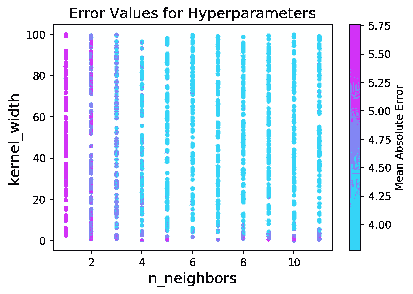

# 用高斯核使你的 KNN 平滑

> 原文：<https://towardsdatascience.com/make-your-knn-smooth-with-gaussian-kernel-7673fceb26b9?source=collection_archive---------26----------------------->

## 找出让你的 KNN 更强大的方法。

图片来自 https://unsplash.com/photos/8Zv3Ygm2CLM

这篇文章假设你知道 KNN 的基本知识。所有源代码都在 https://github.com/seho0808/knn_gaussian_medium 的。请随意使用。

所有的要点都在第一部分和第二部分。之后只是为了帮助你更好地理解和彻底浏览源代码。

# 第 1 部分:默认 KNN 是离散的

一般来说，已知使用 KNN 和随机森林的回归具有离散的预测值。换句话说，预测值不是平滑的，因为我们取原始数据点的平均值。如果你看下面的图，你可以看到默认 KNN 的预测是非常离散的。

图 1 均匀权重的 KNN 插值

Scikit-Learn 库中的默认 KNN 回归器只是在 K-neighbors 中使用统一的权重。换句话说，我们简单地取 K 个最近邻居的平均值。Scikit-Learn 库为此提供了另一种选择:反距离加权。这使得通过使用距离的倒数作为权重，更近的点对预测有更大的影响。下面的图 2 显示了反距离加权。

图 2 使用反距离权重的 KNN 插值

现在看起来比以前光滑了。您注意到的第一件事是 X=(2，4)中的小跳跃。这些缝隙在那里是因为我们没有太多的输入数据。然而，真正的问题是预测曲线似乎过度适应真实数据的噪声。如果给定数据中没有随机噪声，这可能不是过度拟合，但在大多数情况下，像这样完全拟合到单个点是有害的。假设在 X=6 处给定一个新点。如果我们的预测曲线过度拟合随机噪声，新值的误差将会很高。要检查模型是否过度拟合，可以进行交叉验证。

# 第 2 部分:过度拟合的解决方案

为了解决这个过度拟合的问题，我们需要提出一个新的权重函数。可以说最著名的核函数高斯核解决了过拟合问题。图 3 显示了结果。

图 3 高斯内核的 KNN 插值(宽度=2)

高斯内核使用下面图 4 中的公式。

图 4 高斯核方程

w 是权重，d(a，b)是 a 和 b 之间的距离，σ是我们设定的一个参数。查询点是我们试图估计的点，所以我们取 K 个最近点之一的距离，并赋予其权重，如图 4 所示。那么我们如何在 Python 中做到这一点呢？图 5 显示了我的源代码的截图。我在文章顶部附上了 Github 链接，供大家免费使用。

图 5 在 Scikit-Learn 上使用高斯内核的源代码

如图 5 所示，我们将 *weights* 参数设置为自定义函数。需要注意的一件重要事情是，您可以将*内核宽度*设置为您想要的任何值。对于默认的 KNN，您只需要调整一个参数:K-最近邻。使用高斯核时，还需要调整核宽度参数。我建议对每个参数组合进行交叉验证的网格搜索。(即，对于 K=4，宽度=2 为 10 K 倍，对于 K=4，宽度=2.1 为 10 K 倍，等等。)

# 第 3 部分:调优内核宽度和 n 邻居

这部分更像是附录。这个的源代码也包含在顶部的同一个 Github 链接中。我生成了图 6 中的数据。简单来说就是 y=x+ε，其中ε~N(0，5)。我们将学习如何调整高斯核 KNN。

图 6 生成的数据

我们需要调整两个参数:n_neighbors 和 kernel_width。“n_neighbors”控制我们在 KNN 使用多少邻居。“kernel_width”控制高斯核中的分割参数。有许多方法可以优化超参数。优化算法完全是另一个话题，所以我不会深入细节。通常，对于简单的问题，我们使用网格搜索和随机搜索。网格搜索简单地说就是沿着笛卡尔平面线性探测超参数的组合。随机搜索是设置边界并通过超参数的随机组合进行搜索。图 7 显示了搜索结果。我结合使用了网格搜索和随机搜索。n_neighbors 采用网格搜索方式，因为我们用尽了范围[1，11]内的所有值。kernel_width 采用随机搜索方式，我们在 0 到 100 之间随机选择 100 个值。(确切的说，我用的是“ *np.random.randint(5，100000，100)/1000”*)。

对于每个组合(图 7 中的单个数据点)，我运行了 100 次引导运行。换句话说，图 7 中的每个点都是 100 次 KNNruns 的平均误差度量。自举运行可以替代 K-fold。在这种情况下，我采用 9:1 的测试比率来训练数据集大小。为了更容易理解，引导交叉验证过程应该是:

> 随机分割 90%的训练集和 10%的测试集= >用选择的 90%的训练集训练 KNN 模型= >预测 10%的测试集并获得准确性指标= >同样，随机分割 90%的训练集和 10%的测试集= >…做 100 次

我通常会做 10~20 次引导运行，但是越多越好。在这种情况下，数据集很小，所以我运行了 100 次。如果您想使用 K-fold，请随意。

图 7 优化两个超参数的随机网格搜索。

那么我们如何解读图 7 呢？正如你在右边看到的颜色条，我们想要浅蓝色，这意味着低误差值。似乎总的趋势是，从 6 个邻居和更高的邻居开始，误差值的递减趋势似乎趋于平稳。此外，对于 kernel_width，任何高于 20 值似乎都会产生较低的误差。从这里开始，一切都是启发式的:您可以根据自己的项目使用自己的逻辑来选择超参数。让我们检查最小误差点。

图 8 获取图 7 中最小点的代码截图。

最小误差似乎是在 7 个邻居处，对于核宽度为 61.739，平均绝对误差为 3.7698。在许多其他应用中，您可能也希望围绕最小值参数进行网格搜索，但我们在这里将跳过这一步。**更需要注意的是，内核宽度的高值会使预测不平滑！**实际上，我们的收益率值 61.739 绘制成图 9。

图 9 可以看到贴合不平整！

那我们该怎么办？如果降低宽度值，可以看到从 kernel_width=10 或更低的值开始，曲线变得更加平滑。因此，如果您想要获得平滑的曲线和高精度，您将不得不从小于 10 的 kernel_width 中选取较低的误差值。图 10 显示了结果。

图 10 你可以看到 kernel_width=8 产生了更平滑的拟合。

对此我们该如何解读？好吧，至少对于这个生成的数据，统一权重似乎比高斯核稍微好一点。然而，对于更平滑的曲线，误差度量的差异也不是很大，因此您可以使用高斯核或统一权重。对于您自己的应用，您还必须仔细查看误差指标，以选择要使用的权重。生成您自己的图，如图 7 所示，以查看各种选项的趋势。

# 结论

根据你的项目或应用，使用高斯核或任何其他核**可以**帮助你的模型更好地拟合数据。这篇文章展示了如何使用高斯核，这是最流行的核之一。如果您发现本文中有任何错误或有任何疑问，请通过 koolee33@gmail.com 或 seho0808@vt.edu**发邮件给我。你也可以用这篇文章的评论部分，但是我会反应比较慢。**

# 参考

1.  Scikit-Learn 库 KNN 回归器链接(你可以在这里找到权重选项):[https://sci kit-Learn . org/stable/modules/generated/sk Learn . neighbors . kneighborsregressor . html](https://scikit-learn.org/stable/modules/generated/sklearn.neighbors.KNeighborsRegressor.html)
2.  对于 KNN 使用的其他内核:[https://www . ismll . uni-hildesheim . de/lehre/ml-07w/skript/ml-2up-03-nearest-neighbor . pdf](https://www.ismll.uni-hildesheim.de/lehre/ml-07w/skript/ml-2up-03-nearest-neighbor.pdf)