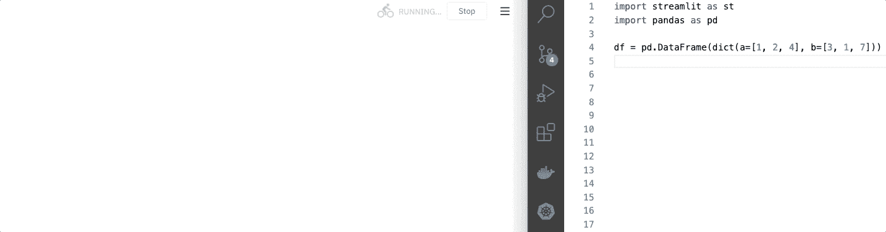
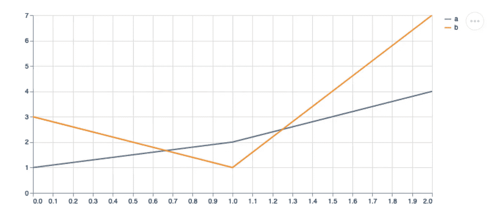
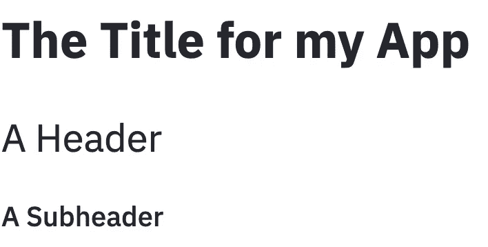
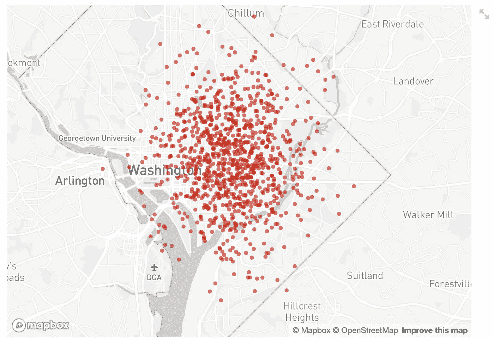
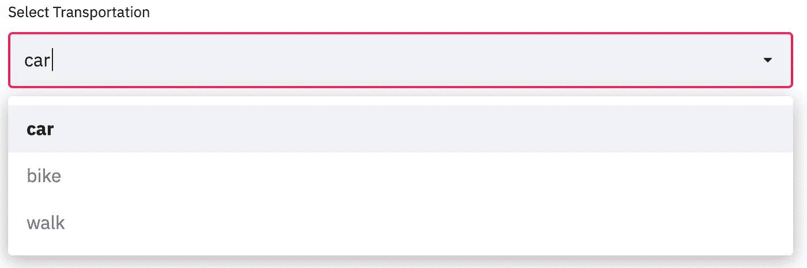
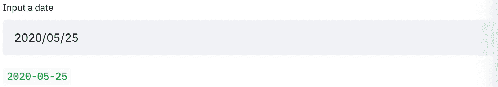
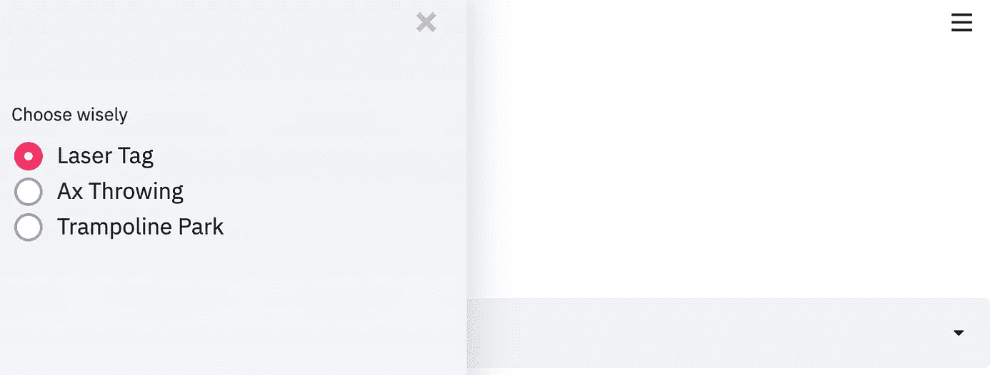
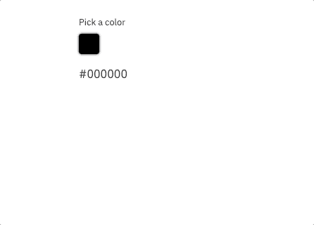
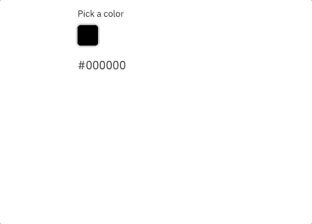
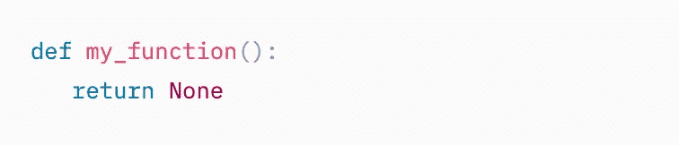

# 使用 Streamlit 让您的机器学习模型活起来

> 原文：<https://towardsdatascience.com/make-your-machine-learning-models-come-alive-with-streamlit-48e6eb8e3004?source=collection_archive---------34----------------------->

## 使用这个免费的 Python 库来快速提供模型和显示数据

你做了一个机器学习模型。耶！😀你希望人们不用启动 Jupyter 笔记本就能使用它。嗯。🤔你该怎么办？

你可以用[烧瓶](https://flask.palletsprojects.com/)来伺候你的模特。Flask 是一个很好的轻量级网络框架，但是它需要了解路线和其他网络事物。😕 [Django](https://www.djangoproject.com/) 是一个全服务框架，但是比 Flask 有更陡峭的学习曲线。如果只是想最快的服务一个模型，应该用什么？

快去救援！有了 [Streamlit](https://www.streamlit.io/) 你可以在几分钟内提供一个机器学习模型，而无需学习 Javascript 框架。🚀


资料来源:Pixabay.com

Streamlit 是一个新的开源库，它使用 Python 并与常见的数据科学库很好地集成。它很好地处理了交互性和可视化。


套用[联合创始人](/coding-ml-tools-like-you-code-ml-models-ddba3357eace) [Adrien Treuille](https://medium.com/u/39dfc90d7a34?source=post_page-----48e6eb8e3004--------------------------------) 的话，Streamlit 应用是将小部件视为变量的 Python 脚本，可以重用数据和计算，并且可以在实时编码环境中开发。Streamlit 非常适合快速开发！

## 快速入门:

开始使用 Streamlit 非常简单:

1.  在你的 Python 虚拟环境中`pip install -U streamlit pandas`。
2.  在文本编辑器中键入以下内容，并将文件另存为 *my_app.py* :

```
import streamlit as st
import pandas as pddf = pd.DataFrame(dict(a=[1, 2, 4], b=[3, 1, 7]))
st.line_chart(df)
```

3.在您的终端中执行`streamlit run my_app.py`。



编码并实时查看输出

嘣！🧨:你已经创建了一个图表，你的用户可以与之互动并下载！



折线图

让我们深入了解什么是 Streamlit，什么不是。

# 什么是细流

*   深受用户喜爱
*   年纪轻的
*   固执己见的
*   快速开始使用
*   纯 Python
*   可视化的理想选择
*   有利于互动

## 深受用户❤️的喜爱

我这里只是有一些轶事，但是通读一下 [Streamlit 社区论坛](https://discuss.streamlit.io/)上的评论和 [GitHub](https://github.com/streamlit) 上的问题，你会看到用户真的对 Streamlit 感到兴奋。它解决了数据科学家的一个痛点。🎉

## 年纪轻的🐣

Streamlit 于 2019 年秋季正式上线，并已快速迭代。该图书馆得到了硅谷风险投资公司的支持，该公司在启动时筹集了 600 万美元的种子资金。

## 固执己见的☝️

Streamlit 将为您提供一个带有可选边栏的单页应用程序。您可以垂直添加一个又一个元素。

Streamlit 服务器每次都会从头到尾重新运行您的脚本。没有回调。Streamlit 允许您缓存函数，以便您只在必要时重新运行代码和重新加载数据。

## 快速开始使用🏃🏾‍♀️

正如你在上面看到的，Streamlit 附带电池。它与 Python 数据科学堆栈配合得很好:pandas、NumPy、scikit-learn、TensorFlow 和 PyTorch。

## 纯 Python🐍

如果 Javascript 框架和模型-视图-控制器范式( [MVC](https://en.wikipedia.org/wiki/Model%E2%80%93view%E2%80%93controller) )不是你的东西，Streamlit 已经帮你搞定了。你只需要 Python 函数、控制流和装饰器。如果你想调整格式，可以加入一些 Markdown 和 HTML/CSS。

## 可视化的理想选择📊

细流已经通过绘图默认使用[牛郎星](https://altair-viz.github.io/)。它可以很容易地改变到其他可视化选项，如 [Matplotlib](https://matplotlib.org/) 、 [Plotly](https://plotly.com/) 、 [Bokeh](https://docs.bokeh.org/en/latest/index.html) 、 [Holoviews](https://discuss.streamlit.io/t/plotting-holoviews-plot/215/2?u=discdiver) 、 [Graphviz](https://www.graphviz.org/) 和 [deck.gl](https://deck.gl) 。

## 有利于互动⏯

内置的 Streamlit 函数使添加复选框、下拉菜单、文本框和其他交互式功能变得容易。Streamlit 将这些小部件视为变量，稍后您将会看到。

## 快速部署

更新于 2021 年 7 月 28 日:Streamlit 将托管您的应用程序，只需点击几下鼠标即可从 GitHub 部署。这是最简单的部署系统。当你推送到指定的 GitHub 分支时，Streamlit 会自动部署新版本。😎

## 得体的造型控制🎨

更新于 2021 年 7 月 28 日:自撰写本文以来，格式选项已经有了显著的改进。现在，您可以创建多个列，并更轻松地控制应用程序的外观。不管是好是坏，它仍然不是一张白纸。

## 管理会话状态🎮

更新于 2021 年 7 月 28 日:最新的 Streamlit 版本使保存会话状态变得更加容易。您仍然没有 cookie 功能。

现在您已经看到了什么是 Streamlit，让我们看看它不是什么。

# 什么不是细流🚫(从版本 0.80.0 开始)

Streamlit 不是一个全功能的 web 框架。🕸:没有路由器，所以你不能有多个页面。没有认证。你不能添加 javascript，所以不会出现弹出窗口。

# 未来🎁

Streamlit 有一个快速一致的发布周期，并且有添加社区所要求的特性的历史。🎉

好了，现在你有了地形，让我们看看如何使用 Streamlit！⚡️

# 使用细流

要运行下面的代码，请将 Streamlit 安装到一个包含 Python、pandas、NumPy 和 Plotly 的虚拟环境中。在撰写本文时，Streamlit 只在 PyPI 上，所以您需要`pip install`它。

我建议您并排设置 web 浏览器和代码编辑器，以获得最佳开发体验。😀

您可以在每次更新时手动重新运行您的代码，在您更改代码后，单击 web 应用程序中的*重新运行*。我建议你通过点击*总是重新运行来设置你的应用程序自动重新运行。*


更改后的标题按钮

如果电线真的缠绕在一起，你可能需要偶尔刷新你的网页或重启你的 Streamlit 服务器，但一般来说，事情应该只是工作。👍

如果你卡住了， [Streamlit 文档](https://docs.streamlit.io/)异常清晰。这里是社区论坛。

让我们来看看这 10 个关键的 Streamlit 函数。

# 10 个关键功能

1.  标题
2.  文本
3.  降价
4.  数据帧
5.  形象化
6.  交互式小工具
7.  CSS 修改
8.  媒体
9.  贮藏
10.  杂项功能

我们先来看标题。

## 标题

安装了 Streamilt 和一个为您的文件提供服务的 Streamlit 服务器(`streamlit run my_app.py`)，在您的文本编辑器中输入以下代码，并在您的 web 浏览器中观察神奇的事情发生。🐇

```
import streamlit as stst.title("The Title for my App")
st.header("A Header")
st.subheader("A Subheader")
```

如果您没有看到任何内容，请将*网络 URL* 从终端复制到网络浏览器窗口。或者，如果您的 Streamlit 服务器已经在运行，请单击浏览器窗口顶部的*重新运行*按钮。😉



标题，页眉，副标题= h1，h2，h3

使用您的浏览器检查工具，您可以验证这些函数分别创建了 *h1* 、 *h2* 和 *h3* HTML 标签。如果你需要 HTML 入门，我建议你去 W3 学校。👍

## 文本

用`st.write()`输出文本。

```
st.write("Some text to output") 
```

或者，如果不需要特殊功能，只需键入字符串，就可以跳过`st.write()`。

```
"Some text to output"
```

像 Jupyter 笔记本一样，一个值或变量名本身会输出到屏幕上。与 Jupyter 笔记本不同，方法调用的结果不会输出任何东西。您必须将返回值保存为变量才能显示它。☝️

例如，以下内容不会显示任何内容:

```
("Some text to output").upper()
```

但是这将:

```
my_uppercased_string = ("Some text to output").upper()
my_uppercased_string
```


输出文本

值得重复的是，Streamlit 会在您每次进行更改时从头到尾重新运行您的代码。当你探索 Streamlit 时，你会发现你不想一直显示所有的东西。注释掉代码块以节省时间和屏幕空间。👍

## 降价

你可以使用 markdown 来格式化你的文本并添加表情符号，如下所示:

```
st.markdown("_This_ __is__ *__markdown__*. 😀")
```

其中显示了以下内容:


降价促销

您也可以使用 Markdown 添加链接，如下所示:

```
st.markdown('Learn Python [here](https://memorablepython.com)')
```

维奥拉。出现一个链接。

我们稍后将探索其他降价用例。

## 数据帧

Streamlit 是以数据科学家为理念构建的。您可以像这样直接输出熊猫数据帧的内容:

```
df = pd.DataFrame(dict(a=[1, 2, 4], b=[3, 1, 7]))
df
```

用户可以自动对这些列进行排序。🎉

如果您想要样式增强，请显式使用`st.dataframe()`。例如，您可以突出显示每列中的最小值，如下所示:

```
st.dataframe(df.style.highlight_min(axis=0))
```


突出显示的数据框架

或者，您可以使用`st.write()`来实现相同的结果，如下所示:

```
st.write(df.style.highlight_min(axis=0))
```

`st.write()`检测传递给它的对象的类型并相应地调整。

现在让我们看看 Streamlit 可以对绘图做些什么。

## 形象化

Streamlit 使可视化变得轻而易举。💨

它为交互式折线图、面积图和条形图提供了默认功能。你看了上面的`st.line_chart()`。`st.bar_chart()`和`st.area_chart()`类似。他们都使用引擎盖下的[牛郎星](https://altair-viz.github.io/)绘图库。

有许多其他的顶级函数包装绘图库，例如 Matplotlib 的`st.pyplot()`和 Mapbox GL 的`st.map()`。下面是从文档中获取的创建地图的代码:

```
map_data = pd.DataFrame(
    np.random.randn(1000, 2) / [50, 50] + [38.9, -77],
    columns=['lat', 'lon']
)st.map(map_data)
```

这是输出结果:



st.map()的输出

或者，您可以使用您最喜欢的 Python 绘图库。例如，这里有一个来自 Plotly 文档的地理可视化。

```
with st.spinner("Component is loading"):
    fig = px.scatter_geo(
        df_geo,  # just making it take some time load
        title='Gapminder Data',
        locations="iso_alpha",
        color="continent",
        hover_name="country",
        size="pop",
        animation_frame="year",
        projection="robinson",
    )fig
```


用 Streamlit

请注意，我们添加了一个`st.spinner()`上下文块，在内容加载时显示一条消息。👍

Streamlit 的绘图非常酷！

现在让我们来看看 Streamlit 的核心交互功能。

## 交互式小工具

Streamlit 使用预定义的函数来创建交互式小部件。

下面是一个选择小部件的例子。



选择小部件输出

创建小部件和变量的代码只有一行！

```
transport = st.selectbox(label=”Select Transportation”, options=[“car”, “bike”, “walk”])
```

这里有七个 Streamlit 函数，您可以使用它们让用户选择一些东西。我包括了每个小部件所需的参数和描述。

*   `button(label='Click to do something')` —点击按钮
*   `radio(label='Choose', options=['rock', 'classical', 'jazz'])` —单选按钮
*   `checkbox(label='Check the box')` —切换复选框
*   `selectbox(label='Choose one', options=['walk', 'bike'])` —从下拉菜单中选择一个选项
*   `multiselect(label='Choose as many as you like', options=['walk', 'bike'])` —从下拉菜单中选择多个选项
*   `slider(label='Slide the bar')` —从滑动条中选择一个值
*   `beta_color_picker(label='Pick a color')` —选择一种颜色

这里有六个功能供用户输入或上传东西。

*   `number_input(label='Input a number')` —输入一个数字
*   `text_input(label='Enter text')` —输入文本
*   `text_area(label='Write an essay')` —输入多行文本
*   `date_input(label='Input a date')` —输入日期
*   `time_input(label='Input a time')` —输入时间
*   `file_uploader(label='Upload a .jpg file')` —上传文件

只需向交互函数传递一个用户将会看到的标签。将返回值保存为变量，并对其进行处理。就这么简单！😀

让我们看看如何使用这些小部件的更多信息。

**使用小工具**

这些小部件是可定制的，并带有合理的默认值。例如，下面是`st.date_input()`小部件代码:

```
date = st.date_input(label='Input a date')
date
```

结果是:



您可以向`date_input`传递默认值、最小值或最大值。现在，`date_input`各自的默认值是今天、2021 年 1 月 1 日和今天加 10 年。

请注意，不允许有重复的小部件。每个小部件必须通过你传递给它的参数来区分，否则你会得到一个错误。如果需要，您可以传递一个`key`参数来确保唯一性。👆

我不会在这里演示所有的小部件类型，但是让我们看看一些常见的模式。

您将经常使用带有`if`语句的复选框。下面是如何根据用户是否勾选了复选框来显示或隐藏数据框。

```
display_df = st.checkbox(label='Want to see the data?')if display_df:
   df
```

下面是输出的样子:


带有控制流的复选框，用于显示数据帧

像这样用`st.sidebar`将任何小部件添加到侧边栏:

```
st.sidebar.radio(
    label="Choose wisely",  
    options=["Laser Tag", "Ax Throwing", "Trampoline Park"]
)
```

现在，一个可扩展的侧边栏将容纳这个小部件。👍



侧栏随着单选按钮展开。

虽然大多数小部件已经存在了一段时间，但颜色选择器小部件仍处于测试阶段，可能会发生变化。代码如下:

```
user_color = st.beta_color_picker("Pick a color")
user_color
```



颜色选择器小工具

Streamlit 小部件是该库如此强大的重要原因。我鼓励你和他们一起玩，看看他们有多酷！😀

## CSS 修改

在 Streamlit 中修改 CSS 是可能的，但并不优雅。您可以通过使用`st.markdown("<style> some css goes here </style>")`来修改 CSS。

这是一个改变页面某一部分的文本颜色的基本例子。

```
st.markdown(
    '''
    <span style="color:blue">
        Print it in blue. <br />
        Please. 😀
    </span>
    ''',
    unsafe_allow_html=True
)
```

注意多行 CSS 使用了三重引号。☝️


改变文本的颜色。

你必须使用带有关键字参数`unsafe_allow_html=True`的`st.markdown()`来访问底层 CSS。

**交互式 CSS**

让我们看看颜色选择器小部件如何允许用户更改页面上的背景。这是代码。

```
user_color = st.beta_color_picker("Pick a color")
user_colorif user_color != "#000000":
    st.markdown(
        f"<style> body{{ background-color: {user_color};}}</style>",    
        unsafe_allow_html=True
    )
```

注意由于字符串插值，需要用双花括号`{{ }}`来转义。下面是实际使用的颜色选择器:



使用颜色选择器更改页面上的 CSS

**自举**

Streamlit 使用 [Bootstrap](https://getbootstrap.com/) 进行样式化，因此您可以访问 Bootstrap 类，如按钮和警告。例如，以下是如何显示成功徽章:

```
st.markdown(
    '<span class="badge badge-pill badge-success"> Badge </span>',
    unsafe_allow_html=True
)
```


使用引导程序的徽章输出

你可以试着用 Bootstrap 做一个网格布局，但是 Streamlit widgets 不会尊重这个布局，所以这不是一个好的选择。☹ ️A 电网布局方案正在酝酿中。🙂

**移除品牌**

下面是删除用 Streamlit 文本制作的*的移除汉堡菜单和页脚的代码:*

```
hide_st_style = """
    <style>
        #MainMenu {visibility: hidden;}
        footer {visibility: hidden;}
    </style>
"""st.markdown(hide_st_style, unsafe_allow_html=True)
```

- [来源](https://discuss.streamlit.io/t/remove-made-with-streamlit-from-bottom-of-app/1370/3) : Streamlit 论坛。

## 媒体

让我们看看如何在您的 Streamlit 应用程序中显示图像、视频和音频文件。

**图像**

您需要导入`PIL`库来显示带有`[st.image()](https://docs.streamlit.io/en/latest/api.html#streamlit.image)`的图像。下面的代码可以用来从用户那里获取图像并显示出来:

```
from PIL import Imageimg = []
img = st.file_uploader(label='input', type=['png', 'jpg'])if img:
    image = Image.open(img)
    st.image(image, caption='Your Image')
```

如有必要，可以指定宽度和 BGR 通道。

**视频**

用`[st.video()](https://docs.streamlit.io/en/latest/api.html#streamlit.video)`播放视频。你可以播放自己的视频或 YouTube 上的视频。以下是如何从 45 秒开始播放 YouTube 视频:

```
st.video(
    'https://www.youtube.com/watch?v=AqAJLh9wuZ0', 
    start_time=45
)
```

默认的视频格式是 *mp4* ，但是您可以指定其他格式。

**音频**

用`[st.audio()](https://docs.streamlit.io/en/latest/api.html#streamlit.audio)`播放音频文件。您可以指定除默认 *wav* 文件类型之外的内容，并传递开始时间。

## 贮藏

缓存可以节省应用程序用户第二次加载应用程序的时间。缓存允许你的应用程序避免重新加载相同的文件和重复相同的计算。

用`@st.cache`装饰器添加[缓存](https://docs.streamlit.io/caching.html)。以下是 Streamlit 缓存工作原理的基本解释:

Streamlit 检查这四项内容:

*   用来调用函数的输入参数
*   函数中使用的任何外部变量的值
*   函数的主体
*   缓存函数中使用的任何函数的主体

> 如果这是 Streamlit 第一次看到这四个组件具有这些确切的值，以及这种确切的组合和顺序，它将运行该函数并将结果存储在本地缓存中。然后，下一次调用缓存的函数时，如果这些组件都没有改变，Streamlit 将跳过执行函数，而是返回之前存储在缓存中的输出。

-来源:[文件](https://docs.streamlit.io/caching.html)。

缓存有助于提高应用程序的速度，但也很棘手，有时会表现得出乎意料。⚠️

## 杂项功能

Streamlit 让用户可以轻松地从汉堡菜单中创建屏幕录像。*录制截屏*选项为用户提供了一系列录制屏幕选项。这有助于合作。👍

您可以轻松显示 Streamlit 应用程序背后的代码。只需将您想要显示的代码放在一个`st.echo()`上下文块中，如下所示:

```
with st.echo():
    def my_function():
       return None
```

输出是格式良好的代码，在用户屏幕上看起来像这样:



来自应用程序的代码

或者，如果您想显示格式化的代码但不想运行它，可以像这样使用`st.code()`:

```
st.code(
    """
    my_var = f"testing my code {1 + 2} times"
    """
)
```


不是由应用程序运行的代码

# 包装

Streamlit 可以让你快速地将机器学习模型转变为基本的应用程序。它包含许多有用的功能，并定期进行改进。Streamlit 已经成为一种流行的自助服务工具，即数据科学家的工具箱。

我希望这篇关于 Streamlit 的介绍对您有所帮助。如果你有，请在你最喜欢的社交媒体上分享，这样其他人也可以找到它。😀

我写关于 Python、T2、SQL 和其他技术主题的文章。如果你对此感兴趣，请注册我的[邮件列表中的令人敬畏的数据科学资源](https://dataawesome.com)，在这里阅读更多帮助你增长技能的内容[。👍](https://medium.com/@jeffhale)

[](https://dataawesome.com)

资料来源:Pixabay.com

流线型快乐！😀