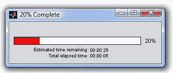
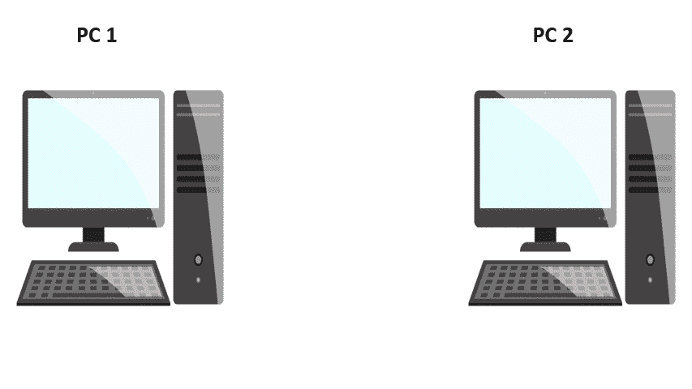
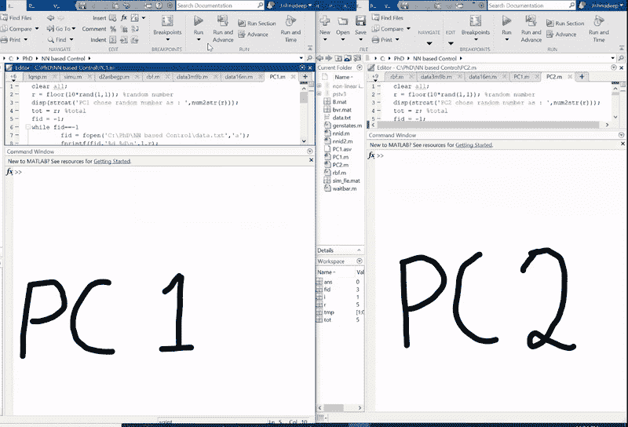
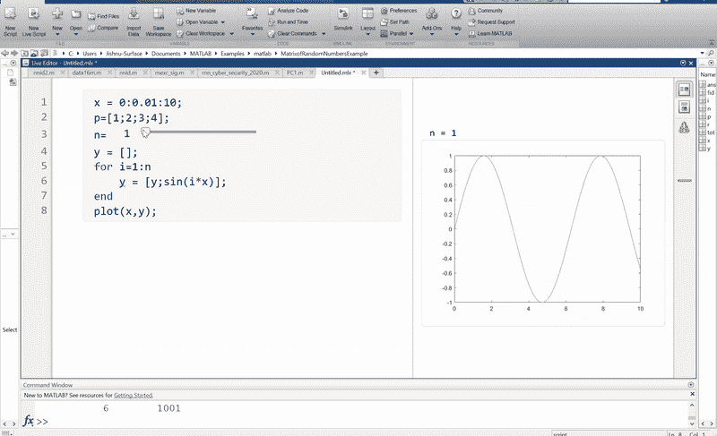

# 使用这些技巧让你的 Matlab 代码更快更真实

> 原文：<https://towardsdatascience.com/make-your-matlab-codes-faster-and-more-realistic-with-these-tips-281389b9d376?source=collection_archive---------24----------------------->

## 我从 4 年多的旅程中学到的技巧，在 Matlab 上工作和编码。


照片由[丹尼尔·里卡洛斯](https://unsplash.com/@ricaros?utm_source=unsplash&utm_medium=referral&utm_content=creditCopyText)在 [Unsplash](https://unsplash.com/s/photos/programming?utm_source=unsplash&utm_medium=referral&utm_content=creditCopyText) 拍摄

如果你曾经使用 Matlab 进行你的大学项目或研究模拟，你知道它在模拟几乎任何你想要的问题方面有无限的潜力和灵活性。更重要的是，用户界面简单易学，代码易于初学者掌握。

大约 4 年前，我开始在 Matlab 中编写代码，这段旅程令人兴奋，充满了学习。我在学士学位期间开始在 Matlab 上为我的课程项目编写代码，现在我全职使用它进行我的博士论文研究。在我的旅程中，有好几次我不得不等待几个小时到几天，让我的模拟收敛。我总是想知道— *我怎样才能让它更快，我怎样才能让 for 循环迭代得更快？*此外，我的一些工作需要分布式设置，即不同版本的 Matlab 相互对话，交换信息并运行算法来执行特定任务。我一直在想——我怎么能做到这一点？我如何让我的代码变得足够酷，变得真实？

在这篇文章中，我将分享一些有用的编程技巧，这些技巧是我在 4 年的编程和玩 Matlab 的过程中学到的。我们开始吧！

# 1.更快的 for 循环

For 循环可能是 Matlab 中使用最广泛的代码块之一。对于运行迭代算法、计算一组数据的矩阵乘积或模拟一个系统的时间，For 循环无处不在。For 循环按顺序计算每个迭代**，这使得它在大量迭代**和大量计算时变得缓慢。Matlab 的并行计算工具箱来帮忙了。

[](https://www.mathworks.com/products/parallel-computing.html) [## 并行计算工具箱

### 并行计算工具箱使您能够利用多核计算机、GPU、集群、网格或云来解决…

www.mathworks.com](https://www.mathworks.com/products/parallel-computing.html) 

例如，考虑这个非常简单的例子，我需要计算矩阵`a`和`b` **，**中条目的元素和，并将结果存储在`c`中。

```
a = randn(1e7,1e7);
b = randn(1e7,1e7);
c = zeros(1e7,1e7);for i=1:1e7
    for j=1:1e7
      c(i,j) = a(i,j) + b(i,j);
    end
end
```

在我的测试中，这个 for 循环计算需要大约 7.72 秒来完成。让我们看看如何在这里使用并行 for 循环。

首先，声明工作线程的数量，最大为处理器拥有的超线程内核的数量。

```
parpool(4); %declare number of workers (max=cores) parfor i=1:1e7 %use parfor instead of for
    for j=1:1e7
      c(i,j) = a(i,j) + b(i,j);
    end
enddelete(gcp('nocreate')); %close parallel computing
```

请注意，嵌套的 for 循环是不允许的，因此我们将其中一个 for 循环改为并行循环，并保持内部循环不变。同样的任务现在只需要 1.36 秒。并行计算工具箱不仅仅限于 for 循环，还具有各种有用的功能，使您的模拟能够更快地完成，这样您就可以睡个好觉。

# 2.进度条(带 ETA)

你是否曾经等着想知道*你的代码需要多长时间才能完成执行？*我相信你已经尝试了各种选项，其中之一是打印出一个循环的迭代次数，然后估计一下需要多长时间才能完成。好了，不要再这样了！

[](https://www.mathworks.com/matlabcentral/fileexchange/22161-waitbar-with-time-estimation) [## 带时间估计的 Waitbar

### 这个版本的 waitbar 与 MATLAB 的版本兼容。因此，不需要对现有的进行任何修改…

www.mathworks.com](https://www.mathworks.com/matlabcentral/fileexchange/22161-waitbar-with-time-estimation) 

您可以在所有的 while 和 for 循环中使用这个插件，不仅可以查看进度的**百分比，还可以获得估计的完成时间**。它真的很棒，我一直在我所有的 Matlab 项目中使用它。用法就像下面这样简单。

```
h = waitbar(0,'Please wait...'); %handle for the waitbarfor i=1:1e7
c(i) = a(i) + b(i);
waitbar(i/1e7,h); %update waitbar status
end
```



学分: [Mathworks](http://mathworks.com)

你会看到一个进度条，如图所示，上面有“进度百分比”和“预计剩余时间”。

# 3.分布式算法或共享数据

分布式算法是在不同的计算机上一起执行特定任务的算法。尤其是大型系统，使用分布式算法来使这种算法在单个处理器上更快、更不密集。**这种设置还要求数据在不同的计算机之间共享。**

然而，大多数时候，在模拟这种算法时，我们只是编写一段代码，然后在一个 Matlab 环境中运行。虽然这可能会产生正确的最终结果，但是当在真实的分布式设置中实现时**很难想象它将如何收敛。我将向你展示我是如何发现使用简单的代码使这变得又酷又真实的。**



作者创建的 GIF

考虑这个例子，我有两台不同的计算机 PC1 和 PC2。它们分别生成一个随机数，然后需要将它们的数字相互通信，以将两个数字的总和报告给 PC 上的两个用户。虽然这似乎是一个非常简单的问题，但它会让您理解底层的方法，从而使解决方案更加现实。

**PC 2 的代码**

```
r = floor(10*rand(1,1)); %random number
disp(strcat('PC2 chose random number as : ',num2str(r)));tot = r; %total
fid = -1;while fid==-1
%data.txt is the shared file used for communication fid = fopen('data.txt','a');
    fprintf(fid,'%d %d\n',2,r);
    pause(1);
    fclose(fid);
endi=0;
while i==0
    disp('PC 2 is attempting to get data from PC 2')
    fid = fopen('data.txt','r');
    tmp=fscanf(fid,'%d %d\n');
    fclose(fid);
    if (size(tmp)~=0)
        if (tmp(1)==1)
        tot = tot+tmp(2); %read PC1 data from shared file
        i=1;
        disp(strcat('Our total is > ',num2str(tot)));

    else
         disp('PC 1 has not yet written data');
    end
pause(rand(1,1)); %pause for small random time
endfclose('all'); %close all files
```

注意，这里 data.txt 作为一个通信文件。类似的代码在 PC 1 上运行，它读取相同的 data.txt 文件，查看 PC 2 共享了什么。



作者模拟 GIF

你可以在上面的 GIF 图像中看到，两个独立的 MATLAB 环境(相当于两台 PC)如何选择一个随机数，然后通过一个. txt 文件相互通信，以得出相同的最终答案 11。很酷，不是吗？这仅仅是个开始，**你可以用这个想法做很多更酷的事情。如果想要更真实的场景，还可以通过远程 SQL 服务器共享数据。这将能够模拟一个更真实的情况，即程序运行在世界上任何地方的两台不同的 PC 上，并且它们仍然得到相同的答案 11。**

[](https://www.mathworks.com/help/database/ug/database.html) [## Matlab 连接和写入数据库

### 使用用户名和密码创建到数据源的数据库连接。数据库连接是一个连接…

www.mathworks.com](https://www.mathworks.com/help/database/ug/database.html) 

# 4.向量化您的计算

人们在使用 Matlab 函数时最常犯的一个错误是使用 for 循环来执行某些向量计算。例如，考虑一个函数`minProduct`，它返回 3 个向量输入的乘积的最小值:`x,y,z`。传统上，我们会编写一个 for 循环来实现这一点，如下所示。

```
function d = minProduct(x,y,z)
% find the minimum of product of entries of x, y, z
d = zeros(length(x),1);for i=1:d
d(i) = x(i)*y(i)*z(i); %compute product and store
endd = min(d); %output the minimum of vector d
```

然而，如果我们以矢量化的形式编写上述函数，将其命名为`minProductVectorized`，那么代码将如下所示。

```
function d = minProductVectorized(x,y,z)
% find the minimum of product of entries of x, y, zd = x.*y.*z;
d = min(d); %output the minimum of vector d
```

对每个包含 100，000 个条目的 3 个随机向量`x,y,z`运行这些函数，minProduct 需要 0.23 秒来执行，而 minProductVectorized 只需 0.089 秒来计算最小值。

# 5.现场脚本

实时脚本是 Matlab 最未被充分利用的特性之一。它是在 2016 年发布的 Matlab 中引入的，但大多数学生、教育工作者和研究人员仍然不知道或不使用它。我将通过一个简单的例子来证明这种方法的有效性。

考虑一下，我想为`x=0:0.01:10`策划罪恶(nx)。这里`n`可以是任何数字，我应该能够画出从 1，2，..所以如果`n=3`，我的图应该包含`sin(x), sin(2x)`和`sin(3x)`的图。在传统的 Matlab 脚本中，我们会定义一个参数`n`，并在每次需要更多曲线时手动更改它的值。然而，使用 live script，我们可以只放入一个滑块用于`n`，Matlab 将负责适当地运行代码以适应情节。



作者模拟 GIF

不就是美吗？当我第一次尝试它的时候，我对用实时脚本管理你的代码是多么简单而强大感到敬畏。这可能看起来是一个非常简单的例子，但是当您需要在代码中的几个地方更改变量以查看输出时，它会非常方便。手动编辑是乏味的，很难跟踪，并且可能给你漂亮的代码带来错误。相反，通过使用这个简单的工具在旅途中可视化您的输出来美化它。这很容易学习，而且肯定会帮助你实现不同参数的代码。

[](https://www.mathworks.com/help/matlab/live-scripts-and-functions.html) [## 实时脚本和函数

### MATLAB live 脚本和 live 函数是将 MATLAB 代码与嵌入式输出相结合的交互式文档…

www.mathworks.com](https://www.mathworks.com/help/matlab/live-scripts-and-functions.html) 

我希望你喜欢这篇文章，并学会了使用 Matlab 的新方法，使你的代码更快更真实。这些是我在日日夜夜摆弄 Matlab 的 4 年旅程中学到的一些重要技巧。如果你想分享任何其他有用的提示，欢迎在下面评论。

感谢阅读。如果你想谈论这篇文章，请随时拨打 jishnudeep.kar@gmail.com T3**联系我。**

如果你喜欢这个故事，你可能想看看这些。

[](/artificial-intelligence-might-just-get-you-your-doppelganger-6511be7a405b) [## 人工智能可能会让你获得重身幽灵奖

### 如果你曾经想过在世界的某个地方拥有你的分身，人工智能可能很快就会实现。

towardsdatascience.com](/artificial-intelligence-might-just-get-you-your-doppelganger-6511be7a405b) [](https://medium.com/illumination/cultural-shock-visiting-the-usa-from-india-a-students-perspective-1f901df99984) [## 从印度到美国的文化冲击——一个学生的视角

### 如果你计划去美国，并且对那里的文化太过好奇，这可能是你最好的剧透！

medium.com](https://medium.com/illumination/cultural-shock-visiting-the-usa-from-india-a-students-perspective-1f901df99984) [](/machine-learning-is-becoming-increasingly-important-to-keep-your-homes-lit-7bd2e62ca2b) [## 机器学习对于保持家庭照明变得越来越重要

### 机器学习超越了图像分类和语音识别。了解为我们的产品提供动力变得多么重要…

towardsdatascience.com](/machine-learning-is-becoming-increasingly-important-to-keep-your-homes-lit-7bd2e62ca2b) [](https://medium.com/the-innovation/why-i-left-my-70k-job-for-a-boring-life-160129d42f21) [## 为什么我要辞去 7 万美元的工作，过“无聊”的生活？

### 在进入印度最负盛名的 IIT 德里学院后，我唯一的梦想就是获得高薪…

medium.com](https://medium.com/the-innovation/why-i-left-my-70k-job-for-a-boring-life-160129d42f21)