# 制作自己的 Python 包

> 原文：<https://towardsdatascience.com/make-your-own-python-package-6d08a400fc2d?source=collection_archive---------16----------------------->

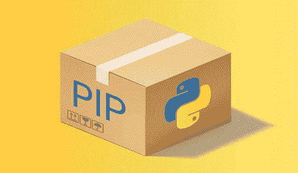

无论您是开发人员还是偶尔的 Python 用户，很难想象一个 Python 脚本在代码的最开始没有一堆 *import 语句(或包)*。

但是你有没有想过这些神奇的进口包是从哪里来的？

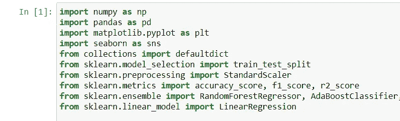

Import 语句使 Python 模块化且易于使用

在本文中，我将指导您如何制作一个 Python 包，带有您自己的自定义函数，您可以用任何代码导入它。这是在团队内部共享现成代码的最快方式，也是对 Python 社区做出贡献的最佳方式，因为任何用户都可以简单地 *pip 安装*您的包并导入它。

所以我们开始吧！

**第一步。制作包装元素**

我假设你已经熟悉 Python，但是制作一个包需要知道一些细节。我为您提供了一个预先发布的包(名为 **dist_alx** )，它基本上是一个文件/文件夹，其中包含了一个包在发布之前必须拥有的所有必要元素。我们将使用这个文件夹作为指南，因为所有 Python 包都必须具有相同的结构。 *dist_alx* 包具体做什么，这里[解释](https://github.com/maleckicoa/dist_alx/blob/master/README.md)。

要获取该文件夹，请转到我的 [Github 库](https://github.com/maleckicoa/dist_alx)，在您的机器上下载 *dist_alx.zip* 并将其解压缩。该父文件夹 *dist_alx* 包含以下文件:

*   setup.py 文件-包含包元数据
*   setup.cfg 文件-用于存储设置的配置文件格式
*   与父文件夹同名的子文件夹(在本例中为 *dist_alx* )，其中存储了您的包的实际 Python 代码

每个包装都必须具备以上三个要素。除此之外，包还应该包含以下内容:

*   您的 Python 包必须有一个唯一的名称。没有两个现有的 Python 包可以共享同一个名称。
*   父文件夹和子文件夹必须具有相同的名称，即您的包的名称。
*   setup.py 文件中有参数 ***名称*** 和**包**。它们还应该与您的包同名。
*   注意**版本**参数，如果你修改了你的包并重新发布它，你也应该修改版本
*   在 setup.py 文件中有 **author_email** 参数。在此键入您自己的电子邮件地址

**第二步。编写代码**

在这个子文件夹中有这个包的实际 Python 代码。如果你打开 *dist_alx* 子文件夹，你会注意到它包含了一个 *_init_。py* 文件。默认情况下，Python 内核会寻找 *_init_。py* 文件作为读取代码时的起点。 *_init_。py* 文件链接到子文件夹中的所有其他 Python 脚本(例如，在我们的 *_init_ 中)。py* 文件，这个链接是通过*从。Gaussiandistribution 导入高斯*线)，这样所有。py 文件连接在一起。在尝试编写包代码之前，最好先复习一下关于 [Python 类](https://www.geeksforgeeks.org/python-classes-and-objects/)的知识。

**第三步。** **开立 PyPI 账户**

大多数公开可用的 Python 包都存储在 [PyPI 库](https://pypi.org/)中。当您在您的机器上安装一个包时(通常通过一个 *pip install* 语句),您实际上是从 PyPI 存储库中下载这个包并将其安装在您的机器上。当发布一个新的包时，你把它上传到 PyPI 服务器，这样社区就可以使用它了。为了能够在 PyPI 上发布，你需要在 PyPI 上开一个(免费)账户。确保使用与用于 **author_email** 参数相同的电子邮件地址。

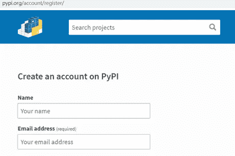

**第四步。** **发布你的包**

发布是从命令提示符/终端完成的，在 Windows 和 Linux 中命令是相同的。

**a.** 导航到父文件夹的位置

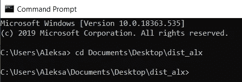

**b.** pip 安装*设置工具*和*绳线*

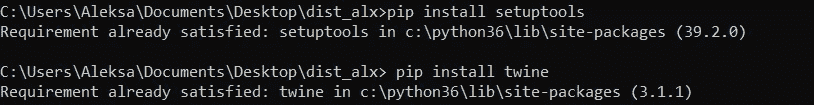

**c.** 类型:python setup.py sdist

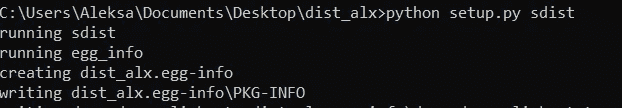

注意，现在在父文件夹中创建了两个新文件夹( *egg-info* 文件和 *dist* 文件夹)。

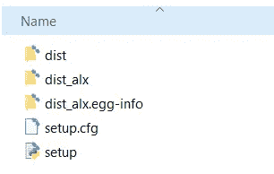

**d.** 类型:捆绳上传距离/*

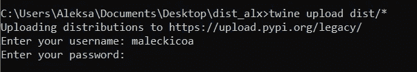

您需要提供您的 PyPI 用户名(不是电子邮件)和密码。

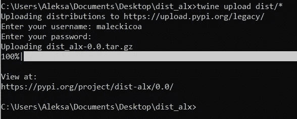

瞧啊。您的包现在托管在 PyPI 服务器上，可以使用了！

**e.** 进入 [PyPI](https://pypi.org/) ，点击你的账户，进入你的项目。如果一切正常，你应该在那里看到你的包裹。

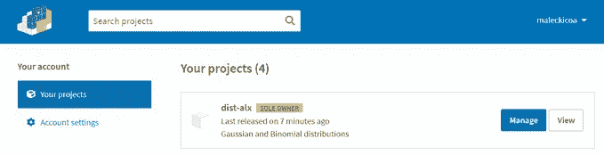

注意 PyPI 在文件命名中只支持破折号(-)而不支持下划线(_)。因此 *dist_alx* 变成了 *dist-alx。*然而，当稍后导入包时，我们将正常键入 *dist_alx。*

**第五步。** **用你的包**

去你最喜欢的 Python 客户端(Terminal，Ipython，Jupyter)然后 *pip 安装*你的包。然后导入您的包并从中获得乐趣！

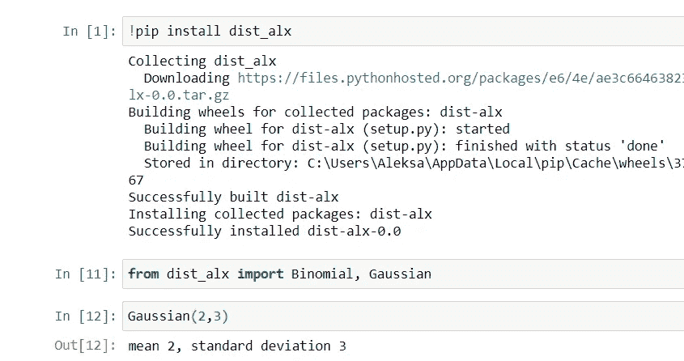

**重述**

在本文中，我们经历了创建 Python 包的以下步骤:

*   制作必要的包装元素并注意命名
*   编写包代码
*   创建 PyPI 帐户
*   在 PyPI 上发布包
*   Pip 安装、导入和运行软件包

**最后一个音符**

#在 *dist_alx* 包中的代码是由 Udacity 编写的，因此所有与它相关的致谢和评论都可以发给他们。

#在将您的包放在主 PyPI 服务器上之前，首先在 [PyPI 测试服务器](https://test.pypi.org/)上发布它通常是一个好主意。