# 用变形金刚和 DialoGPT 微调制作你自己的 Rick Sanchez(机器人)

> 原文：<https://towardsdatascience.com/make-your-own-rick-sanchez-bot-with-transformers-and-dialogpt-fine-tuning-f85e6d1f4e30?source=collection_archive---------10----------------------->

## 教 GPT-2 像一个疯狂的科学家一样写作

我是' [Rick 和 Morty](https://en.wikipedia.org/wiki/Rick_and_Morty) '和 NLP(自然语言处理)的忠实粉丝。在看了《疯狂科学家和他孙子的冒险》的最后一集后，我意识到我必须应用我在 NLP 和机器学习方面的知识来创造我自己的 Rick(至少目前是以聊天机器人的形式)。

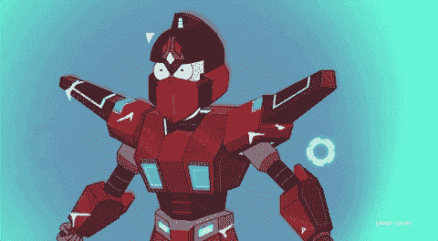

图片来自 [Giphy](https://giphy.com/)

创造虚拟瑞克的道路并不容易。我尝试了许多模型和方法，但虚拟里克在很长一段时间内都不想与我找到共同语言。瑞克对我的问候的第一个反应是“我不是你的伙伴”(说实话，一开始，他只知道这句话)。但我没有放弃，在优秀的变形金刚库和微软的大规模预训练响应生成模型(DialoGPT)的帮助下，我成功地与 Rick 进行了推心置腹的交谈。这是我们的一次对话:

> **用户**:嘿，瑞克，给我做个时光机
> **瑞克伯特**:你是个怪物！
> **用户**:不，我只是想穿越时空
> **RickBot** :回到过去。
> **用户**:是
> **RickBot** :请不要时光机。
> **用户**:但是我需要
> **RickBot** :你不需要，莫蒂。去做吧。
> **用户**:我想看古希腊
> **RickBot** :哎呀。

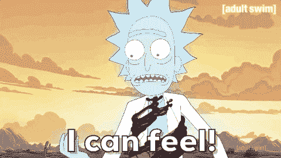

图片来自 [Giphy](https://giphy.com/)

# 一点理论

在这篇文章中，我将告诉你如何创建一个虚拟角色，其陈述将基于我最喜欢的动画科幻情景喜剧的脚本。你可以使用你选择的角色和情景喜剧。我添加了代码，将带有对话框的常规文本文件转换成模型能够理解的格式。

正如我已经提到的，[变形金刚](https://huggingface.co/transformers/)库，其中包含最新的 NLP 模型(如[伯特](https://huggingface.co/transformers/model_doc/bert.html)、 [XLNet](https://huggingface.co/transformers/model_doc/xlnet.html) 、 [GPT-2](https://huggingface.co/transformers/model_doc/gpt2.html) )将帮助我们完成任务。你可以在 Jay Alammar 的一篇插图精美的文章[中读到更多关于变形金刚的内容。](http://jalammar.github.io/illustrated-transformer/)

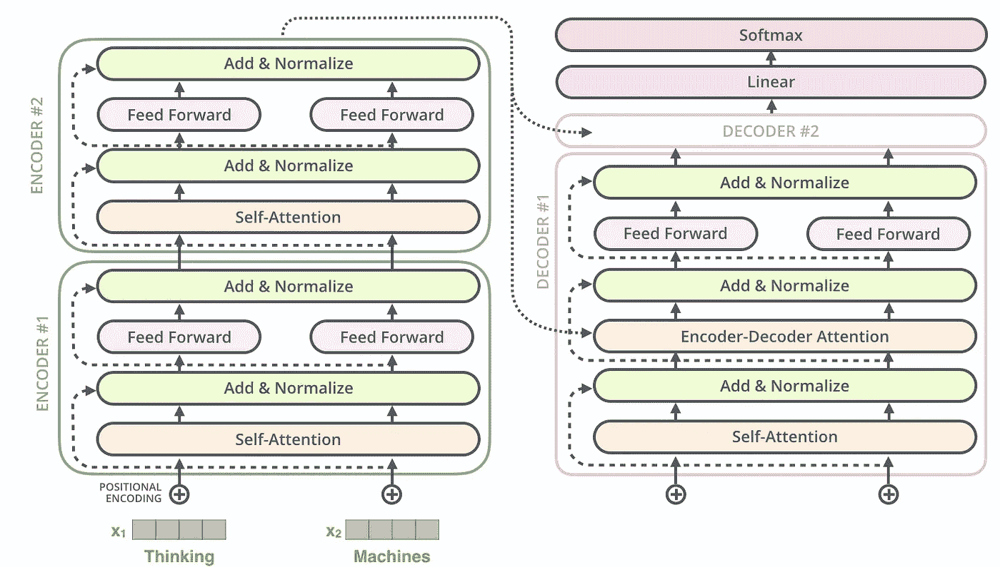

图片来自[http://jalammar . github . io](http://jalammar.github.io/illustrated-transformer/)

不久前，微软的 [DialoGPT](https://huggingface.co/transformers/model_doc/dialogpt.html) 被添加到变形金刚模型集合中。DialoGPT 是 GPT-2 的模型，接受了来自 Reddit 讨论线程的 1.47 亿次多回合对话的训练(你可以在这里了解更多关于 GPT-2 的信息)。这个模型非常适合为一个有趣的对话创建一个虚拟角色，即使在小的实现选项中，它也可以保持连贯的对话，我们现在将看到这一点。

# 与 DialoGPT 的第一次对话

我们将在 [Google Colab](https://colab.research.google.com/) 中进行所有的实验，它的资源足以训练小型 DialoGPT 模型。首先，我们将连接到 Google Drive 并安装必要的模块。

```
from google.colab import drive
drive.mount('/content/drive/')! pip -q install transformers
```

让我们移动到所需的文件夹，我们将在其中存储所有的数据。

```
import osos.chdir("/content/drive/My Drive/Colab Notebooks")
```

尽量用 DialoGPT 聊天，不要微调。

```
from transformers import AutoModelWithLMHead, AutoTokenizer
import torchtokenizer = AutoTokenizer.from_pretrained("microsoft/DialoGPT-small")
model = AutoModelWithLMHead.from_pretrained("microsoft/DialoGPT-small")
```

让我们聊 5 行

```
for step in range(5):
    # encode the new user input, add the eos_token and return a tensor in Pytorch
    new_user_input_ids = tokenizer.encode(input(">> User:") + tokenizer.eos_token, return_tensors='pt')# append the new user input tokens to the chat history
    bot_input_ids = torch.cat([chat_history_ids, new_user_input_ids], dim=-1) if step > 0 else new_user_input_ids# generated a response while limiting the total chat history to 1000 tokens    
    chat_history_ids = model.generate(
    bot_input_ids, max_length=1000,
    pad_token_id=tokenizer.eos_token_id
    )# pretty print last ouput tokens from bot
    print("DialoGPT: {}".format(tokenizer.decode(chat_history_ids[:, bot_input_ids.shape[-1]:][0], skip_special_tokens=True)))
```

> **用户:**嗨里克
> **对话 PT:** 嗨里克
> **用户:**你好吗？
> **DialoGPT:** 我很好，你好吗？
> **用户:**我没事。莫蒂在哪里？他在地下室。
> **用户:**莫蒂是谁？对话:他是个毛头小子。
> **用户:**你是谁？
> **对话:**我是毛蒂。


图片来自 [Giphy](https://giphy.com/)

还不错，但不太令人印象深刻。我们将通过微调来修复它。

# 模型初始配置

让我们训练我们自己的瑞克聊天机器人。首先，我们需要基本的配置和一个数据集。配置和训练脚本大多基于 Huggingface 的这个[脚本](https://github.com/huggingface/transformers/blob/master/examples/language-modeling/run_language_modeling.py)和 Nathan Cooper 的伟大[教程](https://nathancooper.io/i-am-a-nerd/chatbot/deep-learning/gpt2/2020/05/12/chatbot-part-1.html)。

将 Python 脚本参数转换为 Colab notebook 的类参数。

# 准备数据集

我们的对话数据集将基于安德拉达·奥尔特亚努的[文章](https://www.kaggle.com/andradaolteanu/sentiment-analysis-rick-and-morty-scripts/)中使用的关于里克和莫蒂情绪分析的数据集。非常感谢她的工作，也感谢 Gabriel Hernandes，原始文本数据集[的作者！](https://github.com/ghhernandes/rickmorty-gan/tree/master/data)

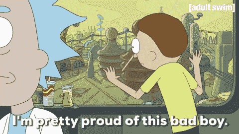

图片来自 [Giphy](https://giphy.com/)

首先，我们将使用一个 **Kaggle** 模块来下载需要的数据集。你可以通过这个[链接](https://github.com/Kaggle/kaggle-api)阅读关于这个模块以及如何获得 Kaggle API 令牌的更多细节。或者您可以从这篇文章[中下载 RickAndMortyScripts.csv 文件，并将该文件放在您的工作目录中。](https://www.kaggle.com/andradaolteanu/sentiment-analysis-rick-and-morty-scripts/)

```
!pip install kaggle!mkdir ~/.kaggle
!cp kaggle.json ~/.kaggle/kaggle.json!kaggle datasets download andradaolteanu/rickmorty-scripts -f RickAndMortyScripts.csv 
!mv datasets%2F506221%2F935855%2FRickAndMortyScripts.csv RickAndMortyScripts.csv
```

让我们看看原始数据集。

```
all_rick = pd.read_csv('RickAndMortyScripts.csv')
all_rick.head(10)
```

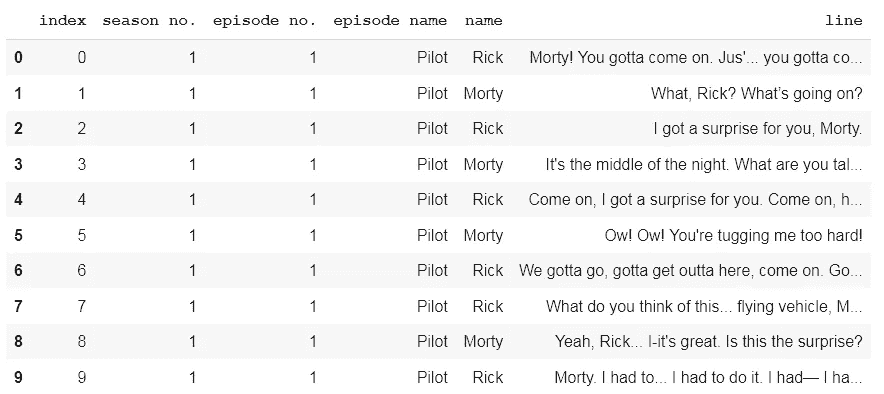

我们将以这样一种方式转换该数据集，即每个响应行将包含 **n** 个以前的响应作为上下文。就我们的目的而言，之前的七个回复就足够了。

```
contexted = []n = 7for i in range(n, len(all_rick['line'])):
  row = []
  prev = i - 1 - n # we additionally subtract 1, so row will contain current response and 7 previous responses  
  for j in range(i, prev, -1):
    row.append(all_rick['line'][j])
  contexted.append(row)columns = ['response', 'context'] 
columns = columns + ['context/'+str(i) for i in range(n-1)]df = pd.DataFrame.from_records(contexted, columns=columns)
df.head(5)
```

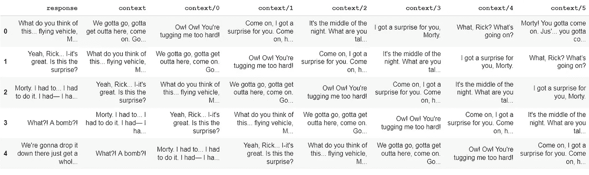

将我们的数据集分成训练和测试部分。

```
trn_df, val_df = train_test_split(df, test_size = 0.1)
```

现在，我们将把数据集转换成适合我们模型的格式。基本上，我们将在每行的一个字符串中连接响应(此外，我们将在响应之间添加特殊的“字符串结束”标记，因此模型将理解字符串中每个响应的结束)。

# 培训和评估

训练我们的模型将需要相当多的代码，但不要担心，一切都应该按原样工作，主要的事情是以正确的格式给模型数据集。

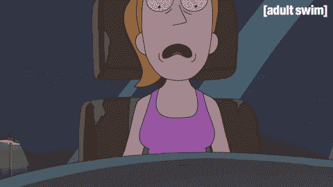

图片来自 [Giphy](https://giphy.com/)

这是主要的跑步者代码。

是时候训练我们的模特了！

```
main(trn_df, val_df)
```


图片来自[吉菲](https://giphy.com/)

我们的数据集很小，所以训练不会花很多时间(通常大约半小时)。

# 和瑞克聊天

模型做好了，该和 Rick 聊聊了。但是别忘了，我警告过你，瑞克可能会很粗鲁。

在响应生成中可以使用多种方法。你可以通过这个[链接](https://huggingface.co/blog/how-to-generate)找到关于这些方法的更多细节。

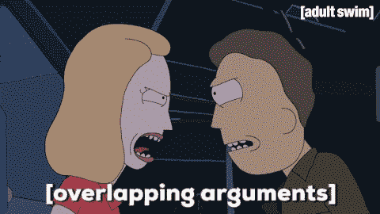

图片来自 [Giphy](https://giphy.com/)

```
tokenizer = AutoTokenizer.from_pretrained('microsoft/DialoGPT-small')
model = AutoModelWithLMHead.from_pretrained('output-small')# Let's chat for 5 lines
for step in range(5):
    # encode the new user input, add the eos_token and return a tensor in Pytorch
    new_user_input_ids = tokenizer.encode(input(">> User:") + tokenizer.eos_token, return_tensors='pt')
    # print(new_user_input_ids)# append the new user input tokens to the chat history
    bot_input_ids = torch.cat([chat_history_ids, new_user_input_ids], dim=-1) if step > 0 else new_user_input_ids# generated a response while limiting the total chat history to 1000 tokens, 
    chat_history_ids = model.generate(
        bot_input_ids, max_length=200,
        pad_token_id=tokenizer.eos_token_id,  
        no_repeat_ngram_size=3,       
        do_sample=True, 
        top_k=100, 
        top_p=0.7,
        temperature = 0.8
    )

    # pretty print last ouput tokens from bot
    print("RickBot: {}".format(tokenizer.decode(chat_history_ids[:, bot_input_ids.shape[-1]:][0], skip_special_tokens=True)))
```

> **用户**:瑞克，你好吗？
> **RickBot** :我没事。
> **用户**:莫蒂在哪里？里克波特:他在医院里。
> **用户**:为什么？那要看谁先崩溃——我还是医院。我是说，那个一直给我吃药的人。
> **用户**:我不懂
> **RickBot** :哇！哇哦。
> **用户**:我明白了，你吃药了
> **RickBot** :嘿，我——我并不以此为荣。

还不错。我会再举几个对话的例子来说明里基现在是我们的里基。

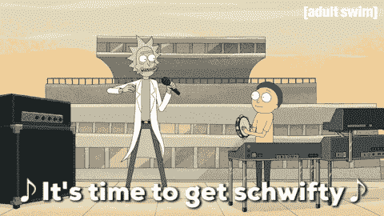

图片来自 [Giphy](https://giphy.com/)

> **用户**:你是谁？
> **RickBot** :音乐人，我不是音乐人，但我跟你挺亲近的。
> **用户**:你是哪种音乐人？
> **RickBot** :谁在乎？我是一个音乐家。
> **用户**:好，给我放一首
> **RickBot** :闭嘴听我说，莫蒂。听我说。听着！我是一群不同死亡世界的领袖，我只是想组建一个乐队。我会把它做成一体，你会成为其中的一部分。
> **用户** :ok
> **RickBot** :哇，哇，嘿，这是谁？
> **用户**:这是 Morty
> **RickBot** :哎呀！！！

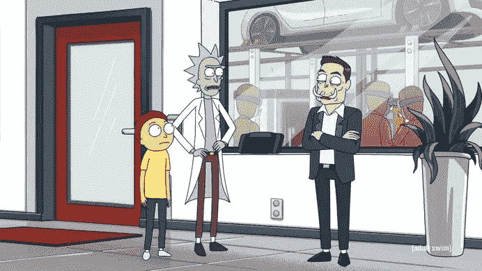

图片来自[news.knowyourmeme.com](https://news.knowyourmeme.com/news/elon-musks-rick-and-morty-cameo-is-a-meme-reference)

> **用户**:你怎么看待埃隆·马斯克？
> **:我经常想起他。
> **用户**:但是你到底是怎么想的？他不是一个坏人。他只是…不是一个很有魅力的人。
> **用户**:我觉得他很有魅力
> **RickBot** :他是。
> **用户**:你还能说他什么？T21:你什么都不用说。他是你们班的领导。
> **用户**:好的，谢谢
> **RickBot** :！！！**

# **结论**

**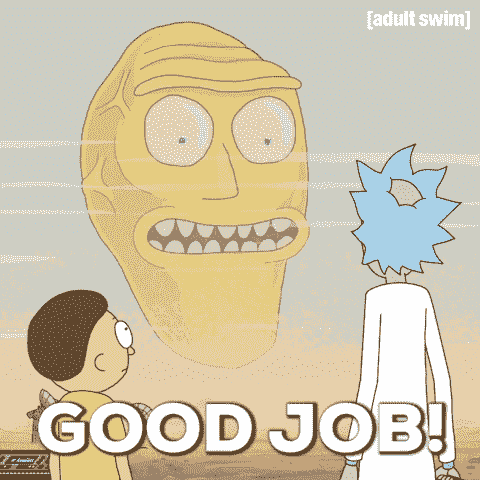**

**图片来自 [Giphy](https://giphy.com/)**

**恭喜你！我们的虚拟瑞克(几乎)还活着！借助于在小数据集上对 DialoGPT 模型的微调，我们能够创建一个虚拟角色，我们可以与他进行大量的 mad 对话。**

**使用所提出的方法，我们可以基于任意的对话数据集创建许多有趣的虚拟角色(只是一个包含角色演讲的 csv 文件，每行一个演讲)。**

**所有提到的代码都可以作为 [Google Colab 笔记本](https://colab.research.google.com/drive/15wa925dj7jvdvrz8_z3vU7btqAFQLVlG)访问。**