# 让你的熊猫数据帧输出报告准备就绪

> 原文：<https://towardsdatascience.com/make-your-pandas-dataframe-output-report-ready-a9440f6045c6?source=collection_archive---------5----------------------->


由 [12019](https://pixabay.com/users/12019-12019/) 在 [Pixabay](https://pixabay.com/photos/bunson-peak-yellowstone-landscape-1589003/) 拍摄的照片

## 熊猫风格和迷你图片库说明

作为一名使用 Python 作为主要编程语言的数据科学家或分析师，我相信您一定经常使用 Pandas。我们经常在笔记本上输出熊猫数据帧。

然而，你有没有想过我们实际上可以让数据框架自己可视化？换句话说，对于一些简单的可视化目的，我们不需要 Matplotlib 或其他可视化库。Pandas 数据框输出可以像 Excel 电子表格一样可视化，具有复杂的样式和非常简单的代码定义。

在本文中，我将介绍 Pandas 库中的样式包，相对于它的数据处理方法，知道它的人相对较少。此外，还有一些有趣的库支持熊猫数据框的更多内联可视化。在最后一节中，我还将介绍其中的一种——迷你图。

# 关于熊猫风格套餐


由 [Pixabay](https://pixabay.com/photos/roses-colored-tinted-colorful-828945/) 上的[自由照片](https://pixabay.com/users/Free-Photos-242387/)拍摄的照片

众所周知，熊猫数据帧可以在 iPython/Jupyter notebook 中输出，该 notebook 以 HTML 格式自动呈现 CSS 样式。这绝对是一个惊人的特性，因为即使我们只是简单地打印它，演示也非常好。

但是等等，它使用了“HTML + CSS”。是的，熊猫也允许我们定制 CSS 样式，使它看起来更漂亮。这是通过“样式”API 实现的。

 [## 风格-熊猫 1.1.2 文档

### 编辑描述

pandas.pydata.org](https://pandas.pydata.org/docs/reference/style.html) 

我们可以简单地调用`df.style`来获取一个数据框的`Styler`对象，然后添加我们想要的样式。现在，让我们看看我们能做些什么。

# 格式化输出


由 [geralt](https://pixabay.com/users/geralt-9301/) 在 [Pixabay](https://pixabay.com/photos/pi-board-school-district-diameter-3653435/) 上拍摄的照片

当然，我们总是可以格式化数据本身，比如`df.round(2)`，用两位小数来舍入所有的数值。然而，使用熊猫风格有一些好处。例如，我们实际上并不改变值，而只是改变表示，这样我们就不会失去精度。

让我们先创建一个随机数据框。

```
import numpy as np
import pandas as pddf = pd.DataFrame(np.random.randn(10, 2)*100)
```

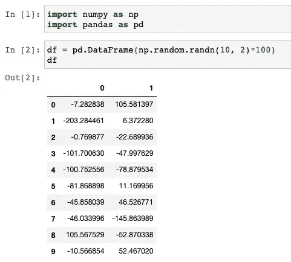

然后，让我们输出特定格式的数据帧。

```
df.style.format("{:.2f}")
```

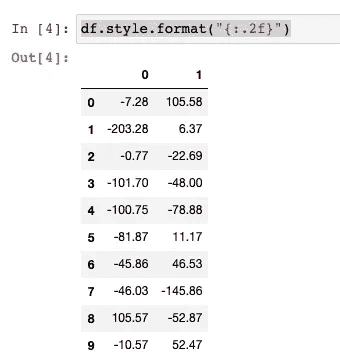

顺便说一句，如果你不太熟悉 Python 格式规范 Mini-Language，这是我使用的表达式`{:.2f}`，你可以在这里查看官方文档(强烈推荐)。

 [## 格式规范迷你语言- Python 文档

### 内置的 string 类提供了通过方法…进行复杂的变量替换和值格式化的能力

docs.python.org](https://docs.python.org/3/library/string.html#formatspec) 

# 用背景和文本颜色突出显示单元格


[YeriLee](https://pixabay.com/users/YeriLee-1801917/) 在 [Pixabay](https://pixabay.com/photos/highlighter-coloring-fluorescent-1103715/) 上拍摄的照片

我知道，格式化不够酷。使用 CSS 我们可以很容易地做很多事情，比如改变背景颜色和文本颜色。

例如，对于上图所示的同一数据框，我们希望分别突出显示正数和自然数。如果你有一些关于 CSS 的基本知识，或者只是简单地谷歌一下，你会知道下面的属性来设置 HTML 表格单元格的背景颜色和文本颜色。

```
background-color: red; color: white
```

让我们写一个函数来给表格单元格着色。

```
def highlight_number(row):
    return [
        'background-color: red; color: white' if cell <= 0 
        else 'background-color: green; color: white'
        for cell in row
    ]
```

如果单元格的值是负数，我们使用红色作为背景，否则使用绿色，如果它是正数。因为颜色可能有点暗，我们也想把文本颜色改为白色。

然后，我们可以将该函数应用于数据框。

```
df.style.apply(highlight_number)
```

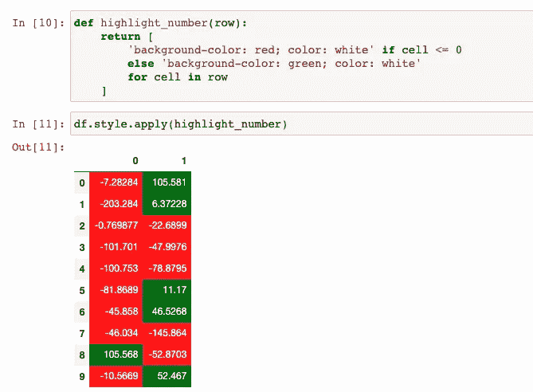

超级爽！现在很明显，我们得到了负数和正数，它们是很好区分的。

# 链接样式功能


图片由 Pixabay 上的 [TanteTati](https://pixabay.com/users/TanteTati-77004/) 拍摄

到目前为止，我们每次只添加一种类型的样式。事实上，一旦我们调用了`df.style`，它就会返回数据帧的`Styler`对象。`Styler`对象支持链接样式函数。让我们看看另一个更复杂的例子。

比方说，我们想在原始数据框中添加以下样式。

1.  用红色突出显示负数，用绿色突出显示正数。
2.  将数字格式化为货币。
3.  使用`set_caption()`为表格添加标题。
4.  增大单元格边距，使其看起来不那么拥挤。
5.  在单元格之间添加白色边框以改善显示效果。

是的，我们可以一次完成所有这些，通过使用链式表达式。

```
df.style \
  .apply(highlight_number) \
  .format('${0:,.2f}') \
  .set_caption('A Sample Table') \
  .set_properties(padding="20px", border='2px solid white')
```

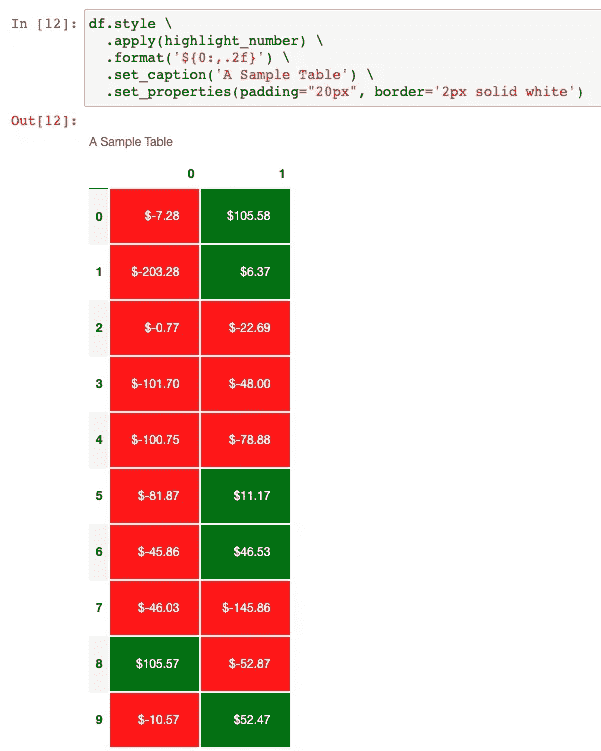

感觉表格可以直接用在一些业务报表上:)

# 内置高亮显示功能


由 [PublicDomainPictures](https://pixabay.com/users/PublicDomainPictures-14/) 在 [Pixbay](https://pixabay.com/photos/bright-close-up-color-colorful-2796/) 上拍摄的照片

不懂 CSS，还想显摆？可以，熊猫 style 还提供了一些内置功能，很酷但是非常好用。

## 突出显示功能

让我们使用相同的数据框进行演示。

```
# Make a nan value for demo purposes
df.at[1, 1] = None# Add styles
df.style \
  .highlight_null('lightgray') \
  .highlight_max(color='lightgreen') \
  .highlight_min(color='pink')
```

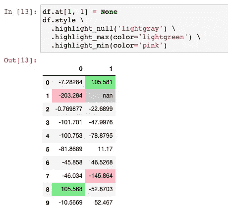

你看，用你喜欢的颜色来突出显示空值、最小值和最大值是非常容易的。我建议使用浅色，因为文本颜色总是黑色。

## 渐变彩色背景

熊猫风格也支持使用`**cmap**`给单元格背景涂上渐变颜色。当我们想要可视化刻度中的数字数据时，这非常有用。

```
df = pd.DataFrame(np.random.randn(10, 2))
df.style \
  .background_gradient(cmap='Blues')
```

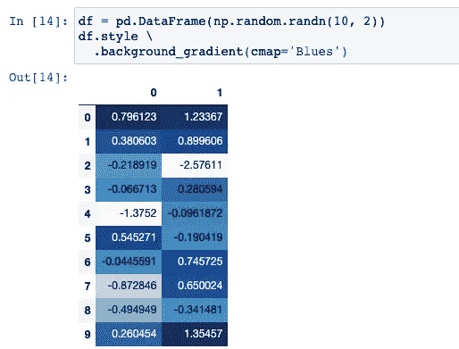

所以，背景颜色是渐变的，取决于值。请注意，“蓝调”是熊猫支持的`cmap`之一。如果您想知道还有哪些支持，下面的 Matplotlib 文档是一个很好的参考。

[](https://matplotlib.org/3.1.0/tutorials/colors/colormaps.html#sequential) [## 在 Matplotlib - Matplotlib 3.1.0 文档中选择色彩映射表

### Matplotlib 有许多内置的色彩映射表，可以通过。还有外部库，如[palettable]和…

matplotlib.org](https://matplotlib.org/3.1.0/tutorials/colors/colormaps.html#sequential) 

## 内嵌条形图

这是另一个内置的超酷功能。它可以在每个单元格的背景中生成条形来指示它们的值。我们用上面的数据框。

```
df.style.bar()
```

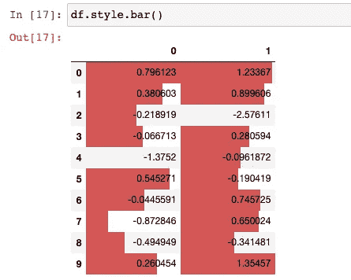

当然，我们对条形图的默认样式并不满意。让我们改进演示文稿。

```
df.style \
  .format('{:.2f}') \
  .bar(align='mid', color=['#FCC0CB', '#90EE90']) \
  .set_caption('A Sample Table with Bar Chart') \
  .set_properties(padding="15px", border='2px solid white', width='300px')
```

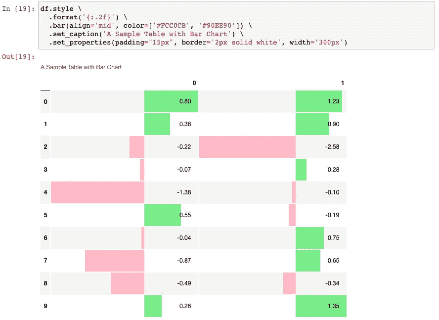

你能相信这还是你曾经非常熟悉的“熊猫数据框”吗？:)

让我简单解释一下`bar()`方法中的参数。`color`参数支持单个字符串或一个元组，当它是一个元组时，第一种颜色将用于着色负值，第二种颜色用于着色正值。因为我们使用了两种颜色，所以我们需要将滚动条设置为在单元格的中间对齐。

# 迷你图-内嵌直方图


照片由 [Myriams-Fotos](https://pixabay.com/users/Myriams-Fotos-1627417/) 在 [Pixabay](https://pixabay.com/photos/sparkler-light-bulb-injection-candle-4629347/) 上拍摄

我可以停在这里，但我想展示一下我发现的另一个非常有趣的库，叫做迷你图。我不会说它很好看，但这个想法真的很酷。

你可以使用`pip`来安装这个库。

```
pip install sparklines
```

然后，让我们导入库并创建另一个示例数据框用于演示目的。

```
from sparklines import sparklinesdf = pd.DataFrame({
    'a': np.random.normal(0, 1, 100),
    'b': np.random.normal(1, 1, 100),
    'c': np.random.normal(0, 3, 100)
})
```

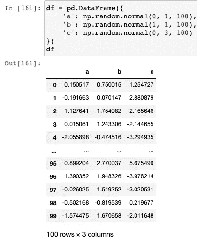

库迷你图的功能很简单。它可以使用 Unicode 字符串生成条形图，比如▁、▂、▃，直到█.为了确保条形的顺序正确，并且作为直方图有意义，我们需要首先使用 NumPy 准备值以生成直方图值。

```
def sparkline_dist(data):
    hist = np.histogram(data, bins=10)[0]
    dist_strings = ''.join(sparklines(hist))
    return dist_strings
```

对于每一列，我们可以使用迷你图生成直方图。

```
[sparkline_dist(df[col]) for col in df.columns]
```

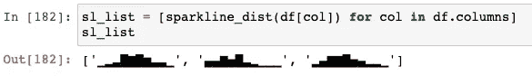

最后，我们可以将字符串与其他统计数据放在一起，以生成更好的报告。

```
df_stats = df.agg(['mean', 'std']).transpose()
df_stats['histogram'] = sl_list
df_stats.style \
  .format('{:.2f}', subset=['mean', 'std']) \
  .set_caption('A Sample Table with Sparklines Distributions') \
  .set_properties(padding="15px", border='2px solid white')
```

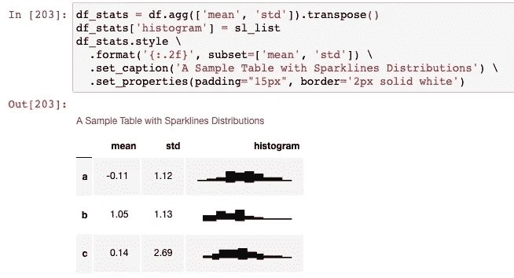

搞定了。

# 摘要


由 [Pixabay](https://pixabay.com/photos/autumn-leaf-collapse-bokeh-season-3707549/) 上的 [pasja1000](https://pixabay.com/users/pasja1000-6355831/) 拍摄

在本文中，我向您展示了熊猫风格包中的所有主要方法。我们可以设置值的格式，给背景上色，用定制的 CSS 属性来改善表现。还有许多内置函数可用于创建“报表就绪”数据框输出。

[](https://medium.com/@qiuyujx/membership) [## 通过我的推荐链接加入 Medium 克里斯托弗·陶

### 作为一个媒体会员，你的会员费的一部分会给你阅读的作家，你可以完全接触到每一个故事…

medium.com](https://medium.com/@qiuyujx/membership) 

**如果你觉得我的文章有帮助，请考虑加入灵媒会员来支持我和成千上万的其他作家！(点击上面的链接)**